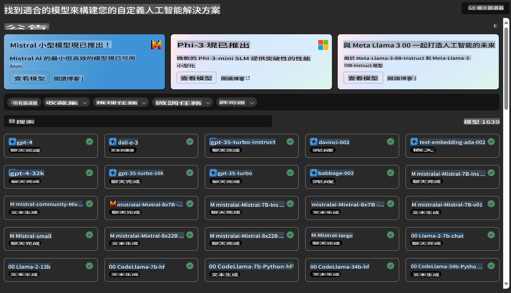
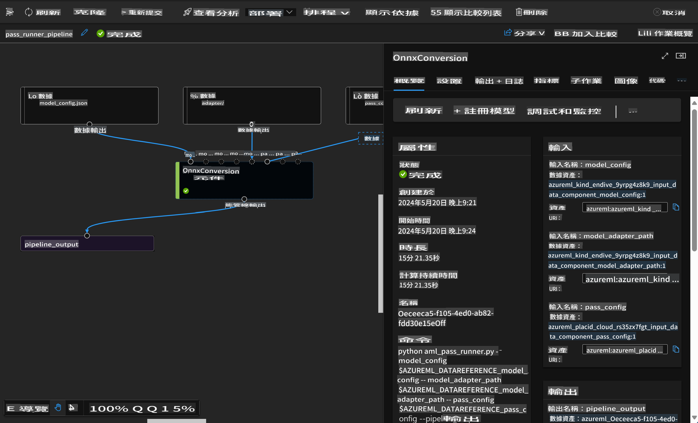

# **介紹 Azure Machine Learning 服務**

[Azure Machine Learning](https://ml.azure.com?WT.mc_id=aiml-138114-kinfeylo) 是一個雲端服務，用於加速和管理機器學習 (ML) 專案的整個生命周期。

ML 專業人士、數據科學家和工程師可以在日常工作流程中使用它來：

- 訓練和部署模型。
- 管理機器學習操作 (MLOps)。
- 你可以在 Azure Machine Learning 中建立模型，或者使用從開源平台（例如 PyTorch、TensorFlow 或 scikit-learn）建構的模型。
- MLOps 工具幫助你監控、重新訓練和重新部署模型。

## 誰適合使用 Azure Machine Learning？

**數據科學家和 ML 工程師**

他們可以使用工具來加速和自動化日常工作流程。  
Azure ML 提供公平性、可解釋性、追蹤和審計功能。

**應用開發人員**

可以無縫地將模型整合到應用程式或服務中。

**平台開發人員**

可以使用由穩健的 Azure Resource Manager API 支援的一整套工具，這些工具可用於建構高級 ML 工具。

**企業**

在 Microsoft Azure 雲端中工作，企業可以受益於熟悉的安全性和基於角色的存取控制。  
設置專案以控制對受保護數據和特定操作的存取。

## 提升團隊每個人的生產力

ML 專案通常需要具備多元技能的團隊來建構和維護。

Azure ML 提供的工具能讓你：
- 通過共享的筆記本、計算資源、無伺服器計算、數據和環境與你的團隊協作。
- 開發具有公平性、可解釋性、追蹤和審計功能的模型，以滿足數據來源和審計合規要求。
- 快速且輕鬆地大規模部署 ML 模型，並通過 MLOps 高效地管理和治理它們。
- 在任何地方運行機器學習工作負載，同時內建治理、安全性和合規性。

## 跨平台兼容工具

ML 團隊中的任何人都可以使用他們喜歡的工具完成工作。  
無論是進行快速實驗、超參數調整、構建管道還是管理推論，你都可以使用熟悉的介面，包括：
- Azure Machine Learning Studio
- Python SDK (v2)
- Azure CLI (v2)
- Azure Resource Manager REST APIs

當你在開發周期中改進模型並協作時，可以在 Azure Machine Learning Studio 的介面中分享和尋找資產、資源和指標。

## **Azure ML 的 LLM/SLM**

Azure ML 增加了許多與 LLM/SLM 相關的功能，結合 LLMOps 和 SLMOps，打造企業級生成式人工智慧技術平台。

### **模型目錄**

企業用戶可以通過模型目錄，根據不同的業務場景部署不同的模型，並以 Model as Service 的形式提供服務，供企業開發者或用戶存取。

Azure Machine Learning Studio 的模型目錄是發現和使用多種模型的中心，幫助你構建生成式 AI 應用程式。  
模型目錄包含來自多個模型供應商的數百個模型，例如 Azure OpenAI 服務、Mistral、Meta、Cohere、Nvidia、Hugging Face，以及由 Microsoft 訓練的模型。  
Microsoft 以外的供應商提供的模型屬於非 Microsoft 產品，根據 Microsoft 的產品條款定義，適用於模型附帶的條款。

### **任務管道**

機器學習管道的核心是將完整的機器學習任務拆分為多步工作流程。每一步都是一個可單獨開發、優化、配置和自動化的組件，步驟之間通過明確定義的介面相連。Azure Machine Learning 的管道服務會自動協調管道步驟之間的所有依賴關係。

在微調 SLM / LLM 時，我們可以通過管道管理數據、訓練和生成過程。

### **提示流 (Prompt Flow)**

使用 Azure Machine Learning 提示流的好處：  
Azure Machine Learning 提示流提供一系列好處，幫助用戶從概念化到實驗，最終實現基於 LLM 的生產級應用：

**提示工程靈活性**

- 互動式創作體驗：Azure Machine Learning 提示流提供流程結構的可視化表示，讓用戶可以輕鬆理解和導航專案。同時提供類似筆記本的編碼體驗，以高效開發和調試流程。
- 提示調整的變體：用戶可以創建和比較多個提示變體，促進迭代改進過程。
- 評估：內建的評估流程幫助用戶評估提示和流程的質量與效果。
- 全面的資源：Azure Machine Learning 提示流包含內建工具、範例和模板庫，為開發提供起點，激發創意並加速過程。

**企業級 LLM 應用的準備**

- 協作：Azure Machine Learning 提示流支持團隊協作，允許多個用戶共同參與提示工程專案，共享知識並維持版本控制。
- 一站式平台：Azure Machine Learning 提示流簡化了提示工程的整個過程，從開發和評估到部署和監控。用戶可以輕鬆將流程部署為 Azure Machine Learning 端點，並即時監控其性能，確保最佳運行和持續改進。
- Azure Machine Learning 的企業級解決方案：提示流利用 Azure Machine Learning 穩健的企業級解決方案，為流程的開發、實驗和部署提供安全、可擴展且可靠的基礎。

通過 Azure Machine Learning 提示流，用戶可以釋放提示工程的靈活性，有效協作，並利用企業級解決方案，成功開發和部署基於 LLM 的應用。

結合 Azure ML 的計算能力、數據和不同組件，企業開發者可以輕鬆構建自己的人工智慧應用。

**免責聲明**：  
本文件已使用機器翻譯服務進行翻譯。我們致力於提供準確的翻譯，但請注意，自動翻譯可能包含錯誤或不準確之處。應以原始語言的文件為權威來源。如涉及關鍵信息，建議尋求專業的人手翻譯。我們對因使用本翻譯而引起的任何誤解或錯誤解讀概不負責。