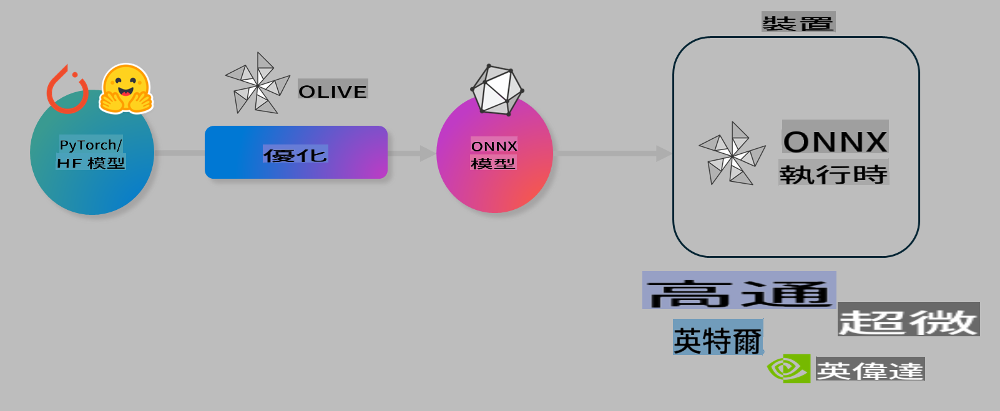

# Lab. 優化 AI 模型以便設備端推理

## 簡介

> [!IMPORTANT]
> 本實驗需要安裝 **Nvidia A10 或 A100 GPU**，並配備相關驅動程式及 CUDA 工具包（版本 12+）。

> [!NOTE]
> 這是一個 **35 分鐘** 的實驗，將帶您實際操作，學習如何使用 OLIVE 優化模型以進行設備端推理的核心概念。

## 學習目標

完成本實驗後，您將能夠使用 OLIVE：

- 使用 AWQ 量化方法對 AI 模型進行量化。
- 對 AI 模型進行特定任務的微調。
- 生成 LoRA 適配器（微調模型），以便在 ONNX Runtime 上高效進行設備端推理。

### 什麼是 Olive

Olive (*O*NNX *live*) 是一個模型優化工具包，配有 CLI，幫助您為 ONNX Runtime +++https://onnxruntime.ai+++ 提供高質量、高性能的模型。



Olive 的輸入通常是一個 PyTorch 或 Hugging Face 模型，輸出則是一個優化過的 ONNX 模型，可在運行 ONNX Runtime 的設備（部署目標）上執行。Olive 會針對硬體供應商（如 Qualcomm、AMD、Nvidia 或 Intel）提供的 AI 加速器（NPU、GPU、CPU）優化模型。

Olive 執行一個 *工作流*，即由多個模型優化任務（稱為 *passes*）按順序組成的序列。例如，pass 包括模型壓縮、圖捕獲、量化、圖優化等。每個 pass 都有一組可調參數，用於實現最佳指標（如準確性和延遲），這些指標由相應的評估器進行評估。Olive 採用一種搜尋策略，使用搜尋算法逐一或組合調整每個 pass。

#### Olive 的優勢

- **減少挫折和時間**：避免手動嘗試不同圖優化、壓縮和量化技術的反覆試驗。定義您的質量和性能約束，讓 Olive 自動為您找到最佳模型。
- **40+ 內建模型優化組件**：涵蓋量化、壓縮、圖優化和微調的前沿技術。
- **簡單易用的 CLI**：用於常見的模型優化任務。例如，olive quantize、olive auto-opt、olive finetune。
- 內建模型打包和部署功能。
- 支援生成 **多 LoRA 服務** 的模型。
- 使用 YAML/JSON 構建工作流，協調模型優化和部署任務。
- **Hugging Face** 和 **Azure AI** 集成。
- 內建 **緩存** 機制以 **節省成本**。

## 實驗指引

> [!NOTE]
> 請確保您已按實驗 1 的指引，配置好您的 Azure AI Hub 和專案，並設置 A100 計算資源。

### 步驟 0：連接到 Azure AI 計算資源

您將使用 **VS Code** 的遠端功能連接到 Azure AI 計算資源。

1. 打開您的 **VS Code** 桌面應用程式：
1. 使用 **Shift+Ctrl+P** 打開 **命令面板**。
1. 在命令面板中搜尋 **AzureML - remote: Connect to compute instance in New Window**。
1. 按照螢幕上的指示連接到計算資源。這包括選擇您的 Azure 訂閱、資源群組、專案及在實驗 1 中設置的計算名稱。
1. 連接成功後，這將顯示在 **Visual Code 左下角** `><Azure ML: Compute Name`

### 步驟 1：克隆此倉庫

在 VS Code 中，使用 **Ctrl+J** 打開新終端，並克隆此倉庫：

在終端中，您應該看到提示：

```
azureuser@computername:~/cloudfiles/code$ 
```  
克隆解決方案：

```bash
cd ~/localfiles
git clone https://github.com/microsoft/phi-3cookbook.git
```

### 步驟 2：在 VS Code 中打開資料夾

在終端中執行以下命令，這將在相關資料夾中打開 VS Code 的新窗口：

```bash
code phi-3cookbook/code/04.Finetuning/Olive-lab
```  

或者，您可以通過選擇 **檔案** > **打開資料夾** 打開資料夾。

### 步驟 3：安裝依賴項

在 VS Code 中，打開 Azure AI 計算實例的終端窗口（提示：**Ctrl+J**），執行以下命令以安裝依賴項：

```bash
conda create -n olive-ai python=3.11 -y
conda activate olive-ai
pip install -r requirements.txt
az extension remove -n azure-cli-ml
az extension add -n ml
```

> [!NOTE]
> 安裝所有依賴項大約需要 5 分鐘。

在本實驗中，您將下載和上傳模型到 Azure AI 模型目錄。為了訪問模型目錄，您需要使用以下命令登錄 Azure：

```bash
az login
```

> [!NOTE]
> 登錄時，系統將要求您選擇訂閱。請確保選擇實驗提供的訂閱。

### 步驟 4：執行 Olive 命令

在 VS Code 中，打開 Azure AI 計算實例的終端窗口（提示：**Ctrl+J**），並確保已激活 `olive-ai` conda 環境：

```bash
conda activate olive-ai
```

接下來，在命令行中執行以下 Olive 命令。

1. **檢查數據**：在本例中，您將微調 Phi-3.5-Mini 模型，使其專注於回答與旅行相關的問題。以下代碼顯示數據集的前幾條記錄，這些記錄採用 JSON 行格式：

    ```bash
    head data/data_sample_travel.jsonl
    ```

1. **量化模型**：在訓練模型之前，您將使用 Active Aware Quantization (AWQ) 技術進行量化 +++https://arxiv.org/abs/2306.00978+++。AWQ 根據推理期間生成的激活值對模型權重進行量化。這意味著量化過程考慮了激活中的實際數據分佈，與傳統權重量化方法相比，能更好地保留模型準確性。

    ```bash
    olive quantize \
       --model_name_or_path microsoft/Phi-3.5-mini-instruct \
       --trust_remote_code \
       --algorithm awq \
       --output_path models/phi/awq \
       --log_level 1
    ```

    完成 AWQ 量化大約需要 **8 分鐘**，這將 **將模型大小從約 7.5GB 減少到約 2.5GB**。

    在本實驗中，我們將展示如何從 Hugging Face 輸入模型（例如：`microsoft/Phi-3.5-mini-instruct`). However, Olive also allows you to input models from the Azure AI catalog by updating the `model_name_or_path` argument to an Azure AI asset ID (for example:  `azureml://registries/azureml/models/Phi-3.5-mini-instruct/versions/4`). 

1. **Train the model:** Next, the `olive finetune` 命令微調量化後的模型。先量化模型再微調，與事後量化相比，能獲得更好的準確性，因為微調過程會恢復部分量化損失。

    ```bash
    olive finetune \
        --method lora \
        --model_name_or_path models/phi/awq \
        --data_files "data/data_sample_travel.jsonl" \
        --data_name "json" \
        --text_template "<|user|>\n{prompt}<|end|>\n<|assistant|>\n{response}<|end|>" \
        --max_steps 100 \
        --output_path ./models/phi/ft \
        --log_level 1
    ```

    完成微調（100 步）大約需要 **6 分鐘**。

1. **優化模型**：模型訓練完成後，您現在可以使用 Olive 的 `auto-opt` command, which will capture the ONNX graph and automatically perform a number of optimizations to improve the model performance for CPU by compressing the model and doing fusions. It should be noted, that you can also optimize for other devices such as NPU or GPU by just updating the `--device` and `--provider` 參數優化模型 - 但在本實驗中，我們將使用 CPU。

    ```bash
    olive auto-opt \
       --model_name_or_path models/phi/ft/model \
       --adapter_path models/phi/ft/adapter \
       --device cpu \
       --provider CPUExecutionProvider \
       --use_ort_genai \
       --output_path models/phi/onnx-ao \
       --log_level 1
    ```

    完成優化大約需要 **5 分鐘**。

### 步驟 5：快速測試模型推理

為了測試模型推理，請在資料夾中創建一個名為 **app.py** 的 Python 文件，並複製粘貼以下代碼：

```python
import onnxruntime_genai as og
import numpy as np

print("loading model and adapters...", end="", flush=True)
model = og.Model("models/phi/onnx-ao/model")
adapters = og.Adapters(model)
adapters.load("models/phi/onnx-ao/model/adapter_weights.onnx_adapter", "travel")
print("DONE!")

tokenizer = og.Tokenizer(model)
tokenizer_stream = tokenizer.create_stream()

params = og.GeneratorParams(model)
params.set_search_options(max_length=100, past_present_share_buffer=False)
user_input = "what is the best thing to see in chicago"
params.input_ids = tokenizer.encode(f"<|user|>\n{user_input}<|end|>\n<|assistant|>\n")

generator = og.Generator(model, params)

generator.set_active_adapter(adapters, "travel")

print(f"{user_input}")

while not generator.is_done():
    generator.compute_logits()
    generator.generate_next_token()

    new_token = generator.get_next_tokens()[0]
    print(tokenizer_stream.decode(new_token), end='', flush=True)

print("\n")
```

使用以下命令執行代碼：

```bash
python app.py
```

### 步驟 6：將模型上傳至 Azure AI

將模型上傳到 Azure AI 模型倉庫後，模型可以與開發團隊的其他成員共享，並且還能處理模型的版本控制。要上傳模型，請執行以下命令：

> [!NOTE]
> 更新 `{}` placeholders with the name of your resource group and Azure AI Project Name. 

To find your resource group `"resourceGroup"` 和 Azure AI 專案名稱，執行以下命令：

```
az ml workspace show
```

或者，您可以訪問 +++ai.azure.com+++，選擇 **管理中心** > **專案** > **概覽**。

更新 `{}` 佔位符為您的資源群組名稱和 Azure AI 專案名稱。

```bash
az ml model create \
    --name ft-for-travel \
    --version 1 \
    --path ./models/phi/onnx-ao \
    --resource-group {RESOURCE_GROUP_NAME} \
    --workspace-name {PROJECT_NAME}
```  
然後，您可以在 https://ml.azure.com/model/list 查看您上傳的模型並進行部署。

**免責聲明**:  
本文件使用基於機器的人工智能翻譯服務進行翻譯。儘管我們致力於確保準確性，但請注意，自動翻譯可能包含錯誤或不準確之處。應以原始語言的文件作為權威來源。對於關鍵資訊，建議使用專業人工翻譯。我們對因使用此翻譯而引起的任何誤解或誤釋不承擔責任。