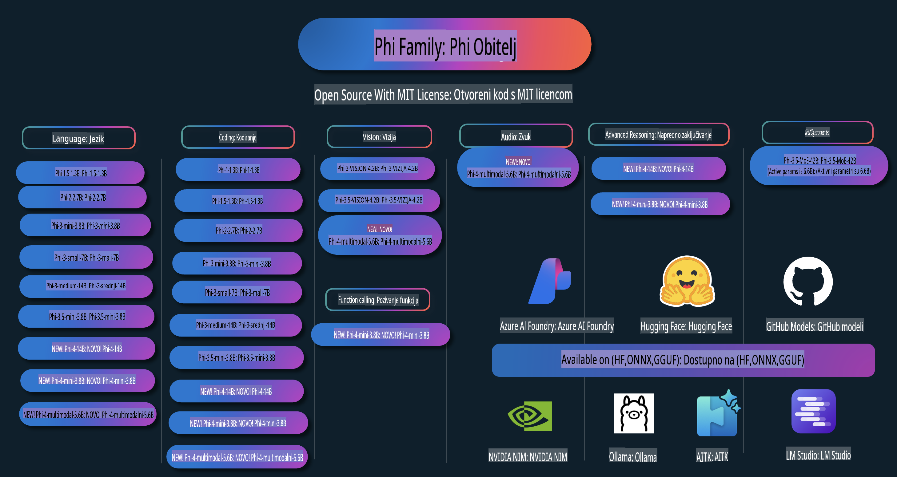

# Phi Cookbook: Praktični Primjeri s Microsoftovim Phi Modelima

Phi je serija AI modela otvorenog koda koje je razvio Microsoft.

Phi je trenutno najmoćniji i najisplativiji mali jezični model (SLM), s izvrsnim rezultatima u više jezika, zaključivanju, generiranju teksta/razgovora, kodiranju, slikama, zvuku i drugim scenarijima.

Možete implementirati Phi u oblaku ili na rubnim uređajima, a također možete jednostavno izgraditi generativne AI aplikacije s ograničenom računalnom snagom.

Slijedite ove korake za početak korištenja ovih resursa:
1. **Forkajte repozitorij**: Kliknite 
2. **Klonirajte repozitorij**:   `git clone https://github.com/microsoft/PhiCookBook.git`
3. [**Pridružite se Microsoft AI Discord zajednici i upoznajte stručnjake i druge programere**](https://discord.com/invite/ByRwuEEgH4?WT.mc_id=aiml-137032-kinfeylo)

## Sadržaj

- Uvod
  - [Dobrodošli u Phi obitelj](./md/01.Introduction/01/01.PhiFamily.md)
  - [Postavljanje vašeg okruženja](./md/01.Introduction/01/01.EnvironmentSetup.md)
  - [Razumijevanje ključnih tehnologija](./md/01.Introduction/01/01.Understandingtech.md)
  - [AI sigurnost za Phi modele](./md/01.Introduction/01/01.AISafety.md)
  - [Podrška za Phi hardver](./md/01.Introduction/01/01.Hardwaresupport.md)
  - [Phi modeli i dostupnost na različitim platformama](./md/01.Introduction/01/01.Edgeandcloud.md)
  - [Korištenje Guidance-ai i Phi](./md/01.Introduction/01/01.Guidance.md)
  - [GitHub Marketplace modeli](https://github.com/marketplace/models)
  - [Azure AI katalog modela](https://ai.azure.com)

- Inference Phi u različitim okruženjima
    -  [Hugging face](./md/01.Introduction/02/01.HF.md)
    -  [GitHub modeli](./md/01.Introduction/02/02.GitHubModel.md)
    -  [Azure AI Foundry katalog modela](./md/01.Introduction/02/03.AzureAIFoundry.md)
    -  [Ollama](./md/01.Introduction/02/04.Ollama.md)
    -  [AI Toolkit VSCode (AITK)](./md/01.Introduction/02/05.AITK.md)
    -  [NVIDIA NIM](./md/01.Introduction/02/06.NVIDIA.md)

- Inference Phi obitelji
    - [Inference Phi na iOS-u](./md/01.Introduction/03/iOS_Inference.md)
    - [Inference Phi na Androidu](./md/01.Introduction/03/Android_Inference.md)
- [Inferiranje Phi na Jetsonu](./md/01.Introduction/03/Jetson_Inference.md)  
    - [Inferiranje Phi na AI PC-u](./md/01.Introduction/03/AIPC_Inference.md)  
    - [Inferiranje Phi pomoću Apple MLX Frameworka](./md/01.Introduction/03/MLX_Inference.md)  
    - [Inferiranje Phi na lokalnom serveru](./md/01.Introduction/03/Local_Server_Inference.md)  
    - [Inferiranje Phi na udaljenom serveru koristeći AI Toolkit](./md/01.Introduction/03/Remote_Interence.md)  
    - [Inferiranje Phi s Rustom](./md/01.Introduction/03/Rust_Inference.md)  
    - [Inferiranje Phi--Vision lokalno](./md/01.Introduction/03/Vision_Inference.md)  
    - [Inferiranje Phi s Kaito AKS, Azure Containers (službena podrška)](./md/01.Introduction/03/Kaito_Inference.md)  

- [Kvantificiranje obitelji Phi](./md/01.Introduction/04/QuantifyingPhi.md)  
    - [Kvantificiranje Phi-3.5 / 4 koristeći llama.cpp](./md/01.Introduction/04/UsingLlamacppQuantifyingPhi.md)  
    - [Kvantificiranje Phi-3.5 / 4 koristeći Generative AI ekstenzije za onnxruntime](./md/01.Introduction/04/UsingORTGenAIQuantifyingPhi.md)  
    - [Kvantificiranje Phi-3.5 / 4 koristeći Intel OpenVINO](./md/01.Introduction/04/UsingIntelOpenVINOQuantifyingPhi.md)  
    - [Kvantificiranje Phi-3.5 / 4 koristeći Apple MLX Framework](./md/01.Introduction/04/UsingAppleMLXQuantifyingPhi.md)  

- Evaluacija Phi  
    - [Odgovorna AI](./md/01.Introduction/05/ResponsibleAI.md)  
    - [Azure AI Foundry za evaluaciju](./md/01.Introduction/05/AIFoundry.md)  
    - [Korištenje Promptflowa za evaluaciju](./md/01.Introduction/05/Promptflow.md)  

- RAG s Azure AI Search  
    - [Kako koristiti Phi-4-mini i Phi-4-multimodal (RAG) s Azure AI Search](https://github.com/microsoft/PhiCookBook/blob/main/code/06.E2E/E2E_Phi-4-RAG-Azure-AI-Search.ipynb)  

- Primjeri razvoja aplikacija s Phi  
  - Tekstualne i chat aplikacije  
    - Primjeri za Phi-4 🆕  
      - [📓] [Chat s Phi-4-mini ONNX modelom](./md/02.Application/01.TextAndChat/Phi4/ChatWithPhi4ONNX/README.md)  
      - [Chat s Phi-4 lokalnim ONNX modelom u .NET-u](../../md/04.HOL/dotnet/src/LabsPhi4-Chat-01OnnxRuntime)  
      - [Chat .NET konzolna aplikacija s Phi-4 ONNX koristeći Semantic Kernel](../../md/04.HOL/dotnet/src/LabsPhi4-Chat-02SK)  
    - Primjeri za Phi-3 / 3.5  
      - [Lokalni chatbot u pregledniku koristeći Phi3, ONNX Runtime Web i WebGPU](https://github.com/microsoft/onnxruntime-inference-examples/tree/main/js/chat)  
      - [OpenVino Chat](./md/02.Application/01.TextAndChat/Phi3/E2E_OpenVino_Chat.md)  
      - [Višestruki modeli - Interaktivni Phi-3-mini i OpenAI Whisper](./md/02.Application/01.TextAndChat/Phi3/E2E_Phi-3-mini_with_whisper.md)  
      - [MLFlow - Izrada omotača i korištenje Phi-3 s MLFlow](./md//02.Application/01.TextAndChat/Phi3/E2E_Phi-3-MLflow.md)  
      - [Optimizacija modela - Kako optimizirati Phi-3-min model za ONNX Runtime Web s Olive](https://github.com/microsoft/Olive/tree/main/examples/phi3)  
      - [WinUI3 aplikacija s Phi-3 mini-4k-instruct-onnx](https://github.com/microsoft/Phi3-Chat-WinUI3-Sample/)  
      - [WinUI3 višemodelna AI aplikacija za bilješke - primjer](https://github.com/microsoft/ai-powered-notes-winui3-sample)  
      - [Fino podešavanje i integracija prilagođenih Phi-3 modela s Prompt flow](./md/02.Application/01.TextAndChat/Phi3/E2E_Phi-3-FineTuning_PromptFlow_Integration.md)  
      - [Fino podešavanje i integracija prilagođenih Phi-3 modela s Prompt flow u Azure AI Foundry](./md/02.Application/01.TextAndChat/Phi3/E2E_Phi-3-FineTuning_PromptFlow_Integration_AIFoundry.md)  
      - [Evaluacija fino podešenog Phi-3 / Phi-3.5 modela u Azure AI Foundry s fokusom na Microsoftove principe odgovorne AI](./md/02.Application/01.TextAndChat/Phi3/E2E_Phi-3-Evaluation_AIFoundry.md)  
- [📓] [Phi-3.5-mini-instruct uzorak predikcije jezika (kineski/engleski)](../../md/02.Application/01.TextAndChat/Phi3/phi3-instruct-demo.ipynb)  
      - [Phi-3.5-Instruct WebGPU RAG Chatbot](./md/02.Application/01.TextAndChat/Phi3/WebGPUWithPhi35Readme.md)  
      - [Korištenje Windows GPU-a za kreiranje Prompt Flow rješenja s Phi-3.5-Instruct ONNX](./md/02.Application/01.TextAndChat/Phi3/UsingPromptFlowWithONNX.md)  
      - [Izrada Android aplikacije pomoću Microsoft Phi-3.5 tflite](./md/02.Application/01.TextAndChat/Phi3/UsingPhi35TFLiteCreateAndroidApp.md)  
      - [Primjer Q&A .NET-a s lokalnim ONNX Phi-3 modelom koristeći Microsoft.ML.OnnxRuntime](../../md/04.HOL/dotnet/src/LabsPhi301)  
      - [Konzolna chat .NET aplikacija sa Semantic Kernel i Phi-3](../../md/04.HOL/dotnet/src/LabsPhi302)  

  - Azure AI Inference SDK Primjeri koda  
    - Phi-4 Primjeri 🆕  
      - [📓] [Generiranje koda projekta pomoću Phi-4-multimodal](./md/02.Application/02.Code/Phi4/GenProjectCode/README.md)  
    - Phi-3 / 3.5 Primjeri  
      - [Izradite svoj vlastiti Visual Studio Code GitHub Copilot Chat s Microsoft Phi-3 obitelji](./md/02.Application/02.Code/Phi3/VSCodeExt/README.md)  
      - [Kreirajte svoj vlastiti Visual Studio Code Chat Copilot Agent s Phi-3.5 pomoću GitHub modela](/md/02.Application/02.Code/Phi3/CreateVSCodeChatAgentWithGitHubModels.md)  

  - Napredni Primjeri Razmišljanja  
    - Phi-4 Primjeri 🆕  
      - [📓] [Phi-4-mini Primjeri Razmišljanja](./md/02.Application/03.AdvancedReasoning/Phi4/AdvancedResoningPhi4mini/README.md)  

  - Demo prikazi  
      - [Phi-4-mini demo prikazi na Hugging Face Spaces](https://huggingface.co/spaces/microsoft/phi-4-mini?WT.mc_id=aiml-137032-kinfeylo)  
      - [Phi-4-multimodal demo prikazi na Hugging Face Spaces](https://huggingface.co/spaces/microsoft/phi-4-multimodal?WT.mc_id=aiml-137032-kinfeylo)  
  - Vizualni Primjeri  
    - Phi-4 Primjeri 🆕  
      - [📓] [Korištenje Phi-4-multimodal za čitanje slika i generiranje koda](./md/02.Application/04.Vision/Phi4/CreateFrontend/README.md)  
    - Phi-3 / 3.5 Primjeri  
      - [📓][Phi-3-vision-Image tekst u tekst](../../md/02.Application/04.Vision/Phi3/E2E_Phi-3-vision-image-text-to-text-online-endpoint.ipynb)  
      - [Phi-3-vision-ONNX](https://onnxruntime.ai/docs/genai/tutorials/phi3-v.html)  
      - [📓][Phi-3-vision CLIP Ugrađivanje](../../md/02.Application/04.Vision/Phi3/E2E_Phi-3-vision-image-text-to-text-online-endpoint.ipynb)  
      - [DEMO: Phi-3 Recikliranje](https://github.com/jennifermarsman/PhiRecycling/)  
      - [Phi-3-vision - Vizualni jezični asistent - s Phi3-Vision i OpenVINO](https://docs.openvino.ai/nightly/notebooks/phi-3-vision-with-output.html)  
      - [Phi-3 Vision Nvidia NIM](./md/02.Application/04.Vision/Phi3/E2E_Nvidia_NIM_Vision.md)  
      - [Phi-3 Vision OpenVino](./md/02.Application/04.Vision/Phi3/E2E_OpenVino_Phi3Vision.md)  
      - [📓][Phi-3.5 Vision primjer za više okvira ili slika](../../md/02.Application/04.Vision/Phi3/phi3-vision-demo.ipynb)  
      - [Phi-3 Vision Lokalni ONNX Model koristeći Microsoft.ML.OnnxRuntime .NET](../../md/04.HOL/dotnet/src/LabsPhi303)  
      - [Izbornik baziran na Phi-3 Vision Lokalni ONNX Model koristeći Microsoft.ML.OnnxRuntime .NET](../../md/04.HOL/dotnet/src/LabsPhi304)  

  - Audio Primjeri  
    - Phi-4 Primjeri 🆕  
      - [📓] [Ekstrakcija audio transkripata pomoću Phi-4-multimodal](./md/02.Application/05.Audio/Phi4/Transciption/README.md)  
      - [📓] [Phi-4-multimodal Audio Primjer](../../md/02.Application/05.Audio/Phi4/Siri/demo.ipynb)  
      - [📓] [Phi-4-multimodal Primjer Prijevoda Govora](../../md/02.Application/05.Audio/Phi4/Translate/demo.ipynb)  
      - [.NET konzolna aplikacija koja koristi Phi-4-multimodal Audio za analizu audio datoteke i generiranje transkripta](../../md/04.HOL/dotnet/src/LabsPhi4-MultiModal-02Audio)  

  - MOE Primjeri  
    - Phi-3 / 3.5 Primjeri  
      - [📓] [Phi-3.5 Mixture of Experts Models (MoEs) Primjer za Društvene Mreže](../../md/02.Application/06.MoE/Phi3/phi3_moe_demo.ipynb)  
      - [📓] [Izrada Retrieval-Augmented Generation (RAG) Povezanog Sustava s NVIDIA NIM Phi-3 MOE, Azure AI Search i LlamaIndex](../../md/02.Application/06.MoE/Phi3/azure-ai-search-nvidia-rag.ipynb)  
  - Primjeri Pozivanja Funkcija  
    - Phi-4 Primjeri 🆕  
      - [📓] [Korištenje Pozivanja Funkcija s Phi-4-mini](./md/02.Application/07.FunctionCalling/Phi4/FunctionCallingBasic/README.md)  
  - Primjeri Miješanja Multimodala  
    - Phi-4 Primjeri 🆕  
- [📓] [Korištenje Phi-4-multimodal kao tehnološki novinar](../../md/02.Application/08.Multimodel/Phi4/TechJournalist/phi_4_mm_audio_text_publish_news.ipynb)
  - [.NET konzolna aplikacija koja koristi Phi-4-multimodal za analizu slika](../../md/04.HOL/dotnet/src/LabsPhi4-MultiModal-01Images)

- Fino podešavanje uzoraka Phi
  - [Scenariji za fino podešavanje](./md/03.FineTuning/FineTuning_Scenarios.md)
  - [Fino podešavanje vs RAG](./md/03.FineTuning/FineTuning_vs_RAG.md)
  - [Fino podešavanje: neka Phi-3 postane stručnjak u industriji](./md/03.FineTuning/LetPhi3gotoIndustriy.md)
  - [Fino podešavanje Phi-3 pomoću AI Toolkit-a za VS Code](./md/03.FineTuning/Finetuning_VSCodeaitoolkit.md)
  - [Fino podešavanje Phi-3 pomoću Azure Machine Learning Service-a](./md/03.FineTuning/Introduce_AzureML.md)
  - [Fino podešavanje Phi-3 pomoću Lora](./md/03.FineTuning/FineTuning_Lora.md)
  - [Fino podešavanje Phi-3 pomoću QLora](./md/03.FineTuning/FineTuning_Qlora.md)
  - [Fino podešavanje Phi-3 pomoću Azure AI Foundry](./md/03.FineTuning/FineTuning_AIFoundry.md)
  - [Fino podešavanje Phi-3 pomoću Azure ML CLI/SDK-a](./md/03.FineTuning/FineTuning_MLSDK.md)
  - [Fino podešavanje pomoću Microsoft Olive-a](./md/03.FineTuning/FineTuning_MicrosoftOlive.md)
  - [Praktična radionica za fino podešavanje pomoću Microsoft Olive-a](./md/03.FineTuning/olive-lab/readme.md)
  - [Fino podešavanje Phi-3-vision pomoću Weights and Bias](./md/03.FineTuning/FineTuning_Phi-3-visionWandB.md)
  - [Fino podešavanje Phi-3 pomoću Apple MLX Framework-a](./md/03.FineTuning/FineTuning_MLX.md)
  - [Fino podešavanje Phi-3-vision (službena podrška)](./md/03.FineTuning/FineTuning_Vision.md)
  - [Fino podešavanje Phi-3 s Kaito AKS i Azure Containers (službena podrška)](./md/03.FineTuning/FineTuning_Kaito.md)
  - [Fino podešavanje Phi-3 i 3.5 Vision](https://github.com/2U1/Phi3-Vision-Finetune)

- Praktične radionice
  - [Istraživanje najmodernijih modela: LLM-ovi, SLM-ovi, lokalni razvoj i više](https://github.com/microsoft/aitour-exploring-cutting-edge-models)
  - [Otključavanje potencijala NLP-a: fino podešavanje pomoću Microsoft Olive-a](https://github.com/azure/Ignite_FineTuning_workshop)

- Akademski istraživački radovi i publikacije
  - [Udžbenici su sve što vam treba II: phi-1.5 tehnički izvještaj](https://arxiv.org/abs/2309.05463)
  - [Phi-3 Tehnički izvještaj: Vrlo sposoban jezični model lokalno na vašem telefonu](https://arxiv.org/abs/2404.14219)
  - [Phi-4 Tehnički izvještaj](https://arxiv.org/abs/2412.08905)
  - [Optimizacija malih jezičnih modela za funkcionalnost u vozilu](https://arxiv.org/abs/2501.02342)
  - [(WhyPHI) Fino podešavanje PHI-3 za pitanja s višestrukim izborom: Metodologija, rezultati i izazovi](https://arxiv.org/abs/2501.01588)

## Korištenje Phi modela

### Phi na Azure AI Foundry

Možete naučiti kako koristiti Microsoft Phi i kako izgraditi E2E rješenja na različitim hardverskim uređajima. Da biste sami isprobali Phi, započnite istraživanjem modela i prilagođavanjem Phi-a za svoje scenarije pomoću [Azure AI Foundry Azure AI Model Catalog](https://aka.ms/phi3-azure-ai). Više informacija možete pronaći u vodiču za početak [Azure AI Foundry](/md/02.QuickStart/AzureAIFoundry_QuickStart.md).

**Igralište**
Svaki model ima svoje igralište za testiranje [Azure AI Playground](https://aka.ms/try-phi3).

### Phi na GitHub Modelima

Možete naučiti kako koristiti Microsoft Phi i kako izgraditi E2E rješenja na različitim hardverskim uređajima. Da biste sami isprobali Phi, započnite istraživanjem modela i prilagođavanjem Phi-a za svoje scenarije pomoću [GitHub Model Catalog](https://github.com/marketplace/models?WT.mc_id=aiml-137032-kinfeylo). Više informacija možete pronaći u vodiču za početak [GitHub Model Catalog](/md/02.QuickStart/GitHubModel_QuickStart.md).

**Igralište**
Svaki model ima poseban [playground za testiranje modela](/md/02.QuickStart/GitHubModel_QuickStart.md).

### Phi na Hugging Face

Model možete pronaći i na [Hugging Face](https://huggingface.co/microsoft)

**Playground**  
[Hugging Chat playground](https://huggingface.co/chat/models/microsoft/Phi-3-mini-4k-instruct)

## Odgovorna AI

Microsoft se zalaže za pomoć svojim korisnicima u odgovornoj upotrebi naših AI proizvoda, dijeljenju naših spoznaja i izgradnji partnerskih odnosa temeljenih na povjerenju kroz alate poput Bilješki o transparentnosti i Procjena utjecaja. Mnogi od ovih resursa dostupni su na [https://aka.ms/RAI](https://aka.ms/RAI).  
Microsoftov pristup odgovornoj AI temelji se na našim principima umjetne inteligencije: pravednosti, pouzdanosti i sigurnosti, privatnosti i zaštiti, uključivosti, transparentnosti i odgovornosti.

Veliki modeli za obradu prirodnog jezika, slika i govora - poput onih korištenih u ovom primjeru - mogu potencijalno djelovati na nepravedan, nepouzdan ili uvredljiv način, što može prouzročiti štetu. Molimo konzultirajte [Bilješku o transparentnosti za Azure OpenAI uslugu](https://learn.microsoft.com/legal/cognitive-services/openai/transparency-note?tabs=text) kako biste se informirali o rizicima i ograničenjima.

Preporučeni pristup za ublažavanje ovih rizika uključuje uključivanje sigurnosnog sustava u vašu arhitekturu koji može otkriti i spriječiti štetno ponašanje. [Azure AI Content Safety](https://learn.microsoft.com/azure/ai-services/content-safety/overview) pruža neovisni sloj zaštite, sposoban otkriti štetan sadržaj generiran od strane korisnika ili AI-a u aplikacijama i uslugama. Azure AI Content Safety uključuje API-je za tekst i slike koji omogućuju detekciju štetnog materijala. Unutar Azure AI Foundry, Content Safety usluga omogućuje pregledavanje, istraživanje i isprobavanje uzorka koda za detekciju štetnog sadržaja u različitim modalitetima. Sljedeća [dokumentacija za brzi početak](https://learn.microsoft.com/azure/ai-services/content-safety/quickstart-text?tabs=visual-studio%2Clinux&pivots=programming-language-rest) vodi vas kroz postupak slanja zahtjeva usluzi.

Drugi aspekt koji treba uzeti u obzir je ukupna izvedba aplikacije. Kod aplikacija s više modaliteta i modela, izvedba znači da sustav funkcionira kako vi i vaši korisnici očekujete, uključujući i to da ne generira štetne rezultate. Važno je procijeniti izvedbu vaše ukupne aplikacije koristeći [Procjenitelje za izvedbu i kvalitetu te rizike i sigurnost](https://learn.microsoft.com/azure/ai-studio/concepts/evaluation-metrics-built-in). Također imate mogućnost kreiranja i evaluacije s [prilagođenim procjeniteljima](https://learn.microsoft.com/azure/ai-studio/how-to/develop/evaluate-sdk#custom-evaluators).

Možete evaluirati svoju AI aplikaciju u svom razvojnom okruženju koristeći [Azure AI Evaluation SDK](https://microsoft.github.io/promptflow/index.html). Na temelju testnog skupa podataka ili cilja, generacije vaše generativne AI aplikacije kvantitativno se mjere pomoću ugrađenih ili prilagođenih procjenitelja po vašem izboru. Da biste započeli s Azure AI Evaluation SDK za evaluaciju vašeg sustava, možete slijediti [vodič za brzi početak](https://learn.microsoft.com/azure/ai-studio/how-to/develop/flow-evaluate-sdk). Nakon što izvršite evaluaciju, možete [vizualizirati rezultate u Azure AI Foundry](https://learn.microsoft.com/azure/ai-studio/how-to/evaluate-flow-results).

## Zaštitni znakovi

Ovaj projekt može sadržavati zaštitne znakove ili logotipe za projekte, proizvode ili usluge. Ovlaštena upotreba Microsoftovih zaštitnih znakova ili logotipa podliježe i mora slijediti [Microsoftove smjernice za zaštitne znakove i brendove](https://www.microsoft.com/legal/intellectualproperty/trademarks/usage/general).  
Korištenje Microsoftovih zaštitnih znakova ili logotipa u izmijenjenim verzijama ovog projekta ne smije uzrokovati zabunu niti implicirati Microsoftovo sponzorstvo. Svaka upotreba zaštitnih znakova ili logotipa trećih strana podliježe politikama tih trećih strana.

**Odricanje odgovornosti**:  
Ovaj dokument je preveden koristeći usluge strojno baziranog AI prevođenja. Iako težimo točnosti, imajte na umu da automatski prijevodi mogu sadržavati pogreške ili netočnosti. Izvorni dokument na izvornom jeziku treba smatrati mjerodavnim izvorom. Za ključne informacije preporučuje se profesionalni prijevod od strane čovjeka. Ne snosimo odgovornost za bilo kakva nesporazume ili pogrešne interpretacije koje proizlaze iz korištenja ovog prijevoda.