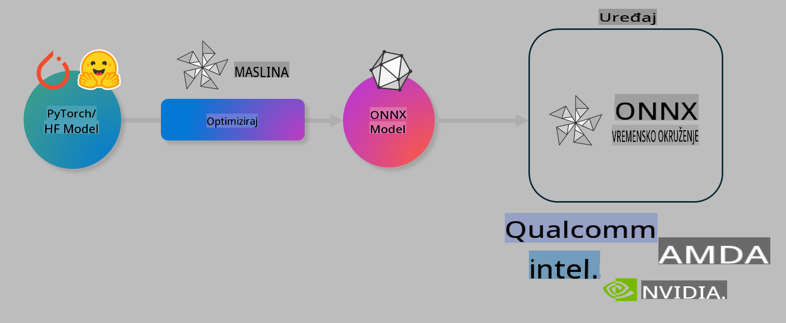

# Laboratorij: Optimizacija AI modela za lokalnu inferenciju

## Uvod

> [!IMPORTANT]
> Ovaj laboratorij zahtijeva **Nvidia A10 ili A100 GPU** s pripadajućim driverima i instaliranim CUDA alatom (verzija 12+).

> [!NOTE]
> Ovo je **35-minutni** laboratorij koji će vam pružiti praktičan uvod u osnovne koncepte optimizacije modela za lokalnu inferenciju koristeći OLIVE.

## Ciljevi učenja

Na kraju ovog laboratorija, moći ćete koristiti OLIVE za:

- Kvantizaciju AI modela koristeći AWQ metodu kvantizacije.
- Fino podešavanje AI modela za određeni zadatak.
- Generiranje LoRA adaptera (fino podešen model) za učinkovitu lokalnu inferenciju na ONNX Runtime-u.

### Što je Olive

Olive (*O*NNX *live*) je alat za optimizaciju modela s pratećim CLI-jem koji omogućuje isporuku modela za ONNX runtime +++https://onnxruntime.ai+++ s visokom kvalitetom i performansama.



Ulaz za Olive obično je PyTorch ili Hugging Face model, dok je izlaz optimizirani ONNX model koji se izvršava na uređaju (cilj za implementaciju) s ONNX runtime-om. Olive optimizira model za AI akcelerator ciljnog uređaja (NPU, GPU, CPU) kojeg pruža proizvođač hardvera poput Qualcomma, AMD-a, Nvidije ili Intela.

Olive izvršava *workflow*, koji je redoslijed pojedinačnih zadataka optimizacije modela nazvanih *passes* - primjeri zadataka uključuju: kompresiju modela, hvatanje grafa, kvantizaciju, optimizaciju grafa. Svaki zadatak ima skup parametara koji se mogu prilagoditi kako bi se postigli najbolji metrički rezultati, poput točnosti i latencije, koje procjenjuje odgovarajući evaluator. Olive koristi strategiju pretraživanja s algoritmom pretraživanja kako bi automatski prilagodio svaki zadatak pojedinačno ili skup zadataka zajedno.

#### Prednosti Olive-a

- **Smanjuje frustraciju i vrijeme** eksperimentiranja metodom pokušaja i pogreške s različitim tehnikama optimizacije grafa, kompresije i kvantizacije. Definirajte svoje zahtjeve za kvalitetom i performansama, a Olive će automatski pronaći najbolji model za vas.
- **40+ ugrađenih komponenti za optimizaciju modela** koje pokrivaju najnovije tehnike kvantizacije, kompresije, optimizacije grafa i finog podešavanja.
- **Jednostavan CLI** za uobičajene zadatke optimizacije modela. Na primjer: olive quantize, olive auto-opt, olive finetune.
- Ugrađeno pakiranje i implementacija modela.
- Podrška za generiranje modela za **Multi LoRA posluživanje**.
- Kreiranje workflow-a koristeći YAML/JSON za orkestraciju zadataka optimizacije i implementacije modela.
- Integracija s **Hugging Face** i **Azure AI**.
- Ugrađeni **mehanizam keširanja** za **smanjenje troškova**.

## Upute za laboratorij
> [!NOTE]
> Provjerite jeste li osigurali svoj Azure AI Hub i Projekt te postavili svoj A100 računalni sustav prema uputama iz Laboratorija 1.

### Korak 0: Povezivanje s vašim Azure AI računalom

Povezat ćete se s Azure AI računalom koristeći udaljenu funkciju u **VS Code-u.** 

1. Otvorite svoju **VS Code** desktop aplikaciju:
2. Otvorite **Command Palette** koristeći **Shift+Ctrl+P**.
3. U Command Palette pretražite **AzureML - remote: Connect to compute instance in New Window**.
4. Slijedite upute na ekranu za povezivanje s računalom. To uključuje odabir vaše Azure pretplate, Resource Group-a, Projekta i imena računala koje ste postavili u Laboratoriju 1.
5. Kada se povežete s vašim Azure ML računalnim čvorom, to će biti prikazano u **donjem lijevom kutu Visual Code-a** `><Azure ML: Compute Name`.

### Korak 1: Klonirajte ovaj repozitorij

U VS Code-u možete otvoriti novi terminal koristeći **Ctrl+J** i klonirati ovaj repozitorij:

U terminalu biste trebali vidjeti prompt:

```
azureuser@computername:~/cloudfiles/code$ 
```
Klonirajte rješenje:

```bash
cd ~/localfiles
git clone https://github.com/microsoft/phi-3cookbook.git
```

### Korak 2: Otvorite mapu u VS Code-u

Da biste otvorili VS Code u relevantnoj mapi, izvršite sljedeću naredbu u terminalu, koja će otvoriti novi prozor:

```bash
code phi-3cookbook/code/04.Finetuning/Olive-lab
```

Alternativno, možete otvoriti mapu odabirom **File** > **Open Folder**. 

### Korak 3: Ovisnosti

Otvorite prozor terminala u VS Code-u na vašem Azure AI računalnom čvoru (savjet: **Ctrl+J**) i izvršite sljedeće naredbe za instalaciju ovisnosti:

```bash
conda create -n olive-ai python=3.11 -y
conda activate olive-ai
pip install -r requirements.txt
az extension remove -n azure-cli-ml
az extension add -n ml
```

> [!NOTE]
> Instalacija svih ovisnosti trajat će ~5 minuta.

U ovom laboratoriju preuzet ćete i prenijeti modele u katalog modela Azure AI. Kako biste mogli pristupiti katalogu modela, trebate se prijaviti u Azure koristeći:

```bash
az login
```

> [!NOTE]
> Prilikom prijave bit ćete upitani da odaberete svoju pretplatu. Provjerite je li odabrana pretplata ona predviđena za ovaj laboratorij.

### Korak 4: Izvršavanje Olive naredbi 

Otvorite prozor terminala u VS Code-u na vašem Azure AI računalnom čvoru (savjet: **Ctrl+J**) i provjerite je li aktivirano `olive-ai` conda okruženje:

```bash
conda activate olive-ai
```

Zatim izvršite sljedeće Olive naredbe u naredbenom retku.

1. **Pregled podataka:** U ovom primjeru fino ćete podesiti Phi-3.5-Mini model kako bi bio specijaliziran za odgovaranje na pitanja vezana uz putovanja. Kod ispod prikazuje prvih nekoliko zapisa iz skupa podataka u JSON lines formatu:
   
    ```bash
    head data/data_sample_travel.jsonl
    ```
2. **Kvantizacija modela:** Prije treniranja modela, prvo ga kvantizirajte koristeći sljedeću naredbu koja koristi tehniku nazvanu Active Aware Quantization (AWQ) +++https://arxiv.org/abs/2306.00978+++. AWQ kvantizira težine modela uzimajući u obzir aktivacije proizvedene tijekom inferencije. To znači da proces kvantizacije uzima u obzir stvarnu distribuciju podataka u aktivacijama, što dovodi do boljeg očuvanja točnosti modela u usporedbi s tradicionalnim metodama kvantizacije težina.
    
    ```bash
    olive quantize \
       --model_name_or_path microsoft/Phi-3.5-mini-instruct \
       --trust_remote_code \
       --algorithm awq \
       --output_path models/phi/awq \
       --log_level 1
    ```
    
    Proces traje **~8 minuta**, a rezultat je **smanjenje veličine modela s ~7.5GB na ~2.5GB**.
   
   U ovom laboratoriju pokazujemo kako unositi modele s Hugging Face-a (na primjer: `microsoft/Phi-3.5-mini-instruct`). However, Olive also allows you to input models from the Azure AI catalog by updating the `model_name_or_path` argument to an Azure AI asset ID (for example:  `azureml://registries/azureml/models/Phi-3.5-mini-instruct/versions/4`). 

1. **Train the model:** Next, the `olive finetune` naredba fino podešava kvantizirani model. Kvantiziranje modela *prije* finog podešavanja, umjesto nakon, daje bolju točnost jer proces finog podešavanja oporavlja dio gubitka od kvantizacije.
    
    ```bash
    olive finetune \
        --method lora \
        --model_name_or_path models/phi/awq \
        --data_files "data/data_sample_travel.jsonl" \
        --data_name "json" \
        --text_template "<|user|>\n{prompt}<|end|>\n<|assistant|>\n{response}<|end|>" \
        --max_steps 100 \
        --output_path ./models/phi/ft \
        --log_level 1
    ```
    
    Proces finog podešavanja traje **~6 minuta** (sa 100 koraka).

3. **Optimizacija:** Kada je model istreniran, sada ga optimizirajte koristeći Olive-ovu naredbu `auto-opt` command, which will capture the ONNX graph and automatically perform a number of optimizations to improve the model performance for CPU by compressing the model and doing fusions. It should be noted, that you can also optimize for other devices such as NPU or GPU by just updating the `--device` and `--provider` argumente - ali za potrebe ovog laboratorija koristit ćemo CPU.

    ```bash
    olive auto-opt \
       --model_name_or_path models/phi/ft/model \
       --adapter_path models/phi/ft/adapter \
       --device cpu \
       --provider CPUExecutionProvider \
       --use_ort_genai \
       --output_path models/phi/onnx-ao \
       --log_level 1
    ```
    
    Optimizacija traje **~5 minuta**.

### Korak 5: Brzi test inferencije modela

Za testiranje inferencije modela, kreirajte Python datoteku u svojoj mapi nazvanu **app.py** i kopirajte sljedeći kod:

```python
import onnxruntime_genai as og
import numpy as np

print("loading model and adapters...", end="", flush=True)
model = og.Model("models/phi/onnx-ao/model")
adapters = og.Adapters(model)
adapters.load("models/phi/onnx-ao/model/adapter_weights.onnx_adapter", "travel")
print("DONE!")

tokenizer = og.Tokenizer(model)
tokenizer_stream = tokenizer.create_stream()

params = og.GeneratorParams(model)
params.set_search_options(max_length=100, past_present_share_buffer=False)
user_input = "what is the best thing to see in chicago"
params.input_ids = tokenizer.encode(f"<|user|>\n{user_input}<|end|>\n<|assistant|>\n")

generator = og.Generator(model, params)

generator.set_active_adapter(adapters, "travel")

print(f"{user_input}")

while not generator.is_done():
    generator.compute_logits()
    generator.generate_next_token()

    new_token = generator.get_next_tokens()[0]
    print(tokenizer_stream.decode(new_token), end='', flush=True)

print("\n")
```

Izvršite kod koristeći:

```bash
python app.py
```

### Korak 6: Prenesite model na Azure AI

Prenošenje modela u Azure AI repozitorij modela omogućuje dijeljenje modela s drugim članovima vašeg razvojnog tima te upravljanje verzijama modela. Za prijenos modela pokrenite sljedeću naredbu:

> [!NOTE]
> Ažurirajte `{}` placeholders with the name of your resource group and Azure AI Project Name. 

To find your resource group `"resourceGroup"` i ime Azure AI Projekta, zatim pokrenite sljedeću naredbu:

```
az ml workspace show
```

Ili posjetite +++ai.azure.com+++ i odaberite **management center** **project** **overview**.

Ažurirajte `{}` rezervirana mjesta s imenom vašeg resource group-a i imenom Azure AI Projekta.

```bash
az ml model create \
    --name ft-for-travel \
    --version 1 \
    --path ./models/phi/onnx-ao \
    --resource-group {RESOURCE_GROUP_NAME} \
    --workspace-name {PROJECT_NAME}
```
Nakon toga možete vidjeti svoj preneseni model i implementirati ga na https://ml.azure.com/model/list

**Odricanje od odgovornosti**:  
Ovaj dokument je preveden korištenjem usluga strojno baziranog AI prijevoda. Iako težimo točnosti, imajte na umu da automatizirani prijevodi mogu sadržavati pogreške ili netočnosti. Izvorni dokument na izvornom jeziku treba smatrati mjerodavnim izvorom. Za ključne informacije preporučuje se profesionalni prijevod od strane čovjeka. Ne snosimo odgovornost za nesporazume ili pogrešna tumačenja koja proizlaze iz korištenja ovog prijevoda.