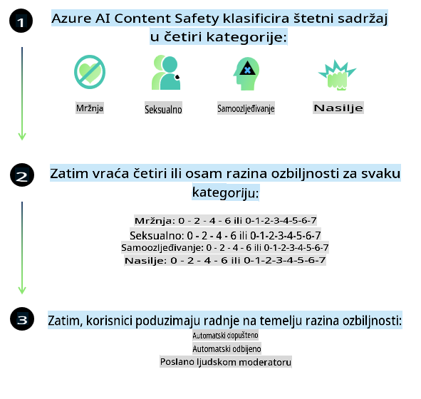

# AI sigurnost za Phi modele
Phi obitelj modela razvijena je u skladu s [Microsoftovim standardom za odgovornu umjetnu inteligenciju](https://query.prod.cms.rt.microsoft.com/cms/api/am/binary/RE5cmFl), koji je skup zahtjeva na razini cijele tvrtke temeljen na sljedećih šest načela: odgovornost, transparentnost, pravednost, pouzdanost i sigurnost, privatnost i sigurnost te uključivost, koji čine [Microsoftova načela odgovorne AI](https://www.microsoft.com/ai/responsible-ai).

Kao i prethodni Phi modeli, usvojen je višestruki pristup procjeni sigurnosti i post-trening sigurnosti, uz dodatne mjere za uzimanje u obzir višejezičnih sposobnosti ovog izdanja. Naš pristup sigurnosnom treningu i procjenama, uključujući testiranje na više jezika i u različitim kategorijama rizika, opisan je u [Phi Safety Post-Training Paper](https://arxiv.org/abs/2407.13833). Iako Phi modeli imaju koristi od ovog pristupa, programeri bi trebali primjenjivati najbolje prakse odgovorne AI, uključujući mapiranje, mjerenje i ublažavanje rizika povezanih s njihovom specifičnom primjenom i kulturnim te jezičnim kontekstom.

## Najbolje prakse

Kao i drugi modeli, Phi obitelj modela može se potencijalno ponašati na nepravedan, nepouzdan ili uvredljiv način.

Neka od ograničavajućih ponašanja SLM i LLM modela na koja treba obratiti pažnju uključuju:

- **Kvaliteta usluge:** Phi modeli su primarno trenirani na engleskom jeziku. Jezici osim engleskog imat će lošiju izvedbu, a varijante engleskog jezika s manje zastupljenosti u podacima za trening mogu imati lošiju izvedbu u usporedbi sa standardnim američkim engleskim.
- **Reprezentacija šteta i perpetuiranje stereotipa:** Ovi modeli mogu pretjerano ili nedovoljno predstavljati određene skupine ljudi, izbrisati reprezentaciju nekih skupina ili ojačati ponižavajuće ili negativne stereotipe. Unatoč post-treningu sigurnosti, ova ograničenja mogu i dalje biti prisutna zbog različitih razina zastupljenosti različitih skupina ili učestalosti primjera negativnih stereotipa u podacima za trening koji odražavaju stvarne obrasce i društvene predrasude.
- **Neprimjeren ili uvredljiv sadržaj:** Ovi modeli mogu generirati i druge vrste neprimjerenog ili uvredljivog sadržaja, što može učiniti njihovu primjenu neprikladnom za osjetljive kontekste bez dodatnih mjera prilagođenih specifičnoj primjeni.
- **Pouzdanost informacija:** Jezični modeli mogu generirati besmislen sadržaj ili izmisliti sadržaj koji zvuči razumno, ali je netočan ili zastario.
- **Ograničeni opseg za kod:** Većina podataka za trening Phi-3 modela temelji se na Pythonu i koristi uobičajene pakete poput "typing, math, random, collections, datetime, itertools". Ako model generira Python skripte koje koriste druge pakete ili skripte u drugim jezicima, snažno preporučujemo korisnicima da ručno provjere sve API-je.

Programeri bi trebali primjenjivati najbolje prakse odgovorne AI i odgovorni su za osiguranje da određena primjena bude u skladu s relevantnim zakonima i propisima (npr. privatnost, trgovina itd.).

## Razmatranja za odgovornu AI

Kao i drugi jezični modeli, Phi serija modela može se potencijalno ponašati na nepravedan, nepouzdan ili uvredljiv način. Neka od ograničavajućih ponašanja na koja treba obratiti pažnju uključuju:

**Kvaliteta usluge:** Phi modeli su primarno trenirani na engleskom jeziku. Jezici osim engleskog imat će lošiju izvedbu. Varijante engleskog jezika s manje zastupljenosti u podacima za trening mogu imati lošiju izvedbu u usporedbi sa standardnim američkim engleskim.

**Reprezentacija šteta i perpetuiranje stereotipa:** Ovi modeli mogu pretjerano ili nedovoljno predstavljati određene skupine ljudi, izbrisati reprezentaciju nekih skupina ili ojačati ponižavajuće ili negativne stereotipe. Unatoč post-treningu sigurnosti, ova ograničenja mogu i dalje biti prisutna zbog različitih razina zastupljenosti različitih skupina ili učestalosti primjera negativnih stereotipa u podacima za trening koji odražavaju stvarne obrasce i društvene predrasude.

**Neprimjeren ili uvredljiv sadržaj:** Ovi modeli mogu generirati i druge vrste neprimjerenog ili uvredljivog sadržaja, što može učiniti njihovu primjenu neprikladnom za osjetljive kontekste bez dodatnih mjera prilagođenih specifičnoj primjeni.

**Pouzdanost informacija:** Jezični modeli mogu generirati besmislen sadržaj ili izmisliti sadržaj koji zvuči razumno, ali je netočan ili zastario.

**Ograničeni opseg za kod:** Većina podataka za trening Phi-3 modela temelji se na Pythonu i koristi uobičajene pakete poput "typing, math, random, collections, datetime, itertools". Ako model generira Python skripte koje koriste druge pakete ili skripte u drugim jezicima, snažno preporučujemo korisnicima da ručno provjere sve API-je.

Programeri bi trebali primjenjivati najbolje prakse odgovorne AI i odgovorni su za osiguranje da određena primjena bude u skladu s relevantnim zakonima i propisima (npr. privatnost, trgovina itd.). Važna područja za razmatranje uključuju:

**Raspodjela:** Modeli možda nisu prikladni za scenarije koji mogu imati značajan utjecaj na pravni status ili raspodjelu resursa ili životnih prilika (npr. stanovanje, zapošljavanje, kredit, itd.) bez daljnjih procjena i dodatnih tehnika za smanjenje pristranosti.

**Visokorizični scenariji:** Programeri bi trebali procijeniti prikladnost korištenja modela u visokorizičnim scenarijima gdje nepravedni, nepouzdani ili uvredljivi rezultati mogu biti izuzetno skupi ili dovesti do štete. To uključuje pružanje savjeta u osjetljivim ili stručnim područjima gdje su točnost i pouzdanost ključni (npr. pravni ili zdravstveni savjeti). Dodatne mjere zaštite trebale bi se implementirati na razini aplikacije prema kontekstu primjene.

**Dezinformacije:** Modeli mogu generirati netočne informacije. Programeri bi trebali slijediti najbolje prakse transparentnosti i obavijestiti krajnje korisnike da komuniciraju s AI sustavom. Na razini aplikacije, programeri mogu izgraditi mehanizme povratnih informacija i procese za utemeljivanje odgovora na specifične, kontekstualne informacije, tehniku poznatu kao Retrieval Augmented Generation (RAG).

**Generiranje štetnog sadržaja:** Programeri bi trebali procijeniti rezultate u njihovom kontekstu i koristiti dostupne sigurnosne klasifikatore ili prilagođena rješenja prikladna za njihovu primjenu.

**Zlouporaba:** Ostali oblici zlouporabe, poput prijevara, neželjene pošte ili stvaranja zlonamjernog softvera, mogući su, a programeri bi trebali osigurati da njihove aplikacije ne krše primjenjive zakone i propise.

### Finetuning i sigurnost AI sadržaja

Nakon prilagođavanja modela, snažno preporučujemo korištenje mjera [Azure AI Content Safety](https://learn.microsoft.com/azure/ai-services/content-safety/overview) za praćenje sadržaja generiranog od strane modela, identificiranje i blokiranje potencijalnih rizika, prijetnji i problema s kvalitetom.

[Azure AI Content Safety](https://learn.microsoft.com/azure/ai-services/content-safety/overview) podržava i tekstualni i slikovni sadržaj. Može se implementirati u oblaku, odspojenim spremnicima i na rubnim/ugrađenim uređajima.

## Pregled Azure AI Content Safety

Azure AI Content Safety nije univerzalno rješenje; može se prilagoditi kako bi se uskladilo sa specifičnim politikama poslovanja. Osim toga, njegovi višejezični modeli omogućuju razumijevanje više jezika istovremeno.

- **Azure AI Content Safety**
- **Microsoft Developer**
- **5 videa**

Usluga Azure AI Content Safety otkriva štetan sadržaj generiran od strane korisnika i AI-a u aplikacijama i uslugama. Uključuje API-je za tekst i slike koji omogućuju otkrivanje štetnog ili neprimjerenog materijala.

[AI Content Safety Playlist](https://www.youtube.com/playlist?list=PLlrxD0HtieHjaQ9bJjyp1T7FeCbmVcPkQ)

**Odricanje od odgovornosti**:  
Ovaj dokument je preveden pomoću usluga strojno baziranog AI prijevoda. Iako nastojimo osigurati točnost, imajte na umu da automatizirani prijevodi mogu sadržavati pogreške ili netočnosti. Izvorni dokument na njegovom izvornom jeziku treba smatrati mjerodavnim izvorom. Za ključne informacije preporučuje se profesionalni ljudski prijevod. Ne preuzimamo odgovornost za nesporazume ili pogrešna tumačenja koja mogu proizaći iz korištenja ovog prijevoda.