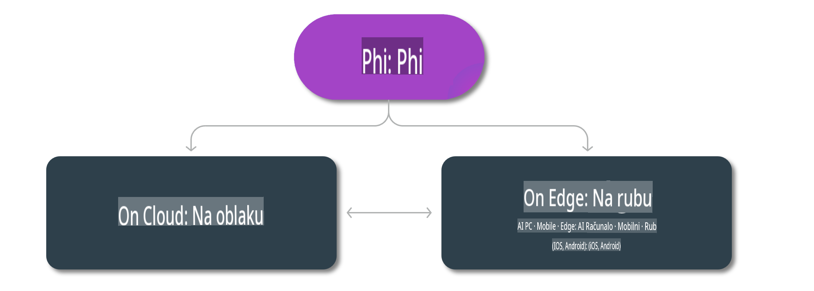

# Phi modeli i dostupnost na platformama

## Scenariji za Edge i Cloud

## Dostupnost modela i resursi

| | | | | | | | | |
|-|-|-|-|-|-|-|-|-|
|Model|Ulaz|Duljina sadržaja|Azure AI (MaaS)|Azure ML (MaaP)|ONNX|Hugging Face|Ollama|Nvidia NIM|
|Phi-3-vision-128k-instruct|Tekst+Slika|128k|[Playground i implementacija](https://ai.azure.com/explore/models/Phi-3-vision-128k-instruct/version/2/registry/azureml)|[Playground, implementacija i fino podešavanje](https://ml.azure.com/registries/azureml/models/Phi-3-vision-128k-instruct/version/2)|[CUDA](https://huggingface.co/microsoft/Phi-3-vision-128k-instruct-onnx-cuda/tree/main),[CPU](https://huggingface.co/microsoft/Phi-3-vision-128k-instruct-onnx-cpu/tree/main), [DirectML](https://huggingface.co/microsoft/Phi-3-vision-128k-instruct-onnx-directml/tree/main)|[Preuzmi](https://huggingface.co/microsoft/Phi-3-vision-128k-instruct)|-N/A-|[NIM API-ji](https://build.nvidia.com/microsoft/phi-3-vision-128k-instruct)|
|Phi-3-mini-4k-instruct|Tekst|4k|[Playground i implementacija](https://aka.ms/phi3-mini-4k-azure-ml)|[Playground, implementacija](https://aka.ms/phi3-mini-4k-azure-ml) i fino podešavanje|[CUDA](https://huggingface.co/microsoft/Phi-3-mini-4k-instruct-onnx), [Web](https://huggingface.co/microsoft/Phi-3-mini-4k-instruct-onnx)|[Playground i preuzimanje](https://huggingface.co/chat/models/microsoft/Phi-3-mini-4k-instruct)|[GGUF](https://huggingface.co/microsoft/Phi-3-mini-4k-instruct-gguf)|[NIM API-ji](https://build.nvidia.com/microsoft/phi-3-mini-4k)|
|Phi-3-mini-128k-instruct|Tekst|128k|[Playground i implementacija](https://ai.azure.com/explore/models/Phi-3-mini-128k-instruct/version/9/registry/azureml)|[Playground, implementacija](https://ai.azure.com/explore/models/Phi-3-mini-128k-instruct/version/9/registry/azureml) i fino podešavanje|[CUDA](https://huggingface.co/microsoft/Phi-3-mini-128k-instruct-onnx)|[Preuzmi](https://huggingface.co/microsoft/Phi-3-mini-128k-instruct-onnx)|-N/A-|[NIM API-ji](https://build.nvidia.com/microsoft/phi-3-mini)|
|Phi-3-small-8k-instruct|Tekst|8k|[Playground i implementacija](https://ml.azure.com/registries/azureml/models/Phi-3-small-8k-instruct/version/2)|[Playground, implementacija](https://ai.azure.com/explore/models/Phi-3-small-8k-instruct/version/2/registry/azureml) i fino podešavanje|[CUDA](https://huggingface.co/microsoft/Phi-3-small-8k-instruct-onnx-cuda)|[Preuzmi](https://huggingface.co/microsoft/Phi-3-small-8k-instruct-onnx-cuda)|-N/A-|[NIM API-ji](https://build.nvidia.com/microsoft/phi-3-small-8k-instruct?docker=false)|
|Phi-3-small-128k-instruct|Tekst|128k|[Playground i implementacija](https://ai.azure.com/explore/models/Phi-3-small-128k-instruct/version/2/registry/azureml)|[Playground, implementacija](https://ml.azure.com/registries/azureml/models/Phi-3-small-128k-instruct/version/2) i fino podešavanje|[CUDA](https://huggingface.co/microsoft/Phi-3-medium-128k-instruct-onnx-cuda)|[Preuzmi](https://huggingface.co/microsoft/Phi-3-small-128k-instruct)|-N/A-|[NIM API-ji](https://build.nvidia.com/microsoft/phi-3-small-128k-instruct?docker=false)|
|Phi-3-medium-4k-instruct|Tekst|4k|[Playground i implementacija](https://huggingface.co/microsoft/Phi-3-medium-4k-instruct)|[Playground, implementacija](https://ml.azure.com/registries/azureml/models/Phi-3-medium-4k-instruct/version/2) i fino podešavanje|[CUDA](https://huggingface.co/microsoft/Phi-3-medium-4k-instruct-onnx-cuda/tree/main), [CPU](https://huggingface.co/microsoft/Phi-3-medium-4k-instruct-onnx-cpu/tree/main), [DirectML](https://huggingface.co/microsoft/Phi-3-medium-4k-instruct-onnx-directml/tree/main)|[Preuzimanje](https://huggingface.co/microsoft/Phi-3-medium-4k-instruct)|-N/A-|[NIM API-jevi](https://build.nvidia.com/microsoft/phi-3-medium-4k-instruct?docker=false)|
|Phi-3-medium-128k-instruct|Tekst|128k|[Playground i implementacija](https://ai.azure.com/explore/models/Phi-3-medium-128k-instruct/version/2)|[Playground, implementacija](https://ml.azure.com/registries/azureml/models/Phi-3-medium-128k-instruct/version/2) i fino podešavanje|[CUDA](https://huggingface.co/microsoft/Phi-3-medium-128k-instruct-onnx-cuda/tree/main), [CPU](https://huggingface.co/microsoft/Phi-3-medium-128k-instruct-onnx-cpu/tree/main), [DirectML](https://huggingface.co/microsoft/Phi-3-medium-128k-instruct-onnx-directml/tree/main)|[Preuzimanje](https://huggingface.co/microsoft/Phi-3-medium-128k-instruct)|-N/A-|-N/A-|

**Odricanje od odgovornosti**:  
Ovaj dokument je preveden pomoću AI usluga za strojno prevođenje. Iako nastojimo osigurati točnost, imajte na umu da automatizirani prijevodi mogu sadržavati pogreške ili netočnosti. Izvorni dokument na izvornom jeziku treba smatrati mjerodavnim izvorom. Za ključne informacije preporučuje se profesionalni prijevod od strane čovjeka. Ne snosimo odgovornost za nesporazume ili pogrešna tumačenja proizašla iz korištenja ovog prijevoda.