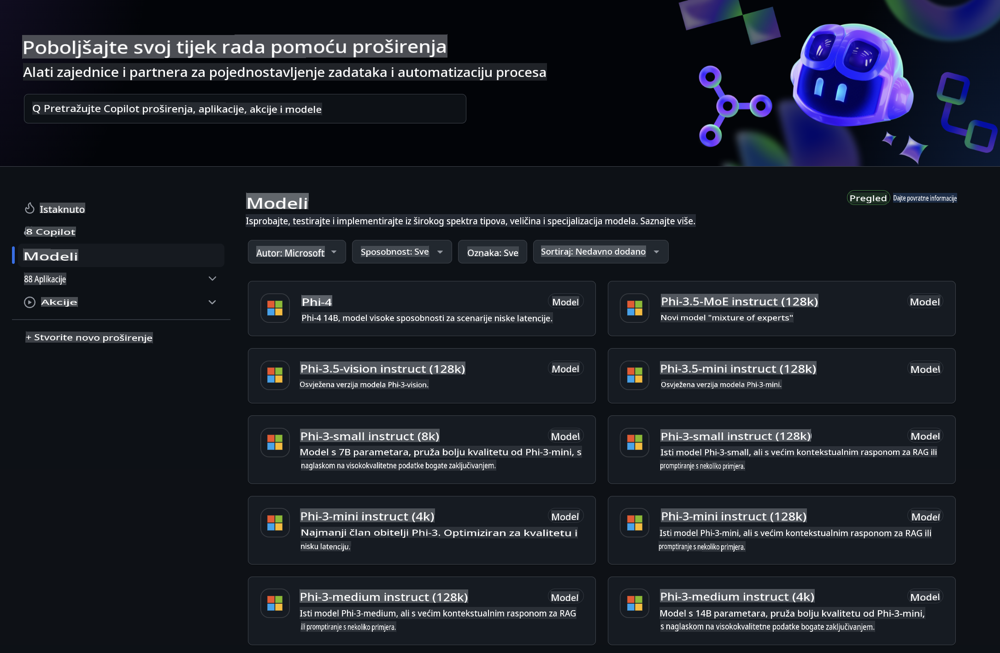
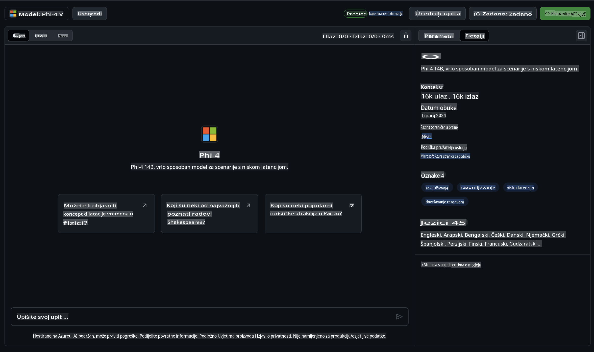
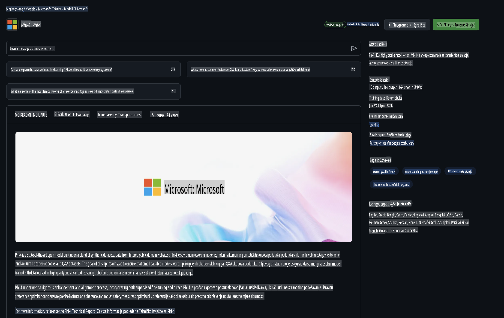

## Phi obitelj u GitHub modelima

Dobrodošli u [GitHub Models](https://github.com/marketplace/models)! Sve je spremno da istražite AI modele hostirane na Azure AI.



Za više informacija o modelima dostupnima na GitHub Models, posjetite [GitHub Model Marketplace](https://github.com/marketplace/models).

## Dostupni modeli

Svaki model ima vlastiti playground i uzorke koda.



### Phi obitelj u GitHub katalogu modela

- [Phi-4](https://github.com/marketplace/models/azureml/Phi-4)

- [Phi-3.5-MoE instruct (128k)](https://github.com/marketplace/models/azureml/Phi-3-5-MoE-instruct)

- [Phi-3.5-vision instruct (128k)](https://github.com/marketplace/models/azureml/Phi-3-5-vision-instruct)

- [Phi-3.5-mini instruct (128k)](https://github.com/marketplace/models/azureml/Phi-3-5-mini-instruct)

- [Phi-3-Medium-128k-Instruct](https://github.com/marketplace/models/azureml/Phi-3-medium-128k-instruct)

- [Phi-3-medium-4k-instruct](https://github.com/marketplace/models/azureml/Phi-3-medium-4k-instruct)

- [Phi-3-mini-128k-instruct](https://github.com/marketplace/models/azureml/Phi-3-mini-128k-instruct)

- [Phi-3-mini-4k-instruct](https://github.com/marketplace/models/azureml/Phi-3-mini-4k-instruct)

- [Phi-3-small-128k-instruct](https://github.com/marketplace/models/azureml/Phi-3-small-128k-instruct)

- [Phi-3-small-8k-instruct](https://github.com/marketplace/models/azureml/Phi-3-small-8k-instruct)

## Početak rada

Postoji nekoliko osnovnih primjera spremnih za pokretanje. Možete ih pronaći u direktoriju s uzorcima. Ako želite odmah prijeći na svoj omiljeni programski jezik, primjere možete pronaći u sljedećim jezicima:

- Python  
- JavaScript  
- C#  
- Java  
- cURL  

Također postoji posebno okruženje Codespaces za pokretanje uzoraka i modela.


## Primjeri koda

Ispod su isječci koda za nekoliko primjena. Za dodatne informacije o Azure AI Inference SDK-u, pogledajte potpunu dokumentaciju i primjere.

## Postavljanje

1. Kreirajte osobni pristupni token  
Ne morate davati nikakve dozvole tokenu. Imajte na umu da će token biti poslan Microsoftovoj usluzi.

Za korištenje dolje navedenih isječaka koda, kreirajte varijablu okruženja kako biste postavili svoj token kao ključ za klijentski kod.

Ako koristite bash:  
```
export GITHUB_TOKEN="<your-github-token-goes-here>"
```  
Ako ste u PowerShellu:  

```
$Env:GITHUB_TOKEN="<your-github-token-goes-here>"
```  

Ako koristite Windows Command Prompt:  

```
set GITHUB_TOKEN=<your-github-token-goes-here>
```  

## Python primjer

### Instalacija ovisnosti  
Instalirajte Azure AI Inference SDK pomoću pip-a (Zahtijeva: Python >=3.8):  

```
pip install azure-ai-inference
```  

### Pokretanje osnovnog primjera koda  

Ovaj primjer prikazuje osnovni poziv API-ju za dovršavanje razgovora. Koristi GitHub AI model inference endpoint i vaš GitHub token. Poziv je sinkroniziran.  

```python
import os
from azure.ai.inference import ChatCompletionsClient
from azure.ai.inference.models import SystemMessage, UserMessage
from azure.core.credentials import AzureKeyCredential

endpoint = "https://models.inference.ai.azure.com"
model_name = "Phi-4"
token = os.environ["GITHUB_TOKEN"]

client = ChatCompletionsClient(
    endpoint=endpoint,
    credential=AzureKeyCredential(token),
)

response = client.complete(
    messages=[
        UserMessage(content="I have $20,000 in my savings account, where I receive a 4% profit per year and payments twice a year. Can you please tell me how long it will take for me to become a millionaire? Also, can you please explain the math step by step as if you were explaining it to an uneducated person?"),
    ],
    temperature=0.4,
    top_p=1.0,
    max_tokens=2048,
    model=model_name
)

print(response.choices[0].message.content)
```  

### Vođenje višestrukog razgovora  

Ovaj primjer prikazuje višestruki razgovor s API-jem za dovršavanje razgovora. Kada koristite model za chat aplikaciju, trebate upravljati poviješću tog razgovora i slati najnovije poruke modelu.  

```
import os
from azure.ai.inference import ChatCompletionsClient
from azure.ai.inference.models import AssistantMessage, SystemMessage, UserMessage
from azure.core.credentials import AzureKeyCredential

token = os.environ["GITHUB_TOKEN"]
endpoint = "https://models.inference.ai.azure.com"
# Replace Model_Name
model_name = "Phi-4"

client = ChatCompletionsClient(
    endpoint=endpoint,
    credential=AzureKeyCredential(token),
)

messages = [
    SystemMessage(content="You are a helpful assistant."),
    UserMessage(content="What is the capital of France?"),
    AssistantMessage(content="The capital of France is Paris."),
    UserMessage(content="What about Spain?"),
]

response = client.complete(messages=messages, model=model_name)

print(response.choices[0].message.content)
```  

### Streamanje izlaza  

Za bolje korisničko iskustvo, poželjet ćete streamati odgovor modela kako bi se prvi token pojavio što ranije i izbjeglo čekanje na duge odgovore.  

```
import os
from azure.ai.inference import ChatCompletionsClient
from azure.ai.inference.models import SystemMessage, UserMessage
from azure.core.credentials import AzureKeyCredential

token = os.environ["GITHUB_TOKEN"]
endpoint = "https://models.inference.ai.azure.com"
# Replace Model_Name
model_name = "Phi-4"

client = ChatCompletionsClient(
    endpoint=endpoint,
    credential=AzureKeyCredential(token),
)

response = client.complete(
    stream=True,
    messages=[
        SystemMessage(content="You are a helpful assistant."),
        UserMessage(content="Give me 5 good reasons why I should exercise every day."),
    ],
    model=model_name,
)

for update in response:
    if update.choices:
        print(update.choices[0].delta.content or "", end="")

client.close()
```  

## BESPLATNO korištenje i ograničenja za GitHub modele



[Ograničenja za playground i besplatno korištenje API-ja](https://docs.github.com/en/github-models/prototyping-with-ai-models#rate-limits) namijenjena su za eksperimentiranje s modelima i prototipiranje AI aplikacija. Za korištenje izvan tih ograničenja, i za skaliranje vaše aplikacije, morate osigurati resurse putem Azure računa i autentificirati se od tamo umjesto putem svog GitHub osobnog pristupnog tokena. Ne trebate mijenjati ništa drugo u svom kodu. Koristite ovu poveznicu kako biste saznali kako premašiti ograničenja besplatnog sloja u Azure AI.

### Napomene

Zapamtite, kada radite s modelom, eksperimentirate s AI-jem, pa su moguće greške u sadržaju.

Značajka je podložna različitim ograničenjima (uključujući zahtjeve po minuti, zahtjeve po danu, tokene po zahtjevu i istovremene zahtjeve) i nije dizajnirana za proizvodne slučajeve korištenja.

GitHub modeli koriste Azure AI Content Safety. Ovi filtri se ne mogu isključiti u okviru GitHub Models iskustva. Ako odlučite koristiti modele putem plaćene usluge, konfigurirajte svoje filtre sadržaja prema svojim potrebama.

Ova usluga podliježe GitHubovim uvjetima za pre-release.

**Odricanje od odgovornosti**:  
Ovaj dokument je preveden korištenjem usluga strojno baziranog AI prevođenja. Iako nastojimo osigurati točnost, imajte na umu da automatizirani prijevodi mogu sadržavati pogreške ili netočnosti. Izvorni dokument na izvornom jeziku treba smatrati mjerodavnim izvorom. Za ključne informacije preporučuje se profesionalni prijevod od strane čovjeka. Ne preuzimamo odgovornost za bilo kakve nesporazume ili pogrešna tumačenja koja mogu proizaći iz korištenja ovog prijevoda.