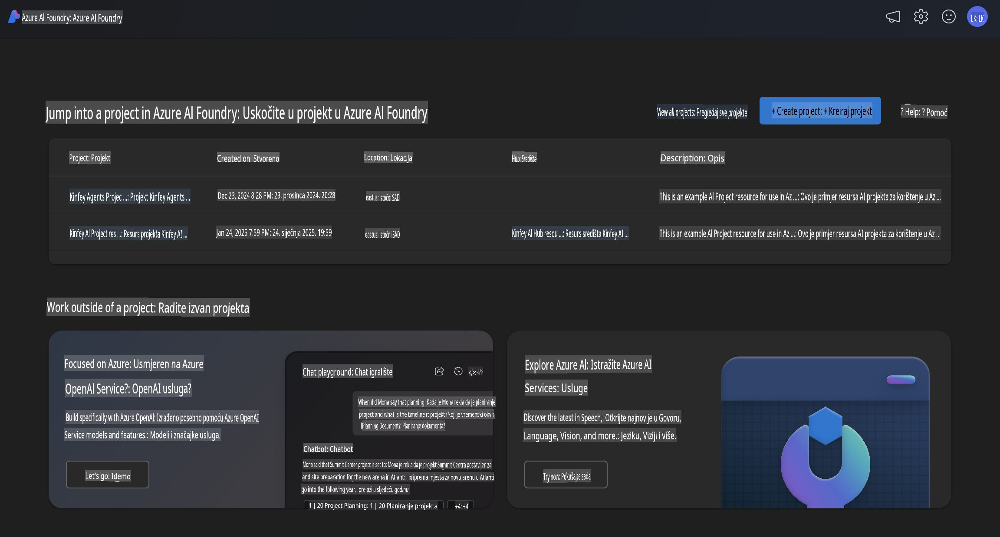
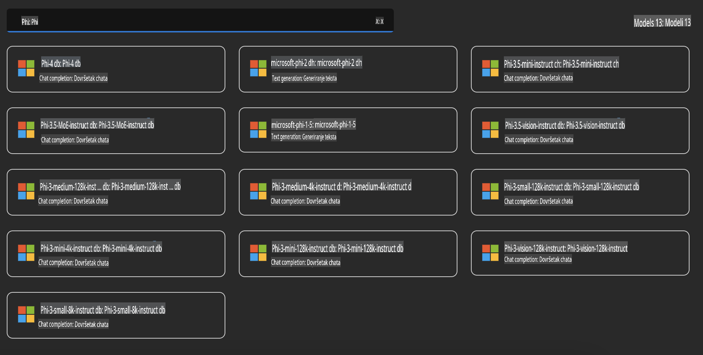
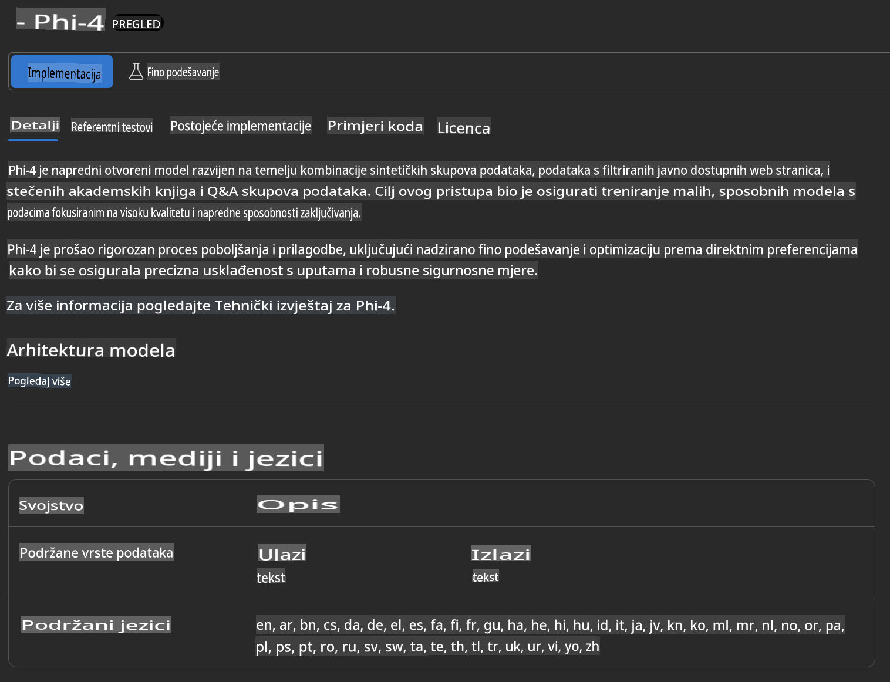
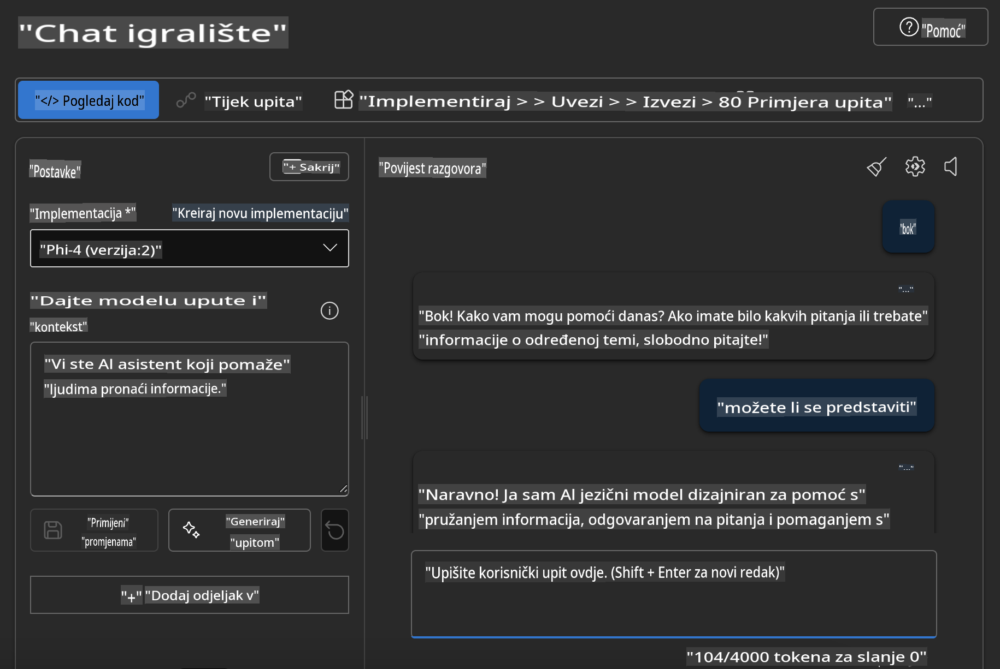

## Phi obitelj u Azure AI Foundry

[Azure AI Foundry](https://ai.azure.com) je pouzdana platforma koja omogućuje programerima da potaknu inovacije i oblikuju budućnost s AI-om na siguran, zaštićen i odgovoran način.

[Azure AI Foundry](https://ai.azure.com) je osmišljen za programere kako bi:

- Izgradili generativne AI aplikacije na platformi poslovne razine.
- Istraživali, gradili, testirali i implementirali koristeći najmodernije AI alate i ML modele, utemeljene na odgovornim AI praksama.
- Suradnjom s timom pokrili cijeli životni ciklus razvoja aplikacija.

S Azure AI Foundry možete istraživati širok spektar modela, usluga i mogućnosti te započeti s razvojem AI aplikacija koje najbolje odgovaraju vašim ciljevima. Platforma Azure AI Foundry omogućuje skalabilnost za jednostavnu transformaciju prototipova u potpuno funkcionalne produkcijske aplikacije. Kontinuirano praćenje i usavršavanje osiguravaju dugoročni uspjeh.



Uz korištenje Azure AOAI Service u Azure AI Foundry, također možete koristiti modele trećih strana iz Azure AI Foundry Model Catalog. Ovo je odličan izbor ako želite koristiti Azure AI Foundry kao platformu za AI rješenja.

Možemo brzo implementirati modele Phi obitelji putem Model Catalog u Azure AI Foundry.



### **Implementacija Phi-4 u Azure AI Foundry**



### **Testiranje Phi-4 u Azure AI Foundry Playground**



### **Pokretanje Python koda za pozivanje Azure AI Foundry Phi-4**

```python

import os  
import base64
from openai import AzureOpenAI  
from azure.identity import DefaultAzureCredential, get_bearer_token_provider  
        
endpoint = os.getenv("ENDPOINT_URL", "Your Azure AOAI Service Endpoint")  
deployment = os.getenv("DEPLOYMENT_NAME", "Phi-4")  
      
token_provider = get_bearer_token_provider(  
    DefaultAzureCredential(),  
    "https://cognitiveservices.azure.com/.default"  
)  
  
client = AzureOpenAI(  
    azure_endpoint=endpoint,  
    azure_ad_token_provider=token_provider,  
    api_version="2024-05-01-preview",  
)  
  

chat_prompt = [
    {
        "role": "system",
        "content": "You are an AI assistant that helps people find information."
    },
    {
        "role": "user",
        "content": "can you introduce yourself"
    }
] 
    
# Include speech result if speech is enabled  
messages = chat_prompt 

completion = client.chat.completions.create(  
    model=deployment,  
    messages=messages,
    max_tokens=800,  
    temperature=0.7,  
    top_p=0.95,  
    frequency_penalty=0,  
    presence_penalty=0,
    stop=None,  
    stream=False  
)  
  
print(completion.to_json())  

```

**Odricanje odgovornosti**:  
Ovaj dokument je preveden korištenjem usluga strojno baziranog AI prijevoda. Iako nastojimo osigurati točnost, imajte na umu da automatski prijevodi mogu sadržavati pogreške ili netočnosti. Izvorni dokument na njegovom izvornom jeziku treba smatrati mjerodavnim izvorom. Za ključne informacije preporučuje se profesionalni prijevod od strane čovjeka. Ne preuzimamo odgovornost za bilo kakve nesporazume ili pogrešne interpretacije koje mogu proizaći iz korištenja ovog prijevoda.