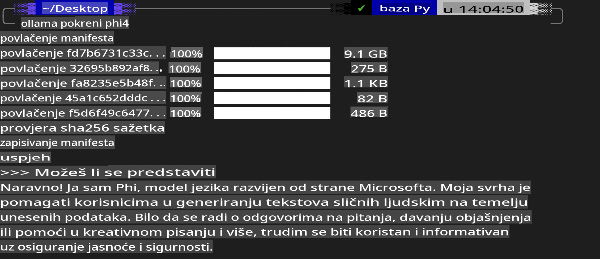
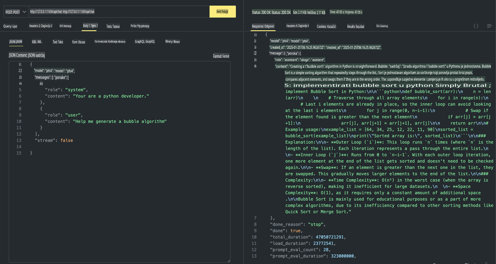

## Phi obitelj u Ollama

[Ollama](https://ollama.com) omogućuje većem broju ljudi da izravno implementiraju open source LLM ili SLM putem jednostavnih skripti, a također može izraditi API-je za pomoć u lokalnim Copilot scenarijima primjene.

## **1. Instalacija**

Ollama podržava rad na Windows, macOS i Linux sustavima. Možete instalirati Ollama putem ove poveznice ([https://ollama.com/download](https://ollama.com/download)). Nakon uspješne instalacije, možete izravno koristiti Ollama skriptu za pozivanje Phi-3 putem terminalskog prozora. Sve [dostupne knjižnice u Ollama](https://ollama.com/library) možete pregledati ovdje. Ako otvorite ovo spremište u Codespaceu, Ollama će već biti instalirana.

```bash

ollama run phi4

```

> [!NOTE]
> Model će se prvo preuzeti kada ga pokrenete prvi put. Naravno, možete i izravno specificirati već preuzeti Phi-4 model. Kao primjer koristimo WSL za pokretanje naredbe. Nakon uspješnog preuzimanja modela, možete izravno komunicirati putem terminala.



## **2. Pozivanje phi-4 API-ja iz Ollama**

Ako želite pozvati Phi-4 API generiran Ollama-om, možete koristiti ovu naredbu u terminalu za pokretanje Ollama servera.

```bash

ollama serve

```

> [!NOTE]
> Ako koristite macOS ili Linux, imajte na umu da možete naići na sljedeću grešku **"Error: listen tcp 127.0.0.1:11434: bind: address already in use"**. Ova se greška može pojaviti prilikom pokretanja naredbe. Možete je ignorirati, jer obično znači da je server već pokrenut, ili možete zaustaviti i ponovno pokrenuti Ollama:

**macOS**

```bash

brew services restart ollama

```

**Linux**

```bash

sudo systemctl stop ollama

```

Ollama podržava dva API-ja: generate i chat. Prema svojim potrebama, možete pozvati model API koji pruža Ollama, slanjem zahtjeva lokalnoj usluzi koja radi na portu 11434.

**Chat**

```bash

curl http://127.0.0.1:11434/api/chat -d '{
  "model": "phi3",
  "messages": [
    {
      "role": "system",
      "content": "Your are a python developer."
    },
    {
      "role": "user",
      "content": "Help me generate a bubble algorithm"
    }
  ],
  "stream": false
  
}'

This is the result in Postman



## Additional Resources

Check the list of available models in Ollama in [their library](https://ollama.com/library).

Pull your model from the Ollama server using this command

```bash
ollama pull phi4
```

Run the model using this command

```bash
ollama run phi4
```

***Note:*** Visit this link [https://github.com/ollama/ollama/blob/main/docs/api.md](https://github.com/ollama/ollama/blob/main/docs/api.md) to learn more

## Calling Ollama from Python

You can use `requests` or `urllib3` to make requests to the local server endpoints used above. However, a popular way to use Ollama in Python is via the [openai](https://pypi.org/project/openai/) SDK, since Ollama provides OpenAI-compatible server endpoints as well.

Here is an example for phi3-mini:

```python
import openai

client = openai.OpenAI(
    base_url="http://localhost:11434/v1",
    api_key="nokeyneeded",
)

response = client.chat.completions.create(
    model="phi4",
    temperature=0.7,
    n=1,
    messages=[
        {"role": "system", "content": "You are a helpful assistant."},
        {"role": "user", "content": "Write a haiku about a hungry cat"},
    ],
)

print("Response:")
print(response.choices[0].message.content)
```

## Calling Ollama from JavaScript 

```javascript
// Primjer sažimanja datoteke pomoću Phi-4
script({
    model: "ollama:phi4",
    title: "Sažmi s Phi-4",
    system: ["system"],
})

// Primjer sažimanja
const file = def("FILE", env.files)
$`Sažmi ${file} u jedan paragraf.`
```

## Calling Ollama from C#

Create a new C# Console application and add the following NuGet package:

```bash
dotnet add package Microsoft.SemanticKernel --version 1.34.0
```

Then replace this code in the `Program.cs` file

```csharp
using Microsoft.SemanticKernel;
using Microsoft.SemanticKernel.ChatCompletion;

// dodaj chat completion uslugu koristeći lokalni Ollama server endpoint
#pragma warning disable SKEXP0001, SKEXP0003, SKEXP0010, SKEXP0011, SKEXP0050, SKEXP0052
builder.AddOpenAIChatCompletion(
    modelId: "phi4",
    endpoint: new Uri("http://localhost:11434/"),
    apiKey: "non required");

// pošalji jednostavan prompt chat usluzi
string prompt = "Napiši šalu o mačićima";
var response = await kernel.InvokePromptAsync(prompt);
Console.WriteLine(response.GetValue<string>());
```

Run the app with the command:

```bash
dotnet run

**Odricanje od odgovornosti**:  
Ovaj dokument je preveden pomoću AI usluga za strojno prevođenje. Iako nastojimo postići točnost, imajte na umu da automatizirani prijevodi mogu sadržavati pogreške ili netočnosti. Izvorni dokument na izvornom jeziku treba smatrati mjerodavnim izvorom. Za ključne informacije preporučuje se profesionalni prijevod od strane ljudskog prevoditelja. Ne preuzimamo odgovornost za nesporazume ili pogrešna tumačenja koja mogu proizaći iz korištenja ovog prijevoda.