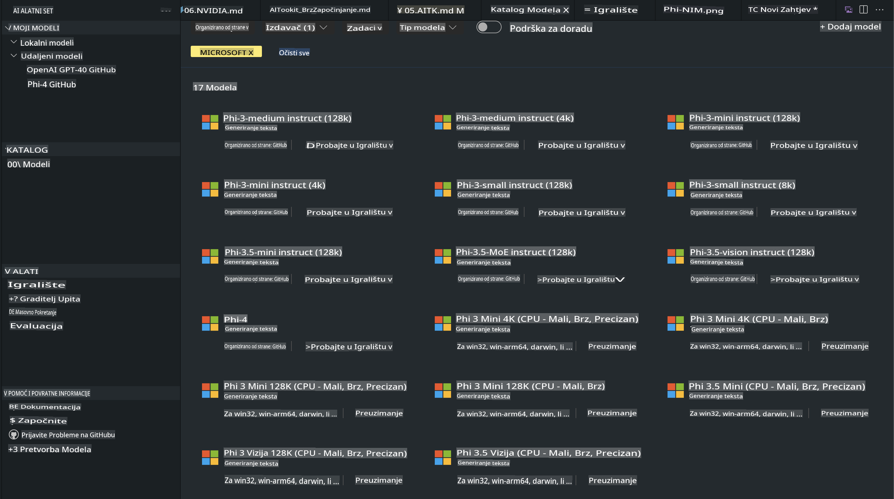
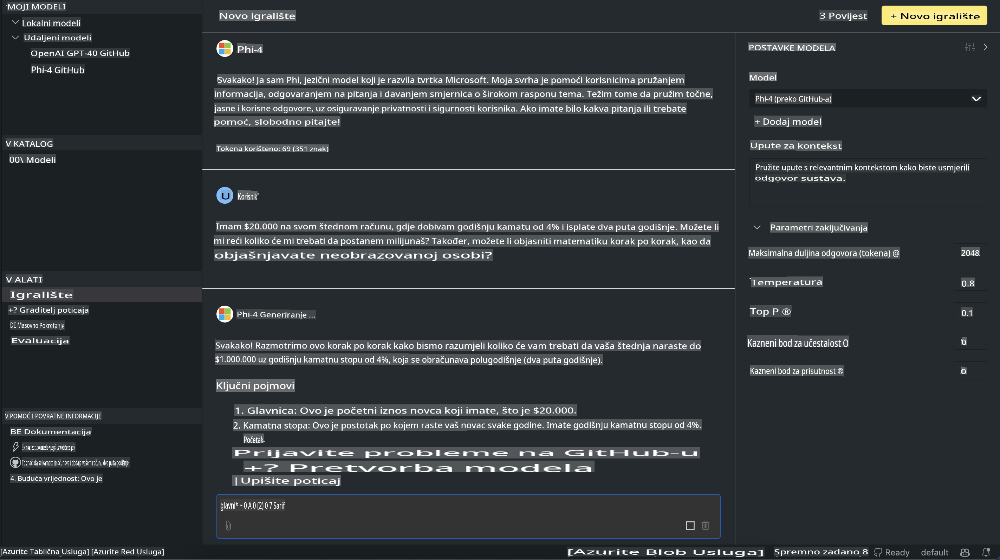

# Phi obitelj u AITK-u

[AI Toolkit za VS Code](https://marketplace.visualstudio.com/items?itemName=ms-windows-ai-studio.windows-ai-studio) pojednostavljuje razvoj aplikacija s generativnom umjetnom inteligencijom spajajući najmodernije alate za razvoj AI-a i modele iz Azure AI Foundry kataloga te drugih kataloga poput Hugging Facea. Možete pregledavati katalog AI modela koji pokreću GitHub modeli i Azure AI Foundry katalozi modela, preuzimati ih lokalno ili na daljinu, prilagođavati, testirati i koristiti u svojim aplikacijama.

Pregled AI Toolkita pokreće se lokalno. Lokalno zaključivanje ili prilagodba ovisi o modelu koji odaberete, a možda će vam trebati GPU poput NVIDIA CUDA GPU-a. Također možete pokretati GitHub modele izravno s AITK-om.

## Početak

[Saznajte više o instalaciji Windows podsustava za Linux](https://learn.microsoft.com/windows/wsl/install?WT.mc_id=aiml-137032-kinfeylo)

i [promjeni zadane distribucije](https://learn.microsoft.com/windows/wsl/install#change-the-default-linux-distribution-installed).

[AI Toolkit GitHub repo](https://github.com/microsoft/vscode-ai-toolkit/)

- Windows, Linux, macOS
  
- Za prilagodbu na Windows i Linux sustavima, potreban vam je Nvidia GPU. Dodatno, **Windows** zahtijeva podsustav za Linux s Ubuntu distribucijom 18.4 ili novijom. [Saznajte više o instalaciji Windows podsustava za Linux](https://learn.microsoft.com/windows/wsl/install) i [promjeni zadane distribucije](https://learn.microsoft.com/windows/wsl/install#change-the-default-linux-distribution-installed).

### Instalacija AI Toolkita

AI Toolkit dolazi kao [Visual Studio Code ekstenzija](https://code.visualstudio.com/docs/setup/additional-components#_vs-code-extensions), pa je prvo potrebno instalirati [VS Code](https://code.visualstudio.com/docs/setup/windows?WT.mc_id=aiml-137032-kinfeylo), a zatim preuzeti AI Toolkit s [VS Marketplacea](https://marketplace.visualstudio.com/items?itemName=ms-windows-ai-studio.windows-ai-studio).  
[AI Toolkit je dostupan na Visual Studio Marketplaceu](https://marketplace.visualstudio.com/items?itemName=ms-windows-ai-studio.windows-ai-studio) i može se instalirati kao i svaka druga VS Code ekstenzija. 

Ako niste upoznati s instalacijom VS Code ekstenzija, slijedite ove korake:

### Prijava

1. U traci aktivnosti u VS Codeu odaberite **Extensions**
2. U traku za pretraživanje ekstenzija upišite "AI Toolkit"
3. Odaberite "AI Toolkit for Visual Studio code"
4. Kliknite **Install**

Sada ste spremni za korištenje ekstenzije!

Bit ćete upitani da se prijavite na GitHub, pa kliknite "Allow" za nastavak. Bit ćete preusmjereni na GitHub stranicu za prijavu.

Prijavite se i slijedite korake. Nakon uspješne prijave bit ćete vraćeni u VS Code.

Nakon što je ekstenzija instalirana, vidjet ćete ikonu AI Toolkita u svojoj traci aktivnosti.

Istražimo dostupne opcije!

### Dostupne opcije

Glavna bočna traka AI Toolkita organizirana je u sljedeće sekcije:

- **Models**
- **Resources**
- **Playground**  
- **Fine-tuning**
- **Evaluation**

Sve su dostupne u odjeljku Resources. Za početak odaberite **Model Catalog**.

### Preuzimanje modela iz kataloga

Nakon pokretanja AI Toolkita iz bočne trake VS Codea, možete odabrati sljedeće opcije:



- Pronađite podržani model iz **Model Catalog** i preuzmite ga lokalno
- Testirajte zaključivanje modela u **Model Playground**
- Prilagodite model lokalno ili na daljinu u **Model Fine-tuning**
- Implementirajte prilagođene modele u oblaku putem naredbene palete za AI Toolkit
- Evaluacija modela

> [!NOTE]
>
> **GPU nasuprot CPU**
>
> Primijetit ćete da kartice modela prikazuju veličinu modela, platformu i vrstu akceleratora (CPU, GPU). Za optimiziranu izvedbu na **Windows uređajima koji imaju barem jedan GPU**, odaberite verzije modela koje ciljaju samo Windows.
>
> To osigurava da imate model optimiziran za DirectML akcelerator.
>
> Nazivi modela su u formatu:
>
> - `{model_name}-{accelerator}-{quantization}-{format}`.
>
>Da biste provjerili imate li GPU na svom Windows uređaju, otvorite **Task Manager** i odaberite karticu **Performance**. Ako imate GPU(e), bit će navedeni pod imenima poput "GPU 0" ili "GPU 1".

### Pokretanje modela u playgroundu

Nakon što su svi parametri postavljeni, kliknite **Generate Project**.

Kad je model preuzet, odaberite **Load in Playground** na kartici modela u katalogu:

- Pokrenite preuzimanje modela
- Instalirajte sve potrebne preduvjete i ovisnosti
- Kreirajte VS Code radni prostor



### Korištenje REST API-ja u aplikaciji 

AI Toolkit dolazi s lokalnim REST API web poslužiteljem **na portu 5272** koji koristi [OpenAI chat completions format](https://platform.openai.com/docs/api-reference/chat/create). 

Ovo omogućuje testiranje vaše aplikacije lokalno bez oslanjanja na uslugu oblaka za AI modele. Na primjer, sljedeći JSON datoteku prikazuje kako konfigurirati tijelo zahtjeva:

```json
{
    "model": "Phi-4",
    "messages": [
        {
            "role": "user",
            "content": "what is the golden ratio?"
        }
    ],
    "temperature": 0.7,
    "top_p": 1,
    "top_k": 10,
    "max_tokens": 100,
    "stream": true
}
```

REST API možete testirati pomoću alata poput [Postman](https://www.postman.com/) ili CURL (Client URL) alata:

```bash
curl -vX POST http://127.0.0.1:5272/v1/chat/completions -H 'Content-Type: application/json' -d @body.json
```

### Korištenje OpenAI klijentske knjižnice za Python

```python
from openai import OpenAI

client = OpenAI(
    base_url="http://127.0.0.1:5272/v1/", 
    api_key="x" # required for the API but not used
)

chat_completion = client.chat.completions.create(
    messages=[
        {
            "role": "user",
            "content": "what is the golden ratio?",
        }
    ],
    model="Phi-4",
)

print(chat_completion.choices[0].message.content)
```

### Korištenje Azure OpenAI klijentske knjižnice za .NET

Dodajte [Azure OpenAI klijentsku knjižnicu za .NET](https://www.nuget.org/packages/Azure.AI.OpenAI/) u svoj projekt koristeći NuGet:

```bash
dotnet add {project_name} package Azure.AI.OpenAI --version 1.0.0-beta.17
```

Dodajte C# datoteku pod nazivom **OverridePolicy.cs** u svoj projekt i zalijepite sljedeći kod:

```csharp
// OverridePolicy.cs
using Azure.Core.Pipeline;
using Azure.Core;

internal partial class OverrideRequestUriPolicy(Uri overrideUri)
    : HttpPipelineSynchronousPolicy
{
    private readonly Uri _overrideUri = overrideUri;

    public override void OnSendingRequest(HttpMessage message)
    {
        message.Request.Uri.Reset(_overrideUri);
    }
}
```

Zatim zalijepite sljedeći kod u svoju **Program.cs** datoteku:

```csharp
// Program.cs
using Azure.AI.OpenAI;

Uri localhostUri = new("http://localhost:5272/v1/chat/completions");

OpenAIClientOptions clientOptions = new();
clientOptions.AddPolicy(
    new OverrideRequestUriPolicy(localhostUri),
    Azure.Core.HttpPipelinePosition.BeforeTransport);
OpenAIClient client = new(openAIApiKey: "unused", clientOptions);

ChatCompletionsOptions options = new()
{
    DeploymentName = "Phi-4",
    Messages =
    {
        new ChatRequestSystemMessage("You are a helpful assistant. Be brief and succinct."),
        new ChatRequestUserMessage("What is the golden ratio?"),
    }
};

StreamingResponse<StreamingChatCompletionsUpdate> streamingChatResponse
    = await client.GetChatCompletionsStreamingAsync(options);

await foreach (StreamingChatCompletionsUpdate chatChunk in streamingChatResponse)
{
    Console.Write(chatChunk.ContentUpdate);
}
```


## Prilagodba s AI Toolkitom

- Počnite s otkrivanjem modela i playgroundom.
- Prilagodba modela i zaključivanje koristeći lokalne računalne resurse.
- Daljinska prilagodba i zaključivanje koristeći Azure resurse.

[Prilagodba s AI Toolkitom](../../03.FineTuning/Finetuning_VSCodeaitoolkit.md)

## AI Toolkit Q&A resursi

Molimo pogledajte našu [Q&A stranicu](https://github.com/microsoft/vscode-ai-toolkit/blob/main/archive/QA.md) za najčešće probleme i rješenja.

**Odricanje od odgovornosti**:  
Ovaj dokument je preveden korištenjem usluga strojno baziranog AI prijevoda. Iako nastojimo osigurati točnost, imajte na umu da automatski prijevodi mogu sadržavati pogreške ili netočnosti. Izvorni dokument na njegovom izvornom jeziku treba smatrati autoritativnim izvorom. Za ključne informacije preporučuje se profesionalni prijevod od strane čovjeka. Ne preuzimamo odgovornost za bilo kakve nesporazume ili pogrešna tumačenja koja proizlaze iz korištenja ovog prijevoda.