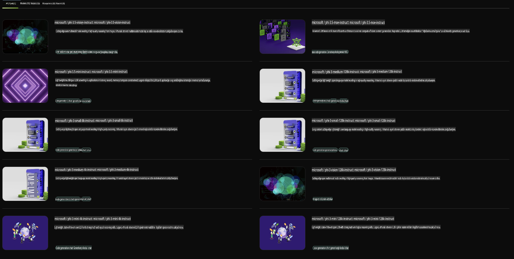

## Phi obitelj u NVIDIA NIM-u

NVIDIA NIM je skup jednostavnih mikroservisa osmišljenih za ubrzanje implementacije generativnih AI modela u oblaku, podatkovnim centrima i radnim stanicama. NIM-ovi su kategorizirani prema obitelji modela i pojedinačnim modelima. Na primjer, NVIDIA NIM za velike jezične modele (LLM-ove) donosi snagu najmodernijih LLM-ova u poslovne aplikacije, omogućujući nenadmašne mogućnosti obrade i razumijevanja prirodnog jezika.

NIM olakšava IT i DevOps timovima samostalno hostanje velikih jezičnih modela (LLM-ova) u vlastitim upravljanim okruženjima, dok istovremeno pruža programerima industrijski standardne API-je za izgradnju moćnih kopilota, chatbotova i AI asistenata koji mogu transformirati njihovo poslovanje. Koristeći NVIDIA-ino vrhunsko ubrzanje putem GPU-a i skalabilnu implementaciju, NIM nudi najbrži put do inferencije s neusporedivim performansama.

Možete koristiti NVIDIA NIM za inferenciranje modela iz Phi obitelji.



### **Primjeri - Phi-3-Vision u NVIDIA NIM-u**

Zamislite da imate sliku (`demo.png`) i želite generirati Python kod koji obrađuje ovu sliku i sprema novu verziju iste (`phi-3-vision.jpg`).

Gornji kod automatizira ovaj proces na sljedeći način:

1. Postavlja okruženje i potrebne konfiguracije.
2. Stvara prompt koji modelu daje upute za generiranje potrebnog Python koda.
3. Šalje prompt modelu i prikuplja generirani kod.
4. Izvlači i izvršava generirani kod.
5. Prikazuje originalnu i obrađenu sliku.

Ovaj pristup koristi snagu AI-a za automatizaciju zadataka obrade slika, čineći ih jednostavnijima i bržima za postizanje vaših ciljeva.

[Primjer rješenja koda](../../../../../code/06.E2E/E2E_Nvidia_NIM_Phi3_Vision.ipynb)

Razložimo što cijeli kod radi korak po korak:

1. **Instalirajte potrebni paket**:
    ```python
    !pip install langchain_nvidia_ai_endpoints -U
    ```
    Ova naredba instalira paket `langchain_nvidia_ai_endpoints`, osiguravajući da je u najnovijoj verziji.

2. **Uvezite potrebne module**:
    ```python
    from langchain_nvidia_ai_endpoints import ChatNVIDIA
    import getpass
    import os
    import base64
    ```
    Ovi uvozi omogućuju interakciju s NVIDIA AI endpointima, sigurno rukovanje lozinkama, interakciju s operativnim sustavom te kodiranje/dekodiranje podataka u base64 formatu.

3. **Postavite API ključ**:
    ```python
    if not os.getenv("NVIDIA_API_KEY"):
        os.environ["NVIDIA_API_KEY"] = getpass.getpass("Enter your NVIDIA API key: ")
    ```
    Ovaj kod provjerava je li postavljena varijabla okruženja `NVIDIA_API_KEY`. Ako nije, od korisnika se traži da unese svoj API ključ na siguran način.

4. **Definirajte model i putanju slike**:
    ```python
    model = 'microsoft/phi-3-vision-128k-instruct'
    chat = ChatNVIDIA(model=model)
    img_path = './imgs/demo.png'
    ```
    Ovo postavlja model koji će se koristiti, kreira instancu `ChatNVIDIA` sa specificiranim modelom i definira putanju do datoteke slike.

5. **Stvorite tekstualni prompt**:
    ```python
    text = "Please create Python code for image, and use plt to save the new picture under imgs/ and name it phi-3-vision.jpg."
    ```
    Ovo definira tekstualni prompt koji daje modelu upute za generiranje Python koda za obradu slike.

6. **Kodirajte sliku u Base64**:
    ```python
    with open(img_path, "rb") as f:
        image_b64 = base64.b64encode(f.read()).decode()
    image = f''
    ```
    Ovaj kod čita datoteku slike, kodira je u base64 i kreira HTML oznaku slike s kodiranim podacima.

7. **Spojite tekst i sliku u prompt**:
    ```python
    prompt = f"{text} {image}"
    ```
    Ovo kombinira tekstualni prompt i HTML oznaku slike u jedan niz.

8. **Generirajte kod koristeći ChatNVIDIA**:
    ```python
    code = ""
    for chunk in chat.stream(prompt):
        print(chunk.content, end="")
        code += chunk.content
    ```
    Ovaj kod šalje prompt u `ChatNVIDIA` model and collects the generated code in chunks, printing and appending each chunk to the `code` niz.

9. **Izvucite Python kod iz generiranog sadržaja**:
    ```python
    begin = code.index('```python') + 9
    code = code[begin:]
    end = code.index('```')
    code = code[:end]
    ```
    Ovo izvlači stvarni Python kod iz generiranog sadržaja uklanjanjem markdown formatiranja.

10. **Pokrenite generirani kod**:
    ```python
    import subprocess
    result = subprocess.run(["python", "-c", code], capture_output=True)
    ```
    Ovo pokreće izdvojeni Python kod kao podproces i bilježi njegov izlaz.

11. **Prikažite slike**:
    ```python
    from IPython.display import Image, display
    display(Image(filename='./imgs/phi-3-vision.jpg'))
    display(Image(filename='./imgs/demo.png'))
    ```
    Ove linije prikazuju slike koristeći modul `IPython.display`.

**Odricanje od odgovornosti**:  
Ovaj dokument je preveden korištenjem usluga strojno podržanog AI prevođenja. Iako nastojimo postići točnost, imajte na umu da automatizirani prijevodi mogu sadržavati pogreške ili netočnosti. Izvorni dokument na izvornom jeziku treba smatrati mjerodavnim izvorom. Za ključne informacije preporučuje se profesionalni prijevod od strane stručnjaka. Ne preuzimamo odgovornost za nesporazume ili pogrešna tumačenja koja mogu proizaći iz korištenja ovog prijevoda.