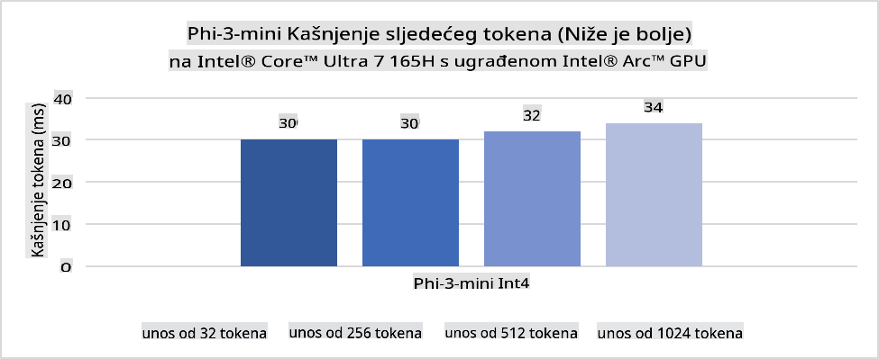
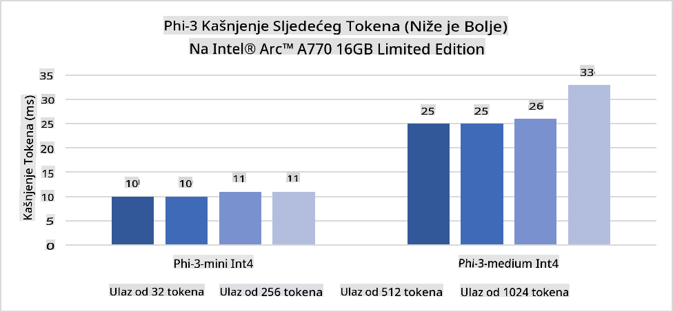
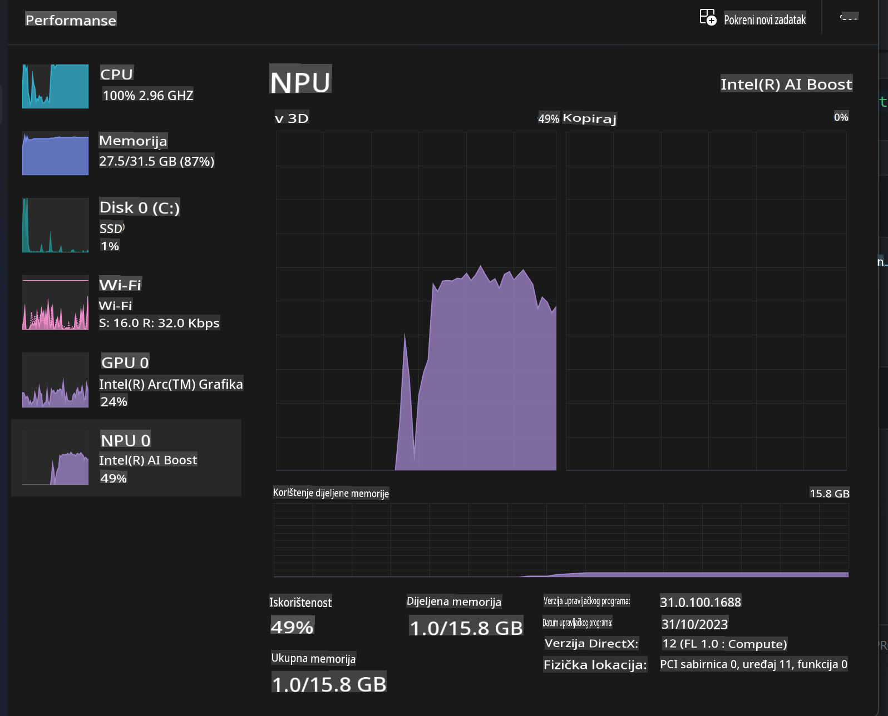
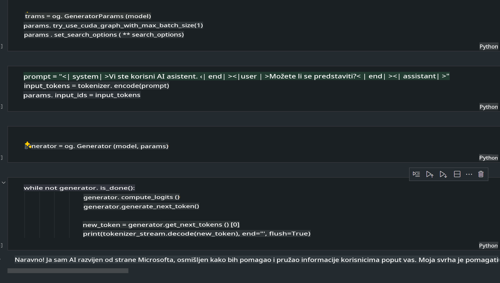
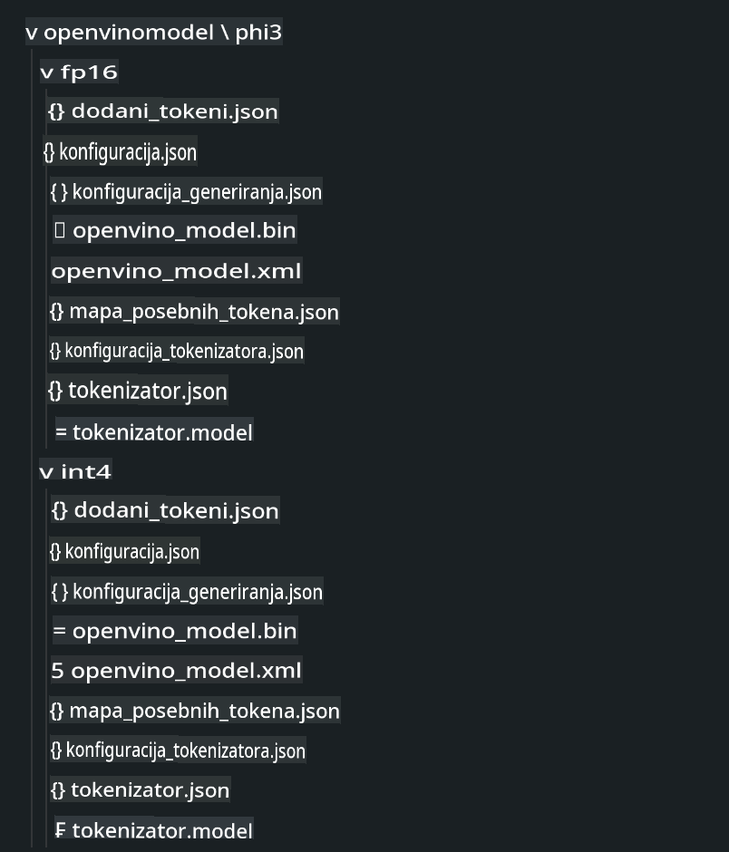
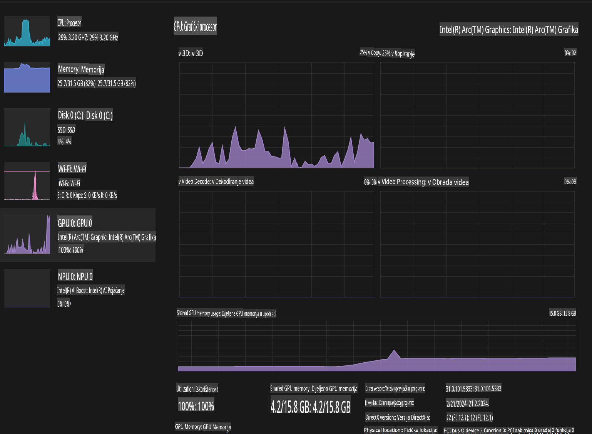

# **Implementacija Phi-3 na AI PC-u**

S razvojem generativne umjetne inteligencije i poboljšanjem hardverskih mogućnosti uređaja na rubu mreže, sve više generativnih AI modela može se integrirati u korisničke uređaje poput BYOD-a (Bring Your Own Device). AI PC-ovi su među tim modelima. Počevši od 2024. godine, Intel, AMD i Qualcomm surađuju s proizvođačima računala kako bi predstavili AI PC-ove koji omogućuju lokalnu implementaciju generativnih AI modela kroz hardverske prilagodbe. U ovoj raspravi usredotočit ćemo se na Intel AI PC-ove i istražiti kako implementirati Phi-3 na Intel AI PC-u.

### Što je NPU?

NPU (Neural Processing Unit) je namjenski procesor ili procesorska jedinica unutar većeg SoC-a, dizajnirana posebno za ubrzavanje operacija neuronskih mreža i zadataka vezanih uz umjetnu inteligenciju. Za razliku od opće namjene CPU-a i GPU-a, NPU-ovi su optimizirani za paralelno računalstvo vođeno podacima, čineći ih izuzetno učinkovitim za obradu velike količine multimedijskih podataka poput videa i slika te za obradu podataka za neuronske mreže. Posebno su sposobni za zadatke vezane uz AI, poput prepoznavanja govora, zamućivanja pozadine tijekom video poziva i uređivanja fotografija ili videa, poput detekcije objekata.

## NPU vs GPU

Iako se mnogi zadaci vezani uz umjetnu inteligenciju i strojno učenje izvode na GPU-ovima, postoji ključna razlika između GPU-ova i NPU-ova.
GPU-ovi su poznati po svojim sposobnostima paralelnog računalstva, ali nisu svi GPU-ovi jednako učinkoviti izvan obrade grafike. S druge strane, NPU-ovi su posebno dizajnirani za složene izračune uključene u operacije neuronskih mreža, čineći ih izuzetno učinkovitima za AI zadatke.

Ukratko, NPU-ovi su matematički genijalci koji ubrzavaju AI izračune i igraju ključnu ulogu u nadolazećoj eri AI PC-ova!

***Ovaj primjer temelji se na najnovijem Intel Core Ultra procesoru.***

## **1. Korištenje NPU-a za pokretanje Phi-3 modela**

Intel® NPU uređaj je akcelerator za AI inferenciju integriran s Intel klijentskim CPU-ovima, počevši od Intel® Core™ Ultra generacije CPU-ova (ranije poznat kao Meteor Lake). Omogućuje energetski učinkovito izvršavanje zadataka umjetnih neuronskih mreža.





**Intel NPU Acceleration Library**

Intel NPU Acceleration Library [https://github.com/intel/intel-npu-acceleration-library](https://github.com/intel/intel-npu-acceleration-library) je Python knjižnica dizajnirana za povećanje učinkovitosti vaših aplikacija iskorištavanjem snage Intel Neural Processing Unit (NPU) za brzo računanje na kompatibilnom hardveru.

Primjer Phi-3-mini na AI PC-u pokretanom Intel® Core™ Ultra procesorima.


Instalirajte Python knjižnicu pomoću pip-a

```bash

   pip install intel-npu-acceleration-library

```

***Napomena*** Projekt je još uvijek u razvoju, ali referentni model je već vrlo potpun.

### **Pokretanje Phi-3 s Intel NPU Acceleration Library**

Korištenjem Intel NPU akceleracije, ova knjižnica ne utječe na tradicionalni proces kodiranja. Potrebno je samo koristiti ovu knjižnicu za kvantizaciju izvornog Phi-3 modela, poput FP16, INT8, INT4, kao što je prikazano:

```python
from transformers import AutoTokenizer, pipeline,TextStreamer
from intel_npu_acceleration_library import NPUModelForCausalLM, int4
from intel_npu_acceleration_library.compiler import CompilerConfig
import warnings

model_id = "microsoft/Phi-3-mini-4k-instruct"

compiler_conf = CompilerConfig(dtype=int4)
model = NPUModelForCausalLM.from_pretrained(
    model_id, use_cache=True, config=compiler_conf, attn_implementation="sdpa"
).eval()

tokenizer = AutoTokenizer.from_pretrained(model_id)

text_streamer = TextStreamer(tokenizer, skip_prompt=True)
```

Nakon uspješne kvantizacije, nastavite izvršavanje kako biste pozvali NPU za pokretanje Phi-3 modela.

```python
generation_args = {
   "max_new_tokens": 1024,
   "return_full_text": False,
   "temperature": 0.3,
   "do_sample": False,
   "streamer": text_streamer,
}

pipe = pipeline(
   "text-generation",
   model=model,
   tokenizer=tokenizer,
)

query = "<|system|>You are a helpful AI assistant.<|end|><|user|>Can you introduce yourself?<|end|><|assistant|>"

with warnings.catch_warnings():
    warnings.simplefilter("ignore")
    pipe(query, **generation_args)
```

Tijekom izvršavanja koda možemo vidjeti status rada NPU-a putem Task Managera.



***Primjeri***: [AIPC_NPU_DEMO.ipynb](../../../../../code/03.Inference/AIPC/AIPC_NPU_DEMO.ipynb)

## **2. Korištenje DirectML + ONNX Runtime za pokretanje Phi-3 modela**

### **Što je DirectML**

[DirectML](https://github.com/microsoft/DirectML) je visokoučinkovita, hardverski ubrzana DirectX 12 knjižnica za strojno učenje. DirectML omogućuje GPU akceleraciju za uobičajene zadatke strojnog učenja na širokom rasponu podržanog hardvera i upravljačkih programa, uključujući sve GPU-ove sposobne za DirectX 12 od proizvođača poput AMD-a, Intela, NVIDIA-e i Qualcomma.

Kada se koristi samostalno, DirectML API je niskorazinska DirectX 12 knjižnica i prikladna je za visokoučinkovite, niskolatentne aplikacije poput okvira, igara i drugih aplikacija u stvarnom vremenu. Besprijekorna interoperabilnost DirectML-a s Direct3D 12, kao i njegova niska opterećenja i usklađenost između hardvera, čine ga idealnim za ubrzavanje strojnog učenja kada je potrebna visoka učinkovitost i pouzdanost rezultata na različitim hardverima.

***Napomena***: Najnoviji DirectML već podržava NPU (https://devblogs.microsoft.com/directx/introducing-neural-processor-unit-npu-support-in-directml-developer-preview/)

### DirectML i CUDA u smislu mogućnosti i performansi:

**DirectML** je knjižnica za strojno učenje koju je razvio Microsoft. Dizajnirana je za ubrzavanje zadataka strojnog učenja na Windows uređajima, uključujući stolna računala, prijenosnike i uređaje na rubu mreže.
- DX12-baziran: DirectML je izgrađen na vrhu DirectX 12 (DX12), koji pruža široku podršku hardveru na GPU-ovima, uključujući NVIDIA i AMD.
- Šira podrška: Budući da koristi DX12, DirectML može raditi s bilo kojim GPU-om koji podržava DX12, čak i integriranim GPU-ovima.
- Obrada slika: DirectML obrađuje slike i druge podatke koristeći neuronske mreže, što ga čini pogodnim za zadatke poput prepoznavanja slika, detekcije objekata i slično.
- Jednostavnost postavljanja: Postavljanje DirectML-a je jednostavno i ne zahtijeva specifične SDK-ove ili knjižnice od proizvođača GPU-ova.
- Performanse: U nekim slučajevima, DirectML se dobro ponaša i može biti brži od CUDA-e, posebno za određene zadatke.
- Ograničenja: Međutim, postoje situacije gdje DirectML može biti sporiji, osobito kod velikih batch-ova float16.

**CUDA** je NVIDIA-ina platforma za paralelno računanje i model programiranja. Omogućuje programerima iskorištavanje snage NVIDIA GPU-ova za opće računalstvo, uključujući strojno učenje i znanstvene simulacije.
- Specifično za NVIDIA: CUDA je usko integrirana s NVIDIA GPU-ovima i posebno dizajnirana za njih.
- Visoko optimizirana: Pruža izvrsne performanse za zadatke ubrzane GPU-om, osobito kada se koriste NVIDIA GPU-ovi.
- Široko korištena: Mnogi okviri i knjižnice za strojno učenje (poput TensorFlowa i PyTorcha) imaju podršku za CUDA-u.
- Prilagodba: Programeri mogu fino podešavati postavke CUDA-e za specifične zadatke, što može dovesti do optimalnih performansi.
- Ograničenja: Međutim, ovisnost CUDA-e o NVIDIA hardveru može biti ograničavajuća ako želite širu kompatibilnost na različitim GPU-ovima.

### Odabir između DirectML-a i CUDA-e

Odabir između DirectML-a i CUDA-e ovisi o vašem specifičnom slučaju korištenja, dostupnosti hardvera i preferencijama.
Ako tražite širu kompatibilnost i jednostavnost postavljanja, DirectML bi mogao biti dobar izbor. Međutim, ako imate NVIDIA GPU-ove i trebate visoko optimizirane performanse, CUDA ostaje snažan kandidat. Ukratko, oba alata imaju svoje prednosti i nedostatke, pa razmotrite svoje zahtjeve i dostupni hardver pri donošenju odluke.

### **Generativna AI s ONNX Runtime**

U eri umjetne inteligencije, prenosivost AI modela je vrlo važna. ONNX Runtime omogućuje jednostavnu implementaciju treniranih modela na različite uređaje. Programeri ne moraju obraćati pažnju na okvir za inferenciju i mogu koristiti jedinstveni API za dovršavanje inferencije modela. U eri generativne umjetne inteligencije, ONNX Runtime je također optimizirao kod (https://onnxruntime.ai/docs/genai/). Kroz optimizirani ONNX Runtime, kvantizirani generativni AI model može se inferirati na različitim terminalima. U generativnoj AI s ONNX Runtime-om, možete izvršiti inferenciju AI modela putem API-ja u Pythonu, C#-u, C/C++-u. Naravno, implementacija na iPhoneu može iskoristiti C++ Generative AI s ONNX Runtime API-jem.

[Primjer koda](https://github.com/Azure-Samples/Phi-3MiniSamples/tree/main/onnx)

***Kompilirajte generativnu AI s ONNX Runtime knjižnicom***

```bash

winget install --id=Kitware.CMake  -e

git clone https://github.com/microsoft/onnxruntime.git

cd .\onnxruntime\

./build.bat --build_shared_lib --skip_tests --parallel --use_dml --config Release

cd ../

git clone https://github.com/microsoft/onnxruntime-genai.git

cd .\onnxruntime-genai\

mkdir ort

cd ort

mkdir include

mkdir lib

copy ..\onnxruntime\include\onnxruntime\core\providers\dml\dml_provider_factory.h ort\include

copy ..\onnxruntime\include\onnxruntime\core\session\onnxruntime_c_api.h ort\include

copy ..\onnxruntime\build\Windows\Release\Release\*.dll ort\lib

copy ..\onnxruntime\build\Windows\Release\Release\onnxruntime.lib ort\lib

python build.py --use_dml


```

**Instalirajte knjižnicu**

```bash

pip install .\onnxruntime_genai_directml-0.3.0.dev0-cp310-cp310-win_amd64.whl

```

Ovo je rezultat izvođenja.



***Primjeri***: [AIPC_DirectML_DEMO.ipynb](../../../../../code/03.Inference/AIPC/AIPC_DirectML_DEMO.ipynb)

## **3. Korištenje Intel OpenVino za pokretanje Phi-3 modela**

### **Što je OpenVINO**

[OpenVINO](https://github.com/openvinotoolkit/openvino) je alat otvorenog koda za optimizaciju i implementaciju modela dubokog učenja. Pruža poboljšane performanse dubokog učenja za modele za viziju, zvuk i jezik iz popularnih okvira poput TensorFlowa, PyTorcha i drugih. Počnite koristiti OpenVINO. OpenVINO se također može koristiti u kombinaciji s CPU-om i GPU-om za pokretanje Phi-3 modela.

***Napomena***: Trenutno OpenVINO ne podržava NPU.

### **Instalacija OpenVINO knjižnice**

```bash

 pip install git+https://github.com/huggingface/optimum-intel.git

 pip install git+https://github.com/openvinotoolkit/nncf.git

 pip install openvino-nightly

```

### **Pokretanje Phi-3 s OpenVINO**

Kao i kod NPU-a, OpenVINO izvršava poziv generativnih AI modela pokretanjem kvantiziranih modela. Prvo trebamo kvantizirati Phi-3 model i dovršiti kvantizaciju modela putem naredbenog retka koristeći optimum-cli.

**INT4**

```bash

optimum-cli export openvino --model "microsoft/Phi-3-mini-4k-instruct" --task text-generation-with-past --weight-format int4 --group-size 128 --ratio 0.6  --sym  --trust-remote-code ./openvinomodel/phi3/int4

```

**FP16**

```bash

optimum-cli export openvino --model "microsoft/Phi-3-mini-4k-instruct" --task text-generation-with-past --weight-format fp16 --trust-remote-code ./openvinomodel/phi3/fp16

```

Pretvoreni format izgleda ovako.



Učitajte putanje modela (model_dir), povezane konfiguracije (ov_config = {"PERFORMANCE_HINT": "LATENCY", "NUM_STREAMS": "1", "CACHE_DIR": ""}) i uređaje s hardverskom akceleracijom (GPU.0) putem OVModelForCausalLM.

```python

ov_model = OVModelForCausalLM.from_pretrained(
     model_dir,
     device='GPU.0',
     ov_config=ov_config,
     config=AutoConfig.from_pretrained(model_dir, trust_remote_code=True),
     trust_remote_code=True,
)

```

Tijekom izvršavanja koda možemo vidjeti status rada GPU-a putem Task Managera.



***Primjeri***: [AIPC_OpenVino_Demo.ipynb](../../../../../code/03.Inference/AIPC/AIPC_OpenVino_Demo.ipynb)

### ***Napomena***: Sve tri metode imaju svoje prednosti, ali preporučuje se korištenje NPU akceleracije za AI PC inferenciju.

**Odricanje od odgovornosti**:  
Ovaj dokument je preveden korištenjem usluga strojnog prevođenja temeljenog na umjetnoj inteligenciji. Iako nastojimo osigurati točnost, imajte na umu da automatski prijevodi mogu sadržavati pogreške ili netočnosti. Izvorni dokument na izvornom jeziku treba smatrati mjerodavnim izvorom. Za kritične informacije preporučuje se profesionalni prijevod od strane ljudskog prevoditelja. Ne snosimo odgovornost za bilo kakva nesporazuma ili pogrešna tumačenja proizašla iz korištenja ovog prijevoda.