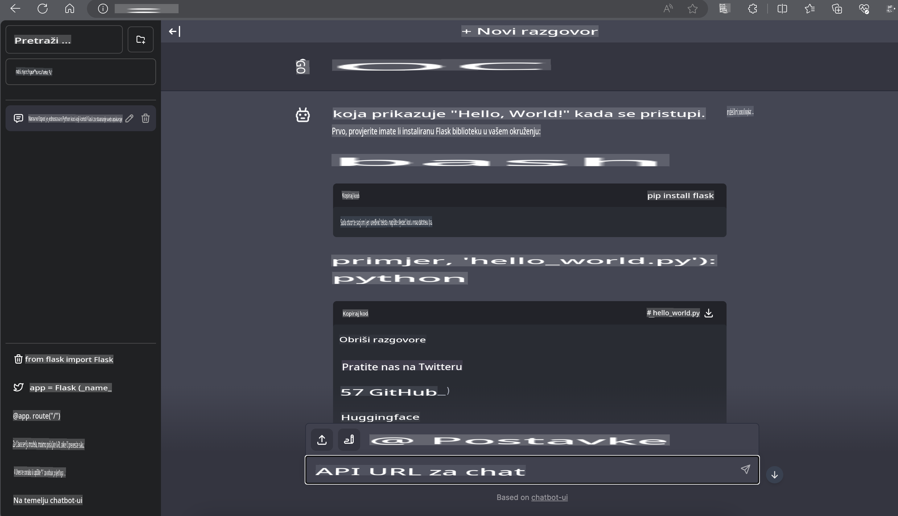

# **Inferencija Phi-3 na Nvidia Jetson**

Nvidia Jetson je serija ugrađenih računalnih ploča od Nvidije. Modeli Jetson TK1, TX1 i TX2 koriste Tegra procesor (ili SoC) od Nvidije koji integrira središnju procesorsku jedinicu (CPU) s ARM arhitekturom. Jetson je sustav niske potrošnje energije i dizajniran je za ubrzavanje primjena strojnog učenja. Nvidia Jetson koriste profesionalni programeri za stvaranje revolucionarnih AI proizvoda u svim industrijama, kao i studenti i entuzijasti za praktično učenje o AI i izradu nevjerojatnih projekata. SLM se implementira na rubnim uređajima poput Jetsona, omogućujući bolju primjenu industrijskih scenarija generativne AI.

## Implementacija na NVIDIA Jetson:
Programeri koji rade na autonomnoj robotici i ugrađenim uređajima mogu koristiti Phi-3 Mini. Relativno mala veličina Phi-3 čini ga idealnim za implementaciju na rubu. Parametri su pažljivo prilagođeni tijekom treniranja, osiguravajući visoku točnost odgovora.

### TensorRT-LLM Optimizacija:
NVIDIA-ina [TensorRT-LLM biblioteka](https://github.com/NVIDIA/TensorRT-LLM?WT.mc_id=aiml-138114-kinfeylo) optimizira inferenciju velikih jezičnih modela. Podržava dugi kontekstualni prozor Phi-3 Minija, poboljšavajući propusnost i latenciju. Optimizacije uključuju tehnike poput LongRoPE, FP8 i inflight batching.

### Dostupnost i implementacija:
Programeri mogu istražiti Phi-3 Mini s 128K kontekstualnim prozorom na [NVIDIA's AI](https://www.nvidia.com/en-us/ai-data-science/generative-ai/). Pakiran je kao NVIDIA NIM, mikrousluga sa standardnim API-jem koja se može implementirati bilo gdje. Dodatno, [TensorRT-LLM implementacije na GitHubu](https://github.com/NVIDIA/TensorRT-LLM).

## **1. Priprema**

a. Jetson Orin NX / Jetson NX

b. JetPack 5.1.2+
   
c. Cuda 11.8
   
d. Python 3.8+

## **2. Pokretanje Phi-3 na Jetsonu**

Možemo odabrati [Ollama](https://ollama.com) ili [LlamaEdge](https://llamaedge.com).

Ako želite koristiti gguf u oblaku i rubnim uređajima istovremeno, LlamaEdge se može razumjeti kao WasmEdge (WasmEdge je lagano, visokoučinkovito, skalabilno WebAssembly okruženje za oblak, rubne i decentralizirane aplikacije. Podržava serverless aplikacije, ugrađene funkcije, mikrousluge, pametne ugovore i IoT uređaje. Možete implementirati kvantitativni model ggufa na rubne uređaje i oblak putem LlamaEdgea).


Evo koraka za korištenje:

1. Instalirajte i preuzmite povezane biblioteke i datoteke

```bash

curl -sSf https://raw.githubusercontent.com/WasmEdge/WasmEdge/master/utils/install.sh | bash -s -- --plugin wasi_nn-ggml

curl -LO https://github.com/LlamaEdge/LlamaEdge/releases/latest/download/llama-api-server.wasm

curl -LO https://github.com/LlamaEdge/chatbot-ui/releases/latest/download/chatbot-ui.tar.gz

tar xzf chatbot-ui.tar.gz

```

**Napomena**: llama-api-server.wasm i chatbot-ui trebaju biti u istom direktoriju.

2. Pokrenite skripte u terminalu

```bash

wasmedge --dir .:. --nn-preload default:GGML:AUTO:{Your gguf path} llama-api-server.wasm -p phi-3-chat

```

Evo rezultata pokretanja:



***Primjer koda*** [Phi-3 mini WASM Notebook Sample](https://github.com/Azure-Samples/Phi-3MiniSamples/tree/main/wasm)

Ukratko, Phi-3 Mini predstavlja značajan napredak u jezičnom modeliranju, kombinirajući učinkovitost, svjesnost konteksta i NVIDIA-ine optimizacijske mogućnosti. Bez obzira gradite li robote ili rubne aplikacije, Phi-3 Mini je moćan alat vrijedan pažnje.

**Odricanje od odgovornosti**:  
Ovaj dokument je preveden korištenjem usluga automatskog prijevoda temeljenih na umjetnoj inteligenciji. Iako težimo točnosti, imajte na umu da automatski prijevodi mogu sadržavati pogreške ili netočnosti. Izvorni dokument na izvornom jeziku treba smatrati mjerodavnim izvorom. Za ključne informacije preporučuje se profesionalni prijevod od strane stručnjaka. Ne snosimo odgovornost za nesporazume ili pogrešne interpretacije proizašle iz korištenja ovog prijevoda.