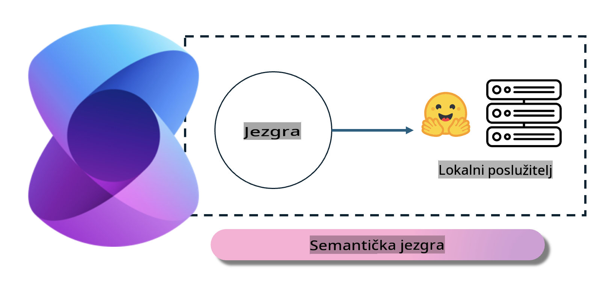
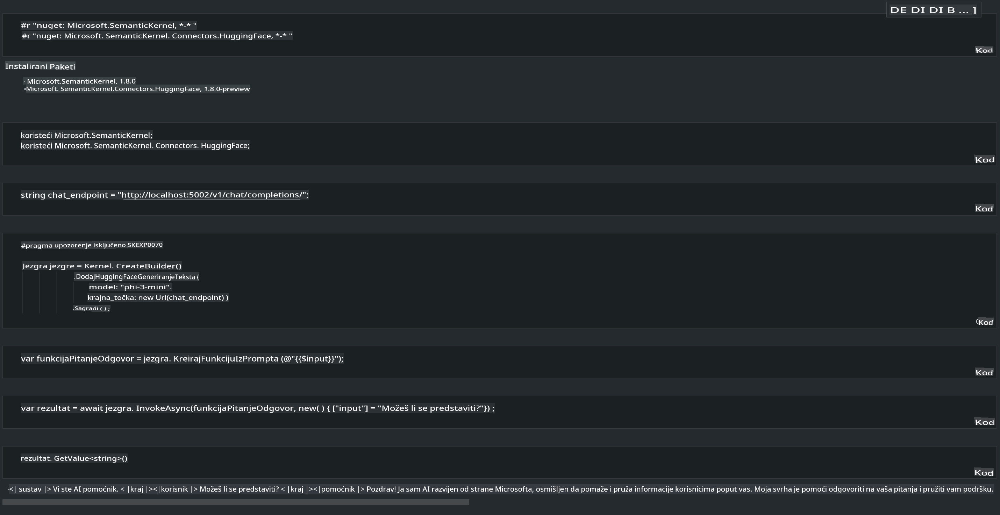

# **Inference Phi-3 na lokalnom poslužitelju**

Možemo implementirati Phi-3 na lokalnom poslužitelju. Korisnici mogu odabrati [Ollama](https://ollama.com) ili [LM Studio](https://llamaedge.com) rješenja, ili mogu napisati vlastiti kod. Lokalnim uslugama Phi-3 možete se povezati putem [Semantic Kernel](https://github.com/microsoft/semantic-kernel?WT.mc_id=aiml-138114-kinfeylo) ili [Langchain](https://www.langchain.com/) kako biste izgradili Copilot aplikacije.

## **Korištenje Semantic Kernel za pristup Phi-3-mini**

U Copilot aplikaciji, aplikacije stvaramo pomoću Semantic Kernel / LangChain. Ovaj tip aplikacijskog okvira općenito je kompatibilan s Azure OpenAI Service / OpenAI modelima, a također može podržavati modele otvorenog koda na Hugging Face platformi te lokalne modele. Što trebamo učiniti ako želimo koristiti Semantic Kernel za pristup Phi-3-mini? Koristeći .NET kao primjer, možemo ga kombinirati s Hugging Face Connector u Semantic Kernel. Po zadanim postavkama, može se povezati s model id na Hugging Face (prilikom prvog korištenja, model će se preuzeti s Hugging Face, što može potrajati dulje). Također se možete povezati s vlastitim lokalnim servisom. Uspoređujući ta dva pristupa, preporučujemo korištenje drugog jer nudi veću razinu autonomije, posebno u poslovnim aplikacijama.

Na slici je prikazano kako se putem Semantic Kernel može lako povezati s vlastitim Phi-3-mini poslužiteljem modela. Ovo je rezultat izvođenja.

***Primjer koda*** https://github.com/kinfey/Phi3MiniSamples/tree/main/semantickernel

**Odricanje odgovornosti**:  
Ovaj dokument je preveden koristeći usluge strojno baziranog AI prevođenja. Iako nastojimo osigurati točnost, molimo vas da budete svjesni da automatizirani prijevodi mogu sadržavati pogreške ili netočnosti. Izvorni dokument na njegovom izvornom jeziku treba smatrati autoritativnim izvorom. Za ključne informacije preporučuje se profesionalni prijevod od strane ljudskog prevoditelja. Ne preuzimamo odgovornost za nesporazume ili pogrešna tumačenja koja mogu proizaći iz korištenja ovog prijevoda.