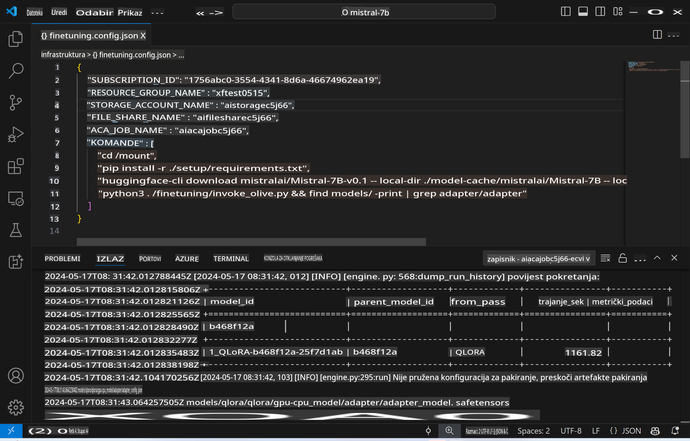
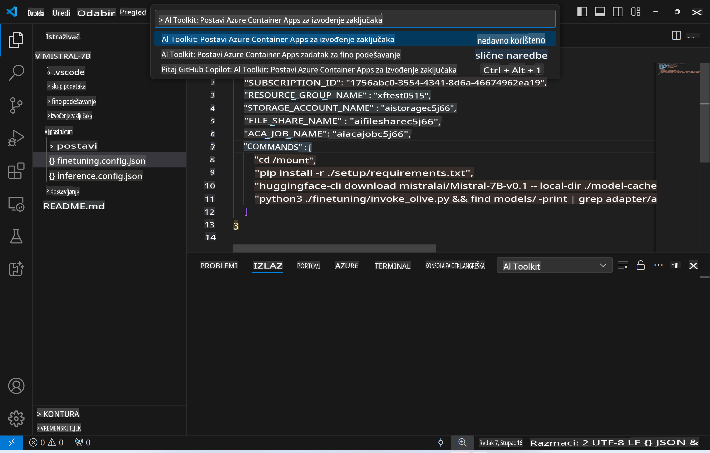
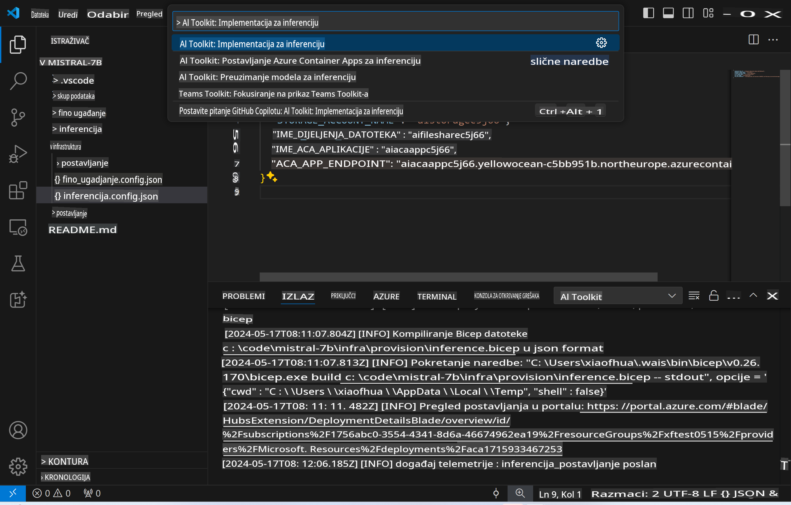
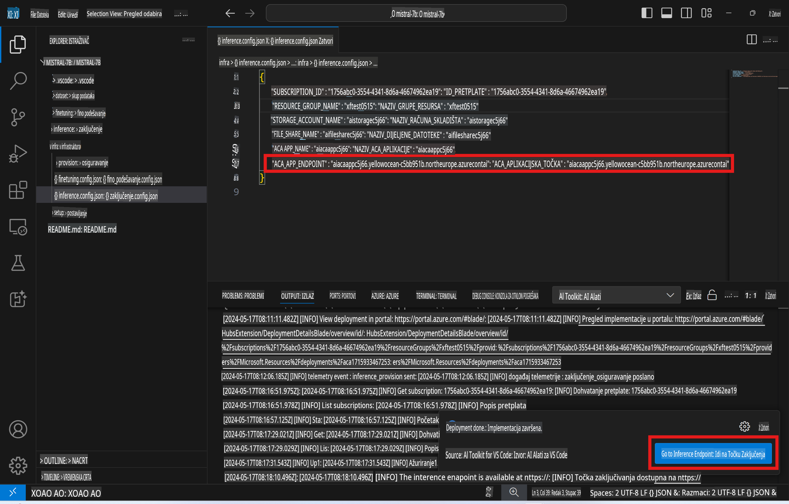

# Daljinsko izvođenje zaključivanja s fino podešenim modelom

Nakon što su adapteri istrenirani u udaljenom okruženju, koristite jednostavnu Gradio aplikaciju za interakciju s modelom.



### Postavljanje Azure resursa
Potrebno je postaviti Azure resurse za daljinsko izvođenje zaključivanja izvršavanjem naredbe `AI Toolkit: Provision Azure Container Apps for inference` iz izbornika naredbi. Tijekom postavljanja, od vas će se tražiti da odaberete svoju Azure pretplatu i grupu resursa.  


Prema zadanim postavkama, pretplata i grupa resursa za zaključivanje trebale bi odgovarati onima koje su korištene za fino podešavanje. Zaključivanje će koristiti isto Azure Container App okruženje i pristupiti modelu i adapteru modela pohranjenima u Azure Files, koji su generirani tijekom koraka finog podešavanja.

## Korištenje AI Toolkit-a

### Implementacija za zaključivanje
Ako želite revidirati kod za zaključivanje ili ponovno učitati model zaključivanja, izvršite naredbu `AI Toolkit: Deploy for inference`. Ova naredba će sinkronizirati vaš najnoviji kod s ACA-om i ponovno pokrenuti repliku.  



Nakon uspješne implementacije, model je spreman za evaluaciju putem ovog krajnje točke.

### Pristup API-ju za zaključivanje

API za zaključivanje možete pristupiti klikom na gumb "*Go to Inference Endpoint*" prikazan u obavijesti VSCode-a. Alternativno, web API krajnja točka može se pronaći pod `ACA_APP_ENDPOINT` u `./infra/inference.config.json` i u izlaznoj ploči.



> **Napomena:** Krajnja točka za zaključivanje može zahtijevati nekoliko minuta da postane potpuno operativna.

## Komponente za zaključivanje uključene u predložak
 
| Mapa | Sadržaj |
| ------ |--------- |
| `infra` | Sadrži sve potrebne konfiguracije za udaljene operacije. |
| `infra/provision/inference.parameters.json` | Sadrži parametre za bicep predloške, koji se koriste za postavljanje Azure resursa za zaključivanje. |
| `infra/provision/inference.bicep` | Sadrži predloške za postavljanje Azure resursa za zaključivanje. |
| `infra/inference.config.json` | Konfiguracijska datoteka, generirana naredbom `AI Toolkit: Provision Azure Container Apps for inference`. Koristi se kao ulaz za ostale naredbene palete za daljinske operacije. |

### Korištenje AI Toolkit-a za konfiguriranje Azure resursa
Konfigurirajte [AI Toolkit](https://marketplace.visualstudio.com/items?itemName=ms-windows-ai-studio.windows-ai-studio)

Postavite Azure Container Apps za zaključivanje` command.

You can find configuration parameters in `./infra/provision/inference.parameters.json` file. Here are the details:
| Parameter | Description |
| --------- |------------ |
| `defaultCommands` | This is the commands to initiate a web API. |
| `maximumInstanceCount` | This parameter sets the maximum capacity of GPU instances. |
| `location` | This is the location where Azure resources are provisioned. The default value is the same as the chosen resource group's location. |
| `storageAccountName`, `fileShareName` `acaEnvironmentName`, `acaEnvironmentStorageName`, `acaAppName`,  `acaLogAnalyticsName` | These parameters are used to name the Azure resources for provision. By default, they will be same to the fine-tuning resource name. You can input a new, unused resource name to create your own custom-named resources, or you can input the name of an already existing Azure resource if you'd prefer to use that. For details, refer to the section [Using existing Azure Resources](../../../../../md/01.Introduction/03). |

### Using Existing Azure Resources

By default, the inference provision use the same Azure Container App Environment, Storage Account, Azure File Share, and Azure Log Analytics that were used for fine-tuning. A separate Azure Container App is created solely for the inference API. 

If you have customized the Azure resources during the fine-tuning step or want to use your own existing Azure resources for inference, specify their names in the `./infra/inference.parameters.json` datoteka. Zatim, pokrenite naredbu `AI Toolkit: Provision Azure Container Apps for inference` iz izbornika naredbi. Ova naredba ažurira sve specificirane resurse i kreira one koji nedostaju.

Na primjer, ako već imate postojeće Azure Container okruženje, vaša datoteka `./infra/finetuning.parameters.json` trebala bi izgledati ovako:

```json
{
    "$schema": "https://schema.management.azure.com/schemas/2019-04-01/deploymentParameters.json#",
    "contentVersion": "1.0.0.0",
    "parameters": {
      ...
      "acaEnvironmentName": {
        "value": "<your-aca-env-name>"
      },
      "acaEnvironmentStorageName": {
        "value": null
      },
      ...
    }
  }
```

### Ručno postavljanje
Ako radije želite ručno konfigurirati Azure resurse, možete koristiti priložene bicep datoteke u `./infra/provision` folders. If you have already set up and configured all the Azure resources without using the AI Toolkit command palette, you can simply enter the resource names in the `inference.config.json` datoteci.

Na primjer:

```json
{
  "SUBSCRIPTION_ID": "<your-subscription-id>",
  "RESOURCE_GROUP_NAME": "<your-resource-group-name>",
  "STORAGE_ACCOUNT_NAME": "<your-storage-account-name>",
  "FILE_SHARE_NAME": "<your-file-share-name>",
  "ACA_APP_NAME": "<your-aca-name>",
  "ACA_APP_ENDPOINT": "<your-aca-endpoint>"
}
```

**Odricanje od odgovornosti**:  
Ovaj dokument je preveden korištenjem usluga strojnog AI prevođenja. Iako nastojimo osigurati točnost, molimo vas da imate na umu da automatizirani prijevodi mogu sadržavati pogreške ili netočnosti. Izvorni dokument na njegovom izvornom jeziku treba smatrati mjerodavnim izvorom. Za ključne informacije preporučuje se profesionalni prijevod od strane stručnjaka. Ne snosimo odgovornost za nesporazume ili pogrešna tumačenja koja mogu proizaći iz korištenja ovog prijevoda.