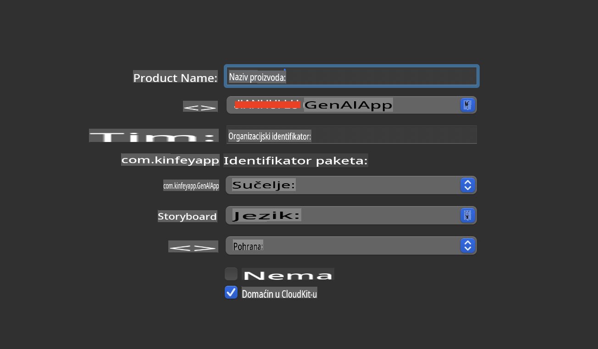
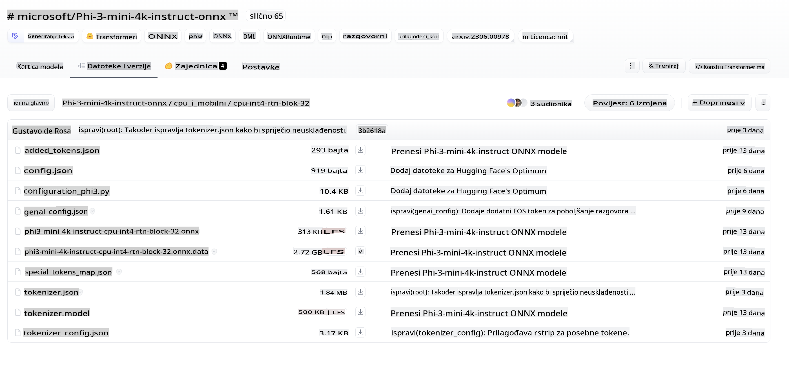
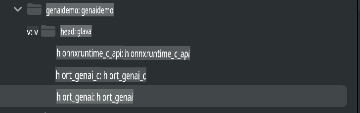
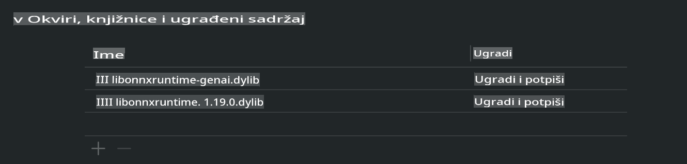
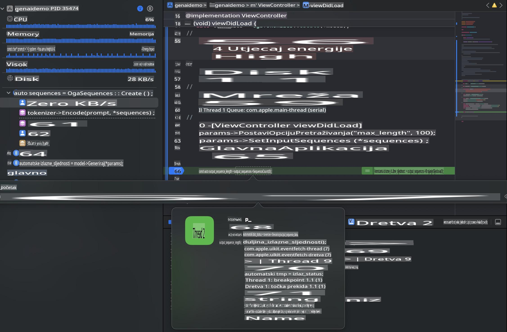

# **Inference Phi-3 na iOS-u**

Phi-3-mini je nova serija modela iz Microsofta koja omogućuje implementaciju velikih jezičnih modela (LLM-ova) na edge uređajima i IoT uređajima. Phi-3-mini dostupan je za iOS, Android i edge uređaje, omogućujući generativnu AI tehnologiju u BYOD okruženjima. Sljedeći primjer pokazuje kako implementirati Phi-3-mini na iOS-u.

## **1. Priprema**

- **a.** macOS 14+
- **b.** Xcode 15+
- **c.** iOS SDK 17.x (iPhone 14 A16 ili noviji)
- **d.** Instalirajte Python 3.10+ (preporučuje se Conda)
- **e.** Instalirajte Python biblioteku: `python-flatbuffers`
- **f.** Instalirajte CMake

### Semantic Kernel i Inference

Semantic Kernel je aplikacijski okvir koji omogućuje kreiranje aplikacija kompatibilnih s Azure OpenAI Service, OpenAI modelima i lokalnim modelima. Pristup lokalnim servisima putem Semantic Kernela omogućuje jednostavnu integraciju s vašim lokalno hostanim Phi-3-mini model serverom.

### Pozivanje Kvantiziranih Modela s Ollama ili LlamaEdge

Mnogi korisnici preferiraju korištenje kvantiziranih modela za lokalno pokretanje. [Ollama](https://ollama.com) i [LlamaEdge](https://llamaedge.com) omogućuju korisnicima pozivanje različitih kvantiziranih modela:

#### **Ollama**

Možete pokrenuti `ollama run phi3` direktno ili ga konfigurirati offline. Kreirajte Modelfile s putanjom do vaše `gguf` datoteke. Primjer koda za pokretanje kvantiziranog Phi-3-mini modela:

```gguf
FROM {Add your gguf file path}
TEMPLATE \"\"\"<|user|> .Prompt<|end|> <|assistant|>\"\"\"
PARAMETER stop <|end|>
PARAMETER num_ctx 4096
```

#### **LlamaEdge**

Ako želite koristiti `gguf` istovremeno na cloud i edge uređajima, LlamaEdge je izvrsna opcija.

## **2. Kompilacija ONNX Runtime-a za iOS**

```bash

git clone https://github.com/microsoft/onnxruntime.git

cd onnxruntime

./build.sh --build_shared_lib --ios --skip_tests --parallel --build_dir ./build_ios --ios --apple_sysroot iphoneos --osx_arch arm64 --apple_deploy_target 17.5 --cmake_generator Xcode --config Release

cd ../

```

### **Napomena**

- **a.** Prije kompilacije, provjerite je li Xcode ispravno konfiguriran i postavljen kao aktivni razvojni direktorij u terminalu:

    ```bash
    sudo xcode-select -switch /Applications/Xcode.app/Contents/Developer
    ```

- **b.** ONNX Runtime treba biti kompiliran za različite platforme. Za iOS, možete ga kompilirati za `arm64` or `x86_64`.

- **c.** Preporučuje se korištenje najnovijeg iOS SDK-a za kompilaciju. Međutim, možete koristiti i stariju verziju ako trebate kompatibilnost s prethodnim SDK-ovima.

## **3. Kompilacija Generativne AI s ONNX Runtime-om za iOS**

> **Napomena:** Budući da je Generativna AI s ONNX Runtime-om u pregledu, budite svjesni mogućih promjena.

```bash

git clone https://github.com/microsoft/onnxruntime-genai
 
cd onnxruntime-genai
 
mkdir ort
 
cd ort
 
mkdir include
 
mkdir lib
 
cd ../
 
cp ../onnxruntime/include/onnxruntime/core/session/onnxruntime_c_api.h ort/include
 
cp ../onnxruntime/build_ios/Release/Release-iphoneos/libonnxruntime*.dylib* ort/lib
 
export OPENCV_SKIP_XCODEBUILD_FORCE_TRYCOMPILE_DEBUG=1
 
python3 build.py --parallel --build_dir ./build_ios --ios --ios_sysroot iphoneos --ios_arch arm64 --ios_deployment_target 17.5 --cmake_generator Xcode --cmake_extra_defines CMAKE_XCODE_ATTRIBUTE_CODE_SIGNING_ALLOWED=NO

```

## **4. Kreiranje App aplikacije u Xcode-u**

Odabrao sam Objective-C kao metodu razvoja aplikacije jer je za korištenje Generativne AI s ONNX Runtime C++ API-jem Objective-C bolje kompatibilan. Naravno, možete također koristiti Swift bridging za obavljanje povezanih poziva.



## **5. Kopiranje ONNX kvantiziranog INT4 modela u projekt aplikacije**

Moramo uvesti INT4 kvantizirani model u ONNX formatu, koji prvo treba preuzeti.



Nakon preuzimanja, trebate ga dodati u direktorij Resources projekta u Xcode-u.


## **6. Dodavanje C++ API-ja u ViewControllers**

> **Napomena:**

- **a.** Dodajte odgovarajuće C++ zaglavne datoteke u projekt.

  

- **b.** Uključite `onnxruntime-genai` dynamic library in Xcode.

  

- **c.** Use the C Samples code for testing. You can also add additional features like ChatUI for more functionality.

- **d.** Since you need to use C++ in your project, rename `ViewController.m` to `ViewController.mm` kako biste omogućili podršku za Objective-C++.

```objc

    NSString *llmPath = [[NSBundle mainBundle] resourcePath];
    char const *modelPath = llmPath.cString;

    auto model =  OgaModel::Create(modelPath);

    auto tokenizer = OgaTokenizer::Create(*model);

    const char* prompt = "<|system|>You are a helpful AI assistant.<|end|><|user|>Can you introduce yourself?<|end|><|assistant|>";

    auto sequences = OgaSequences::Create();
    tokenizer->Encode(prompt, *sequences);

    auto params = OgaGeneratorParams::Create(*model);
    params->SetSearchOption("max_length", 100);
    params->SetInputSequences(*sequences);

    auto output_sequences = model->Generate(*params);
    const auto output_sequence_length = output_sequences->SequenceCount(0);
    const auto* output_sequence_data = output_sequences->SequenceData(0);
    auto out_string = tokenizer->Decode(output_sequence_data, output_sequence_length);
    
    auto tmp = out_string;

```

## **7. Pokretanje aplikacije**

Kada je postavljanje završeno, možete pokrenuti aplikaciju i vidjeti rezultate inferencije modela Phi-3-mini.



Za više primjera koda i detaljne upute, posjetite [Phi-3 Mini Samples repository](https://github.com/Azure-Samples/Phi-3MiniSamples/tree/main/ios).

**Odricanje od odgovornosti**:  
Ovaj dokument je preveden korištenjem AI usluga za strojno prevođenje. Iako težimo točnosti, imajte na umu da automatizirani prijevodi mogu sadržavati pogreške ili netočnosti. Izvorni dokument na njegovom izvornom jeziku treba smatrati mjerodavnim izvorom. Za ključne informacije preporučuje se profesionalni prijevod od strane čovjeka. Ne snosimo odgovornost za bilo kakve nesporazume ili pogrešna tumačenja proizašla iz korištenja ovog prijevoda.