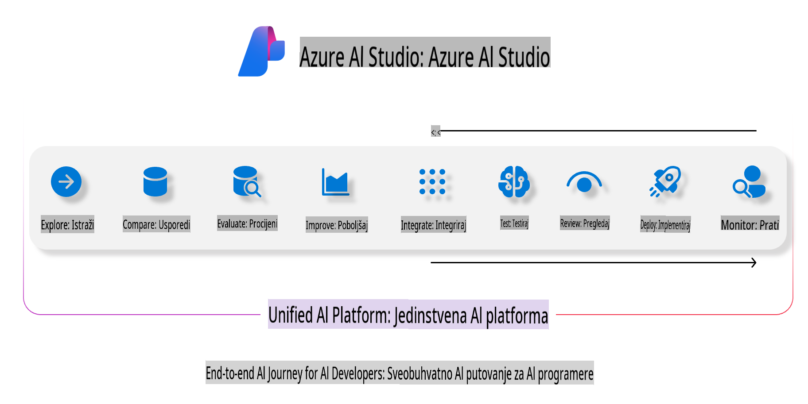
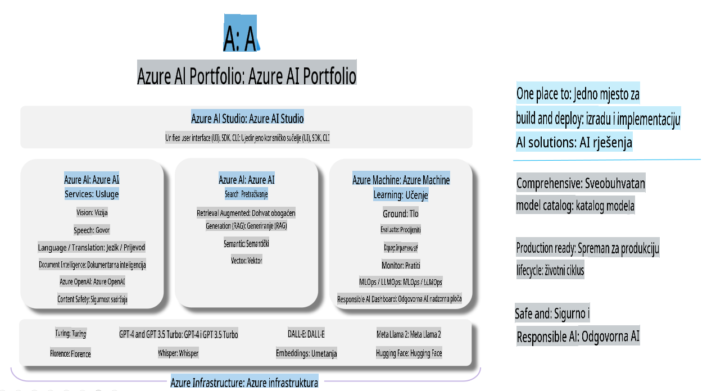

# **Korištenje Azure AI Foundry za evaluaciju**

Kako evaluirati svoju generativnu AI aplikaciju koristeći [Azure AI Foundry](https://ai.azure.com?WT.mc_id=aiml-138114-kinfeylo). Bez obzira procjenjujete li jednostavne ili višestruke razgovore, Azure AI Foundry nudi alate za evaluaciju performansi i sigurnosti modela.

## Kako evaluirati generativne AI aplikacije s Azure AI Foundry
Za detaljnije upute pogledajte [Azure AI Foundry dokumentaciju](https://learn.microsoft.com/azure/ai-studio/how-to/evaluate-generative-ai-app?WT.mc_id=aiml-138114-kinfeylo).

Evo koraka za početak:

## Evaluacija generativnih AI modela u Azure AI Foundry

**Preduvjeti**

- Testni skup podataka u CSV ili JSON formatu.
- Implementirani generativni AI model (kao što su Phi-3, GPT 3.5, GPT 4 ili Davinci modeli).
- Runtime s instancom za računalnu obradu za pokretanje evaluacije.

## Ugrađene metrike za evaluaciju

Azure AI Foundry omogućuje evaluaciju jednostavnih i složenih, višestrukih razgovora.
Za scenarije Retrieval Augmented Generation (RAG), gdje je model temeljen na specifičnim podacima, performanse se mogu procijeniti koristeći ugrađene metrike za evaluaciju.
Također, možete evaluirati općenite scenarije jednostavnog odgovaranja na pitanja (ne-RAG).

## Kreiranje evaluacijskog procesa

U Azure AI Foundry korisničkom sučelju, idite na stranicu Evaluate ili Prompt Flow.
Slijedite čarobnjak za kreiranje evaluacije kako biste postavili evaluacijski proces. Opcionalno unesite naziv za vašu evaluaciju.
Odaberite scenarij koji se poklapa s ciljevima vaše aplikacije.
Odaberite jednu ili više metrika za evaluaciju kako biste procijenili izlaz modela.

## Prilagođeni proces evaluacije (Opcionalno)

Za veću fleksibilnost, možete postaviti prilagođeni proces evaluacije. Prilagodite proces evaluacije prema svojim specifičnim zahtjevima.

## Pregled rezultata

Nakon što pokrenete evaluaciju, zabilježite, pregledajte i analizirajte detaljne metrike evaluacije u Azure AI Foundry. Steknite uvid u mogućnosti i ograničenja vaše aplikacije.

**Napomena** Azure AI Foundry je trenutno u javnoj pretpregledu, stoga ga koristite za eksperimentiranje i razvojne svrhe. Za produkcijske radne zadatke razmotrite druge opcije. Istražite službenu [AI Foundry dokumentaciju](https://learn.microsoft.com/azure/ai-studio/?WT.mc_id=aiml-138114-kinfeylo) za više detalja i upute korak po korak.

**Odricanje od odgovornosti**:  
Ovaj dokument je preveden korištenjem usluga automatskog prijevoda temeljenog na umjetnoj inteligenciji. Iako nastojimo postići točnost, imajte na umu da automatski prijevodi mogu sadržavati pogreške ili netočnosti. Izvorni dokument na njegovom izvornom jeziku treba smatrati mjerodavnim izvorom. Za ključne informacije preporučuje se profesionalni prijevod od strane čovjeka. Ne snosimo odgovornost za nesporazume ili pogrešna tumačenja koja mogu proizaći iz korištenja ovog prijevoda.