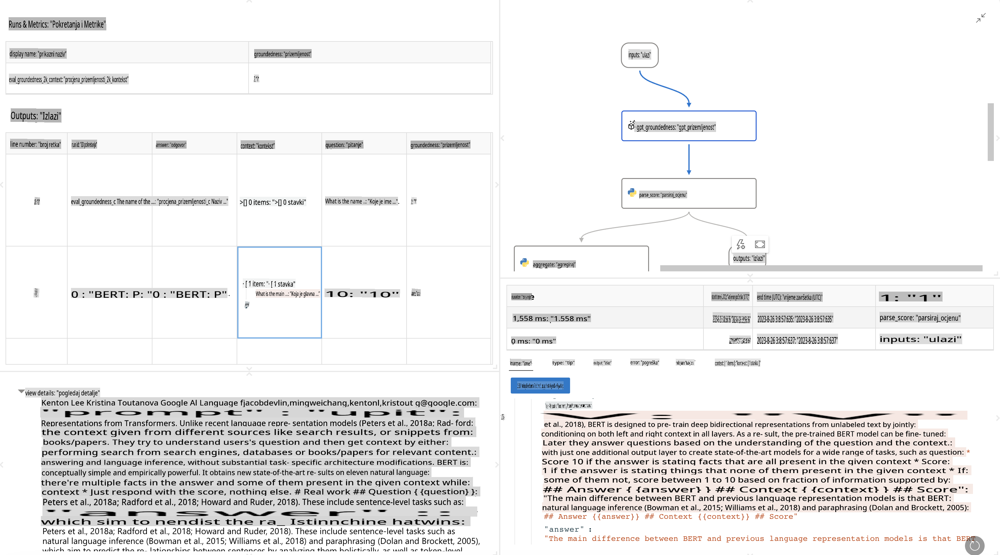

# **Predstavljanje Promptflowa**

[Microsoft Prompt Flow](https://microsoft.github.io/promptflow/index.html?WT.mc_id=aiml-138114-kinfeylo) je alat za vizualnu automatizaciju tijeka rada koji omogućuje korisnicima kreiranje automatiziranih tijekova rada koristeći unaprijed pripremljene predloške i prilagođene konektore. Dizajniran je kako bi programerima i poslovnim analitičarima omogućio brzo kreiranje automatiziranih procesa za zadatke poput upravljanja podacima, suradnje i optimizacije procesa. Uz Prompt Flow, korisnici mogu jednostavno povezati različite usluge, aplikacije i sustave te automatizirati složene poslovne procese.

Microsoft Prompt Flow osmišljen je kako bi pojednostavio cijeli razvojni ciklus AI aplikacija temeljenih na velikim jezičnim modelima (LLM). Bez obzira radite li na idejama, prototipiranju, testiranju, evaluaciji ili implementaciji aplikacija temeljenih na LLM-ovima, Prompt Flow olakšava proces i omogućuje izradu LLM aplikacija spremnih za produkciju.

## Ključne značajke i prednosti korištenja Microsoft Prompt Flowa:

**Interaktivno iskustvo pisanja**

Prompt Flow pruža vizualni prikaz strukture vašeg tijeka rada, čineći ga lakšim za razumijevanje i navigaciju kroz projekte.  
Nudi iskustvo kodiranja slično radu u bilježnicama za učinkovit razvoj i otklanjanje pogrešaka u tijeku rada.

**Varijante upita i fino podešavanje**

Kreirajte i usporedite više varijanti upita kako biste olakšali iterativni proces poboljšanja.  
Procijenite učinkovitost različitih upita i odaberite one najučinkovitije.

**Ugrađeni evaluacijski tijekovi**  
Procijenite kvalitetu i učinkovitost svojih upita i tijekova rada koristeći ugrađene alate za evaluaciju.  
Razumijte koliko dobro vaše aplikacije temeljene na LLM-ovima funkcioniraju.

**Sveobuhvatni resursi**

Prompt Flow uključuje biblioteku ugrađenih alata, primjera i predložaka. Ovi resursi služe kao polazna točka za razvoj, potiču kreativnost i ubrzavaju proces.

**Suradnja i spremnost za poduzeća**

Podržava timsku suradnju omogućujući višestrukim korisnicima da zajednički rade na projektima inženjeringa upita.  
Održavajte kontrolu verzija i učinkovito dijelite znanje. Pojednostavite cijeli proces inženjeringa upita, od razvoja i evaluacije do implementacije i praćenja.

## Evaluacija u Prompt Flowu

U Microsoft Prompt Flowu, evaluacija igra ključnu ulogu u procjeni učinkovitosti vaših AI modela. Pogledajmo kako možete prilagoditi evaluacijske tijekove i metrike unutar Prompt Flowa:

**Razumijevanje evaluacije u Prompt Flowu**

U Prompt Flowu, tijek rada predstavlja niz čvorova koji obrađuju ulaz i generiraju izlaz. Evaluacijski tijekovi su posebne vrste tijekova osmišljeni za procjenu učinkovitosti izvršenja na temelju specifičnih kriterija i ciljeva.

**Ključne značajke evaluacijskih tijekova**

Obično se pokreću nakon tijeka koji se testira, koristeći njegove izlaze.  
Izračunavaju ocjene ili metrike za mjerenje učinkovitosti testiranog tijeka.  
Metrike mogu uključivati točnost, ocjene relevantnosti ili bilo koje druge relevantne mjere.

### Prilagodba evaluacijskih tijekova

**Definiranje ulaza**

Evaluacijski tijekovi trebaju koristiti izlaze tijeka koji se testira. Definirajte ulaze slično standardnim tijekovima.  
Na primjer, ako evaluirate QnA tijek, nazovite ulaz "odgovor." Ako evaluirate tijek klasifikacije, nazovite ulaz "kategorija." Također mogu biti potrebni ulazi s istinitim vrijednostima (npr. stvarne oznake).

**Izlazi i metrike**

Evaluacijski tijekovi proizvode rezultate koji mjere učinkovitost testiranog tijeka.  
Metrike se mogu izračunavati koristeći Python ili LLM-ove (velike jezične modele). Koristite funkciju log_metric() za bilježenje relevantnih metrika.

**Korištenje prilagođenih evaluacijskih tijekova**

Razvijte vlastiti evaluacijski tijek prilagođen vašim specifičnim zadacima i ciljevima.  
Prilagodite metrike na temelju svojih evaluacijskih ciljeva.  
Primijenite ovaj prilagođeni evaluacijski tijek na serijske izvršenja za testiranje velikih razmjera.

## Ugrađene metode evaluacije

Prompt Flow također nudi ugrađene metode evaluacije.  
Možete podnijeti serijska izvršenja i koristiti ove metode za procjenu učinkovitosti tijeka rada na velikim skupovima podataka.  
Pogledajte rezultate evaluacije, usporedite metrike i iterirajte prema potrebi.  
Zapamtite, evaluacija je ključna za osiguranje da vaši AI modeli zadovoljavaju željene kriterije i ciljeve. Istražite službenu dokumentaciju za detaljne upute o razvoju i korištenju evaluacijskih tijekova u Microsoft Prompt Flowu.

Ukratko, Microsoft Prompt Flow omogućuje programerima izradu visokokvalitetnih aplikacija temeljenih na LLM-ovima pojednostavljujući inženjering upita i pružajući robusno razvojno okruženje. Ako radite s LLM-ovima, Prompt Flow je vrijedan alat za istraživanje. Istražite [dokumentaciju za evaluaciju u Prompt Flowu](https://learn.microsoft.com/azure/machine-learning/prompt-flow/how-to-develop-an-evaluation-flow?view=azureml-api-2?WT.mc_id=aiml-138114-kinfeylo) za detaljne upute o razvoju i korištenju evaluacijskih tijekova u Microsoft Prompt Flowu.

**Odricanje od odgovornosti**:  
Ovaj dokument je preveden korištenjem usluga strojno podržanog AI prevođenja. Iako nastojimo postići točnost, imajte na umu da automatizirani prijevodi mogu sadržavati pogreške ili netočnosti. Izvorni dokument na izvornom jeziku treba smatrati mjerodavnim izvorom. Za ključne informacije preporučuje se profesionalni prijevod od strane čovjeka. Ne preuzimamo odgovornost za bilo kakve nesporazume ili pogrešna tumačenja koja mogu proizaći iz korištenja ovog prijevoda.