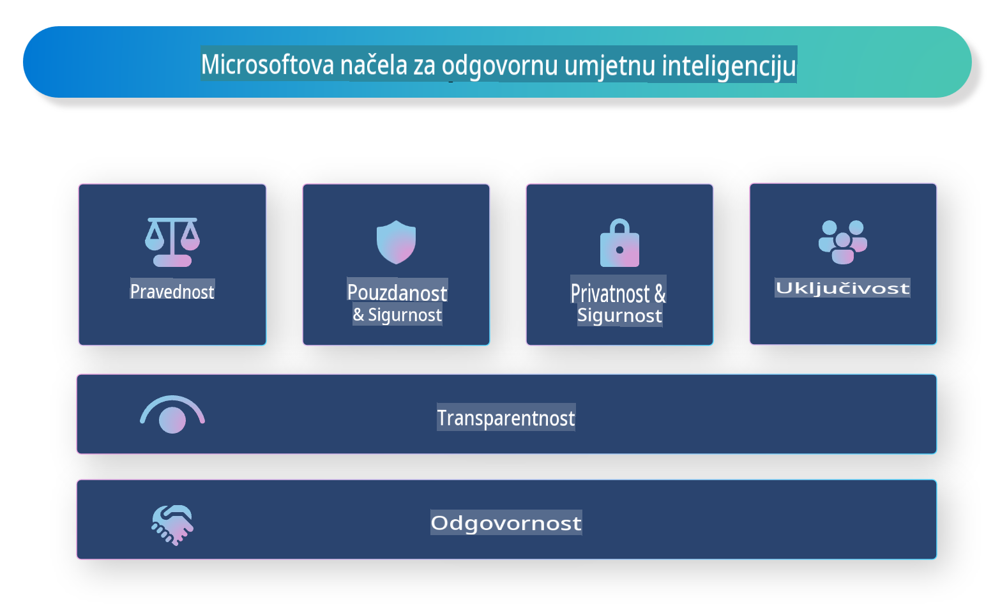

# **Predstavljanje Odgovorne umjetne inteligencije**

[Microsoft Responsible AI](https://www.microsoft.com/ai/responsible-ai?WT.mc_id=aiml-138114-kinfeylo) je inicijativa koja ima za cilj pomoći programerima i organizacijama u izgradnji AI sustava koji su transparentni, pouzdani i odgovorni. Inicijativa pruža smjernice i resurse za razvoj odgovorne AI koja je u skladu s etičkim načelima, poput privatnosti, pravednosti i transparentnosti. Također ćemo istražiti neke od izazova i najboljih praksi povezanih s razvojem odgovorne umjetne inteligencije.

## Pregled Microsoftove odgovorne umjetne inteligencije

**Etička načela**

Microsoft Responsible AI temelji se na skupu etičkih načela, poput privatnosti, pravednosti, transparentnosti, odgovornosti i sigurnosti. Ova načela osmišljena su kako bi osigurala da se AI sustavi razvijaju na etičan i odgovoran način.

**Transparentna umjetna inteligencija**

Microsoft Responsible AI naglašava važnost transparentnosti u AI sustavima. To uključuje pružanje jasnih objašnjenja o tome kako AI modeli funkcioniraju, kao i osiguravanje da su izvori podataka i algoritmi javno dostupni.

**Odgovorna umjetna inteligencija**

[Microsoft Responsible AI](https://www.microsoft.com/ai/responsible-ai?WT.mc_id=aiml-138114-kinfeylo) promiče razvoj odgovornih AI sustava koji mogu pružiti uvid u to kako AI modeli donose odluke. Ovo može pomoći korisnicima da razumiju i vjeruju rezultatima AI sustava.

**Uključivost**

AI sustavi trebali bi biti dizajnirani tako da koriste svima. Microsoft teži stvaranju uključive umjetne inteligencije koja uzima u obzir različite perspektive i izbjegava pristranosti ili diskriminaciju.

**Pouzdanost i sigurnost**

Osiguravanje pouzdanosti i sigurnosti AI sustava je ključno. Microsoft se fokusira na izgradnju robusnih modela koji dosljedno funkcioniraju i izbjegavaju štetne ishode.

**Pravednost u umjetnoj inteligenciji**

Microsoft Responsible AI prepoznaje da AI sustavi mogu perpetuirati pristranosti ako su trenirani na pristranim podacima ili algoritmima. Inicijativa pruža smjernice za razvoj pravednih AI sustava koji ne diskriminiraju na temelju čimbenika poput rase, spola ili dobi.

**Privatnost i sigurnost**

Microsoft Responsible AI naglašava važnost zaštite privatnosti korisnika i sigurnosti podataka u AI sustavima. To uključuje implementaciju snažnog šifriranja podataka i kontrolu pristupa, kao i redovite revizije AI sustava radi otkrivanja ranjivosti.

**Odgovornost i odgovornost**

Microsoft Responsible AI promiče odgovornost u razvoju i implementaciji AI sustava. To uključuje osiguravanje da su programeri i organizacije svjesni potencijalnih rizika povezanih s AI sustavima i poduzimanje koraka za njihovo ublažavanje.

## Najbolje prakse za izgradnju odgovornih AI sustava

**Razvijajte AI modele koristeći raznolike skupove podataka**

Kako bi se izbjegla pristranost u AI sustavima, važno je koristiti raznolike skupove podataka koji predstavljaju širok raspon perspektiva i iskustava.

**Koristite tehnike objašnjive umjetne inteligencije**

Tehnike objašnjive umjetne inteligencije mogu pomoći korisnicima da razumiju kako AI modeli donose odluke, što može povećati povjerenje u sustav.

**Redovito provodite revizije AI sustava radi ranjivosti**

Redovite revizije AI sustava mogu pomoći u identificiranju potencijalnih rizika i ranjivosti koje treba riješiti.

**Implementirajte snažno šifriranje podataka i kontrole pristupa**

Šifriranje podataka i kontrole pristupa mogu pomoći u zaštiti privatnosti i sigurnosti korisnika u AI sustavima.

**Slijedite etička načela u razvoju AI**

Slijeđenje etičkih načela, poput pravednosti, transparentnosti i odgovornosti, može pomoći u izgradnji povjerenja u AI sustave i osigurati njihov odgovoran razvoj.

## Korištenje AI Foundry za odgovornu umjetnu inteligenciju

[Azure AI Foundry](https://ai.azure.com?WT.mc_id=aiml-138114-kinfeylo) je moćna platforma koja omogućuje programerima i organizacijama brzo stvaranje inteligentnih, naprednih, tržišno spremnih i odgovornih aplikacija. Evo nekih ključnih značajki i mogućnosti Azure AI Foundry:

**Gotovi API-ji i modeli**

Azure AI Foundry nudi unaprijed izrađene i prilagodljive API-je i modele. Oni pokrivaju širok raspon AI zadataka, uključujući generativnu umjetnu inteligenciju, obradu prirodnog jezika za razgovore, pretraživanje, praćenje, prijevod, govor, viziju i donošenje odluka.

**Prompt Flow**

Prompt flow u Azure AI Foundry omogućuje stvaranje iskustava s konverzacijskom umjetnom inteligencijom. Omogućuje dizajniranje i upravljanje konverzacijskim tokovima, olakšavajući izradu chatbotova, virtualnih asistenata i drugih interaktivnih aplikacija.

**Retrieval Augmented Generation (RAG)**

RAG je tehnika koja kombinira pristupe temeljene na pretraživanju i generiranju. Poboljšava kvalitetu generiranih odgovora koristeći postojeće znanje (pretraživanje) i kreativno generiranje (generacija).

**Metričke evaluacije i praćenja za generativnu umjetnu inteligenciju**

Azure AI Foundry pruža alate za evaluaciju i praćenje generativnih AI modela. Možete procijeniti njihovu izvedbu, pravednost i druge važne metrike kako biste osigurali odgovornu implementaciju. Osim toga, ako ste izradili nadzornu ploču, možete koristiti sučelje bez koda u Azure Machine Learning Studio za prilagodbu i generiranje Responsible AI Dashboard-a i pripadajuće kartice rezultata na temelju [Responsible AI Toolbox](https://responsibleaitoolbox.ai/?WT.mc_id=aiml-138114-kinfeylo) Python biblioteka. Ova kartica rezultata pomaže u dijeljenju ključnih uvida vezanih uz pravednost, važnost značajki i druge aspekte odgovorne implementacije s tehničkim i netehničkim dionicima.

Kako biste koristili AI Foundry s odgovornom umjetnom inteligencijom, slijedite ove najbolje prakse:

**Definirajte problem i ciljeve svog AI sustava**

Prije početka razvoja, važno je jasno definirati problem ili cilj koji vaš AI sustav treba riješiti. To će vam pomoći identificirati podatke, algoritme i resurse potrebne za izgradnju učinkovitog modela.

**Prikupite i unaprijed obradite relevantne podatke**

Kvaliteta i količina podataka korištenih za treniranje AI sustava mogu značajno utjecati na njegovu izvedbu. Stoga je važno prikupiti relevantne podatke, očistiti ih, unaprijed obraditi i osigurati da predstavljaju populaciju ili problem koji pokušavate riješiti.

**Odaberite odgovarajuću evaluaciju**

Dostupni su različiti algoritmi za evaluaciju. Važno je odabrati najprikladniji algoritam na temelju vaših podataka i problema.

**Procijenite i interpretirajte model**

Nakon što izgradite AI model, važno je procijeniti njegovu izvedbu koristeći odgovarajuće metrike i interpretirati rezultate na transparentan način. Ovo će vam pomoći identificirati pristranosti ili ograničenja modela i napraviti potrebna poboljšanja.

**Osigurajte transparentnost i objašnjivost**

AI sustavi trebali bi biti transparentni i objašnjivi kako bi korisnici mogli razumjeti kako funkcioniraju i kako se donose odluke. Ovo je posebno važno za aplikacije koje imaju značajan utjecaj na ljudske živote, poput zdravstva, financija i pravnog sustava.

**Pratite i ažurirajte model**

AI sustave treba kontinuirano pratiti i ažurirati kako bi ostali točni i učinkoviti tijekom vremena. To zahtijeva stalno održavanje, testiranje i ponovno treniranje modela.

Zaključno, Microsoft Responsible AI je inicijativa koja ima za cilj pomoći programerima i organizacijama u izgradnji AI sustava koji su transparentni, pouzdani i odgovorni. Zapamtite da je implementacija odgovorne umjetne inteligencije ključna, a Azure AI Foundry nastoji to učiniti praktičnim za organizacije. Slijedeći etička načela i najbolje prakse, možemo osigurati da se AI sustavi razvijaju i implementiraju na odgovoran način koji koristi društvu u cjelini.

**Odricanje od odgovornosti**:  
Ovaj dokument je preveden korištenjem usluga strojno baziranog AI prevođenja. Iako težimo točnosti, imajte na umu da automatizirani prijevodi mogu sadržavati pogreške ili netočnosti. Izvorni dokument na njegovom izvornom jeziku treba smatrati mjerodavnim izvorom. Za ključne informacije preporučuje se profesionalni prijevod od strane ljudskog prevoditelja. Ne preuzimamo odgovornost za bilo kakva nesporazume ili pogrešna tumačenja koja mogu proizaći iz korištenja ovog prijevoda.