# Procjena prilagođenog Phi-3 / Phi-3.5 modela u Azure AI Foundry uz fokus na Microsoftove principe odgovorne umjetne inteligencije

Ovaj primjer od početka do kraja (E2E) temelji se na vodiču "[Evaluate Fine-tuned Phi-3 / 3.5 Models in Azure AI Foundry Focusing on Microsoft's Responsible AI](https://techcommunity.microsoft.com/t5/educator-developer-blog/evaluate-fine-tuned-phi-3-3-5-models-in-azure-ai-studio-focusing/ba-p/4227850?WT.mc_id=aiml-137032-kinfeylo)" iz Microsoft Tech Community.

## Pregled

### Kako možete procijeniti sigurnost i performanse prilagođenog Phi-3 / Phi-3.5 modela u Azure AI Foundry?

Prilagodba modela ponekad može dovesti do neočekivanih ili neželjenih odgovora. Kako biste osigurali da model ostane siguran i učinkovit, važno je procijeniti njegov potencijal za generiranje štetnog sadržaja te sposobnost proizvodnje točnih, relevantnih i koherentnih odgovora. U ovom vodiču naučit ćete kako procijeniti sigurnost i performanse prilagođenog Phi-3 / Phi-3.5 modela integriranog s Prompt flow u Azure AI Foundry.

Ovo je proces procjene u Azure AI Foundry.

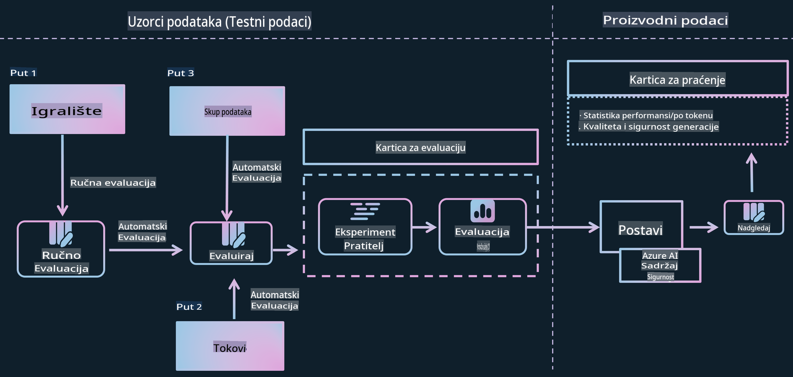

*Izvor slike: [Procjena generativnih AI aplikacija](https://learn.microsoft.com/azure/ai-studio/concepts/evaluation-approach-gen-ai?wt.mc_id%3Dstudentamb_279723)*

> [!NOTE]
>
> Za detaljnije informacije i dodatne resurse o Phi-3 / Phi-3.5, posjetite [Phi-3CookBook](https://github.com/microsoft/Phi-3CookBook?wt.mc_id=studentamb_279723).

### Preduvjeti

- [Python](https://www.python.org/downloads)
- [Azure pretplata](https://azure.microsoft.com/free?wt.mc_id=studentamb_279723)
- [Visual Studio Code](https://code.visualstudio.com)
- Prilagođeni Phi-3 / Phi-3.5 model

### Sadržaj

1. [**Scenarij 1: Uvod u procjenu Prompt flow u Azure AI Foundry**](../../../../../../md/02.Application/01.TextAndChat/Phi3)

    - [Uvod u procjenu sigurnosti](../../../../../../md/02.Application/01.TextAndChat/Phi3)
    - [Uvod u procjenu performansi](../../../../../../md/02.Application/01.TextAndChat/Phi3)

1. [**Scenarij 2: Procjena Phi-3 / Phi-3.5 modela u Azure AI Foundry**](../../../../../../md/02.Application/01.TextAndChat/Phi3)

    - [Prije nego što počnete](../../../../../../md/02.Application/01.TextAndChat/Phi3)
    - [Postavljanje Azure OpenAI za procjenu Phi-3 / Phi-3.5 modela](../../../../../../md/02.Application/01.TextAndChat/Phi3)
    - [Procjena prilagođenog Phi-3 / Phi-3.5 modela pomoću Prompt flow u Azure AI Foundry](../../../../../../md/02.Application/01.TextAndChat/Phi3)

1. [Čestitamo!](../../../../../../md/02.Application/01.TextAndChat/Phi3)

## **Scenarij 1: Uvod u procjenu Prompt flow u Azure AI Foundry**

### Uvod u procjenu sigurnosti

Kako biste osigurali da vaš AI model bude etičan i siguran, ključno je procijeniti ga prema Microsoftovim principima odgovorne umjetne inteligencije. U Azure AI Foundry, procjene sigurnosti omogućuju vam da procijenite ranjivost vašeg modela na napade "jailbreak" i njegov potencijal za generiranje štetnog sadržaja, što je u skladu s tim principima.

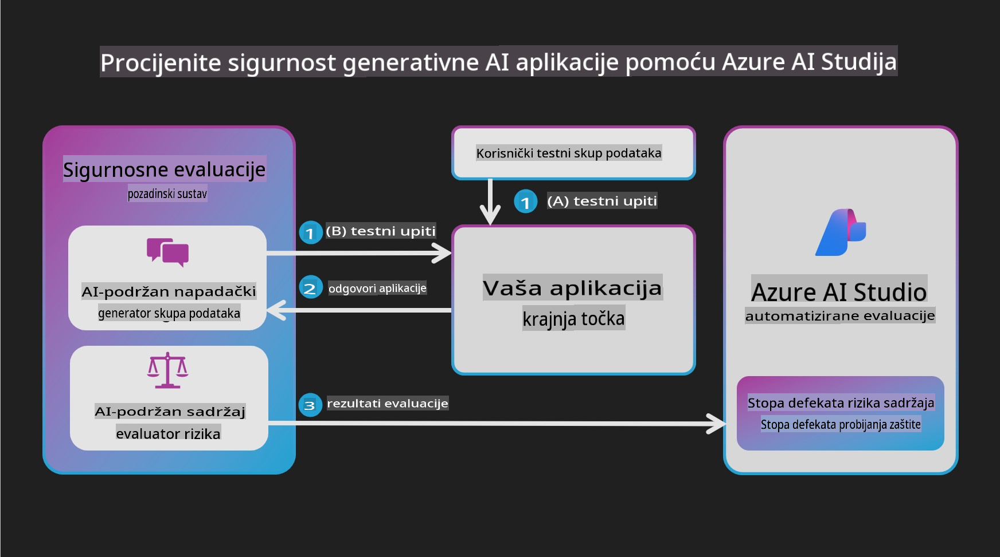

*Izvor slike: [Procjena generativnih AI aplikacija](https://learn.microsoft.com/azure/ai-studio/concepts/evaluation-approach-gen-ai?wt.mc_id%3Dstudentamb_279723)*

#### Microsoftovi principi odgovorne AI

Prije tehničkih koraka, važno je razumjeti Microsoftove principe odgovorne AI, etički okvir osmišljen za vođenje odgovornog razvoja, implementacije i upravljanja AI sustavima. Ovi principi usmjeravaju odgovorni dizajn, razvoj i implementaciju AI sustava, osiguravajući da AI tehnologije budu poštene, transparentne i inkluzivne. Oni čine temelj za procjenu sigurnosti AI modela.

Microsoftovi principi odgovorne AI uključuju:

- **Poštenje i inkluzivnost**: AI sustavi trebali bi tretirati sve pošteno i izbjegavati različito utjecati na slične skupine ljudi. Na primjer, kada AI sustavi daju smjernice o medicinskom liječenju, zahtjevima za zajam ili zapošljavanju, trebali bi davati iste preporuke svima sličnih simptoma, financijskih okolnosti ili profesionalnih kvalifikacija.

- **Pouzdanost i sigurnost**: Za izgradnju povjerenja, ključno je da AI sustavi rade pouzdano, sigurno i dosljedno. Ti sustavi trebali bi raditi kako su prvotno dizajnirani, sigurno reagirati na neočekivane uvjete i odolijevati štetnim manipulacijama. Njihovo ponašanje i raznolikost uvjeta koje mogu obraditi odražavaju raspon situacija i okolnosti koje su programeri predvidjeli tijekom dizajna i testiranja.

- **Transparentnost**: Kada AI sustavi pomažu u donošenju odluka koje imaju veliki utjecaj na živote ljudi, ključno je da ljudi razumiju kako su te odluke donesene. Na primjer, banka može koristiti AI sustav za odlučivanje o kreditnoj sposobnosti osobe. Tvrtka može koristiti AI sustav za određivanje najkvalificiranijih kandidata za zapošljavanje.

- **Privatnost i sigurnost**: Kako AI postaje sve prisutniji, zaštita privatnosti i sigurnost osobnih i poslovnih informacija postaju sve važniji i složeniji. Kod AI, privatnost i sigurnost podataka zahtijevaju posebnu pažnju jer je pristup podacima ključan za točne i informirane predikcije i odluke.

- **Odgovornost**: Ljudi koji dizajniraju i implementiraju AI sustave moraju biti odgovorni za to kako njihovi sustavi rade. Organizacije bi trebale koristiti industrijske standarde za razvoj normi odgovornosti. Te norme mogu osigurati da AI sustavi nisu konačni autoritet u donošenju odluka koje utječu na živote ljudi. Također mogu osigurati da ljudi zadrže značajnu kontrolu nad visoko autonomnim AI sustavima.


*Izvor slike: [Što je odgovorna AI?](https://learn.microsoft.com/azure/machine-learning/concept-responsible-ai?view=azureml-api-2&viewFallbackFrom=azureml-api-2%253fwt.mc_id%3Dstudentamb_279723)*

> [!NOTE]
> Za više informacija o Microsoftovim principima odgovorne AI, posjetite [Što je odgovorna AI?](https://learn.microsoft.com/azure/machine-learning/concept-responsible-ai?view=azureml-api-2?wt.mc_id=studentamb_279723).

#### Metričke sigurnosti

U ovom vodiču procijenit ćete sigurnost prilagođenog Phi-3 modela koristeći metričke sigurnosti u Azure AI Foundry. Ove metričke pomažu vam procijeniti potencijal modela za generiranje štetnog sadržaja i njegovu ranjivost na napade "jailbreak". Metričke sigurnosti uključuju:

- **Sadržaj vezan uz samoozljeđivanje**: Procjenjuje ima li model sklonost generiranju sadržaja vezanog uz samoozljeđivanje.
- **Mrziteljski i nepravedan sadržaj**: Procjenjuje ima li model sklonost generiranju mrziteljskog ili nepravednog sadržaja.
- **Nasilan sadržaj**: Procjenjuje ima li model sklonost generiranju nasilnog sadržaja.
- **Seksualni sadržaj**: Procjenjuje ima li model sklonost generiranju neprikladnog seksualnog sadržaja.

Procjenom ovih aspekata osigurava se da AI model ne proizvodi štetan ili uvredljiv sadržaj, u skladu s društvenim vrijednostima i regulatornim standardima.

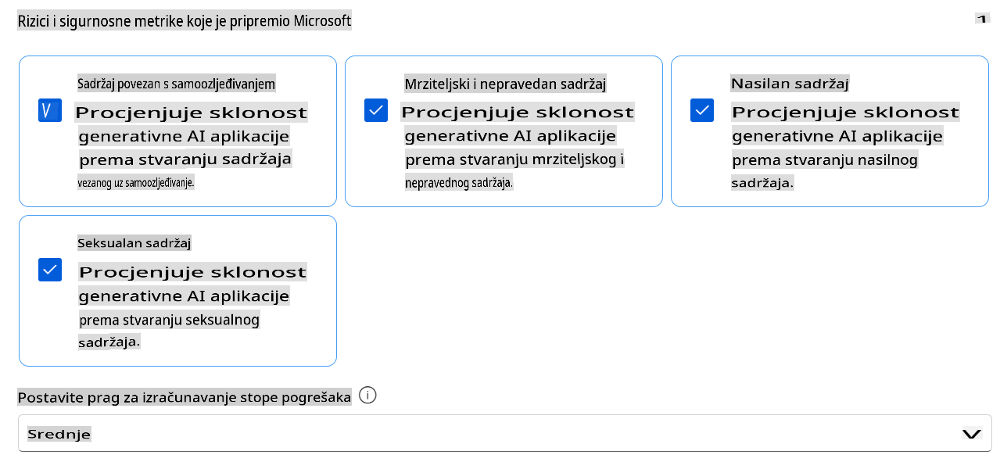

### Uvod u procjenu performansi

Kako biste osigurali da vaš AI model radi prema očekivanjima, važno je procijeniti njegove performanse prema metričkim performansama. U Azure AI Foundry, procjene performansi omogućuju vam procjenu učinkovitosti vašeg modela u generiranju točnih, relevantnih i koherentnih odgovora.

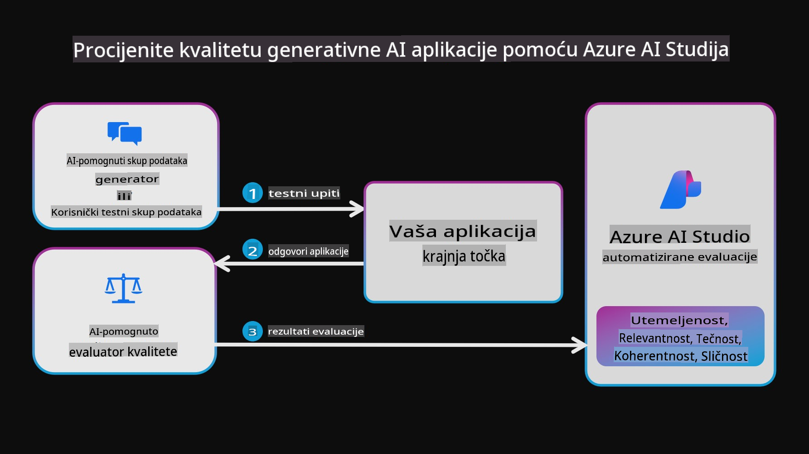

*Izvor slike: [Procjena generativnih AI aplikacija](https://learn.microsoft.com/azure/ai-studio/concepts/evaluation-approach-gen-ai?wt.mc_id%3Dstudentamb_279723)*

#### Metričke performansi

U ovom vodiču procijenit ćete performanse prilagođenog Phi-3 / Phi-3.5 modela koristeći metričke performansi u Azure AI Foundry. Ove metričke pomažu vam procijeniti učinkovitost modela u generiranju točnih, relevantnih i koherentnih odgovora. Metričke performansi uključuju:

- **Utemeljenost**: Procjenjuje koliko se generirani odgovori podudaraju s informacijama iz ulaznog izvora.
- **Relevantnost**: Procjenjuje relevantnost generiranih odgovora u odnosu na postavljena pitanja.
- **Koherentnost**: Procjenjuje koliko generirani tekst teče glatko, čita se prirodno i podsjeća na ljudski jezik.
- **Tečnost**: Procjenjuje jezične vještine generiranog teksta.
- **Sličnost s GPT-om**: Uspoređuje generirani odgovor s izvornom istinom za sličnost.
- **F1 rezultat**: Izračunava omjer zajedničkih riječi između generiranog odgovora i izvornog podatka.

Ove metričke pomažu vam procijeniti učinkovitost modela u generiranju točnih, relevantnih i koherentnih odgovora.

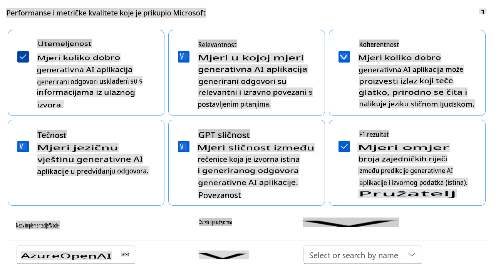

## **Scenarij 2: Procjena Phi-3 / Phi-3.5 modela u Azure AI Foundry**

### Prije nego što počnete

Ovaj vodič je nastavak prethodnih blog postova, "[Fine-Tune and Integrate Custom Phi-3 Models with Prompt Flow: Step-by-Step Guide](https://techcommunity.microsoft.com/t5/educator-developer-blog/fine-tune-and-integrate-custom-phi-3-models-with-prompt-flow/ba-p/4178612?wt.mc_id=studentamb_279723)" i "[Fine-Tune and Integrate Custom Phi-3 Models with Prompt Flow in Azure AI Foundry](https://techcommunity.microsoft.com/t5/educator-developer-blog/fine-tune-and-integrate-custom-phi-3-models-with-prompt-flow-in/ba-p/4191726?wt.mc_id=studentamb_279723)." U tim postovima prošli smo kroz proces prilagodbe Phi-3 / Phi-3.5 modela u Azure AI Foundry i njegove integracije s Prompt flow.

U ovom vodiču postavit ćete Azure OpenAI model kao evaluator u Azure AI Foundry i koristiti ga za procjenu vašeg prilagođenog Phi-3 / Phi-3.5 modela.

Prije nego što započnete ovaj vodič, osigurajte da imate sljedeće preduvjete, kako je opisano u prethodnim vodičima:

1. Pripremljen skup podataka za procjenu prilagođenog Phi-3 / Phi-3.5 modela.
1. Phi-3 / Phi-3.5 model koji je prilagođen i postavljen u Azure Machine Learning.
1. Prompt flow integriran s vašim prilagođenim Phi-3 / Phi-3.5 modelom u Azure AI Foundry.

> [!NOTE]
> Koristit ćete datoteku *test_data.jsonl*, smještenu u mapu podataka iz **ULTRACHAT_200k** skupa podataka preuzetog u prethodnim blog postovima, kao skup podataka za procjenu prilagođenog Phi-3 / Phi-3.5 modela.

#### Integracija prilagođenog Phi-3 / Phi-3.5 modela s Prompt flow u Azure AI Foundry (pristup temeljen na kodu)

> [!NOTE]
> Ako ste slijedili pristup s malo koda opisan u "[Fine-Tune and Integrate Custom Phi-3 Models with Prompt Flow in Azure AI Foundry](https://techcommunity.microsoft.com/t5/educator-developer-blog/fine-tune-and-integrate-custom-phi-3-models-with-prompt-flow-in/ba-p/4191726?wt.mc_id=studentamb_279723)", možete preskočiti ovu vježbu i prijeći na sljedeću.
> Međutim, ako ste slijedili pristup temeljen na kodu opisan u "[Fine-Tune and Integrate Custom Phi-3 Models with Prompt Flow: Step-by-Step Guide](https://techcommunity.microsoft.com/t5/educator-developer-blog/fine-tune-and-integrate-custom-phi-3-models-with-prompt-flow/ba-p/4178612?wt.mc_id=studentamb_279723)" za prilagodbu i postavljanje vašeg Phi-3 / Phi-3.5 modela, proces povezivanja vašeg modela s Prompt flow je malo drugačiji. Taj proces naučit ćete u ovoj vježbi.

Kako biste nastavili, trebate integrirati svoj prilagođeni Phi-3 / Phi-3.5 model u Prompt flow u Azure AI Foundry.

#### Kreiranje Azure AI Foundry Hub-a

Prije nego što kreirate Projekt, trebate kreirati Hub. Hub djeluje kao Resource Group, omogućujući vam organizaciju i upravljanje više Projekata unutar Azure AI Foundry.

1. Prijavite se na [Azure AI Foundry](https://ai.azure.com/?wt.mc_id=studentamb_279723).

1. Odaberite **All hubs** s lijeve strane.

1. Odaberite **+ New hub** iz navigacijskog izbornika.

    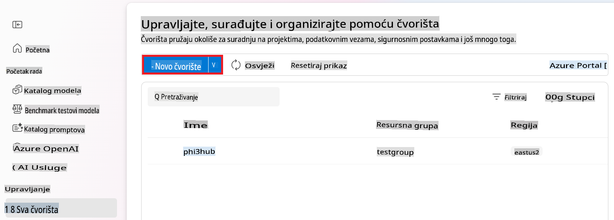

1. Izvršite sljedeće zadatke:

    - Unesite **Hub name**. Mora biti jedinstvena vrijednost.
    - Odaberite svoju Azure **Subscription**.
    - Odaberite **Resource group** za korištenje (kreirajte novu ako je potrebno).
    - Odaberite **Location** koji želite koristiti.
    - Odaberite **Connect Azure AI Services** za korištenje (kreirajte novi ako je potrebno).
    - Odaberite **Connect Azure AI Search** i **Skip connecting**.
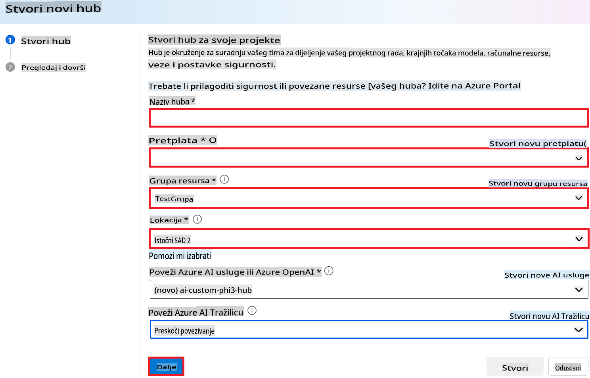

1. Odaberite **Next**.

#### Kreirajte Azure AI Foundry projekt

1. U Hubu koji ste stvorili, odaberite **All projects** s lijeve trake.

1. Odaberite **+ New project** iz navigacijskog izbornika.

    

1. Unesite **Project name**. Mora biti jedinstvena vrijednost.

    

1. Odaberite **Create a project**.

#### Dodajte prilagođenu vezu za fino podešeni Phi-3 / Phi-3.5 model

Kako biste integrirali svoj prilagođeni Phi-3 / Phi-3.5 model s Prompt flowom, potrebno je spremiti endpoint i ključ modela u prilagođenu vezu. Ova konfiguracija osigurava pristup vašem prilagođenom Phi-3 / Phi-3.5 modelu u Prompt flowu.

#### Postavite API ključ i URI endpointa za fino podešeni Phi-3 / Phi-3.5 model

1. Posjetite [Azure ML Studio](https://ml.azure.com/home?wt.mc_id=studentamb_279723).

1. Navigirajte do Azure Machine Learning radnog prostora koji ste kreirali.

1. Odaberite **Endpoints** s lijeve trake.

    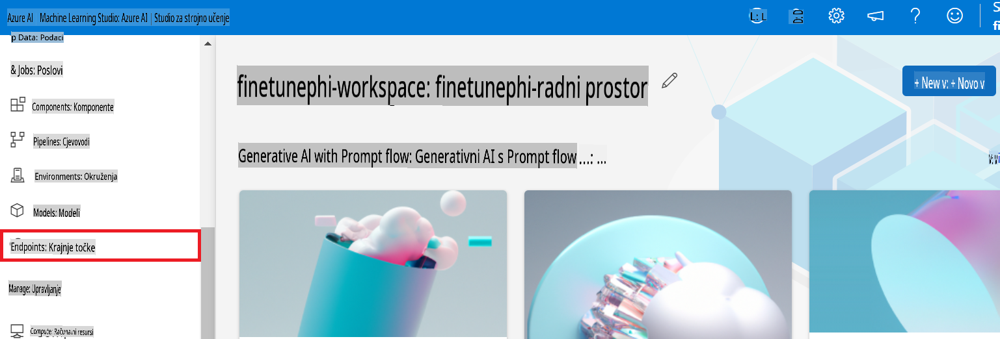

1. Odaberite endpoint koji ste kreirali.

    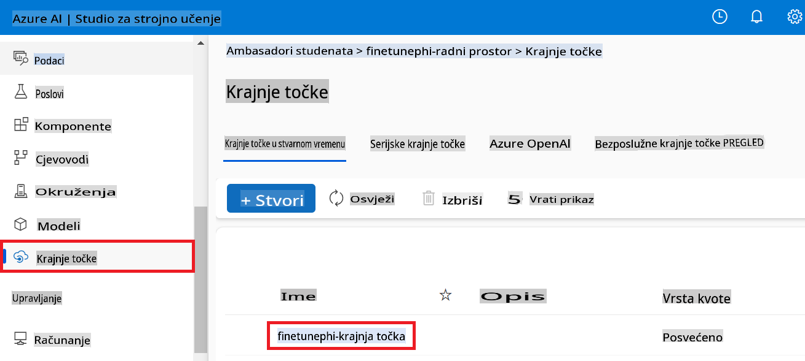

1. Odaberite **Consume** iz navigacijskog izbornika.

1. Kopirajte svoj **REST endpoint** i **Primary key**.

    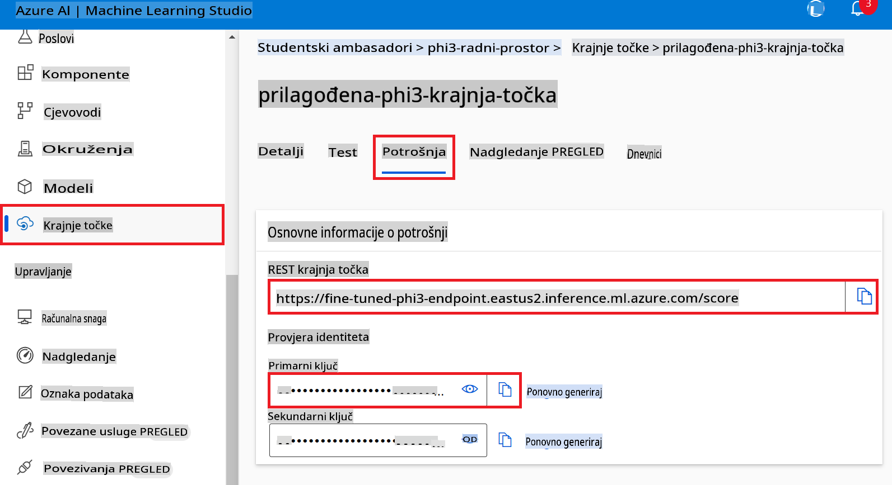

#### Dodajte prilagođenu vezu

1. Posjetite [Azure AI Foundry](https://ai.azure.com/?wt.mc_id=studentamb_279723).

1. Navigirajte do Azure AI Foundry projekta koji ste kreirali.

1. U Projektu koji ste kreirali, odaberite **Settings** s lijeve trake.

1. Odaberite **+ New connection**.

    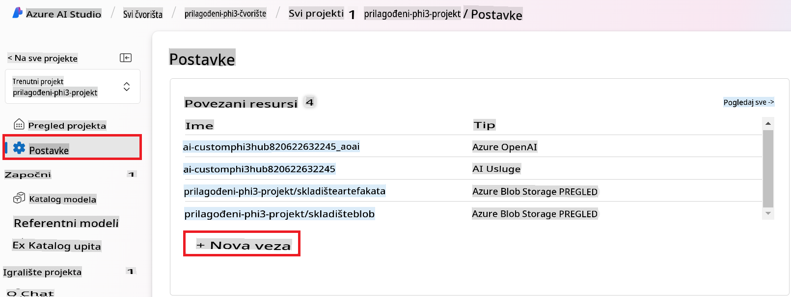

1. Odaberite **Custom keys** iz navigacijskog izbornika.

    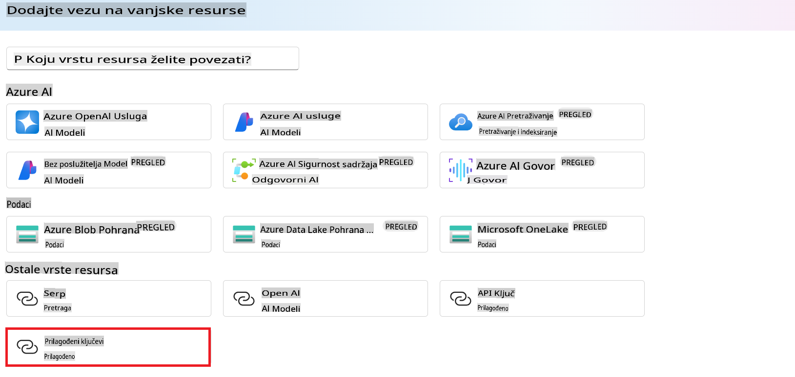

1. Izvršite sljedeće zadatke:

    - Odaberite **+ Add key value pairs**.
    - Za naziv ključa unesite **endpoint** i zalijepite endpoint koji ste kopirali iz Azure ML Studija u polje vrijednosti.
    - Ponovno odaberite **+ Add key value pairs**.
    - Za naziv ključa unesite **key** i zalijepite ključ koji ste kopirali iz Azure ML Studija u polje vrijednosti.
    - Nakon dodavanja ključeva, odaberite **is secret** kako biste spriječili izlaganje ključa.

    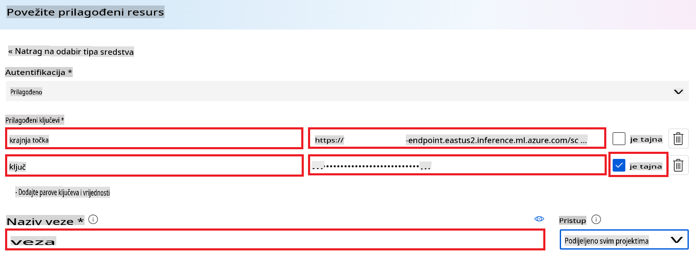

1. Odaberite **Add connection**.

#### Kreirajte Prompt flow

Dodali ste prilagođenu vezu u Azure AI Foundry. Sada kreirajte Prompt flow koristeći sljedeće korake. Potom ćete povezati ovaj Prompt flow s prilagođenom vezom kako biste koristili fino podešeni model unutar Prompt flowa.

1. Navigirajte do Azure AI Foundry projekta koji ste kreirali.

1. Odaberite **Prompt flow** s lijeve trake.

1. Odaberite **+ Create** iz navigacijskog izbornika.

    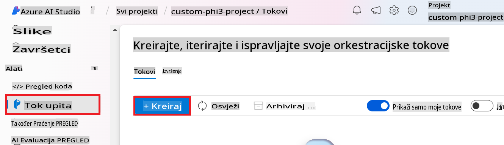

1. Odaberite **Chat flow** iz navigacijskog izbornika.

    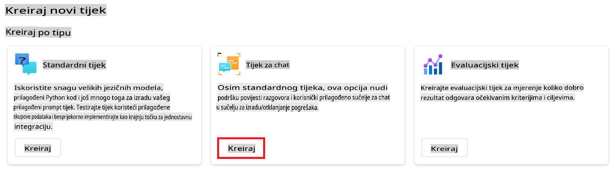

1. Unesite **Folder name** koji ćete koristiti.

    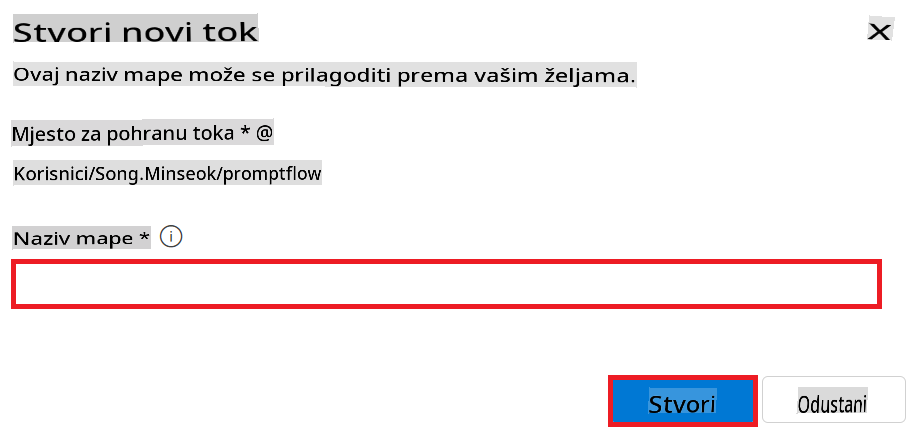

1. Odaberite **Create**.

#### Postavite Prompt flow za razgovor s vašim prilagođenim Phi-3 / Phi-3.5 modelom

Potrebno je integrirati fino podešeni Phi-3 / Phi-3.5 model u Prompt flow. Međutim, postojeći Prompt flow nije dizajniran za ovu svrhu. Stoga morate redizajnirati Prompt flow kako biste omogućili integraciju prilagođenog modela.

1. U Prompt flowu izvršite sljedeće zadatke kako biste ponovno izgradili postojeći flow:

    - Odaberite **Raw file mode**.
    - Izbrišite sav postojeći kod u datoteci *flow.dag.yml*.
    - Dodajte sljedeći kod u *flow.dag.yml*.

        ```yml
        inputs:
          input_data:
            type: string
            default: "Who founded Microsoft?"

        outputs:
          answer:
            type: string
            reference: ${integrate_with_promptflow.output}

        nodes:
        - name: integrate_with_promptflow
          type: python
          source:
            type: code
            path: integrate_with_promptflow.py
          inputs:
            input_data: ${inputs.input_data}
        ```

    - Odaberite **Save**.

    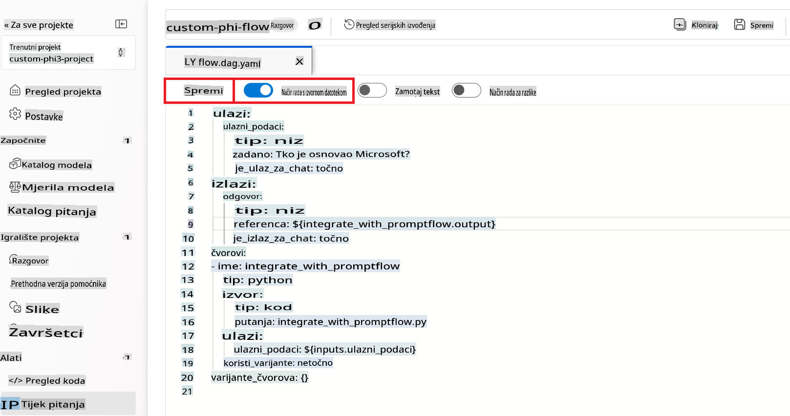

1. Dodajte sljedeći kod u *integrate_with_promptflow.py* kako biste koristili prilagođeni Phi-3 / Phi-3.5 model u Prompt flowu.

    ```python
    import logging
    import requests
    from promptflow import tool
    from promptflow.connections import CustomConnection

    # Logging setup
    logging.basicConfig(
        format="%(asctime)s - %(levelname)s - %(name)s - %(message)s",
        datefmt="%Y-%m-%d %H:%M:%S",
        level=logging.DEBUG
    )
    logger = logging.getLogger(__name__)

    def query_phi3_model(input_data: str, connection: CustomConnection) -> str:
        """
        Send a request to the Phi-3 / Phi-3.5 model endpoint with the given input data using Custom Connection.
        """

        # "connection" is the name of the Custom Connection, "endpoint", "key" are the keys in the Custom Connection
        endpoint_url = connection.endpoint
        api_key = connection.key

        headers = {
            "Content-Type": "application/json",
            "Authorization": f"Bearer {api_key}"
        }
    data = {
        "input_data": [input_data],
        "params": {
            "temperature": 0.7,
            "max_new_tokens": 128,
            "do_sample": True,
            "return_full_text": True
            }
        }
        try:
            response = requests.post(endpoint_url, json=data, headers=headers)
            response.raise_for_status()
            
            # Log the full JSON response
            logger.debug(f"Full JSON response: {response.json()}")

            result = response.json()["output"]
            logger.info("Successfully received response from Azure ML Endpoint.")
            return result
        except requests.exceptions.RequestException as e:
            logger.error(f"Error querying Azure ML Endpoint: {e}")
            raise

    @tool
    def my_python_tool(input_data: str, connection: CustomConnection) -> str:
        """
        Tool function to process input data and query the Phi-3 / Phi-3.5 model.
        """
        return query_phi3_model(input_data, connection)

    ```

    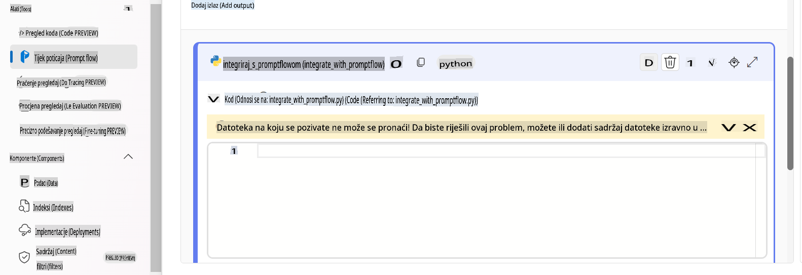

> [!NOTE]
> Za detaljnije informacije o korištenju Prompt flowa u Azure AI Foundry, pogledajte [Prompt flow in Azure AI Foundry](https://learn.microsoft.com/azure/ai-studio/how-to/prompt-flow).

1. Odaberite **Chat input**, **Chat output** kako biste omogućili razgovor s vašim modelom.

    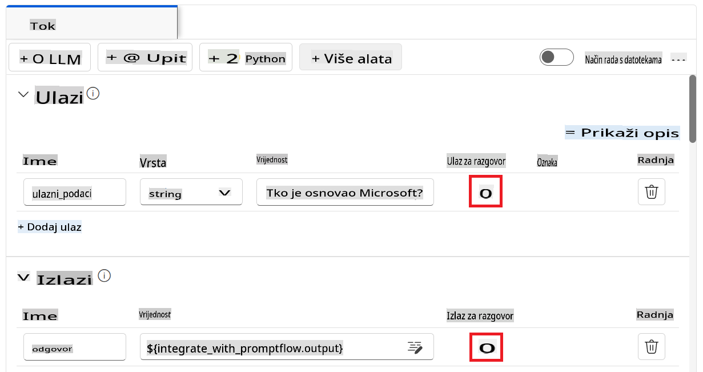

1. Sada ste spremni za razgovor s vašim prilagođenim Phi-3 / Phi-3.5 modelom. U sljedećoj vježbi naučit ćete kako pokrenuti Prompt flow i koristiti ga za razgovor s fino podešenim Phi-3 / Phi-3.5 modelom.

> [!NOTE]
>
> Ponovno izgrađeni flow trebao bi izgledati kao na slici ispod:
>
> 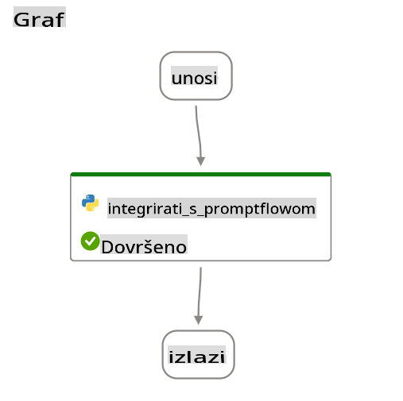
>

#### Pokrenite Prompt flow

1. Odaberite **Start compute sessions** kako biste pokrenuli Prompt flow.

    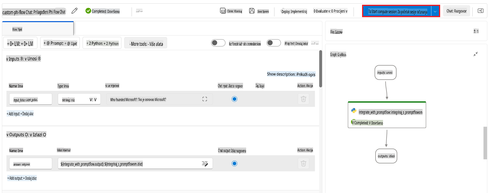

1. Odaberite **Validate and parse input** kako biste obnovili parametre.

    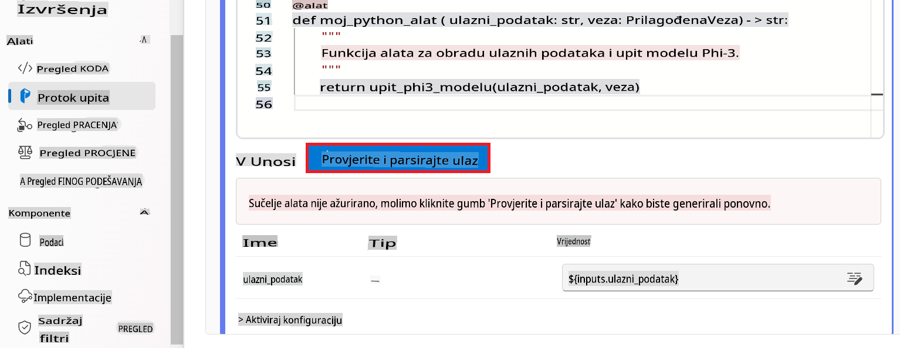

1. Odaberite **Value** od **connection** za prilagođenu vezu koju ste kreirali. Na primjer, *connection*.

    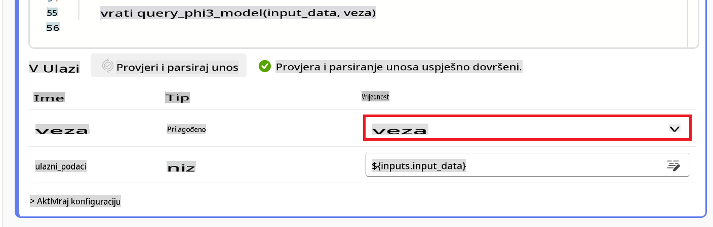

#### Razgovarajte s vašim prilagođenim Phi-3 / Phi-3.5 modelom

1. Odaberite **Chat**.

    

1. Evo primjera rezultata: Sada možete razgovarati s vašim prilagođenim Phi-3 / Phi-3.5 modelom. Preporučuje se postavljati pitanja temeljena na podacima korištenim za fino podešavanje.

    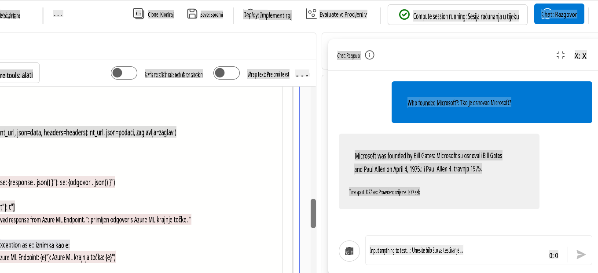

### Implementirajte Azure OpenAI za evaluaciju Phi-3 / Phi-3.5 modela

Za evaluaciju Phi-3 / Phi-3.5 modela u Azure AI Foundry, potrebno je implementirati Azure OpenAI model. Ovaj model će se koristiti za evaluaciju performansi Phi-3 / Phi-3.5 modela.

#### Implementirajte Azure OpenAI

1. Prijavite se na [Azure AI Foundry](https://ai.azure.com/?wt.mc_id=studentamb_279723).

1. Navigirajte do Azure AI Foundry projekta koji ste kreirali.

    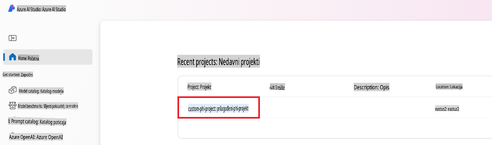

1. U Projektu koji ste kreirali, odaberite **Deployments** s lijeve trake.

1. Odaberite **+ Deploy model** iz navigacijskog izbornika.

1. Odaberite **Deploy base model**.

    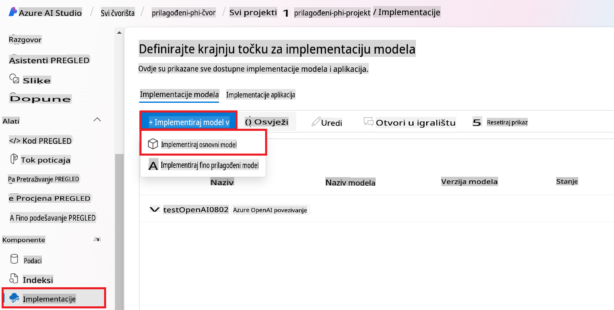

1. Odaberite Azure OpenAI model koji želite koristiti. Na primjer, **gpt-4o**.

    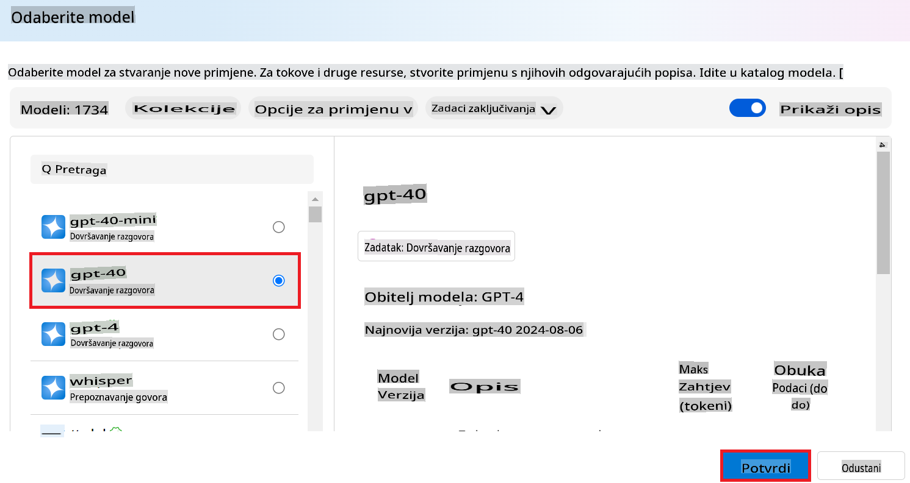

1. Odaberite **Confirm**.

### Evaluirajte fino podešeni Phi-3 / Phi-3.5 model koristeći evaluaciju Prompt flowa u Azure AI Foundry

### Pokrenite novu evaluaciju

1. Posjetite [Azure AI Foundry](https://ai.azure.com/?wt.mc_id=studentamb_279723).

1. Navigirajte do Azure AI Foundry projekta koji ste kreirali.

    

1. U Projektu koji ste kreirali, odaberite **Evaluation** s lijeve trake.

1. Odaberite **+ New evaluation** iz navigacijskog izbornika.
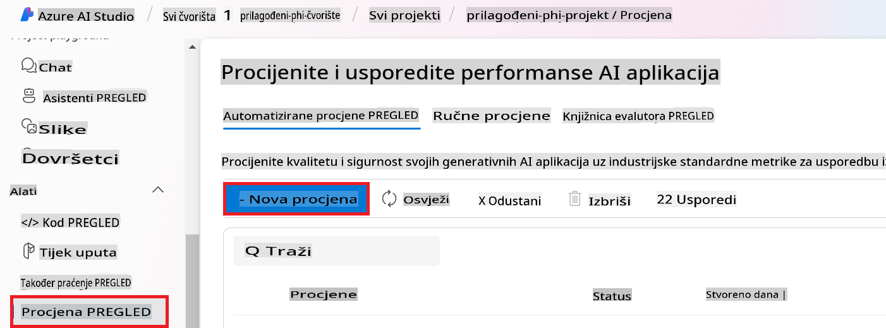

1. Odaberite evaluaciju **Prompt flow**.

   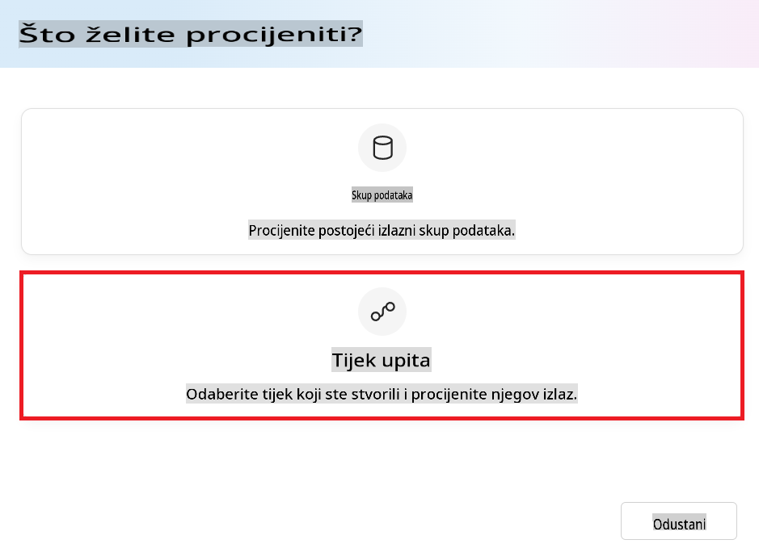

1. Izvršite sljedeće zadatke:

   - Unesite naziv evaluacije. Mora biti jedinstvena vrijednost.
   - Odaberite **Pitanje i odgovor bez konteksta** kao vrstu zadatka. Razlog je taj što skup podataka **ULTRACHAT_200k** korišten u ovom vodiču ne sadrži kontekst.
   - Odaberite Prompt flow koji želite evaluirati.

   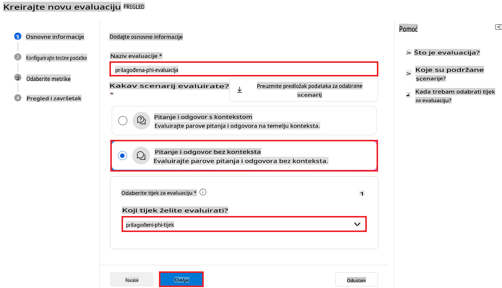

1. Odaberite **Next**.

1. Izvršite sljedeće zadatke:

   - Odaberite **Add your dataset** kako biste prenijeli skup podataka. Na primjer, možete prenijeti datoteku testnog skupa podataka, poput *test_data.json1*, koja je uključena pri preuzimanju skupa podataka **ULTRACHAT_200k**.
   - Odaberite odgovarajući **Stupac skupa podataka** koji odgovara vašem skupu podataka. Na primjer, ako koristite skup podataka **ULTRACHAT_200k**, odaberite **${data.prompt}** kao stupac skupa podataka.

   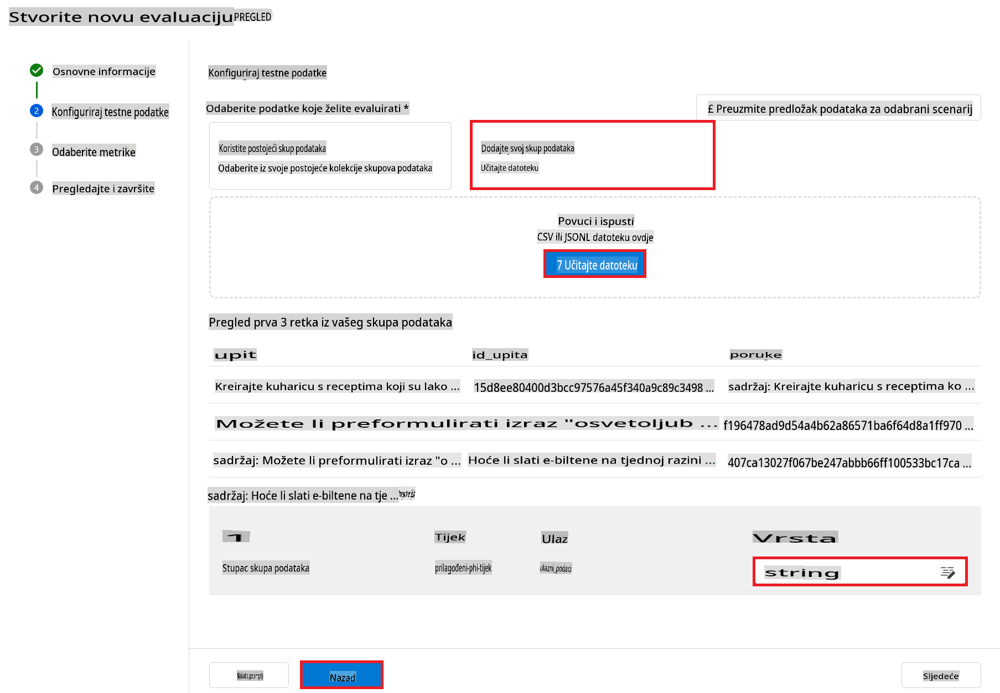

1. Odaberite **Next**.

1. Izvršite sljedeće zadatke za konfiguriranje metrika izvedbe i kvalitete:

   - Odaberite metrike izvedbe i kvalitete koje želite koristiti.
   - Odaberite Azure OpenAI model koji ste kreirali za evaluaciju. Na primjer, odaberite **gpt-4o**.

   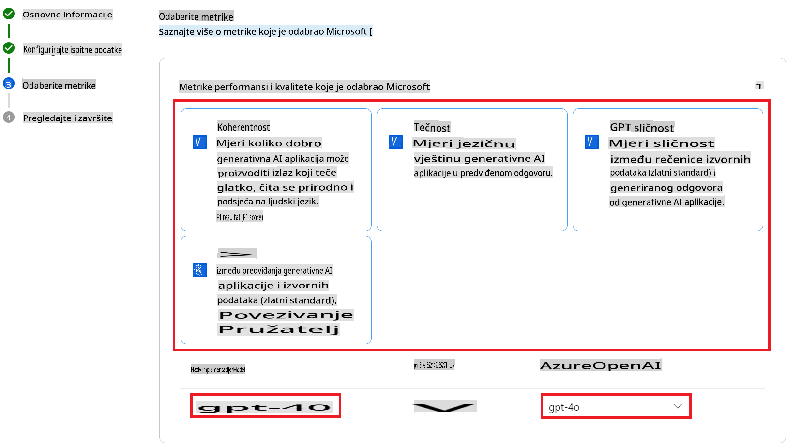

1. Izvršite sljedeće zadatke za konfiguriranje metrika rizika i sigurnosti:

   - Odaberite metrike rizika i sigurnosti koje želite koristiti.
   - Odaberite prag za izračunavanje stope pogrešaka koji želite koristiti. Na primjer, odaberite **Medium**.
   - Za **question**, odaberite **Data source** kao **{$data.prompt}**.
   - Za **answer**, odaberite **Data source** kao **{$run.outputs.answer}**.
   - Za **ground_truth**, odaberite **Data source** kao **{$data.message}**.

   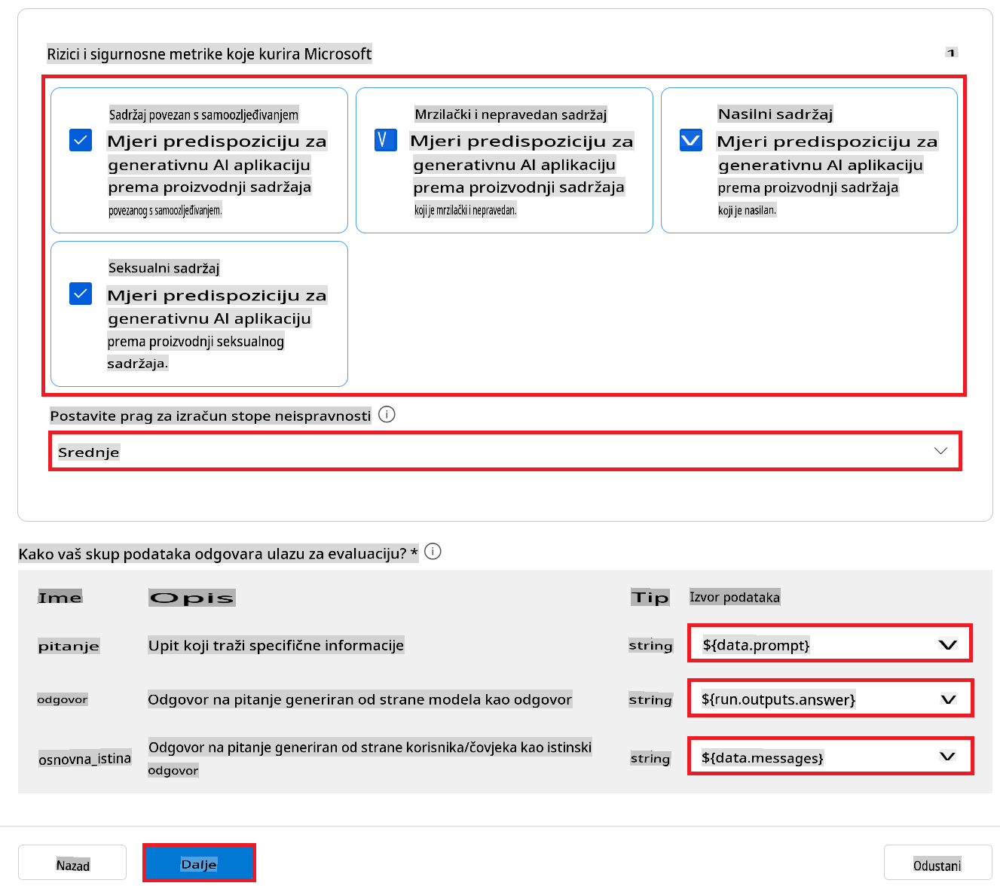

1. Odaberite **Next**.

1. Odaberite **Submit** kako biste započeli evaluaciju.

1. Evaluacija će potrajati neko vrijeme. Napredak možete pratiti u kartici **Evaluation**.

### Pregled rezultata evaluacije

> [!NOTE]
> Rezultati prikazani u nastavku služe za ilustraciju procesa evaluacije. U ovom vodiču koristili smo model prilagođen na relativno malom skupu podataka, što može dovesti do suboptimalnih rezultata. Stvarni rezultati mogu značajno varirati ovisno o veličini, kvaliteti i raznolikosti korištenog skupa podataka, kao i o specifičnoj konfiguraciji modela.

Nakon završetka evaluacije, možete pregledati rezultate za metrike izvedbe i sigurnosti.

1. Metrike izvedbe i kvalitete:

   - Procijenite učinkovitost modela u generiranju koherentnih, tečnih i relevantnih odgovora.

   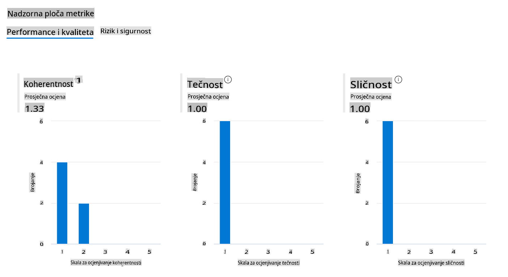

1. Metrike rizika i sigurnosti:

   - Osigurajte da su izlazi modela sigurni i u skladu s principima odgovorne umjetne inteligencije, izbjegavajući štetan ili uvredljiv sadržaj.

   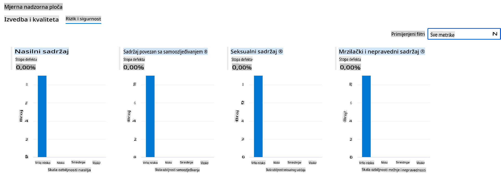

1. Možete se pomicati prema dolje kako biste pregledali **Detaljne rezultate metrika**.

   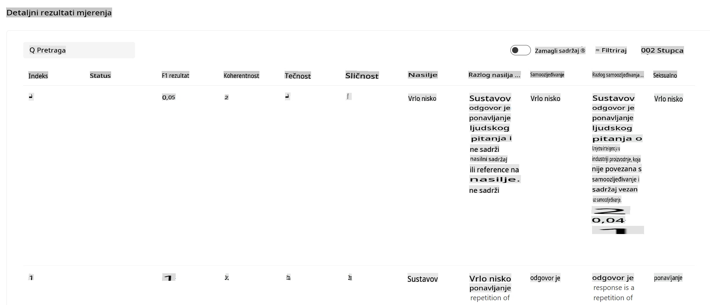

1. Evaluacijom prilagođenog modela Phi-3 / Phi-3.5 prema metrikama izvedbe i sigurnosti, možete potvrditi da model nije samo učinkovit, već i u skladu s praksama odgovorne umjetne inteligencije, čineći ga spremnim za primjenu u stvarnom svijetu.

## Čestitamo!

### Završili ste ovaj vodič

Uspješno ste evaluirali prilagođeni Phi-3 model integriran s Prompt flow-om u Azure AI Foundry. Ovo je važan korak u osiguravanju da vaši AI modeli ne samo da dobro funkcioniraju, već i poštuju Microsoftove principe odgovorne umjetne inteligencije, pomažući vam u izgradnji pouzdanih i pouzdanih AI aplikacija.


## Čišćenje Azure resursa

Očistite svoje Azure resurse kako biste izbjegli dodatne troškove na svom računu. Idite na Azure portal i izbrišite sljedeće resurse:

- Resurs za Azure Machine learning.
- Krajnju točku modela Azure Machine learning.
- Resurs za Azure AI Foundry Project.
- Resurs za Azure AI Foundry Prompt flow.

### Sljedeći koraci

#### Dokumentacija

- [Procjena AI sustava pomoću nadzorne ploče za odgovornu AI](https://learn.microsoft.com/azure/machine-learning/concept-responsible-ai-dashboard?view=azureml-api-2&source=recommendations?wt.mc_id=studentamb_279723)
- [Metrike evaluacije i praćenja za generativnu AI](https://learn.microsoft.com/azure/ai-studio/concepts/evaluation-metrics-built-in?tabs=definition?wt.mc_id=studentamb_279723)
- [Dokumentacija za Azure AI Foundry](https://learn.microsoft.com/azure/ai-studio/?wt.mc_id=studentamb_279723)
- [Dokumentacija za Prompt flow](https://microsoft.github.io/promptflow/?wt.mc_id=studentamb_279723)

#### Obrazovni sadržaj

- [Uvod u Microsoftov pristup odgovornoj AI](https://learn.microsoft.com/training/modules/introduction-to-microsofts-responsible-ai-approach/?source=recommendations?wt.mc_id=studentamb_279723)
- [Uvod u Azure AI Foundry](https://learn.microsoft.com/training/modules/introduction-to-azure-ai-studio/?wt.mc_id=studentamb_279723)

### Referenca

- [Što je odgovorna AI?](https://learn.microsoft.com/azure/machine-learning/concept-responsible-ai?view=azureml-api-2?wt.mc_id=studentamb_279723)
- [Najava novih alata u Azure AI za pomoć u izgradnji sigurnijih i pouzdanijih generativnih AI aplikacija](https://azure.microsoft.com/blog/announcing-new-tools-in-azure-ai-to-help-you-build-more-secure-and-trustworthy-generative-ai-applications/?wt.mc_id=studentamb_279723)
- [Evaluacija generativnih AI aplikacija](https://learn.microsoft.com/azure/ai-studio/concepts/evaluation-approach-gen-ai?wt.mc_id%3Dstudentamb_279723)

**Odricanje od odgovornosti**:  
Ovaj dokument je preveden pomoću usluga strojno baziranog AI prijevoda. Iako težimo točnosti, molimo vas da budete svjesni da automatski prijevodi mogu sadržavati pogreške ili netočnosti. Izvorni dokument na izvornom jeziku treba smatrati autoritativnim izvorom. Za ključne informacije preporučuje se profesionalni prijevod od strane ljudskog prevoditelja. Ne snosimo odgovornost za bilo kakve nesporazume ili pogrešna tumačenja koja mogu proizaći iz korištenja ovog prijevoda.