# Fino podešavanje i integracija prilagođenih Phi-3 modela s Prompt flow

Ovaj krajnji do kraja (E2E) primjer temelji se na vodiču "[Fine-Tune and Integrate Custom Phi-3 Models with Prompt Flow: Step-by-Step Guide](https://techcommunity.microsoft.com/t5/educator-developer-blog/fine-tune-and-integrate-custom-phi-3-models-with-prompt-flow/ba-p/4178612?WT.mc_id=aiml-137032-kinfeylo)" iz Microsoft Tech Community. U njemu su objašnjeni procesi fino podešavanja, implementacije i integracije prilagođenih Phi-3 modela s Prompt flow.

## Pregled

U ovom E2E primjeru naučit ćete kako fino podesiti Phi-3 model i integrirati ga s Prompt flow. Iskorištavanjem Azure Machine Learninga i Prompt flow-a, uspostavit ćete tijek rada za implementaciju i korištenje prilagođenih AI modela. Ovaj E2E primjer podijeljen je u tri scenarija:

**Scenarij 1: Postavljanje Azure resursa i priprema za fino podešavanje**

**Scenarij 2: Fino podešavanje Phi-3 modela i implementacija u Azure Machine Learning Studio**

**Scenarij 3: Integracija s Prompt flow i interakcija s prilagođenim modelom**

Ovdje je pregled ovog E2E primjera.

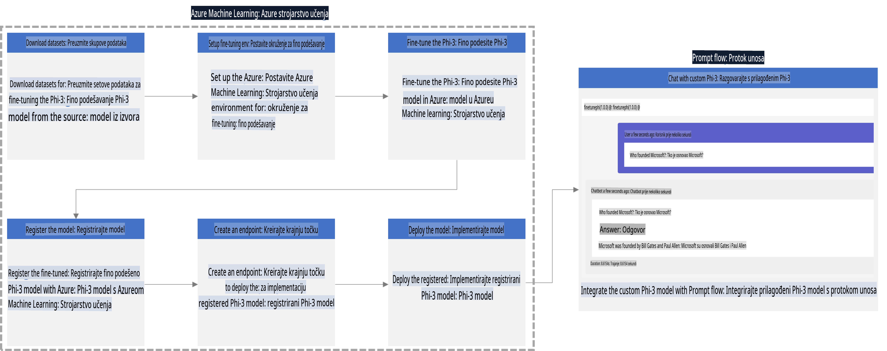

### Sadržaj

1. **[Scenarij 1: Postavljanje Azure resursa i priprema za fino podešavanje](../../../../../../md/02.Application/01.TextAndChat/Phi3)**
    - [Kreiranje Azure Machine Learning radnog prostora](../../../../../../md/02.Application/01.TextAndChat/Phi3)
    - [Zahtjev za GPU kvotama u Azure pretplati](../../../../../../md/02.Application/01.TextAndChat/Phi3)
    - [Dodavanje uloga](../../../../../../md/02.Application/01.TextAndChat/Phi3)
    - [Postavljanje projekta](../../../../../../md/02.Application/01.TextAndChat/Phi3)
    - [Priprema skupa podataka za fino podešavanje](../../../../../../md/02.Application/01.TextAndChat/Phi3)

1. **[Scenarij 2: Fino podešavanje Phi-3 modela i implementacija u Azure Machine Learning Studio](../../../../../../md/02.Application/01.TextAndChat/Phi3)**
    - [Postavljanje Azure CLI](../../../../../../md/02.Application/01.TextAndChat/Phi3)
    - [Fino podešavanje Phi-3 modela](../../../../../../md/02.Application/01.TextAndChat/Phi3)
    - [Implementacija fino podešenog modela](../../../../../../md/02.Application/01.TextAndChat/Phi3)

1. **[Scenarij 3: Integracija s Prompt flow i interakcija s prilagođenim modelom](../../../../../../md/02.Application/01.TextAndChat/Phi3)**
    - [Integracija prilagođenog Phi-3 modela s Prompt flow](../../../../../../md/02.Application/01.TextAndChat/Phi3)
    - [Interakcija s vašim prilagođenim modelom](../../../../../../md/02.Application/01.TextAndChat/Phi3)

## Scenarij 1: Postavljanje Azure resursa i priprema za fino podešavanje

### Kreiranje Azure Machine Learning radnog prostora

1. Upišite *azure machine learning* u **traku za pretraživanje** na vrhu stranice portala i odaberite **Azure Machine Learning** iz prikazanih opcija.

    

1. Odaberite **+ Create** iz navigacijskog izbornika.

1. Odaberite **New workspace** iz navigacijskog izbornika.

    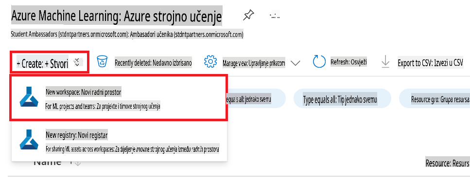

1. Obavite sljedeće zadatke:

    - Odaberite svoju Azure **Subscription**.
    - Odaberite **Resource group** za korištenje (kreirajte novu ako je potrebno).
    - Unesite **Workspace Name**. Vrijednost mora biti jedinstvena.
    - Odaberite **Region** koji želite koristiti.
    - Odaberite **Storage account** za korištenje (kreirajte novi ako je potrebno).
    - Odaberite **Key vault** za korištenje (kreirajte novi ako je potrebno).
    - Odaberite **Application insights** za korištenje (kreirajte novi ako je potrebno).
    - Odaberite **Container registry** za korištenje (kreirajte novi ako je potrebno).

    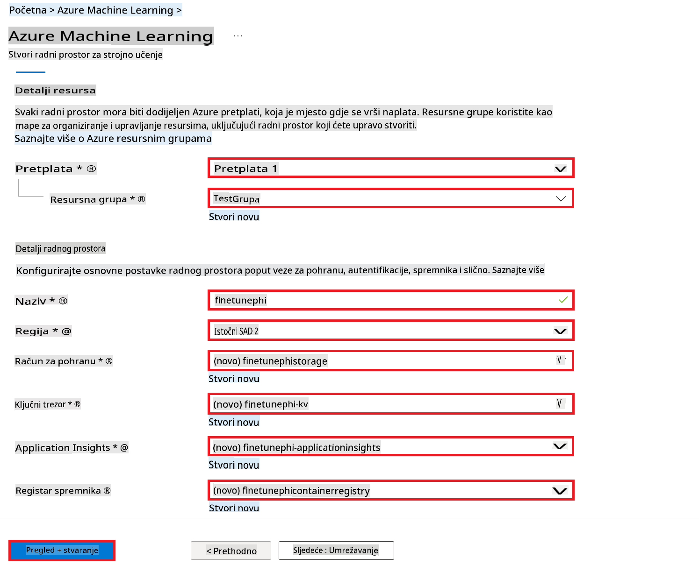

1. Odaberite **Review + Create**.

1. Odaberite **Create**.

### Zahtjev za GPU kvotama u Azure pretplati

U ovom E2E primjeru koristit ćete *Standard_NC24ads_A100_v4 GPU* za fino podešavanje, što zahtijeva zahtjev za kvotom, te *Standard_E4s_v3* CPU za implementaciju, što ne zahtijeva zahtjev za kvotom.

> [!NOTE]
>
> Samo Pay-As-You-Go pretplate (standardni tip pretplate) ispunjavaju uvjete za GPU alokaciju; pretplate s beneficijama trenutno nisu podržane.
>
> Za one koji koriste pretplate s beneficijama (kao što je Visual Studio Enterprise pretplata) ili one koji žele brzo testirati proces fino podešavanja i implementacije, ovaj vodič također pruža upute za fino podešavanje s minimalnim skupom podataka koristeći CPU. Međutim, važno je napomenuti da su rezultati fino podešavanja značajno bolji kada se koristi GPU s većim skupovima podataka.

1. Posjetite [Azure ML Studio](https://ml.azure.com/home?wt.mc_id=studentamb_279723).

1. Obavite sljedeće zadatke za zahtjev kvote za *Standard NCADSA100v4 Family*:

    - Odaberite **Quota** iz lijevog navigacijskog izbornika.
    - Odaberite **Virtual machine family** za korištenje. Na primjer, odaberite **Standard NCADSA100v4 Family Cluster Dedicated vCPUs**, koji uključuje *Standard_NC24ads_A100_v4* GPU.
    - Odaberite **Request quota** iz navigacijskog izbornika.

        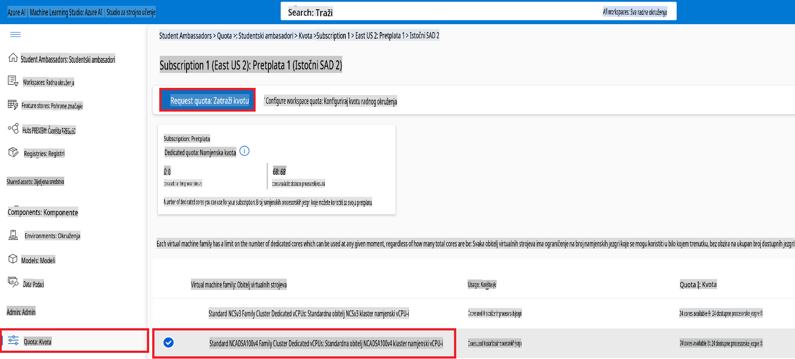

    - Na stranici Request quota unesite **New cores limit** koji želite koristiti. Na primjer, 24.
    - Na stranici Request quota odaberite **Submit** za zahtjev GPU kvote.

> [!NOTE]
> Možete odabrati odgovarajući GPU ili CPU prema vašim potrebama upućujući se na dokument [Sizes for Virtual Machines in Azure](https://learn.microsoft.com/azure/virtual-machines/sizes/overview?tabs=breakdownseries%2Cgeneralsizelist%2Ccomputesizelist%2Cmemorysizelist%2Cstoragesizelist%2Cgpusizelist%2Cfpgasizelist%2Chpcsizelist).

### Dodavanje uloga

Za fino podešavanje i implementaciju vaših modela, prvo morate kreirati User Assigned Managed Identity (UAI) i dodijeliti joj odgovarajuće dozvole. Ova UAI će se koristiti za autentifikaciju tijekom implementacije.

#### Kreiranje User Assigned Managed Identity (UAI)

1. Upišite *managed identities* u **traku za pretraživanje** na vrhu stranice portala i odaberite **Managed Identities** iz prikazanih opcija.

    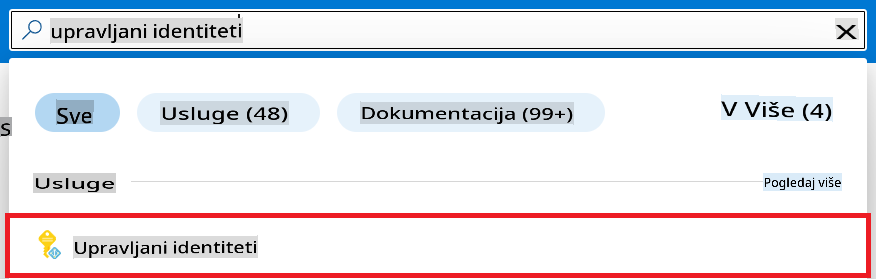

1. Odaberite **+ Create**.

    

1. Obavite sljedeće zadatke:

    - Odaberite svoju Azure **Subscription**.
    - Odaberite **Resource group** za korištenje (kreirajte novu ako je potrebno).
    - Odaberite **Region** koji želite koristiti.
    - Unesite **Name**. Vrijednost mora biti jedinstvena.

1. Odaberite **Review + create**.

1. Odaberite **+ Create**.

#### Dodavanje Contributor uloge za Managed Identity

1. Navigirajte do resursa Managed Identity koji ste kreirali.

1. Odaberite **Azure role assignments** iz lijevog navigacijskog izbornika.

1. Odaberite **+Add role assignment** iz navigacijskog izbornika.

1. Na stranici Add role assignment obavite sljedeće zadatke:
    - Odaberite **Scope** na **Resource group**.
    - Odaberite svoju Azure **Subscription**.
    - Odaberite **Resource group** za korištenje.
    - Odaberite **Role** na **Contributor**.

    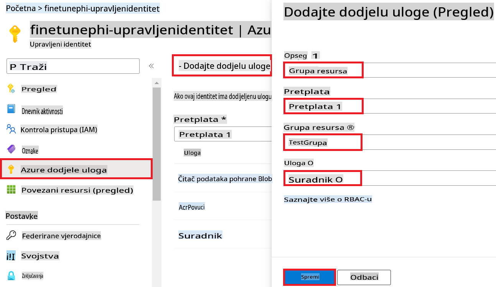

1. Odaberite **Save**.

#### Dodavanje Storage Blob Data Reader uloge za Managed Identity

1. Upišite *storage accounts* u **traku za pretraživanje** na vrhu stranice portala i odaberite **Storage accounts** iz prikazanih opcija.

    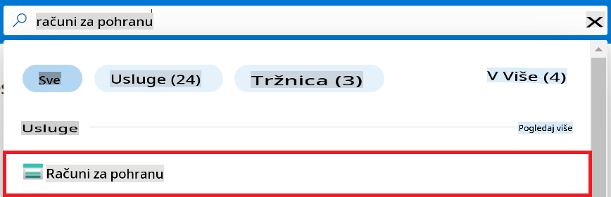

1. Odaberite storage račun povezan s Azure Machine Learning radnim prostorom koji ste kreirali. Na primjer, *finetunephistorage*.

1. Obavite sljedeće zadatke za navigaciju na stranicu Add role assignment:

    - Navigirajte do Azure Storage računa koji ste kreirali.
    - Odaberite **Access Control (IAM)** iz lijevog navigacijskog izbornika.
    - Odaberite **+ Add** iz navigacijskog izbornika.
    - Odaberite **Add role assignment** iz navigacijskog izbornika.

    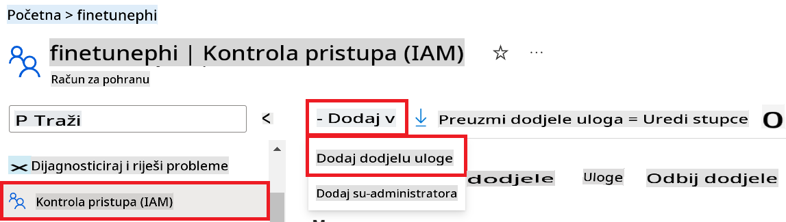

1. Na stranici Add role assignment obavite sljedeće zadatke:

    - Na stranici Role upišite *Storage Blob Data Reader* u **traku za pretraživanje** i odaberite **Storage Blob Data Reader** iz prikazanih opcija.
    - Na stranici Role odaberite **Next**.
    - Na stranici Members odaberite **Assign access to** **Managed identity**.
    - Na stranici Members odaberite **+ Select members**.
    - Na stranici Select managed identities odaberite svoju Azure **Subscription**.
    - Na stranici Select managed identities odaberite **Managed identity** na **Manage Identity**.
    - Na stranici Select managed identities odaberite Managed Identity koji ste kreirali. Na primjer, *finetunephi-managedidentity*.
    - Na stranici Select managed identities odaberite **Select**.

    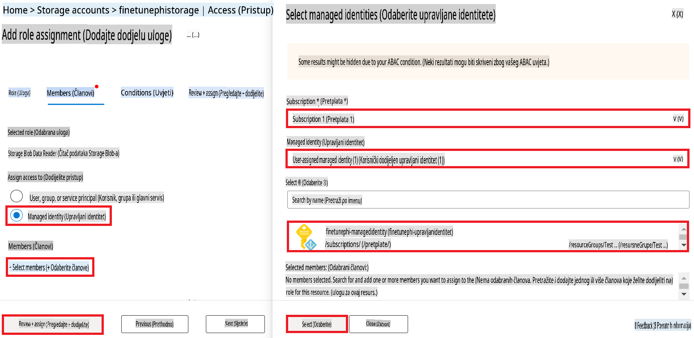

1. Odaberite **Review + assign**.

#### Dodavanje AcrPull uloge za Managed Identity

1. Upišite *container registries* u **traku za pretraživanje** na vrhu stranice portala i odaberite **Container registries** iz prikazanih opcija.

    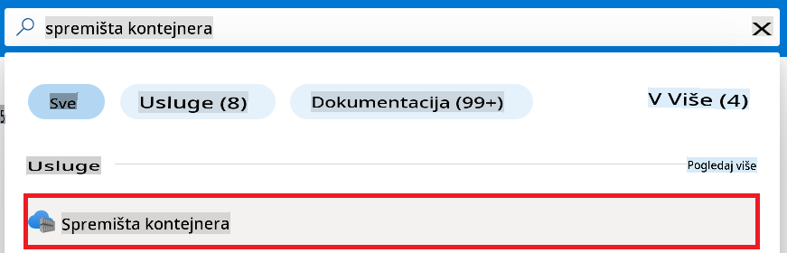

1. Odaberite container registry povezan s Azure Machine Learning radnim prostorom. Na primjer, *finetunephicontainerregistries*.

1. Obavite sljedeće zadatke za navigaciju na stranicu Add role assignment:

    - Odaberite **Access Control (IAM)** iz lijevog navigacijskog izbornika.
    - Odaberite **+ Add** iz navigacijskog izbornika.
    - Odaberite **Add role assignment** iz navigacijskog izbornika.

1. Na stranici Add role assignment obavite sljedeće zadatke:

    - Na stranici Role upišite *AcrPull* u **traku za pretraživanje** i odaberite **AcrPull** iz prikazanih opcija.
    - Na stranici Role odaberite **Next**.
    - Na stranici Members odaberite **Assign access to** **Managed identity**.
    - Na stranici Members odaberite **+ Select members**.
    - Na stranici Select managed identities odaberite svoju Azure **Subscription**.
    - Na stranici Select managed identities odaberite **Managed identity** na **Manage Identity**.
    - Na stranici Select managed identities odaberite Managed Identity koji ste kreirali. Na primjer, *finetunephi-managedidentity*.
    - Na stranici Select managed identities odaberite **Select**.
    - Odaberite **Review + assign**.

### Postavljanje projekta

Sada ćete kreirati mapu za rad i postaviti virtualno okruženje za razvoj programa koji komunicira s korisnicima i koristi povijest razgovora pohranjenu u Azure Cosmos DB za informiranje svojih odgovora.

#### Kreiranje mape za rad

1. Otvorite terminal i upišite sljedeću naredbu kako biste kreirali mapu pod nazivom *finetune-phi* na zadanoj lokaciji.

    ```console
    mkdir finetune-phi
    ```

1. Upišite sljedeću naredbu u terminalu kako biste navigirali do mape *finetune-phi* koju ste kreirali.

    ```console
    cd finetune-phi
    ```

#### Kreiranje virtualnog okruženja

1. Upišite sljedeću naredbu u terminalu kako biste kreirali virtualno okruženje pod nazivom *.venv*.

    ```console
    python -m venv .venv
    ```

1. Upišite sljedeću naredbu u terminalu kako biste aktivirali virtualno okruženje.

    ```console
    .venv\Scripts\activate.bat
    ```

> [!NOTE]
>
> Ako je uspjelo, trebali biste vidjeti *(.venv)* prije naredbenog retka.

#### Instalacija potrebnih paketa

1. Upišite sljedeće naredbe u terminalu kako biste instalirali potrebne pakete.

    ```console
    pip install datasets==2.19.1
    pip install transformers==4.41.1
    pip install azure-ai-ml==1.16.0
    pip install torch==2.3.1
    pip install trl==0.9.4
    pip install promptflow==1.12.0
    ```

#### Kreiranje projektnih datoteka

U ovoj vježbi kreirat ćete osnovne datoteke za naš projekt. Ove datoteke uključuju skripte za preuzimanje skupa podataka, postavljanje Azure Machine Learning okruženja, fino podešavanje Phi-3 modela i implementaciju fino podešenog modela. Također ćete kreirati datoteku *conda.yml* za postavljanje okruženja za fino podešavanje.

U ovoj vježbi ćete:

- Kreirati datoteku *download_dataset.py* za preuzimanje skupa podataka.
- Kreirati datoteku *setup_ml.py* za postavljanje Azure Machine Learning okruženja.
- Kreirati datoteku *fine_tune.py* u mapi *finetuning_dir* za fino podešavanje Phi-3 modela koristeći skup podataka.
- Kreirati datoteku *conda.yml* za postavljanje okruženja za fino podešavanje.
- Kreirati datoteku *deploy_model.py* za implementaciju fino podešenog modela.
- Kreirati datoteku *integrate_with_promptflow.py* za integraciju fino podešenog modela i izvršavanje modela koristeći Prompt flow.
- Kreirati datoteku *flow.dag.yml* za postavljanje strukture tijeka rada za Prompt flow.
- Kreirati datoteku *config.py* za unos Azure informacija.

> [!NOTE]
>
> Kompletna struktura mape:
>
> ```text
> └── YourUserName
> .    └── finetune-phi
> .        ├── finetuning_dir
> .        │      └── fine_tune.py
> .        ├── conda.yml
> .        ├── config.py
> .        ├── deploy_model.py
> .        ├── download_dataset.py
> .        ├── flow.dag.yml
> .        ├── integrate_with_promptflow.py
> .        └── setup_ml.py
> ```

1. Otvorite **Visual Studio Code**.

1. Odaberite **File** iz izbornika.

1. Odaberite **Open Folder**.

1. Odaberite mapu *finetune-phi* koju ste kreirali, koja se nalazi na *C:\Users\yourUserName\finetune-phi*.

    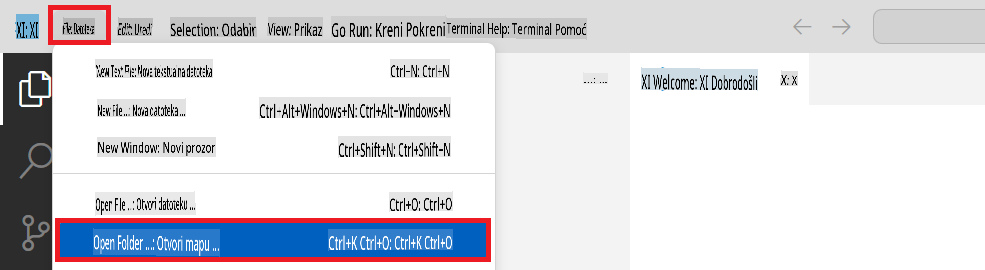

1. U lijevom dijelu Visual Studio Code-a, desnim klikom odaberite **New File** kako biste kreirali novu datoteku pod nazivom *download_dataset.py*.

1. U lijevom dijelu Visual Studio Code-a, desnim klikom odaberite **New File** kako biste kreirali novu datoteku pod nazivom *setup_ml.py*.

1. U lijevom dijelu Visual Studio Code-a, desnim klikom odaberite **New File** kako biste kreirali novu datoteku pod nazivom *deploy_model.py*.

    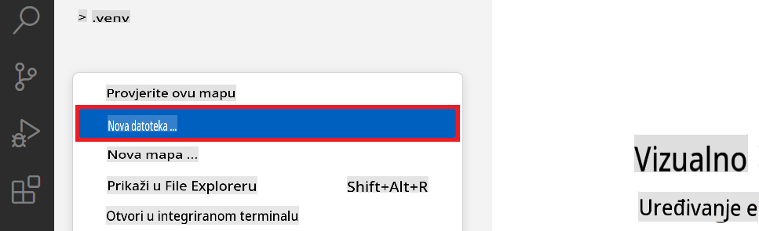

1. U lijevom dijelu Visual Studio Code-a, desnim klikom odaberite **New Folder** kako biste kreirali novu mapu pod nazivom *finetuning_dir*.

1. U mapi *finetuning_dir* kreirajte novu datoteku pod nazivom *fine_tune.py*.

#### Kreiranje i konfiguriranje datoteke *conda.yml*

1. U lijevom dijelu Visual Studio Code-a, desnim klikom odaberite **New File** kako biste kreirali novu datoteku pod nazivom *conda.yml*.

1. Dodajte sljedeći kod u datoteku *conda.yml* kako biste postavili okruženje za fino podešavanje za Phi-3 model.

    ```yml
    name: phi-3-training-env
    channels:
      - defaults
      - conda-forge
    dependencies:
      - python=3.10
      - pip
      - numpy<2.0
      - pip:
          - torch==2.4.0
          - torchvision==0.19.0
          - trl==0.8.6
          - transformers==4.41
          - datasets==2.21.0
          - azureml-core==1.57.0
          - azure-storage-blob==12.19.0
          - azure-ai-ml==1.16
          - azure-identity==1.17.1
          - accelerate==0.33.0
          - mlflow==2.15.1
          - azureml-mlflow==1.57.0
    ```

#### Kreiranje i konfiguriranje datoteke *config.py*

1. U lijevom dijelu Visual Studio Code-a, desnim klikom odaberite **New File** kako biste kreirali novu datoteku pod nazivom *config.py*.

1. Dodajte sljedeći kod u datoteku *config.py* kako biste uključili svoje Azure informacije.

    ```python
    # Azure settings
    AZURE_SUBSCRIPTION_ID = "your_subscription_id"
    AZURE_RESOURCE_GROUP_NAME = "your_resource_group_name" # "TestGroup"

    # Azure Machine Learning settings
    AZURE_ML_WORKSPACE_NAME = "your_workspace_name" # "finetunephi-workspace"

    # Azure Managed Identity settings
    AZURE_MANAGED_IDENTITY_CLIENT_ID = "your_azure_managed_identity_client_id"
    AZURE_MANAGED_IDENTITY_NAME = "your_azure_managed_identity_name" # "finetunephi-mangedidentity"
    AZURE_MANAGED_IDENTITY_RESOURCE_ID = f"/subscriptions/{AZURE_SUBSCRIPTION_ID}/resourceGroups/{AZURE_RESOURCE_GROUP_NAME}/providers/Microsoft.ManagedIdentity/userAssignedIdentities/{AZURE_MANAGED_IDENTITY_NAME}"

    # Dataset file paths
    TRAIN_DATA_PATH = "data/train_data.jsonl"
    TEST_DATA_PATH = "data/test_data.jsonl"

    # Fine-tuned model settings
    AZURE_MODEL_NAME = "your_fine_tuned_model_name" # "finetune-phi-model"
    AZURE_ENDPOINT_NAME = "your_fine_tuned_model_endpoint_name" # "finetune-phi-endpoint"
    AZURE_DEPLOYMENT_NAME = "your_fine_tuned_model_deployment_name" # "finetune-phi-deployment"

    AZURE_ML_API_KEY = "your_fine_tuned_model_api_key"
    AZURE_ML_ENDPOINT = "your_fine_tuned_model_endpoint_uri" # "https://{your-endpoint-name}.{your-region}.inference.ml.azure.com/score"
    ```

#### Dodavanje Azure varijabli okruženja

1
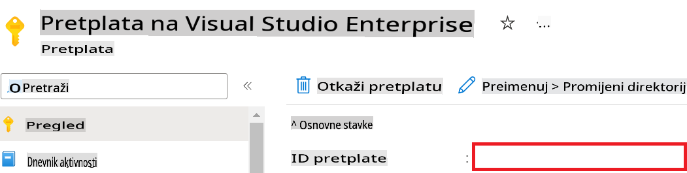

1. Izvršite sljedeće zadatke kako biste dodali naziv Azure Workspacea:

    - Idite na Azure Machine Learning resurs koji ste kreirali.
    - Kopirajte i zalijepite naziv svog računa u datoteku *config.py*.

    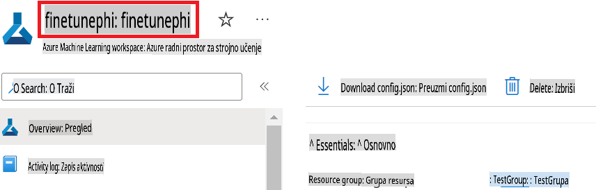

1. Izvršite sljedeće zadatke kako biste dodali naziv Azure Resource Group:

    - Idite na Azure Machine Learning resurs koji ste kreirali.
    - Kopirajte i zalijepite naziv svoje Azure Resource Group u datoteku *config.py*.

    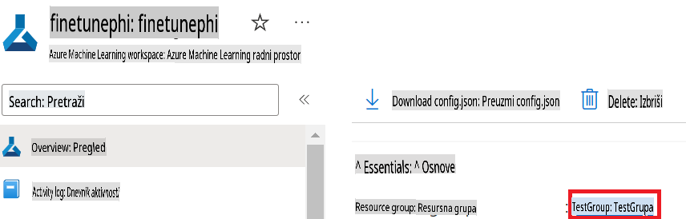

2. Izvršite sljedeće zadatke kako biste dodali naziv Azure Managed Identity:

    - Idite na Managed Identities resurs koji ste kreirali.
    - Kopirajte i zalijepite naziv svoje Azure Managed Identity u datoteku *config.py*.

    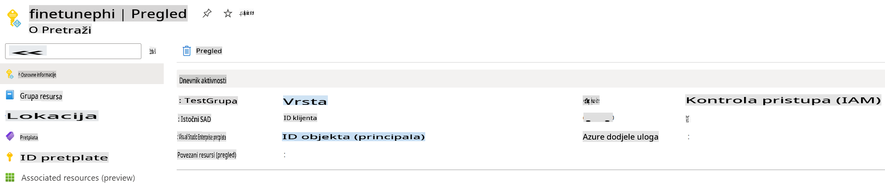

### Priprema skupa podataka za fino podešavanje

U ovoj vježbi pokrenut ćete datoteku *download_dataset.py* kako biste preuzeli skupove podataka *ULTRACHAT_200k* u svoje lokalno okruženje. Zatim ćete koristiti te skupove podataka za fino podešavanje modela Phi-3 u Azure Machine Learningu.

#### Preuzmite svoj skup podataka koristeći *download_dataset.py*

1. Otvorite datoteku *download_dataset.py* u Visual Studio Code.

1. Dodajte sljedeći kod u *download_dataset.py*.

    ```python
    import json
    import os
    from datasets import load_dataset
    from config import (
        TRAIN_DATA_PATH,
        TEST_DATA_PATH)

    def load_and_split_dataset(dataset_name, config_name, split_ratio):
        """
        Load and split a dataset.
        """
        # Load the dataset with the specified name, configuration, and split ratio
        dataset = load_dataset(dataset_name, config_name, split=split_ratio)
        print(f"Original dataset size: {len(dataset)}")
        
        # Split the dataset into train and test sets (80% train, 20% test)
        split_dataset = dataset.train_test_split(test_size=0.2)
        print(f"Train dataset size: {len(split_dataset['train'])}")
        print(f"Test dataset size: {len(split_dataset['test'])}")
        
        return split_dataset

    def save_dataset_to_jsonl(dataset, filepath):
        """
        Save a dataset to a JSONL file.
        """
        # Create the directory if it does not exist
        os.makedirs(os.path.dirname(filepath), exist_ok=True)
        
        # Open the file in write mode
        with open(filepath, 'w', encoding='utf-8') as f:
            # Iterate over each record in the dataset
            for record in dataset:
                # Dump the record as a JSON object and write it to the file
                json.dump(record, f)
                # Write a newline character to separate records
                f.write('\n')
        
        print(f"Dataset saved to {filepath}")

    def main():
        """
        Main function to load, split, and save the dataset.
        """
        # Load and split the ULTRACHAT_200k dataset with a specific configuration and split ratio
        dataset = load_and_split_dataset("HuggingFaceH4/ultrachat_200k", 'default', 'train_sft[:1%]')
        
        # Extract the train and test datasets from the split
        train_dataset = dataset['train']
        test_dataset = dataset['test']

        # Save the train dataset to a JSONL file
        save_dataset_to_jsonl(train_dataset, TRAIN_DATA_PATH)
        
        # Save the test dataset to a separate JSONL file
        save_dataset_to_jsonl(test_dataset, TEST_DATA_PATH)

    if __name__ == "__main__":
        main()

    ```

> [!TIP]
>
> **Upute za fino podešavanje s minimalnim skupom podataka koristeći CPU**
>
> Ako želite koristiti CPU za fino podešavanje, ovaj pristup je idealan za one s benefit pretplatama (poput Visual Studio Enterprise Subscription) ili za brzo testiranje procesa fino podešavanja i implementacije.
>
> Zamijenite `dataset = load_and_split_dataset("HuggingFaceH4/ultrachat_200k", 'default', 'train_sft[:1%]')` with `dataset = load_and_split_dataset("HuggingFaceH4/ultrachat_200k", 'default', 'train_sft[:10]')`
>

1. Upišite sljedeću naredbu unutar svog terminala kako biste pokrenuli skriptu i preuzeli skup podataka u svoje lokalno okruženje.

    ```console
    python download_data.py
    ```

1. Provjerite jesu li skupovi podataka uspješno spremljeni u vaš lokalni direktorij *finetune-phi/data*.

> [!NOTE]
>
> **Veličina skupa podataka i vrijeme fino podešavanja**
>
> U ovom E2E uzorku koristite samo 1% skupa podataka (`train_sft[:1%]`). Ovo značajno smanjuje količinu podataka, ubrzavajući proces prijenosa i fino podešavanje. Možete prilagoditi postotak kako biste pronašli ravnotežu između vremena obuke i performansi modela. Korištenje manjeg podskupa skupa podataka smanjuje vrijeme potrebno za fino podešavanje, čineći proces upravljivim za E2E uzorak.

## Scenarij 2: Fino podešavanje modela Phi-3 i implementacija u Azure Machine Learning Studio

### Postavljanje Azure CLI-a

Potrebno je postaviti Azure CLI za autentifikaciju vašeg okruženja. Azure CLI omogućuje upravljanje Azure resursima izravno iz naredbenog retka i pruža potrebne vjerodajnice za pristup Azure Machine Learning resursima. Za početak instalirajte [Azure CLI](https://learn.microsoft.com/cli/azure/install-azure-cli)

1. Otvorite prozor terminala i upišite sljedeću naredbu za prijavu na svoj Azure račun.

    ```console
    az login
    ```

1. Odaberite Azure račun koji ćete koristiti.

1. Odaberite Azure pretplatu koju ćete koristiti.

    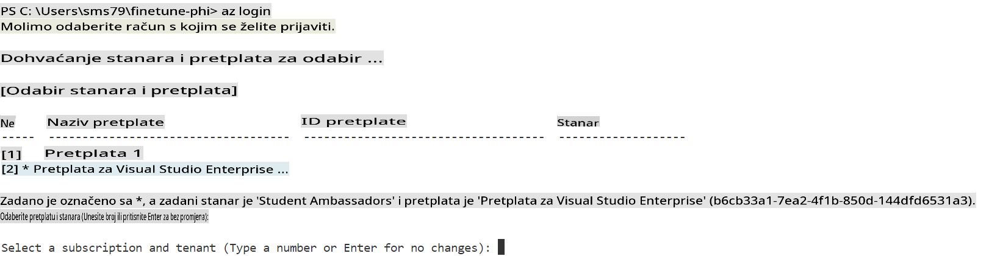

> [!TIP]
>
> Ako imate problema s prijavom na Azure, pokušajte koristiti kod uređaja. Otvorite prozor terminala i upišite sljedeću naredbu za prijavu na svoj Azure račun:
>
> ```console
> az login --use-device-code
> ```
>

### Fino podešavanje modela Phi-3

U ovoj vježbi fino ćete podesiti model Phi-3 koristeći dostavljeni skup podataka. Prvo ćete definirati proces fino podešavanja u datoteci *fine_tune.py*. Zatim ćete konfigurirati okruženje Azure Machine Learninga i pokrenuti proces fino podešavanja pokretanjem datoteke *setup_ml.py*. Ova skripta osigurava da se fino podešavanje odvija unutar Azure Machine Learning okruženja.

Pokretanjem *setup_ml.py* pokrenut ćete proces fino podešavanja unutar Azure Machine Learning okruženja.

#### Dodavanje koda u datoteku *fine_tune.py*

1. Idite u direktorij *finetuning_dir* i otvorite datoteku *fine_tune.py* u Visual Studio Code.

1. Dodajte sljedeći kod u *fine_tune.py*.

    ```python
    import argparse
    import sys
    import logging
    import os
    from datasets import load_dataset
    import torch
    import mlflow
    from transformers import AutoModelForCausalLM, AutoTokenizer, TrainingArguments
    from trl import SFTTrainer

    # To avoid the INVALID_PARAMETER_VALUE error in MLflow, disable MLflow integration
    os.environ["DISABLE_MLFLOW_INTEGRATION"] = "True"

    # Logging setup
    logging.basicConfig(
        format="%(asctime)s - %(levelname)s - %(name)s - %(message)s",
        datefmt="%Y-%m-%d %H:%M:%S",
        handlers=[logging.StreamHandler(sys.stdout)],
        level=logging.WARNING
    )
    logger = logging.getLogger(__name__)

    def initialize_model_and_tokenizer(model_name, model_kwargs):
        """
        Initialize the model and tokenizer with the given pretrained model name and arguments.
        """
        model = AutoModelForCausalLM.from_pretrained(model_name, **model_kwargs)
        tokenizer = AutoTokenizer.from_pretrained(model_name)
        tokenizer.model_max_length = 2048
        tokenizer.pad_token = tokenizer.unk_token
        tokenizer.pad_token_id = tokenizer.convert_tokens_to_ids(tokenizer.pad_token)
        tokenizer.padding_side = 'right'
        return model, tokenizer

    def apply_chat_template(example, tokenizer):
        """
        Apply a chat template to tokenize messages in the example.
        """
        messages = example["messages"]
        if messages[0]["role"] != "system":
            messages.insert(0, {"role": "system", "content": ""})
        example["text"] = tokenizer.apply_chat_template(
            messages, tokenize=False, add_generation_prompt=False
        )
        return example

    def load_and_preprocess_data(train_filepath, test_filepath, tokenizer):
        """
        Load and preprocess the dataset.
        """
        train_dataset = load_dataset('json', data_files=train_filepath, split='train')
        test_dataset = load_dataset('json', data_files=test_filepath, split='train')
        column_names = list(train_dataset.features)

        train_dataset = train_dataset.map(
            apply_chat_template,
            fn_kwargs={"tokenizer": tokenizer},
            num_proc=10,
            remove_columns=column_names,
            desc="Applying chat template to train dataset",
        )

        test_dataset = test_dataset.map(
            apply_chat_template,
            fn_kwargs={"tokenizer": tokenizer},
            num_proc=10,
            remove_columns=column_names,
            desc="Applying chat template to test dataset",
        )

        return train_dataset, test_dataset

    def train_and_evaluate_model(train_dataset, test_dataset, model, tokenizer, output_dir):
        """
        Train and evaluate the model.
        """
        training_args = TrainingArguments(
            bf16=True,
            do_eval=True,
            output_dir=output_dir,
            eval_strategy="epoch",
            learning_rate=5.0e-06,
            logging_steps=20,
            lr_scheduler_type="cosine",
            num_train_epochs=3,
            overwrite_output_dir=True,
            per_device_eval_batch_size=4,
            per_device_train_batch_size=4,
            remove_unused_columns=True,
            save_steps=500,
            seed=0,
            gradient_checkpointing=True,
            gradient_accumulation_steps=1,
            warmup_ratio=0.2,
        )

        trainer = SFTTrainer(
            model=model,
            args=training_args,
            train_dataset=train_dataset,
            eval_dataset=test_dataset,
            max_seq_length=2048,
            dataset_text_field="text",
            tokenizer=tokenizer,
            packing=True
        )

        train_result = trainer.train()
        trainer.log_metrics("train", train_result.metrics)

        mlflow.transformers.log_model(
            transformers_model={"model": trainer.model, "tokenizer": tokenizer},
            artifact_path=output_dir,
        )

        tokenizer.padding_side = 'left'
        eval_metrics = trainer.evaluate()
        eval_metrics["eval_samples"] = len(test_dataset)
        trainer.log_metrics("eval", eval_metrics)

    def main(train_file, eval_file, model_output_dir):
        """
        Main function to fine-tune the model.
        """
        model_kwargs = {
            "use_cache": False,
            "trust_remote_code": True,
            "torch_dtype": torch.bfloat16,
            "device_map": None,
            "attn_implementation": "eager"
        }

        # pretrained_model_name = "microsoft/Phi-3-mini-4k-instruct"
        pretrained_model_name = "microsoft/Phi-3.5-mini-instruct"

        with mlflow.start_run():
            model, tokenizer = initialize_model_and_tokenizer(pretrained_model_name, model_kwargs)
            train_dataset, test_dataset = load_and_preprocess_data(train_file, eval_file, tokenizer)
            train_and_evaluate_model(train_dataset, test_dataset, model, tokenizer, model_output_dir)

    if __name__ == "__main__":
        parser = argparse.ArgumentParser()
        parser.add_argument("--train-file", type=str, required=True, help="Path to the training data")
        parser.add_argument("--eval-file", type=str, required=True, help="Path to the evaluation data")
        parser.add_argument("--model_output_dir", type=str, required=True, help="Directory to save the fine-tuned model")
        args = parser.parse_args()
        main(args.train_file, args.eval_file, args.model_output_dir)

    ```

1. Spremite i zatvorite datoteku *fine_tune.py*.

> [!TIP]
> **Možete fino podesiti Phi-3.5 model**
>
> U datoteci *fine_tune.py* možete promijeniti polje `pretrained_model_name` from `"microsoft/Phi-3-mini-4k-instruct"` to any model you want to fine-tune. For example, if you change it to `"microsoft/Phi-3.5-mini-instruct"`, you'll be using the Phi-3.5-mini-instruct model for fine-tuning. To find and use the model name you prefer, visit [Hugging Face](https://huggingface.co/), search for the model you're interested in, and then copy and paste its name into the `pretrained_model_name` u svojoj skripti.
>
> :::image type="content" source="../../imgs/03/FineTuning-PromptFlow/finetunephi3.5.png" alt-text="Fino podešavanje Phi-3.5.":::
>

#### Dodavanje koda u datoteku *setup_ml.py*

1. Otvorite datoteku *setup_ml.py* u Visual Studio Code.

1. Dodajte sljedeći kod u *setup_ml.py*.

    ```python
    import logging
    from azure.ai.ml import MLClient, command, Input
    from azure.ai.ml.entities import Environment, AmlCompute
    from azure.identity import AzureCliCredential
    from config import (
        AZURE_SUBSCRIPTION_ID,
        AZURE_RESOURCE_GROUP_NAME,
        AZURE_ML_WORKSPACE_NAME,
        TRAIN_DATA_PATH,
        TEST_DATA_PATH
    )

    # Constants

    # Uncomment the following lines to use a CPU instance for training
    # COMPUTE_INSTANCE_TYPE = "Standard_E16s_v3" # cpu
    # COMPUTE_NAME = "cpu-e16s-v3"
    # DOCKER_IMAGE_NAME = "mcr.microsoft.com/azureml/openmpi4.1.0-ubuntu20.04:latest"

    # Uncomment the following lines to use a GPU instance for training
    COMPUTE_INSTANCE_TYPE = "Standard_NC24ads_A100_v4"
    COMPUTE_NAME = "gpu-nc24s-a100-v4"
    DOCKER_IMAGE_NAME = "mcr.microsoft.com/azureml/curated/acft-hf-nlp-gpu:59"

    CONDA_FILE = "conda.yml"
    LOCATION = "eastus2" # Replace with the location of your compute cluster
    FINETUNING_DIR = "./finetuning_dir" # Path to the fine-tuning script
    TRAINING_ENV_NAME = "phi-3-training-environment" # Name of the training environment
    MODEL_OUTPUT_DIR = "./model_output" # Path to the model output directory in azure ml

    # Logging setup to track the process
    logger = logging.getLogger(__name__)
    logging.basicConfig(
        format="%(asctime)s - %(levelname)s - %(name)s - %(message)s",
        datefmt="%Y-%m-%d %H:%M:%S",
        level=logging.WARNING
    )

    def get_ml_client():
        """
        Initialize the ML Client using Azure CLI credentials.
        """
        credential = AzureCliCredential()
        return MLClient(credential, AZURE_SUBSCRIPTION_ID, AZURE_RESOURCE_GROUP_NAME, AZURE_ML_WORKSPACE_NAME)

    def create_or_get_environment(ml_client):
        """
        Create or update the training environment in Azure ML.
        """
        env = Environment(
            image=DOCKER_IMAGE_NAME,  # Docker image for the environment
            conda_file=CONDA_FILE,  # Conda environment file
            name=TRAINING_ENV_NAME,  # Name of the environment
        )
        return ml_client.environments.create_or_update(env)

    def create_or_get_compute_cluster(ml_client, compute_name, COMPUTE_INSTANCE_TYPE, location):
        """
        Create or update the compute cluster in Azure ML.
        """
        try:
            compute_cluster = ml_client.compute.get(compute_name)
            logger.info(f"Compute cluster '{compute_name}' already exists. Reusing it for the current run.")
        except Exception:
            logger.info(f"Compute cluster '{compute_name}' does not exist. Creating a new one with size {COMPUTE_INSTANCE_TYPE}.")
            compute_cluster = AmlCompute(
                name=compute_name,
                size=COMPUTE_INSTANCE_TYPE,
                location=location,
                tier="Dedicated",  # Tier of the compute cluster
                min_instances=0,  # Minimum number of instances
                max_instances=1  # Maximum number of instances
            )
            ml_client.compute.begin_create_or_update(compute_cluster).wait()  # Wait for the cluster to be created
        return compute_cluster

    def create_fine_tuning_job(env, compute_name):
        """
        Set up the fine-tuning job in Azure ML.
        """
        return command(
            code=FINETUNING_DIR,  # Path to fine_tune.py
            command=(
                "python fine_tune.py "
                "--train-file ${{inputs.train_file}} "
                "--eval-file ${{inputs.eval_file}} "
                "--model_output_dir ${{inputs.model_output}}"
            ),
            environment=env,  # Training environment
            compute=compute_name,  # Compute cluster to use
            inputs={
                "train_file": Input(type="uri_file", path=TRAIN_DATA_PATH),  # Path to the training data file
                "eval_file": Input(type="uri_file", path=TEST_DATA_PATH),  # Path to the evaluation data file
                "model_output": MODEL_OUTPUT_DIR
            }
        )

    def main():
        """
        Main function to set up and run the fine-tuning job in Azure ML.
        """
        # Initialize ML Client
        ml_client = get_ml_client()

        # Create Environment
        env = create_or_get_environment(ml_client)
        
        # Create or get existing compute cluster
        create_or_get_compute_cluster(ml_client, COMPUTE_NAME, COMPUTE_INSTANCE_TYPE, LOCATION)

        # Create and Submit Fine-Tuning Job
        job = create_fine_tuning_job(env, COMPUTE_NAME)
        returned_job = ml_client.jobs.create_or_update(job)  # Submit the job
        ml_client.jobs.stream(returned_job.name)  # Stream the job logs
        
        # Capture the job name
        job_name = returned_job.name
        print(f"Job name: {job_name}")

    if __name__ == "__main__":
        main()

    ```

1. Zamijenite `COMPUTE_INSTANCE_TYPE`, `COMPUTE_NAME`, and `LOCATION` sa svojim specifičnim podacima.

    ```python
   # Uncomment the following lines to use a GPU instance for training
    COMPUTE_INSTANCE_TYPE = "Standard_NC24ads_A100_v4"
    COMPUTE_NAME = "gpu-nc24s-a100-v4"
    ...
    LOCATION = "eastus2" # Replace with the location of your compute cluster
    ```

> [!TIP]
>
> **Upute za fino podešavanje s minimalnim skupom podataka koristeći CPU**
>
> Ako želite koristiti CPU za fino podešavanje, ovaj pristup je idealan za one s benefit pretplatama (poput Visual Studio Enterprise Subscription) ili za brzo testiranje procesa fino podešavanja i implementacije.
>
> 1. Otvorite datoteku *setup_ml*.
> 1. Zamijenite `COMPUTE_INSTANCE_TYPE`, `COMPUTE_NAME`, and `DOCKER_IMAGE_NAME` with the following. If you do not have access to *Standard_E16s_v3*, you can use an equivalent CPU instance or request a new quota.
> 1. Replace `LOCATION` sa svojim specifičnim podacima.
>
>    ```python
>    # Uncomment the following lines to use a CPU instance for training
>    COMPUTE_INSTANCE_TYPE = "Standard_E16s_v3" # cpu
>    COMPUTE_NAME = "cpu-e16s-v3"
>    DOCKER_IMAGE_NAME = "mcr.microsoft.com/azureml/openmpi4.1.0-ubuntu20.04:latest"
>    LOCATION = "eastus2" # Replace with the location of your compute cluster
>    ```
>

1. Upišite sljedeću naredbu za pokretanje skripte *setup_ml.py* i započinjanje procesa fino podešavanja u Azure Machine Learning.

    ```python
    python setup_ml.py
    ```

1. U ovoj vježbi uspješno ste fino podesili model Phi-3 koristeći Azure Machine Learning. Pokretanjem skripte *setup_ml.py* postavili ste okruženje Azure Machine Learninga i pokrenuli proces fino podešavanja definiran u datoteci *fine_tune.py*. Imajte na umu da proces fino podešavanja može potrajati značajno vrijeme. Nakon pokretanja `python setup_ml.py` command, you need to wait for the process to complete. You can monitor the status of the fine-tuning job by following the link provided in the terminal to the Azure Machine Learning portal.

    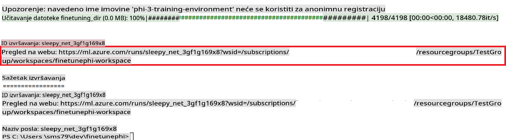

### Deploy the fine-tuned model

To integrate the fine-tuned Phi-3 model with Prompt Flow, you need to deploy the model to make it accessible for real-time inference. This process involves registering the model, creating an online endpoint, and deploying the model.

#### Set the model name, endpoint name, and deployment name for deployment

1. Open *config.py* file.

1. Replace `AZURE_MODEL_NAME = "your_fine_tuned_model_name"` with the desired name for your model.

1. Replace `AZURE_ENDPOINT_NAME = "your_fine_tuned_model_endpoint_name"` with the desired name for your endpoint.

1. Replace `AZURE_DEPLOYMENT_NAME = "your_fine_tuned_model_deployment_name"` unesite željeno ime za svoju implementaciju.

#### Dodavanje koda u datoteku *deploy_model.py*

Pokretanjem datoteke *deploy_model.py* automatizira se cijeli proces implementacije. Registrira model, kreira endpoint i izvršava implementaciju prema postavkama specificiranim u datoteci config.py, koja uključuje naziv modela, naziv endpointa i naziv implementacije.

1. Otvorite datoteku *deploy_model.py* u Visual Studio Code.

1. Dodajte sljedeći kod u *deploy_model.py*.

    ```python
    import logging
    from azure.identity import AzureCliCredential
    from azure.ai.ml import MLClient
    from azure.ai.ml.entities import Model, ProbeSettings, ManagedOnlineEndpoint, ManagedOnlineDeployment, IdentityConfiguration, ManagedIdentityConfiguration, OnlineRequestSettings
    from azure.ai.ml.constants import AssetTypes

    # Configuration imports
    from config import (
        AZURE_SUBSCRIPTION_ID,
        AZURE_RESOURCE_GROUP_NAME,
        AZURE_ML_WORKSPACE_NAME,
        AZURE_MANAGED_IDENTITY_RESOURCE_ID,
        AZURE_MANAGED_IDENTITY_CLIENT_ID,
        AZURE_MODEL_NAME,
        AZURE_ENDPOINT_NAME,
        AZURE_DEPLOYMENT_NAME
    )

    # Constants
    JOB_NAME = "your-job-name"
    COMPUTE_INSTANCE_TYPE = "Standard_E4s_v3"

    deployment_env_vars = {
        "SUBSCRIPTION_ID": AZURE_SUBSCRIPTION_ID,
        "RESOURCE_GROUP_NAME": AZURE_RESOURCE_GROUP_NAME,
        "UAI_CLIENT_ID": AZURE_MANAGED_IDENTITY_CLIENT_ID,
    }

    # Logging setup
    logging.basicConfig(
        format="%(asctime)s - %(levelname)s - %(name)s - %(message)s",
        datefmt="%Y-%m-%d %H:%M:%S",
        level=logging.DEBUG
    )
    logger = logging.getLogger(__name__)

    def get_ml_client():
        """Initialize and return the ML Client."""
        credential = AzureCliCredential()
        return MLClient(credential, AZURE_SUBSCRIPTION_ID, AZURE_RESOURCE_GROUP_NAME, AZURE_ML_WORKSPACE_NAME)

    def register_model(ml_client, model_name, job_name):
        """Register a new model."""
        model_path = f"azureml://jobs/{job_name}/outputs/artifacts/paths/model_output"
        logger.info(f"Registering model {model_name} from job {job_name} at path {model_path}.")
        run_model = Model(
            path=model_path,
            name=model_name,
            description="Model created from run.",
            type=AssetTypes.MLFLOW_MODEL,
        )
        model = ml_client.models.create_or_update(run_model)
        logger.info(f"Registered model ID: {model.id}")
        return model

    def delete_existing_endpoint(ml_client, endpoint_name):
        """Delete existing endpoint if it exists."""
        try:
            endpoint_result = ml_client.online_endpoints.get(name=endpoint_name)
            logger.info(f"Deleting existing endpoint {endpoint_name}.")
            ml_client.online_endpoints.begin_delete(name=endpoint_name).result()
            logger.info(f"Deleted existing endpoint {endpoint_name}.")
        except Exception as e:
            logger.info(f"No existing endpoint {endpoint_name} found to delete: {e}")

    def create_or_update_endpoint(ml_client, endpoint_name, description=""):
        """Create or update an endpoint."""
        delete_existing_endpoint(ml_client, endpoint_name)
        logger.info(f"Creating new endpoint {endpoint_name}.")
        endpoint = ManagedOnlineEndpoint(
            name=endpoint_name,
            description=description,
            identity=IdentityConfiguration(
                type="user_assigned",
                user_assigned_identities=[ManagedIdentityConfiguration(resource_id=AZURE_MANAGED_IDENTITY_RESOURCE_ID)]
            )
        )
        endpoint_result = ml_client.online_endpoints.begin_create_or_update(endpoint).result()
        logger.info(f"Created new endpoint {endpoint_name}.")
        return endpoint_result

    def create_or_update_deployment(ml_client, endpoint_name, deployment_name, model):
        """Create or update a deployment."""

        logger.info(f"Creating deployment {deployment_name} for endpoint {endpoint_name}.")
        deployment = ManagedOnlineDeployment(
            name=deployment_name,
            endpoint_name=endpoint_name,
            model=model.id,
            instance_type=COMPUTE_INSTANCE_TYPE,
            instance_count=1,
            environment_variables=deployment_env_vars,
            request_settings=OnlineRequestSettings(
                max_concurrent_requests_per_instance=3,
                request_timeout_ms=180000,
                max_queue_wait_ms=120000
            ),
            liveness_probe=ProbeSettings(
                failure_threshold=30,
                success_threshold=1,
                period=100,
                initial_delay=500,
            ),
            readiness_probe=ProbeSettings(
                failure_threshold=30,
                success_threshold=1,
                period=100,
                initial_delay=500,
            ),
        )
        deployment_result = ml_client.online_deployments.begin_create_or_update(deployment).result()
        logger.info(f"Created deployment {deployment.name} for endpoint {endpoint_name}.")
        return deployment_result

    def set_traffic_to_deployment(ml_client, endpoint_name, deployment_name):
        """Set traffic to the specified deployment."""
        try:
            # Fetch the current endpoint details
            endpoint = ml_client.online_endpoints.get(name=endpoint_name)
            
            # Log the current traffic allocation for debugging
            logger.info(f"Current traffic allocation: {endpoint.traffic}")
            
            # Set the traffic allocation for the deployment
            endpoint.traffic = {deployment_name: 100}
            
            # Update the endpoint with the new traffic allocation
            endpoint_poller = ml_client.online_endpoints.begin_create_or_update(endpoint)
            updated_endpoint = endpoint_poller.result()
            
            # Log the updated traffic allocation for debugging
            logger.info(f"Updated traffic allocation: {updated_endpoint.traffic}")
            logger.info(f"Set traffic to deployment {deployment_name} at endpoint {endpoint_name}.")
            return updated_endpoint
        except Exception as e:
            # Log any errors that occur during the process
            logger.error(f"Failed to set traffic to deployment: {e}")
            raise


    def main():
        ml_client = get_ml_client()

        registered_model = register_model(ml_client, AZURE_MODEL_NAME, JOB_NAME)
        logger.info(f"Registered model ID: {registered_model.id}")

        endpoint = create_or_update_endpoint(ml_client, AZURE_ENDPOINT_NAME, "Endpoint for finetuned Phi-3 model")
        logger.info(f"Endpoint {AZURE_ENDPOINT_NAME} is ready.")

        try:
            deployment = create_or_update_deployment(ml_client, AZURE_ENDPOINT_NAME, AZURE_DEPLOYMENT_NAME, registered_model)
            logger.info(f"Deployment {AZURE_DEPLOYMENT_NAME} is created for endpoint {AZURE_ENDPOINT_NAME}.")

            set_traffic_to_deployment(ml_client, AZURE_ENDPOINT_NAME, AZURE_DEPLOYMENT_NAME)
            logger.info(f"Traffic is set to deployment {AZURE_DEPLOYMENT_NAME} at endpoint {AZURE_ENDPOINT_NAME}.")
        except Exception as e:
            logger.error(f"Failed to create or update deployment: {e}")

    if __name__ == "__main__":
        main()

    ```

1. Izvršite sljedeće zadatke kako biste dobili `JOB_NAME`:

    - Navigate to Azure Machine Learning resource that you created.
    - Select **Studio web URL** to open the Azure Machine Learning workspace.
    - Select **Jobs** from the left side tab.
    - Select the experiment for fine-tuning. For example, *finetunephi*.
    - Select the job that you created.
    - Copy and paste your job Name into the `JOB_NAME = "your-job-name"` in *deploy_model.py* file.

1. Replace `COMPUTE_INSTANCE_TYPE` sa svojim specifičnim podacima.

1. Upišite sljedeću naredbu za pokretanje skripte *deploy_model.py* i započinjanje procesa implementacije u Azure Machine Learning.

    ```python
    python deploy_model.py
    ```

> [!WARNING]
> Kako biste izbjegli dodatne troškove na svom računu, obavezno izbrišite kreirani endpoint u Azure Machine Learning radnom prostoru.
>

#### Provjera statusa implementacije u Azure Machine Learning Workspace

1. Posjetite [Azure ML Studio](https://ml.azure.com/home?wt.mc_id=studentamb_279723).

1. Idite na Azure Machine Learning radni prostor koji ste kreirali.

1. Odaberite **Studio web URL** za otvaranje Azure Machine Learning radnog prostora.

1. Odaberite **Endpoints** iz lijevog izbornika.

    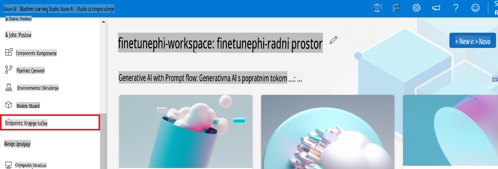

2. Odaberite endpoint koji ste kreirali.

    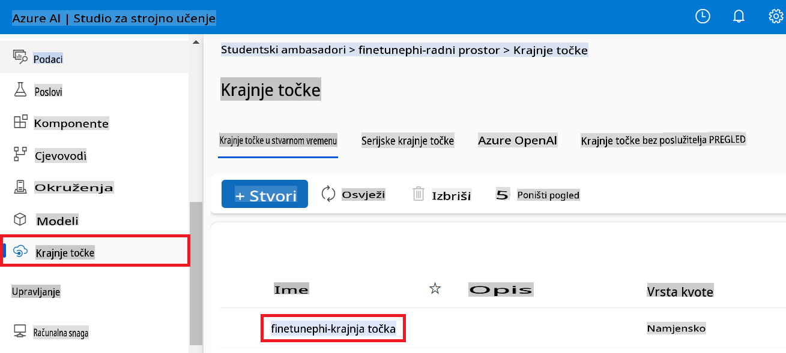

3. Na ovoj stranici možete upravljati endpointima kreiranim tijekom procesa implementacije.

## Scenarij 3: Integracija s Prompt flowom i razgovor s vašim prilagođenim modelom

### Integracija prilagođenog Phi-3 modela s Prompt flowom

Nakon uspješne implementacije vašeg fino podešenog modela, sada ga možete integrirati s Prompt flowom kako biste koristili svoj model u stvarnim aplikacijama, omogućujući razne interaktivne zadatke s vašim prilagođenim Phi-3 modelom.

#### Postavite API ključ i URI endpointa fino podešenog Phi-3 modela

1. Idite na Azure Machine Learning radni prostor koji ste kreirali.
1. Odaberite **Endpoints** iz lijevog izbornika.
1. Odaberite endpoint koji ste kreirali.
1. Odaberite **Consume** iz navigacijskog izbornika.
1. Kopirajte i zalijepite svoj **REST endpoint** u datoteku *config.py*, zamjenjujući `AZURE_ML_ENDPOINT = "your_fine_tuned_model_endpoint_uri"` with your **REST endpoint**.
1. Copy and paste your **Primary key** into the *config.py* file, replacing `AZURE_ML_API_KEY = "your_fine_tuned_model_api_key"` sa svojim **Primary key**.

    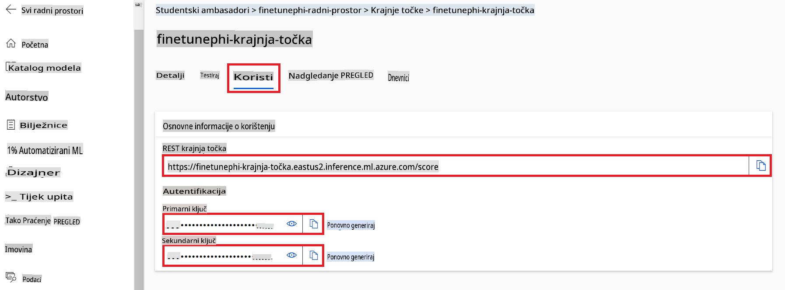

#### Dodavanje koda u datoteku *flow.dag.yml*

1. Otvorite datoteku *flow.dag.yml* u Visual Studio Code.

1. Dodajte sljedeći kod u *flow.dag.yml*.

    ```yml
    inputs:
      input_data:
        type: string
        default: "Who founded Microsoft?"

    outputs:
      answer:
        type: string
        reference: ${integrate_with_promptflow.output}

    nodes:
    - name: integrate_with_promptflow
      type: python
      source:
        type: code
        path: integrate_with_promptflow.py
      inputs:
        input_data: ${inputs.input_data}
    ```

#### Dodavanje koda u datoteku *integrate_with_promptflow.py*

1. Otvorite datoteku *integrate_with_promptflow.py* u Visual Studio Code.

1. Dodajte sljedeći kod u *integrate_with_promptflow.py*.

    ```python
    import logging
    import requests
    from promptflow.core import tool
    import asyncio
    import platform
    from config import (
        AZURE_ML_ENDPOINT,
        AZURE_ML_API_KEY
    )

    # Logging setup
    logging.basicConfig(
        format="%(asctime)s - %(levelname)s - %(name)s - %(message)s",
        datefmt="%Y-%m-%d %H:%M:%S",
        level=logging.DEBUG
    )
    logger = logging.getLogger(__name__)

    def query_azml_endpoint(input_data: list, endpoint_url: str, api_key: str) -> str:
        """
        Send a request to the Azure ML endpoint with the given input data.
        """
        headers = {
            "Content-Type": "application/json",
            "Authorization": f"Bearer {api_key}"
        }
        data = {
            "input_data": [input_data],
            "params": {
                "temperature": 0.7,
                "max_new_tokens": 128,
                "do_sample": True,
                "return_full_text": True
            }
        }
        try:
            response = requests.post(endpoint_url, json=data, headers=headers)
            response.raise_for_status()
            result = response.json()[0]
            logger.info("Successfully received response from Azure ML Endpoint.")
            return result
        except requests.exceptions.RequestException as e:
            logger.error(f"Error querying Azure ML Endpoint: {e}")
            raise

    def setup_asyncio_policy():
        """
        Setup asyncio event loop policy for Windows.
        """
        if platform.system() == 'Windows':
            asyncio.set_event_loop_policy(asyncio.WindowsSelectorEventLoopPolicy())
            logger.info("Set Windows asyncio event loop policy.")

    @tool
    def my_python_tool(input_data: str) -> str:
        """
        Tool function to process input data and query the Azure ML endpoint.
        """
        setup_asyncio_policy()
        return query_azml_endpoint(input_data, AZURE_ML_ENDPOINT, AZURE_ML_API_KEY)

    ```

### Razgovor s vašim prilagođenim modelom

1. Upišite sljedeću naredbu za pokretanje skripte *deploy_model.py* i započinjanje procesa implementacije u Azure Machine Learning.

    ```python
    pf flow serve --source ./ --port 8080 --host localhost
    ```

1. Evo primjera rezultata: Sada možete razgovarati s vašim prilagođenim Phi-3 modelom. Preporučuje se postavljati pitanja temeljem podataka korištenih za fino podešavanje.

    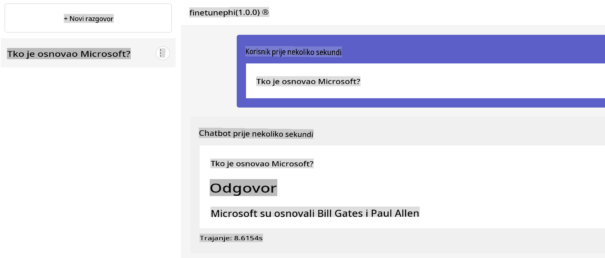

**Odricanje od odgovornosti**:  
Ovaj dokument je preveden korištenjem usluga strojno podržanog AI prevođenja. Iako nastojimo osigurati točnost, molimo vas da budete svjesni da automatizirani prijevodi mogu sadržavati pogreške ili netočnosti. Izvorni dokument na njegovom izvornom jeziku treba smatrati mjerodavnim izvorom. Za kritične informacije preporučuje se profesionalni prijevod od strane ljudskog prevoditelja. Ne snosimo odgovornost za nesporazume ili pogrešna tumačenja koja mogu proizaći iz korištenja ovog prijevoda.