# Fino podešavanje i integracija prilagođenih Phi-3 modela s Prompt flow u Azure AI Foundry

Ovaj uzorak "od početka do kraja" (E2E) temelji se na vodiču "[Fine-Tune and Integrate Custom Phi-3 Models with Prompt Flow in Azure AI Foundry](https://techcommunity.microsoft.com/t5/educator-developer-blog/fine-tune-and-integrate-custom-phi-3-models-with-prompt-flow-in/ba-p/4191726?WT.mc_id=aiml-137032-kinfeylo)" iz Microsoft Tech Community. Prikazuje procese fino podešavanja, implementacije i integracije prilagođenih Phi-3 modela s Prompt flow u Azure AI Foundry.  
Za razliku od uzorka "[Fine-Tune and Integrate Custom Phi-3 Models with Prompt Flow](./E2E_Phi-3-FineTuning_PromptFlow_Integration.md)", koji uključuje lokalno pokretanje koda, ovaj vodič se u potpunosti fokusira na fino podešavanje i integraciju modela unutar Azure AI / ML Studija.

## Pregled

U ovom E2E uzorku naučit ćete kako fino podesiti Phi-3 model i integrirati ga s Prompt flow u Azure AI Foundry. Korištenjem Azure AI / ML Studija, uspostavit ćete tijek rada za implementaciju i korištenje prilagođenih AI modela. Ovaj uzorak podijeljen je u tri scenarija:

**Scenarij 1: Postavljanje Azure resursa i priprema za fino podešavanje**  
**Scenarij 2: Fino podešavanje Phi-3 modela i implementacija u Azure Machine Learning Studio**  
**Scenarij 3: Integracija s Prompt flow i razgovor s prilagođenim modelom u Azure AI Foundry**

Evo pregleda ovog E2E uzorka.

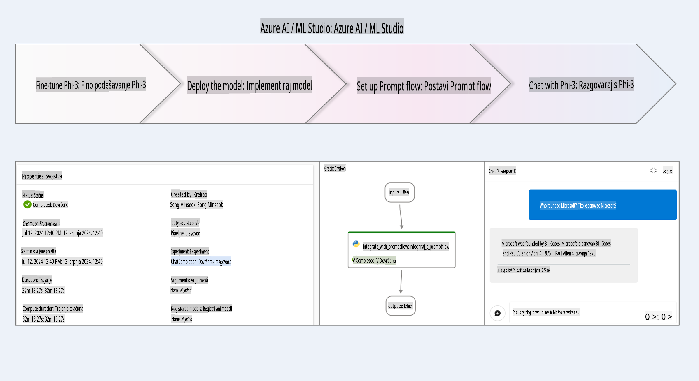

### Sadržaj

1. **[Scenarij 1: Postavljanje Azure resursa i priprema za fino podešavanje](../../../../../../md/02.Application/01.TextAndChat/Phi3)**  
    - [Kreiranje Azure Machine Learning radnog prostora](../../../../../../md/02.Application/01.TextAndChat/Phi3)  
    - [Zahtjev za GPU kvotama u Azure pretplati](../../../../../../md/02.Application/01.TextAndChat/Phi3)  
    - [Dodavanje uloga](../../../../../../md/02.Application/01.TextAndChat/Phi3)  
    - [Postavljanje projekta](../../../../../../md/02.Application/01.TextAndChat/Phi3)  
    - [Priprema skupa podataka za fino podešavanje](../../../../../../md/02.Application/01.TextAndChat/Phi3)

2. **[Scenarij 2: Fino podešavanje Phi-3 modela i implementacija u Azure Machine Learning Studio](../../../../../../md/02.Application/01.TextAndChat/Phi3)**  
    - [Fino podešavanje Phi-3 modela](../../../../../../md/02.Application/01.TextAndChat/Phi3)  
    - [Implementacija fino podešenog Phi-3 modela](../../../../../../md/02.Application/01.TextAndChat/Phi3)

3. **[Scenarij 3: Integracija s Prompt flow i razgovor s vašim prilagođenim modelom u Azure AI Foundry](../../../../../../md/02.Application/01.TextAndChat/Phi3)**  
    - [Integracija prilagođenog Phi-3 modela s Prompt flow](../../../../../../md/02.Application/01.TextAndChat/Phi3)  
    - [Razgovor s vašim prilagođenim Phi-3 modelom](../../../../../../md/02.Application/01.TextAndChat/Phi3)

## Scenarij 1: Postavljanje Azure resursa i priprema za fino podešavanje

### Kreiranje Azure Machine Learning radnog prostora

1. U gornjoj **tražilici** na portalu upišite *azure machine learning* i odaberite **Azure Machine Learning** iz ponuđenih opcija.

    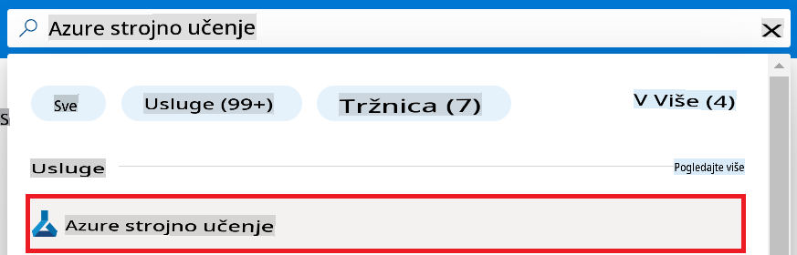

2. Kliknite na **+ Create** u navigacijskom izborniku.

3. Izaberite **New workspace** u navigacijskom izborniku.

    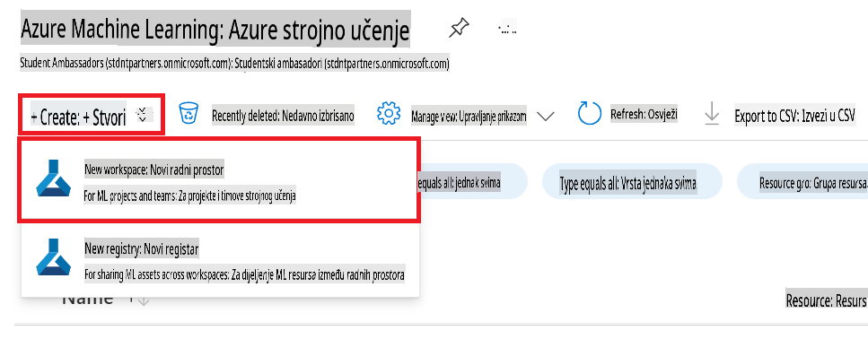

4. Izvršite sljedeće zadatke:

    - Odaberite svoju Azure **pretplatu**.  
    - Odaberite **grupu resursa** koju ćete koristiti (kreirajte novu ako je potrebno).  
    - Unesite **Naziv radnog prostora**. Vrijednost mora biti jedinstvena.  
    - Odaberite **Regiju** koju želite koristiti.  
    - Odaberite **Storage account** (kreirajte novi ako je potrebno).  
    - Odaberite **Key vault** (kreirajte novi ako je potrebno).  
    - Odaberite **Application insights** (kreirajte novi ako je potrebno).  
    - Odaberite **Container registry** (kreirajte novi ako je potrebno).  

    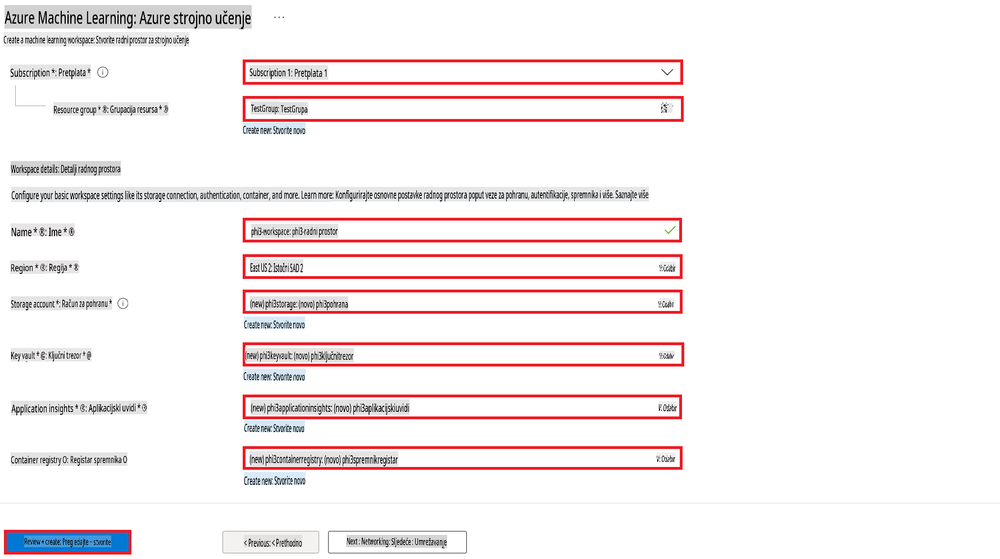

5. Kliknite na **Review + Create**.

6. Kliknite na **Create**.

### Zahtjev za GPU kvotama u Azure pretplati

U ovom vodiču naučit ćete kako fino podesiti i implementirati Phi-3 model koristeći GPU-ove. Za fino podešavanje koristit ćete *Standard_NC24ads_A100_v4* GPU, koji zahtijeva zahtjev za kvotom. Za implementaciju koristit ćete *Standard_NC6s_v3* GPU, koji također zahtijeva zahtjev za kvotom.

> [!NOTE]  
> Samo pretplate s modelom Pay-As-You-Go (standardni tip pretplate) imaju pravo na GPU dodjelu; pretplate s benefitima trenutno nisu podržane.

1. Posjetite [Azure ML Studio](https://ml.azure.com/home?wt.mc_id=studentamb_279723).

1. Izvršite sljedeće korake za zahtjev kvote za *Standard NCADSA100v4 Family*:

    - Odaberite **Quota** s lijeve strane.  
    - Odaberite **Virtual machine family** koju želite koristiti. Na primjer, odaberite **Standard NCADSA100v4 Family Cluster Dedicated vCPUs**, koji uključuje *Standard_NC24ads_A100_v4* GPU.  
    - Kliknite na **Request quota** u navigacijskom izborniku.

        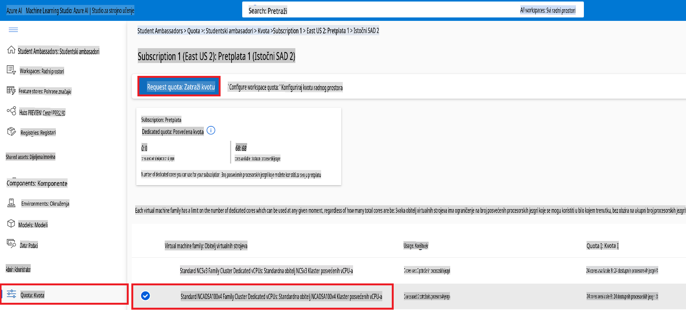

    - Na stranici Zahtjev kvote unesite **Novi limit jezgri** koji želite koristiti. Na primjer, 24.  
    - Kliknite na **Submit** za podnošenje zahtjeva za GPU kvotu.

1. Izvršite sljedeće korake za zahtjev kvote za *Standard NCSv3 Family*:

    - Odaberite **Quota** s lijeve strane.  
    - Odaberite **Virtual machine family** koju želite koristiti. Na primjer, odaberite **Standard NCSv3 Family Cluster Dedicated vCPUs**, koji uključuje *Standard_NC6s_v3* GPU.  
    - Kliknite na **Request quota** u navigacijskom izborniku.  
    - Na stranici Zahtjev kvote unesite **Novi limit jezgri** koji želite koristiti. Na primjer, 24.  
    - Kliknite na **Submit** za podnošenje zahtjeva za GPU kvotu.

### Dodavanje uloga

Kako biste fino podesili i implementirali svoje modele, prvo morate kreirati User Assigned Managed Identity (UAI) i dodijeliti mu odgovarajuće dozvole. Ovaj UAI će se koristiti za autentifikaciju tijekom implementacije.

#### Kreiranje User Assigned Managed Identity (UAI)

1. U gornjoj **tražilici** na portalu upišite *managed identities* i odaberite **Managed Identities** iz ponuđenih opcija.

    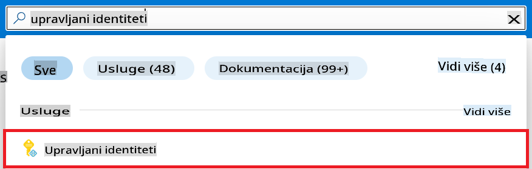

1. Kliknite na **+ Create**.

    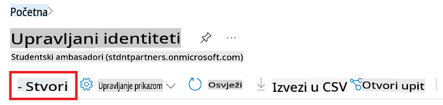

1. Izvršite sljedeće zadatke:

    - Odaberite svoju Azure **pretplatu**.  
    - Odaberite **grupu resursa** koju ćete koristiti (kreirajte novu ako je potrebno).  
    - Odaberite **Regiju** koju želite koristiti.  
    - Unesite **Naziv**. Vrijednost mora biti jedinstvena.  

    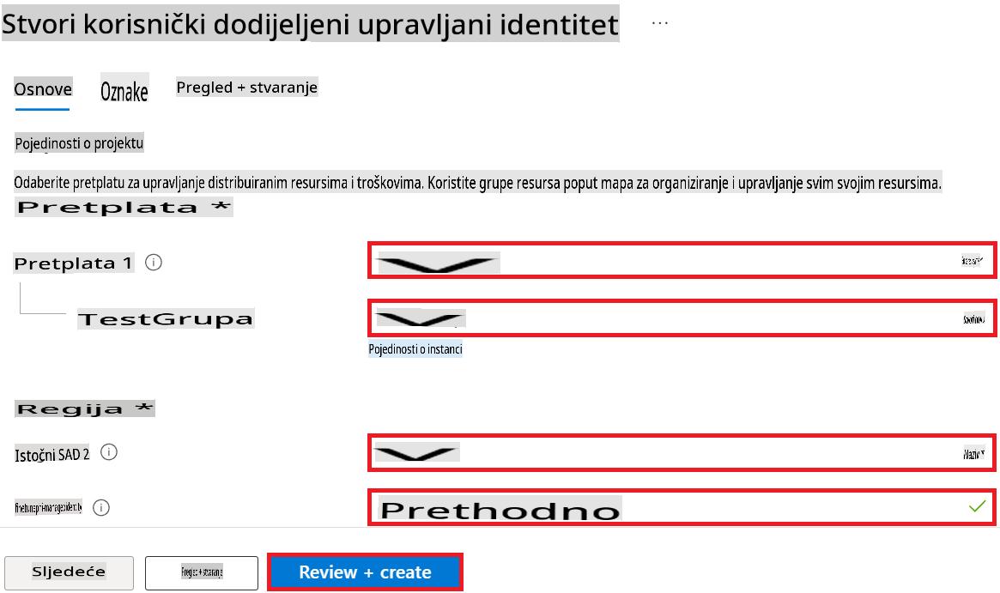

1. Kliknite na **Review + create**.

1. Kliknite na **+ Create**.

#### Dodavanje Contributor uloge Managed Identity

1. Navigirajte do resursa Managed Identity koji ste kreirali.  

1. Odaberite **Azure role assignments** s lijeve strane.  

1. Kliknite na **+Add role assignment** u navigacijskom izborniku.  

1. Na stranici Dodavanje uloge izvršite sljedeće zadatke:  
    - Odaberite **Opseg** kao **Resource group**.  
    - Odaberite svoju Azure **pretplatu**.  
    - Odaberite **grupu resursa** koju želite koristiti.  
    - Odaberite **Ulogu** kao **Contributor**.  

    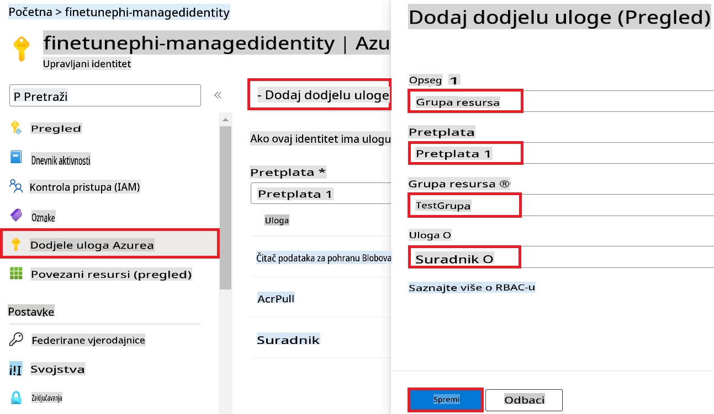

2. Kliknite na **Save**.

...
1. Posjetite [Azure ML Studio](https://ml.azure.com/home?wt.mc_id=studentamb_279723).

1. Odaberite **Compute** s lijeve trake.

1. Odaberite **Compute clusters** iz navigacijskog izbornika.

1. Odaberite **+ New**.

    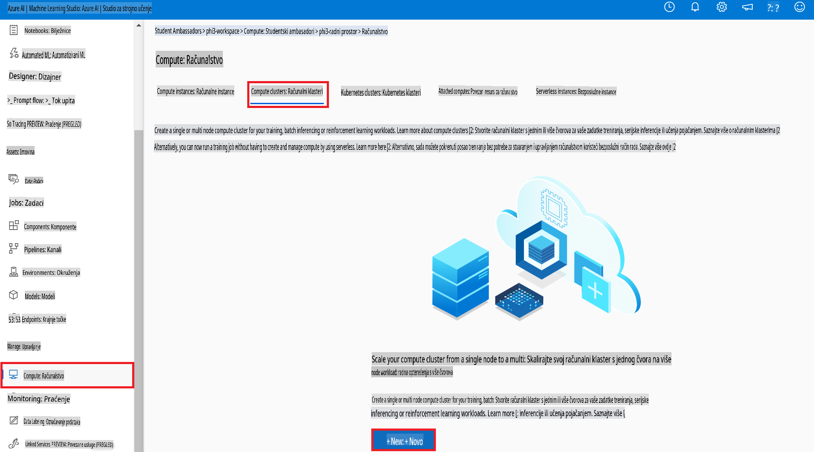

1. Izvršite sljedeće zadatke:

    - Odaberite **Region** koji želite koristiti.
    - Postavite **Virtual machine tier** na **Dedicated**.
    - Postavite **Virtual machine type** na **GPU**.
    - Postavite filtar **Virtual machine size** na **Select from all options**.
    - Odaberite **Virtual machine size** na **Standard_NC24ads_A100_v4**.

    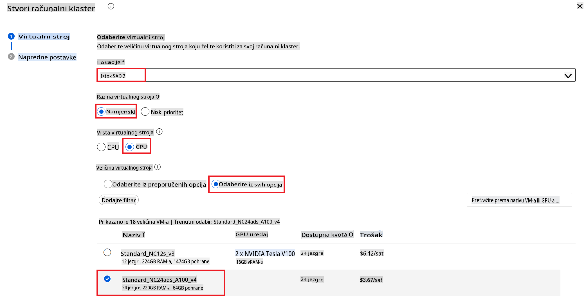

1. Odaberite **Next**.

1. Izvršite sljedeće zadatke:

    - Unesite **Compute name**. Vrijednost mora biti jedinstvena.
    - Postavite **Minimum number of nodes** na **0**.
    - Postavite **Maximum number of nodes** na **1**.
    - Postavite **Idle seconds before scale down** na **120**.

    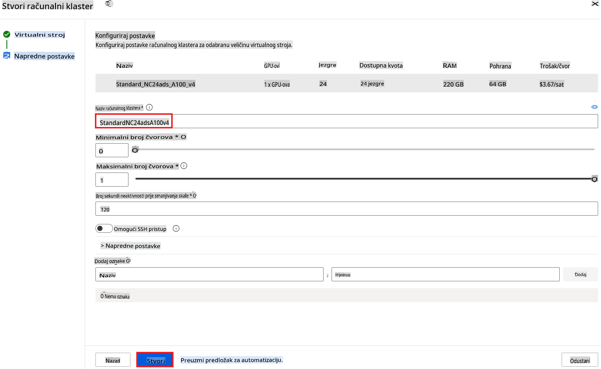

1. Odaberite **Create**.

#### Fino podešavanje Phi-3 modela

1. Posjetite [Azure ML Studio](https://ml.azure.com/home?wt.mc_id=studentamb_279723).

1. Odaberite Azure Machine Learning radni prostor koji ste kreirali.

    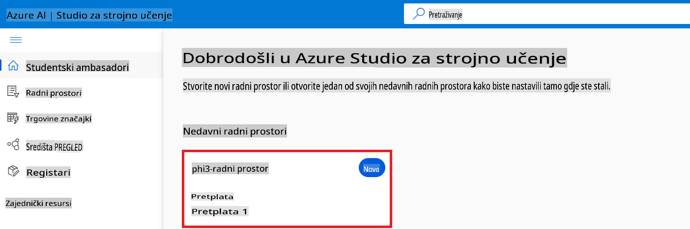

1. Izvršite sljedeće zadatke:

    - Odaberite **Model catalog** s lijeve trake.
    - Upišite *phi-3-mini-4k* u **search bar** i odaberite **Phi-3-mini-4k-instruct** iz ponuđenih opcija.

    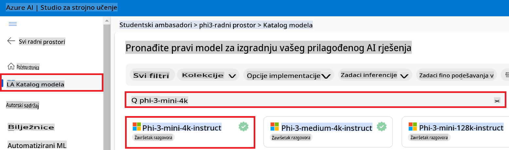

1. Odaberite **Fine-tune** iz navigacijskog izbornika.

    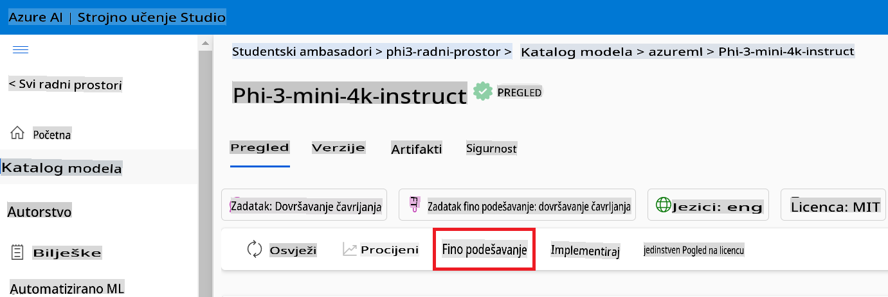

1. Izvršite sljedeće zadatke:

    - Postavite **Select task type** na **Chat completion**.
    - Odaberite **+ Select data** za učitavanje **Training data**.
    - Postavite vrstu učitavanja Validation data na **Provide different validation data**.
    - Odaberite **+ Select data** za učitavanje **Validation data**.

    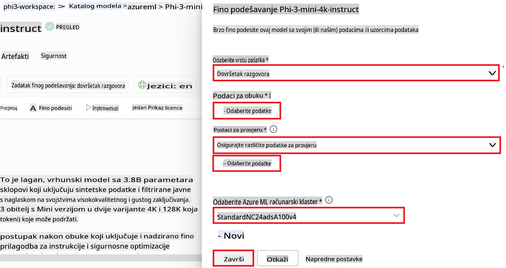

    > [!TIP]
    >
    > Možete odabrati **Advanced settings** za prilagodbu konfiguracija poput **learning_rate** i **lr_scheduler_type** kako biste optimizirali proces finog podešavanja prema vašim specifičnim potrebama.

1. Odaberite **Finish**.

1. U ovoj vježbi uspješno ste fino podesili Phi-3 model koristeći Azure Machine Learning. Imajte na umu da proces finog podešavanja može potrajati. Nakon pokretanja zadatka finog podešavanja, trebate pričekati dok se ne završi. Status zadatka možete pratiti odlaskom na karticu Jobs s lijeve strane u vašem Azure Machine Learning radnom prostoru. U sljedećem dijelu, implementirat ćete fino podešeni model i integrirati ga s Prompt flowom.

    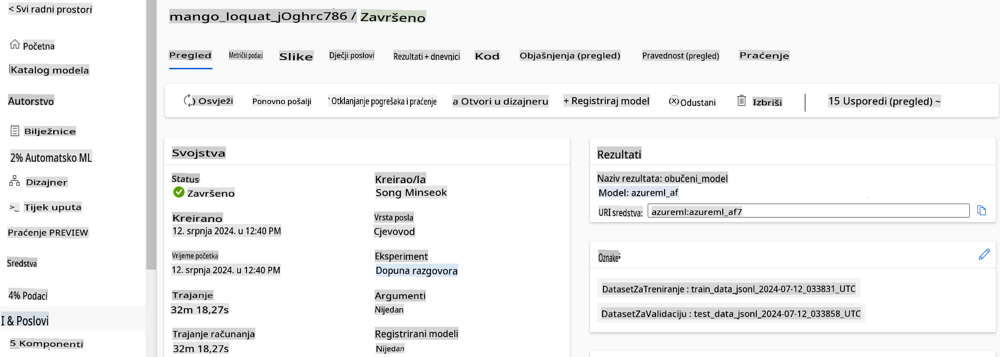

### Implementacija fino podešenog Phi-3 modela

Kako biste integrirali fino podešeni Phi-3 model s Prompt flowom, trebate ga implementirati kako bi bio dostupan za stvarnu inferenciju. Ovaj proces uključuje registraciju modela, kreiranje online endpointa i implementaciju modela.

U ovoj vježbi ćete:

- Registrirati fino podešeni model u Azure Machine Learning radnom prostoru.
- Kreirati online endpoint.
- Implementirati registrirani fino podešeni Phi-3 model.

#### Registracija fino podešenog modela

1. Posjetite [Azure ML Studio](https://ml.azure.com/home?wt.mc_id=studentamb_279723).

1. Odaberite Azure Machine Learning radni prostor koji ste kreirali.

    

1. Odaberite **Models** s lijeve trake.
1. Odaberite **+ Register**.
1. Odaberite **From a job output**.

    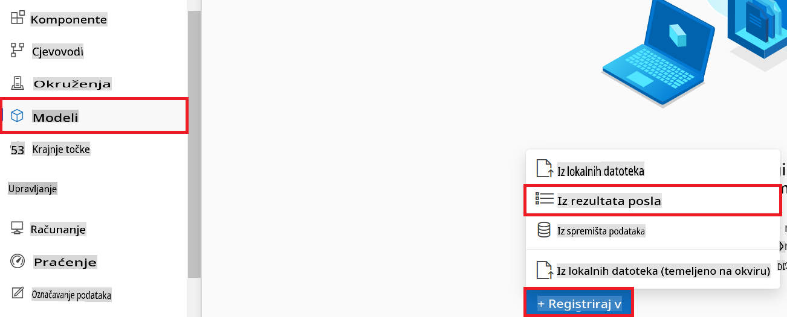

1. Odaberite zadatak koji ste kreirali.

    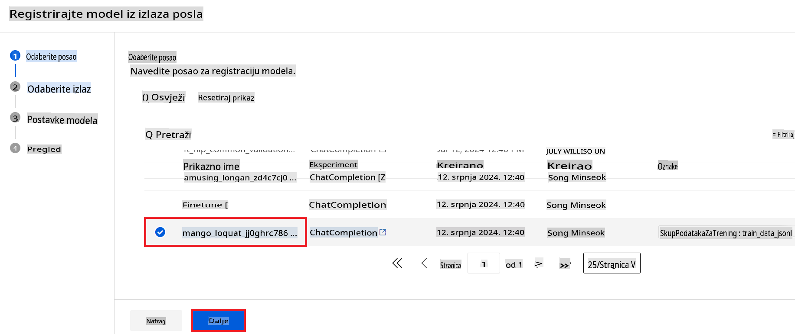

1. Odaberite **Next**.

1. Postavite **Model type** na **MLflow**.

1. Provjerite je li **Job output** odabran; trebao bi biti automatski odabran.

    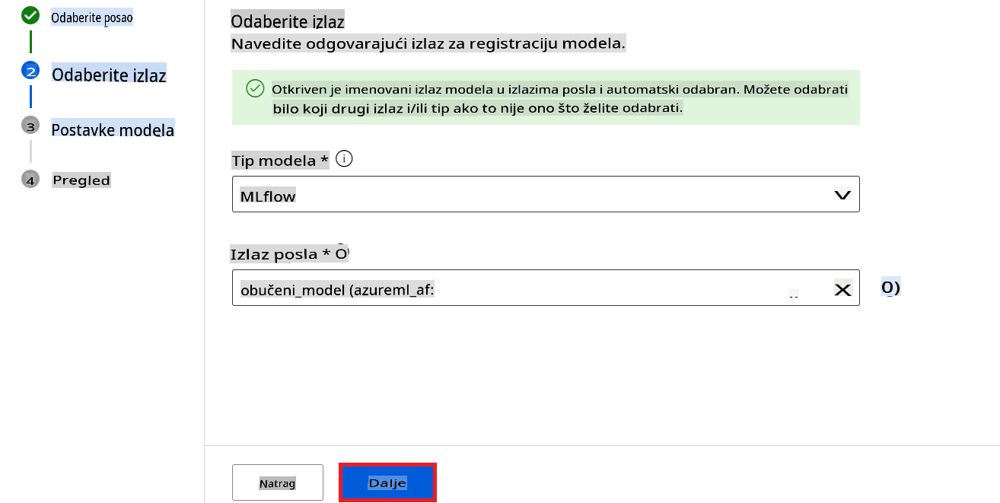

2. Odaberite **Next**.

3. Odaberite **Register**.

    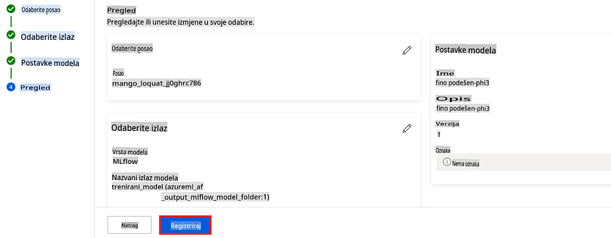

4. Svoj registrirani model možete vidjeti odlaskom na izbornik **Models** s lijeve strane.

    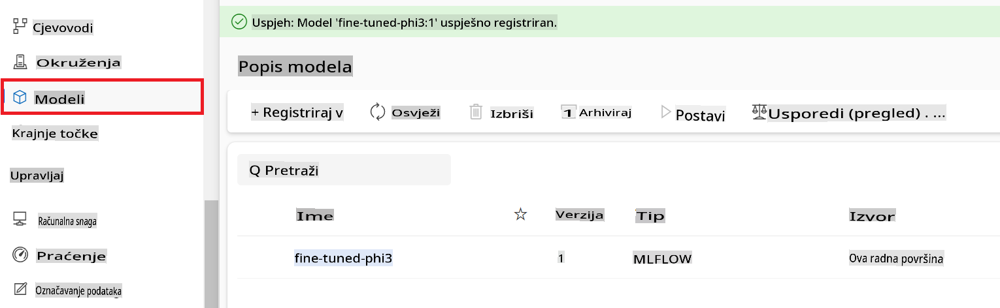

#### Implementacija fino podešenog modela

1. Idite u Azure Machine Learning radni prostor koji ste kreirali.

1. Odaberite **Endpoints** s lijeve trake.

1. Odaberite **Real-time endpoints** iz navigacijskog izbornika.

    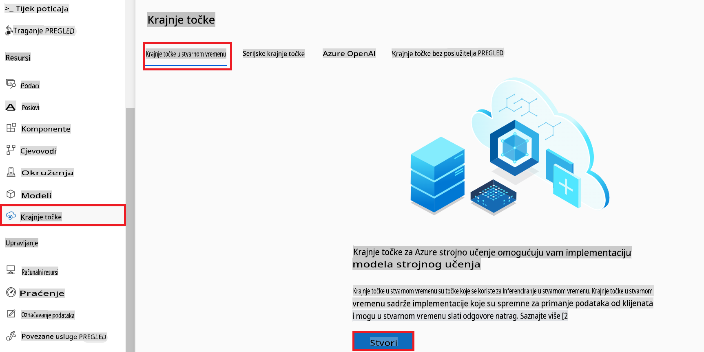

1. Odaberite **Create**.

1. Odaberite registrirani model koji ste kreirali.

    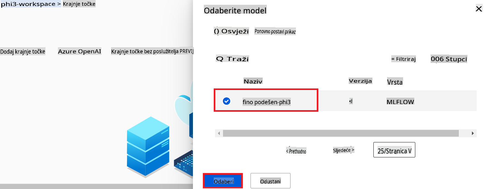

1. Odaberite **Select**.

1. Izvršite sljedeće zadatke:

    - Postavite **Virtual machine** na *Standard_NC6s_v3*.
    - Odaberite broj **Instance count** koji želite koristiti, primjerice *1*.
    - Postavite **Endpoint** na **New** za kreiranje endpointa.
    - Unesite **Endpoint name**. Vrijednost mora biti jedinstvena.
    - Unesite **Deployment name**. Vrijednost mora biti jedinstvena.

    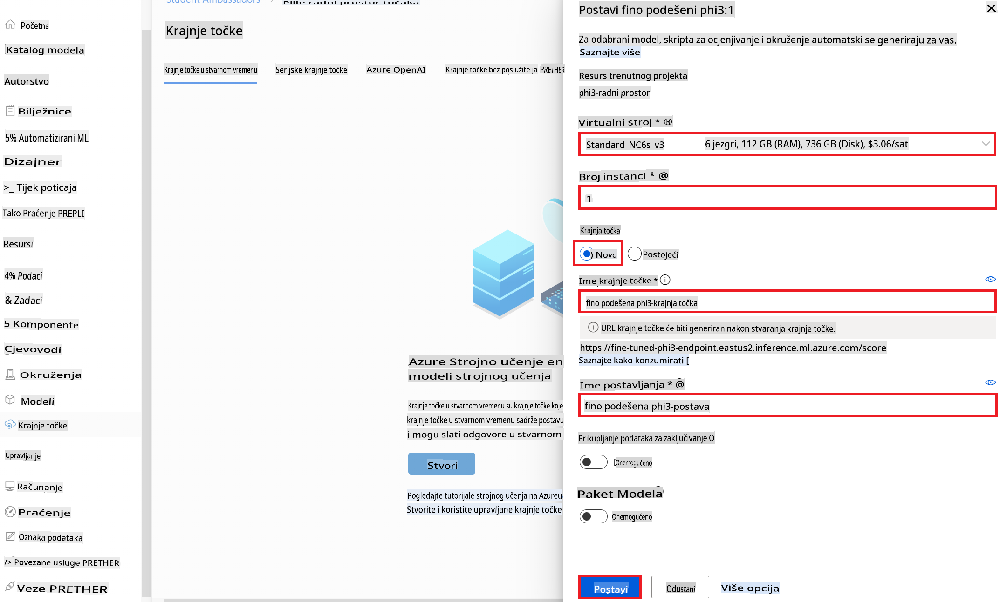

1. Odaberite **Deploy**.

> [!WARNING]
> Kako biste izbjegli dodatne troškove na vašem računu, obavezno izbrišite kreirani endpoint u Azure Machine Learning radnom prostoru.
>

#### Provjera statusa implementacije u Azure Machine Learning radnom prostoru

1. Idite u Azure Machine Learning radni prostor koji ste kreirali.

1. Odaberite **Endpoints** s lijeve trake.

1. Odaberite endpoint koji ste kreirali.

    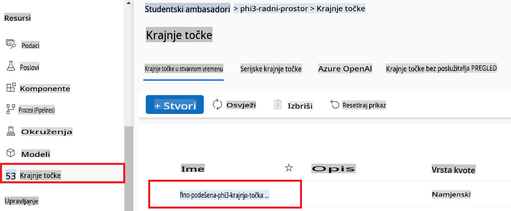

1. Na ovoj stranici možete upravljati endpointima tijekom procesa implementacije.

> [!NOTE]
> Nakon što je implementacija dovršena, provjerite je li **Live traffic** postavljen na **100%**. Ako nije, odaberite **Update traffic** kako biste prilagodili postavke prometa. Imajte na umu da ne možete testirati model ako je promet postavljen na 0%.
>
> 
>
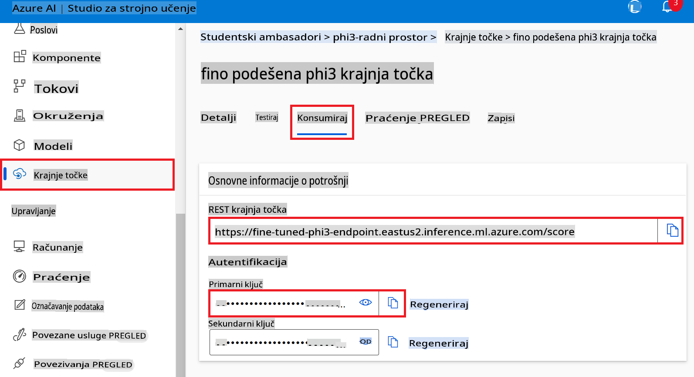

#### Dodavanje prilagožene veze

1. Posjetite [Azure AI Foundry](https://ai.azure.com/?WT.mc_id=aiml-137032-kinfeylo).

1. Otvorite projekt Azure AI Foundry koji ste kreirali.

1. U projektu koji ste kreirali odaberite **Postavke** na lijevoj bočnoj traci.

1. Odaberite **+ Nova veza**.

    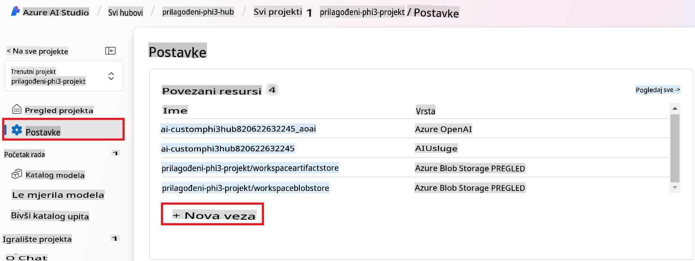

1. Iz izbornika odaberite **Prilagođeni ključevi**.

    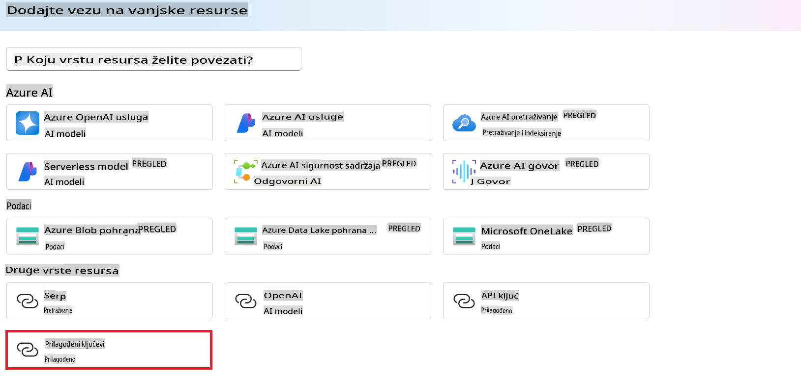

1. Izvršite sljedeće zadatke:

    - Odaberite **+ Dodaj parove ključ-vrijednost**.
    - Za naziv ključa unesite **endpoint** i zalijepite krajnju točku koju ste kopirali iz Azure ML Studija u polje za vrijednost.
    - Ponovno odaberite **+ Dodaj parove ključ-vrijednost**.
    - Za naziv ključa unesite **key** i zalijepite ključ koji ste kopirali iz Azure ML Studija u polje za vrijednost.
    - Nakon dodavanja ključeva, označite **je tajno** kako biste spriječili izlaganje ključa.

    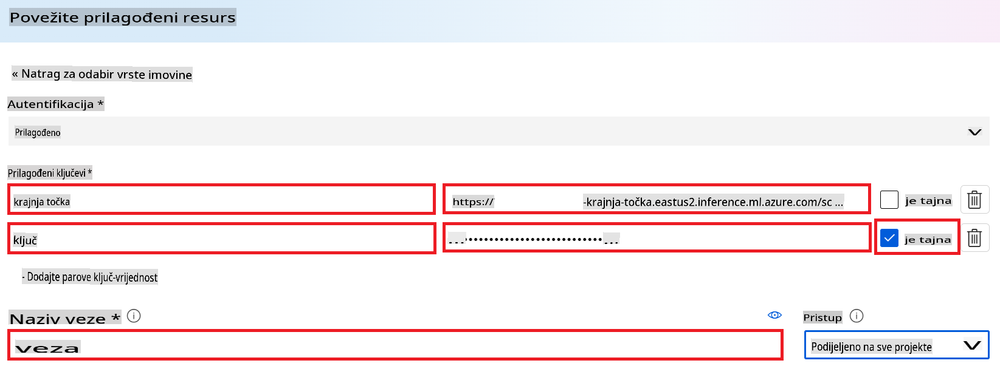

1. Odaberite **Dodaj vezu**.

#### Kreiranje Prompt flowa

Dodali ste prilagoženu vezu u Azure AI Foundry. Sada ćemo kreirati Prompt flow koristeći sljedeće korake. Zatim ćete povezati ovaj Prompt flow s prilagođenom vezom kako biste mogli koristiti fino podešeni model unutar Prompt flowa.

1. Otvorite projekt Azure AI Foundry koji ste kreirali.

1. Odaberite **Prompt flow** na lijevoj bočnoj traci.

1. Odaberite **+ Kreiraj** iz navigacijskog izbornika.

    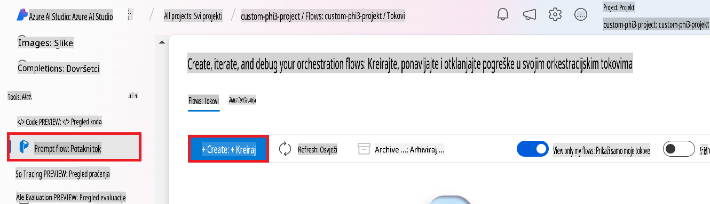

1. Iz izbornika odaberite **Chat flow**.

    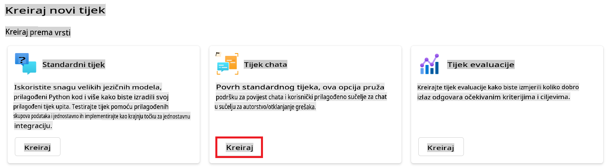

1. Unesite **Naziv mape** koju želite koristiti.

    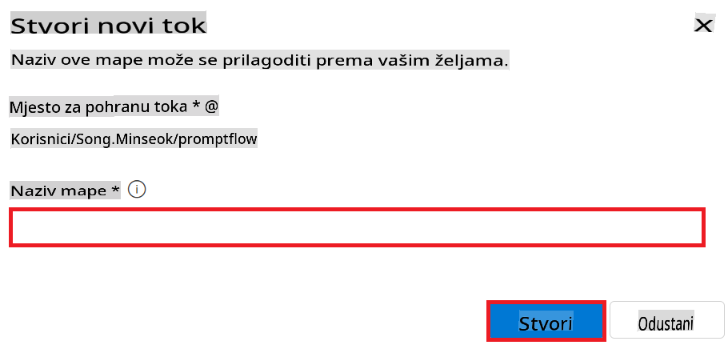

2. Odaberite **Kreiraj**.

#### Postavljanje Prompt flowa za razgovor s prilagođenim Phi-3 modelom

Potrebno je integrirati fino podešeni Phi-3 model u Prompt flow. Međutim, postojeći Prompt flow nije dizajniran za ovu svrhu. Stoga morate redizajnirati Prompt flow kako biste omogućili integraciju prilagođenog modela.

1. U Prompt flowu izvršite sljedeće zadatke za ponovno kreiranje postojećeg toka:

    - Odaberite **Način rada s izvornom datotekom**.
    - Obrišite sav postojeći kod u datoteci *flow.dag.yml*.
    - Dodajte sljedeći kod u datoteku *flow.dag.yml*.

        ```yml
        inputs:
          input_data:
            type: string
            default: "Who founded Microsoft?"

        outputs:
          answer:
            type: string
            reference: ${integrate_with_promptflow.output}

        nodes:
        - name: integrate_with_promptflow
          type: python
          source:
            type: code
            path: integrate_with_promptflow.py
          inputs:
            input_data: ${inputs.input_data}
        ```

    - Odaberite **Spremi**.

    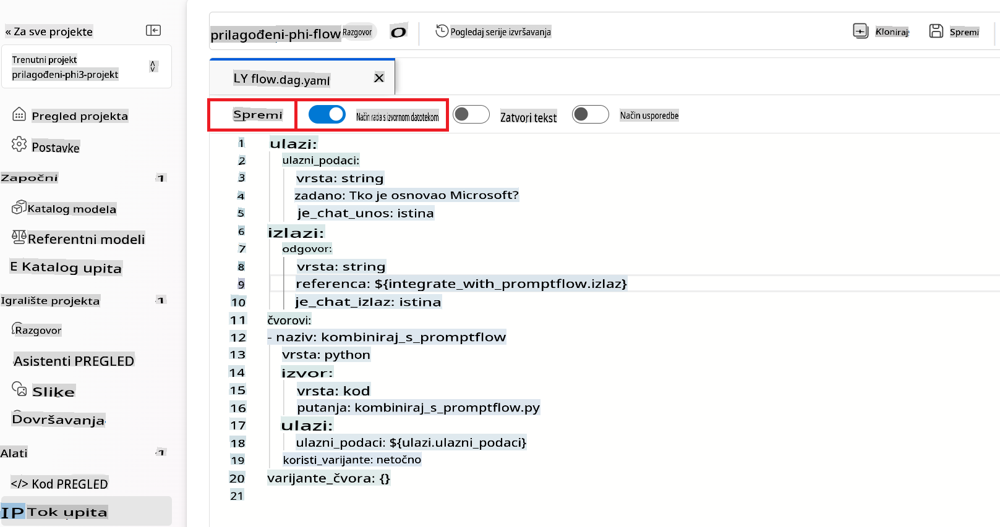

1. Dodajte sljedeći kod u datoteku *integrate_with_promptflow.py* kako biste koristili prilagođeni Phi-3 model u Prompt flowu.

    ```python
    import logging
    import requests
    from promptflow import tool
    from promptflow.connections import CustomConnection

    # Logging setup
    logging.basicConfig(
        format="%(asctime)s - %(levelname)s - %(name)s - %(message)s",
        datefmt="%Y-%m-%d %H:%M:%S",
        level=logging.DEBUG
    )
    logger = logging.getLogger(__name__)

    def query_phi3_model(input_data: str, connection: CustomConnection) -> str:
        """
        Send a request to the Phi-3 model endpoint with the given input data using Custom Connection.
        """

        # "connection" is the name of the Custom Connection, "endpoint", "key" are the keys in the Custom Connection
        endpoint_url = connection.endpoint
        api_key = connection.key

        headers = {
            "Content-Type": "application/json",
            "Authorization": f"Bearer {api_key}"
        }
        data = {
            "input_data": {
                "input_string": [
                    {"role": "user", "content": input_data}
                ],
                "parameters": {
                    "temperature": 0.7,
                    "max_new_tokens": 128
                }
            }
        }
        try:
            response = requests.post(endpoint_url, json=data, headers=headers)
            response.raise_for_status()
            
            # Log the full JSON response
            logger.debug(f"Full JSON response: {response.json()}")

            result = response.json()["output"]
            logger.info("Successfully received response from Azure ML Endpoint.")
            return result
        except requests.exceptions.RequestException as e:
            logger.error(f"Error querying Azure ML Endpoint: {e}")
            raise

    @tool
    def my_python_tool(input_data: str, connection: CustomConnection) -> str:
        """
        Tool function to process input data and query the Phi-3 model.
        """
        return query_phi3_model(input_data, connection)

    ```

    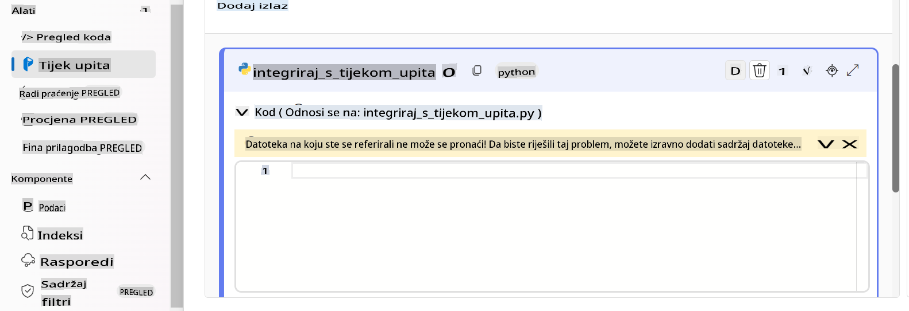

> [!NOTE]
> Za detaljnije informacije o korištenju Prompt flowa u Azure AI Foundry, pogledajte [Prompt flow u Azure AI Foundry](https://learn.microsoft.com/azure/ai-studio/how-to/prompt-flow).

1. Odaberite **Unos za chat**, **Izlaz za chat** kako biste omogućili razgovor s vašim modelom.

    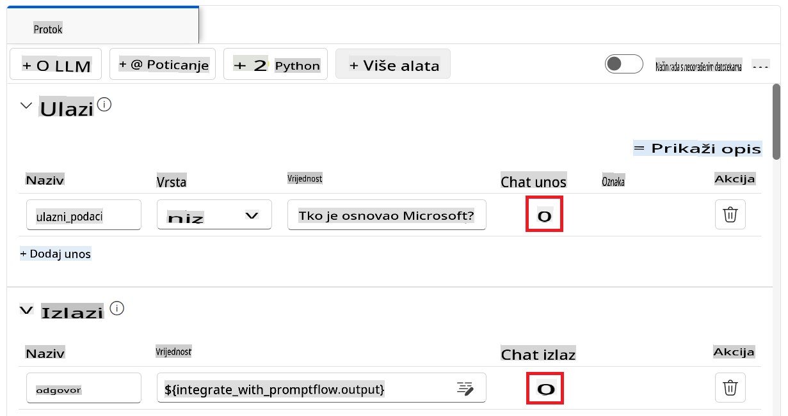

1. Sada ste spremni za razgovor s vašim prilagođenim Phi-3 modelom. U sljedećoj vježbi naučit ćete kako pokrenuti Prompt flow i koristiti ga za razgovor s vašim fino podešenim Phi-3 modelom.

> [!NOTE]
>
> Redizajnirani tok trebao bi izgledati kao na slici ispod:
>
> 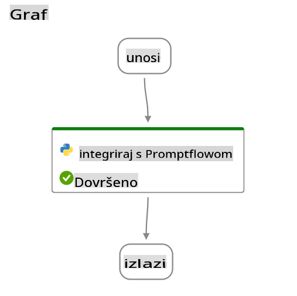
>

### Razgovor s vašim prilagođenim Phi-3 modelom

Sada kada ste fino podesili i integrirali vaš prilagođeni Phi-3 model s Prompt flowom, spremni ste za početak interakcije s njim. Ova vježba vodi vas kroz proces postavljanja i pokretanja razgovora s vašim modelom koristeći Prompt flow. Slijedeći ove korake, moći ćete u potpunosti iskoristiti mogućnosti vašeg fino podešenog Phi-3 modela za razne zadatke i razgovore.

- Razgovarajte s vašim prilagođenim Phi-3 modelom koristeći Prompt flow.

#### Pokretanje Prompt flowa

1. Odaberite **Pokreni sesije računalne obrade** za pokretanje Prompt flowa.

    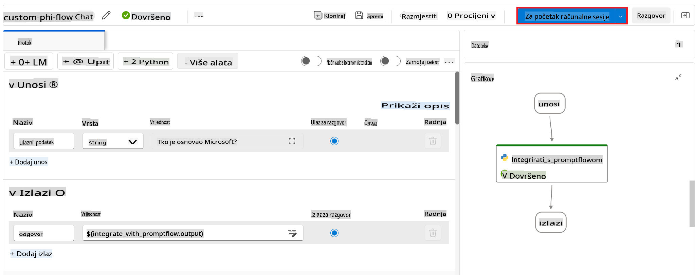

1. Odaberite **Potvrdi i parsiraj unos** za ažuriranje parametara.

    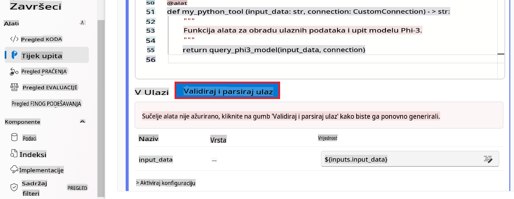

1. Odaberite **Vrijednost** prilagođene veze koju ste kreirali. Na primjer, *connection*.

    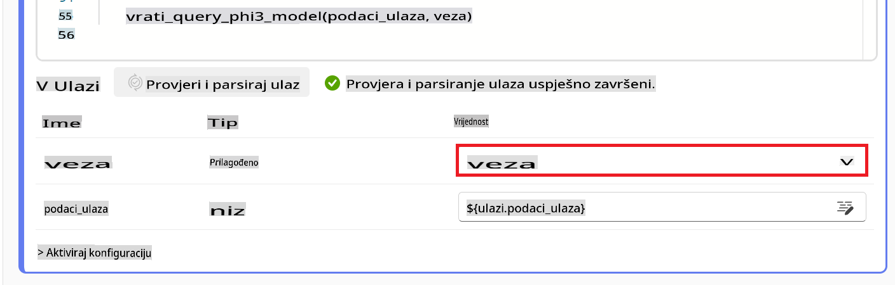

#### Razgovor s vašim prilagođenim modelom

1. Odaberite **Chat**.

    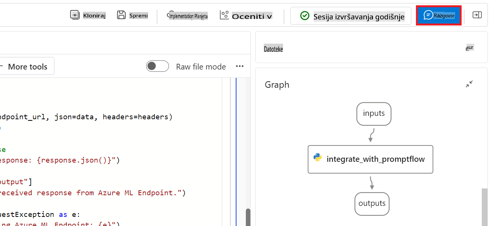

1. Evo primjera rezultata: Sada možete razgovarati s vašim prilagođenim Phi-3 modelom. Preporučuje se postavljati pitanja temeljena na podacima korištenim za fino podešavanje.

    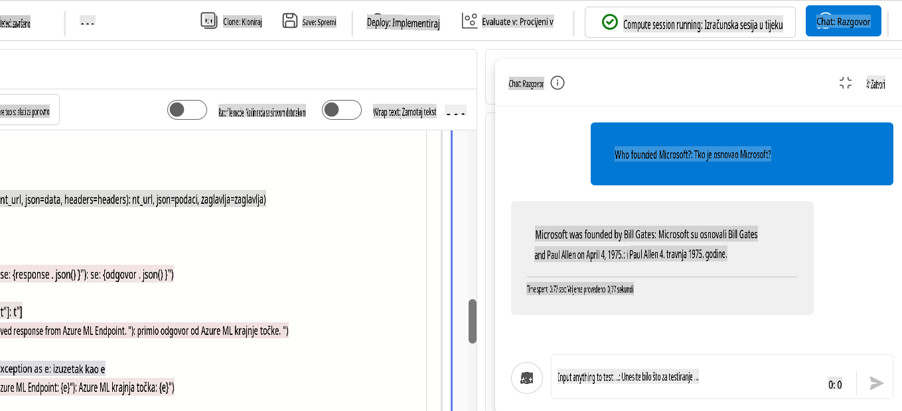

**Odricanje od odgovornosti**:  
Ovaj dokument je preveden pomoću usluga strojno baziranog AI prevođenja. Iako težimo točnosti, imajte na umu da automatski prijevodi mogu sadržavati pogreške ili netočnosti. Izvorni dokument na izvornom jeziku treba smatrati mjerodavnim izvorom. Za ključne informacije preporučuje se profesionalni prijevod od strane ljudskog prevoditelja. Ne preuzimamo odgovornost za nesporazume ili pogrešne interpretacije proizašle iz korištenja ovog prijevoda.