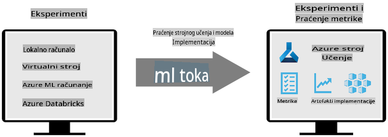
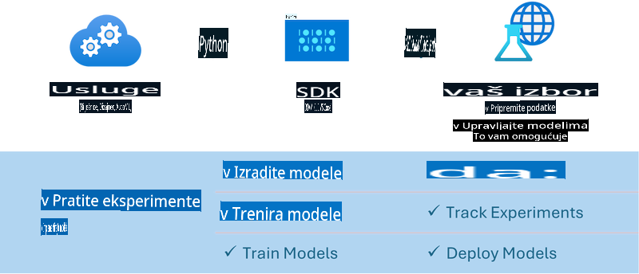

# MLflow

[MLflow](https://mlflow.org/) je otvorena platforma dizajnirana za upravljanje cjelokupnim životnim ciklusom strojnog učenja.


MLFlow se koristi za upravljanje životnim ciklusom strojnog učenja, uključujući eksperimentiranje, reproducibilnost, implementaciju i centralni registar modela. Trenutno MLFlow nudi četiri komponente:

- **MLflow Tracking:** Bilježi i pretražuje eksperimente, kod, konfiguracije podataka i rezultate.
- **MLflow Projects:** Pakira kod za znanost o podacima u format koji omogućuje reproduciranje na bilo kojoj platformi.
- **Mlflow Models:** Implementira modele strojnog učenja u raznim okruženjima za posluživanje.
- **Model Registry:** Pohranjuje, označava i upravlja modelima u centralnom repozitoriju.

Uključuje mogućnosti praćenja eksperimenata, pakiranja koda u reproducibilne procese te dijeljenja i implementacije modela. MLFlow je integriran u Databricks i podržava razne biblioteke za strojno učenje, čineći ga neovisnim o biblioteci. Može se koristiti s bilo kojom bibliotekom za strojno učenje i bilo kojim programskim jezikom, jer nudi REST API i CLI za praktičnost.



Ključne značajke MLFlow-a uključuju:

- **Praćenje Eksperimenata:** Bilježenje i uspoređivanje parametara i rezultata.
- **Upravljanje Modelima:** Implementacija modela na raznim platformama za posluživanje i inferenciju.
- **Registar Modela:** Zajedničko upravljanje životnim ciklusom MLFlow modela, uključujući verzioniranje i bilješke.
- **Projekti:** Pakiranje ML koda za dijeljenje ili produkcijsku upotrebu.

MLFlow također podržava MLOps ciklus, koji uključuje pripremu podataka, registraciju i upravljanje modelima, pakiranje modela za izvršavanje, implementaciju usluga i praćenje modela. Cilj mu je pojednostaviti proces prelaska s prototipa na produkcijski tijek rada, posebno u oblaku i rubnim okruženjima.

## E2E Scenarij - Izrada omotača i korištenje Phi-3 kao MLFlow modela

U ovom E2E primjeru pokazat ćemo dva različita pristupa izradi omotača oko Phi-3 malog jezičnog modela (SLM) te njegovo pokretanje kao MLFlow modela lokalno ili u oblaku, npr. u Azure Machine Learning radnom prostoru.



| Projekt | Opis | Lokacija |
| ------------ | ----------- | -------- |
| Transformer Pipeline | Transformer Pipeline je najjednostavnija opcija za izradu omotača ako želite koristiti HuggingFace model s MLFlow-ovim eksperimentalnim transformers okusom. | [**TransformerPipeline.ipynb**](../../../../../../code/06.E2E/E2E_Phi-3-MLflow_TransformerPipeline.ipynb) |
| Custom Python Wrapper | U trenutku pisanja, transformer pipeline nije podržavao generiranje MLFlow omotača za HuggingFace modele u ONNX formatu, čak ni s eksperimentalnim optimum Python paketom. Za ovakve slučajeve, možete izraditi vlastiti Python omotač za MLFlow način rada. | [**CustomPythonWrapper.ipynb**](../../../../../../code/06.E2E/E2E_Phi-3-MLflow_CustomPythonWrapper.ipynb) |

## Projekt: Transformer Pipeline

1. Trebat će vam relevantni Python paketi iz MLFlow-a i HuggingFace-a:

    ``` Python
    import mlflow
    import transformers
    ```

2. Zatim biste trebali pokrenuti transformer pipeline pozivajući se na ciljni Phi-3 model u HuggingFace registru. Kao što se vidi iz kartice modela _Phi-3-mini-4k-instruct_, njegov zadatak je tipa “Generiranje Teksta”:

    ``` Python
    pipeline = transformers.pipeline(
        task = "text-generation",
        model = "microsoft/Phi-3-mini-4k-instruct"
    )
    ```

3. Sada možete spremiti transformer pipeline svog Phi-3 modela u MLFlow format i pružiti dodatne detalje poput ciljnog puta za artefakte, specifičnih postavki konfiguracije modela i tipa inferencijskog API-ja:

    ``` Python
    model_info = mlflow.transformers.log_model(
        transformers_model = pipeline,
        artifact_path = "phi3-mlflow-model",
        model_config = model_config,
        task = "llm/v1/chat"
    )
    ```

## Projekt: Custom Python Wrapper

1. Ovdje možemo iskoristiti Microsoftov [ONNX Runtime generate() API](https://github.com/microsoft/onnxruntime-genai) za inferenciju ONNX modela i enkodiranje/dekodiranje tokena. Morate odabrati _onnxruntime_genai_ paket za svoju ciljnu računarsku platformu, s primjerom ispod koji cilja CPU:

    ``` Python
    import mlflow
    from mlflow.models import infer_signature
    import onnxruntime_genai as og
    ```

1. Naša prilagođena klasa implementira dvije metode: _load_context()_ za inicijalizaciju **ONNX modela** Phi-3 Mini 4K Instruct, **generator parametara** i **tokenizera**; te _predict()_ za generiranje izlaznih tokena za zadani prompt:

    ``` Python
    class Phi3Model(mlflow.pyfunc.PythonModel):
        def load_context(self, context):
            # Retrieving model from the artifacts
            model_path = context.artifacts["phi3-mini-onnx"]
            model_options = {
                 "max_length": 300,
                 "temperature": 0.2,         
            }
        
            # Defining the model
            self.phi3_model = og.Model(model_path)
            self.params = og.GeneratorParams(self.phi3_model)
            self.params.set_search_options(**model_options)
            
            # Defining the tokenizer
            self.tokenizer = og.Tokenizer(self.phi3_model)
    
        def predict(self, context, model_input):
            # Retrieving prompt from the input
            prompt = model_input["prompt"][0]
            self.params.input_ids = self.tokenizer.encode(prompt)
    
            # Generating the model's response
            response = self.phi3_model.generate(self.params)
    
            return self.tokenizer.decode(response[0][len(self.params.input_ids):])
    ```

1. Sada možete koristiti funkciju _mlflow.pyfunc.log_model()_ za generiranje prilagođenog Python omotača (u pickle formatu) za Phi-3 model, zajedno s izvornim ONNX modelom i potrebnim ovisnostima:

    ``` Python
    model_info = mlflow.pyfunc.log_model(
        artifact_path = artifact_path,
        python_model = Phi3Model(),
        artifacts = {
            "phi3-mini-onnx": "cpu_and_mobile/cpu-int4-rtn-block-32-acc-level-4",
        },
        input_example = input_example,
        signature = infer_signature(input_example, ["Run"]),
        extra_pip_requirements = ["torch", "onnxruntime_genai", "numpy"],
    )
    ```

## Potpisi generiranih MLFlow modela

1. U koraku 3 gore spomenutog Transformer Pipeline projekta, postavili smo zadatak MLFlow modela na “_llm/v1/chat_”. Takva uputa generira API omotač modela, kompatibilan s OpenAI-evim Chat API-jem, kao što je prikazano dolje:

    ``` Python
    {inputs: 
      ['messages': Array({content: string (required), name: string (optional), role: string (required)}) (required), 'temperature': double (optional), 'max_tokens': long (optional), 'stop': Array(string) (optional), 'n': long (optional), 'stream': boolean (optional)],
    outputs: 
      ['id': string (required), 'object': string (required), 'created': long (required), 'model': string (required), 'choices': Array({finish_reason: string (required), index: long (required), message: {content: string (required), name: string (optional), role: string (required)} (required)}) (required), 'usage': {completion_tokens: long (required), prompt_tokens: long (required), total_tokens: long (required)} (required)],
    params: 
      None}
    ```

1. Kao rezultat toga, možete predati svoj prompt u sljedećem formatu:

    ``` Python
    messages = [{"role": "user", "content": "What is the capital of Spain?"}]
    ```

1. Zatim koristite post-procesiranje kompatibilno s OpenAI API-jem, npr. _response[0][‘choices’][0][‘message’][‘content’]_, kako biste uljepšali svoj izlaz u nešto poput ovoga:

    ``` JSON
    Question: What is the capital of Spain?
    
    Answer: The capital of Spain is Madrid. It is the largest city in Spain and serves as the political, economic, and cultural center of the country. Madrid is located in the center of the Iberian Peninsula and is known for its rich history, art, and architecture, including the Royal Palace, the Prado Museum, and the Plaza Mayor.
    
    Usage: {'prompt_tokens': 11, 'completion_tokens': 73, 'total_tokens': 84}
    ```

1. U koraku 3 gore spomenutog Custom Python Wrapper projekta, omogućujemo MLFlow paketu da generira potpis modela iz danog primjera unosa. Potpis našeg MLFlow omotača izgledat će ovako:

    ``` Python
    {inputs: 
      ['prompt': string (required)],
    outputs: 
      [string (required)],
    params: 
      None}
    ```

1. Dakle, naš prompt bi trebao sadržavati ključ rječnika "prompt", slično ovome:

    ``` Python
    {"prompt": "<|system|>You are a stand-up comedian.<|end|><|user|>Tell me a joke about atom<|end|><|assistant|>",}
    ```

1. Izlaz modela tada će biti dostavljen u formatu stringa:

    ``` JSON
    Alright, here's a little atom-related joke for you!
    
    Why don't electrons ever play hide and seek with protons?
    
    Because good luck finding them when they're always "sharing" their electrons!
    
    Remember, this is all in good fun, and we're just having a little atomic-level humor!
    ```

**Odricanje od odgovornosti**:  
Ovaj dokument je preveden pomoću usluga strojno baziranog AI prijevoda. Iako nastojimo osigurati točnost, imajte na umu da automatski prijevodi mogu sadržavati pogreške ili netočnosti. Izvorni dokument na izvornom jeziku treba smatrati mjerodavnim izvorom. Za ključne informacije preporučuje se profesionalni prijevod od strane ljudskog prevoditelja. Ne snosimo odgovornost za nesporazume ili pogrešne interpretacije koje proizlaze iz korištenja ovog prijevoda.