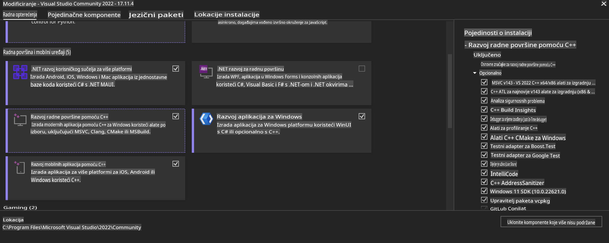
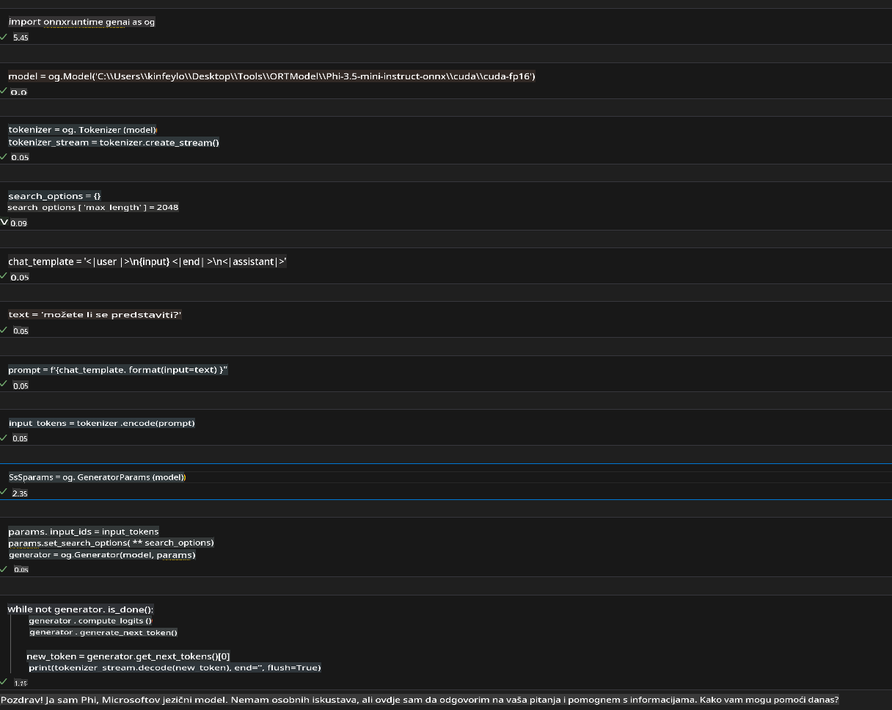
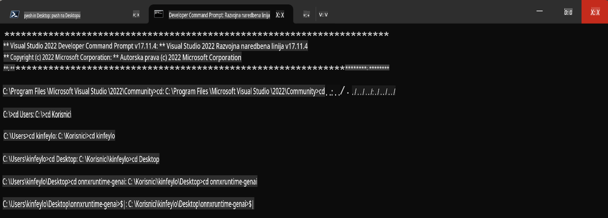

# **Vodič za OnnxRuntime GenAI Windows GPU**

Ovaj vodič pruža korake za postavljanje i korištenje ONNX Runtime (ORT) s GPU-ovima na Windowsu. Dizajniran je kako bi vam pomogao iskoristiti GPU akceleraciju za vaše modele, poboljšavajući performanse i učinkovitost.

Dokument sadrži smjernice o:

- Postavljanju okruženja: Upute za instalaciju potrebnih ovisnosti poput CUDA, cuDNN i ONNX Runtime.
- Konfiguraciji: Kako konfigurirati okruženje i ONNX Runtime za učinkovito korištenje GPU resursa.
- Savjeti za optimizaciju: Preporuke za fino podešavanje GPU postavki za optimalne performanse.

### **1. Python 3.10.x /3.11.8**

   ***Napomena*** Preporučuje se korištenje [miniforge](https://github.com/conda-forge/miniforge/releases/latest/download/Miniforge3-Windows-x86_64.exe) kao Python okruženja.

   ```bash

   conda create -n pydev python==3.11.8

   conda activate pydev

   ```

   ***Podsjetnik*** Ako imate instaliranu bilo koju ONNX Python biblioteku, deinstalirajte je.

### **2. Instalirajte CMake pomoću winget-a**


   ```bash

   winget install -e --id Kitware.CMake

   ```

### **3. Instalirajte Visual Studio 2022 - Razvoj za stolna računala s C++**

   ***Napomena*** Ako ne želite kompajlirati, možete preskočiti ovaj korak.



### **4. Instalirajte NVIDIA upravljački program**

1. **NVIDIA GPU upravljački program**  [https://www.nvidia.com/en-us/drivers/](https://www.nvidia.com/en-us/drivers/)

2. **NVIDIA CUDA 12.4** [https://developer.nvidia.com/cuda-12-4-0-download-archive](https://developer.nvidia.com/cuda-12-4-0-download-archive)

3. **NVIDIA CUDNN 9.4**  [https://developer.nvidia.com/cudnn-downloads](https://developer.nvidia.com/cudnn-downloads)

***Podsjetnik*** Tijekom instalacije koristite zadane postavke.

### **5. Postavite NVIDIA okruženje**

Kopirajte NVIDIA CUDNN 9.4 lib, bin, include u NVIDIA CUDA 12.4 lib, bin, include.

- kopirajte datoteke iz *'C:\Program Files\NVIDIA\CUDNN\v9.4\bin\12.6'* u *'C:\Program Files\NVIDIA GPU Computing Toolkit\CUDA\v12.4\bin*

- kopirajte datoteke iz *'C:\Program Files\NVIDIA\CUDNN\v9.4\include\12.6'* u *'C:\Program Files\NVIDIA GPU Computing Toolkit\CUDA\v12.4\include*

- kopirajte datoteke iz *'C:\Program Files\NVIDIA\CUDNN\v9.4\lib\12.6'* u *'C:\Program Files\NVIDIA GPU Computing Toolkit\CUDA\v12.4\lib\x64'*

### **6. Preuzmite Phi-3.5-mini-instruct-onnx**


   ```bash

   winget install -e --id Git.Git

   winget install -e --id GitHub.GitLFS

   git lfs install

   git clone https://huggingface.co/microsoft/Phi-3.5-mini-instruct-onnx

   ```

### **7. Pokretanje InferencePhi35Instruct.ipynb**

   Otvorite [Notebook](../../../../../../code/09.UpdateSamples/Aug/ortgpu-phi35-instruct.ipynb) i izvršite ga.



### **8. Kompajliranje ORT GenAI GPU-a**

   ***Napomena*** 
   
   1. Prvo deinstalirajte sve što je povezano s onnx, onnxruntime i onnxruntime-genai.

   
   ```bash

   pip list 
   
   ```

   Zatim deinstalirajte sve onnxruntime biblioteke, npr.

   ```bash

   pip uninstall onnxruntime

   pip uninstall onnxruntime-genai

   pip uninstall onnxruntume-genai-cuda
   
   ```

   2. Provjerite podršku za Visual Studio ekstenzije.

   Provjerite mapu C:\Program Files\NVIDIA GPU Computing Toolkit\CUDA\v12.4\extras kako biste osigurali da se mapa C:\Program Files\NVIDIA GPU Computing Toolkit\CUDA\v12.4\extras\visual_studio_integration nalazi tamo. 
   
   Ako je nema, provjerite druge mape Cuda toolkit upravljačkih programa i kopirajte mapu visual_studio_integration i njen sadržaj u C:\Program Files\NVIDIA GPU Computing Toolkit\CUDA\v12.4\extras\visual_studio_integration.

   - Ako ne želite kompajlirati, možete preskočiti ovaj korak.

   ```bash

   git clone https://github.com/microsoft/onnxruntime-genai

   ```

   - Preuzmite [https://github.com/microsoft/onnxruntime/releases/download/v1.19.2/onnxruntime-win-x64-gpu-1.19.2.zip](https://github.com/microsoft/onnxruntime/releases/download/v1.19.2/onnxruntime-win-x64-gpu-1.19.2.zip)

   - Raspakirajte onnxruntime-win-x64-gpu-1.19.2.zip, preimenujte ga u **ort** i kopirajte mapu ort u onnxruntime-genai.

   - Koristeći Windows Terminal, otvorite Developer Command Prompt za VS 2022 i idite u mapu onnxruntime-genai.



   - Kompajlirajte s vašim Python okruženjem.

   
   ```bash

   cd onnxruntime-genai

   python build.py --use_cuda  --cuda_home "C:\Program Files\NVIDIA GPU Computing Toolkit\CUDA\v12.4" --config Release
 

   cd build/Windows/Release/Wheel

   pip install .whl

   ```

**Odricanje od odgovornosti**:  
Ovaj dokument je preveden korištenjem usluga strojno baziranog AI prijevoda. Iako nastojimo postići točnost, imajte na umu da automatizirani prijevodi mogu sadržavati pogreške ili netočnosti. Izvorni dokument na izvornom jeziku treba smatrati mjerodavnim izvorom. Za ključne informacije preporučuje se profesionalni prijevod od strane ljudskog prevoditelja. Ne preuzimamo odgovornost za bilo kakve nesporazume ili pogrešne interpretacije proizašle iz korištenja ovog prijevoda.