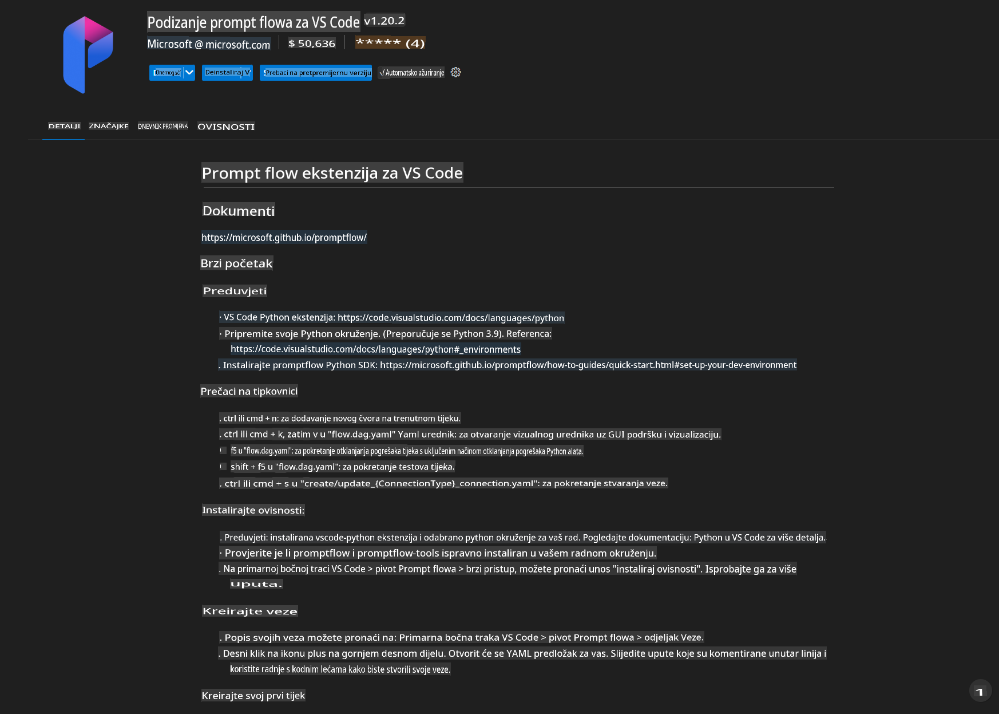
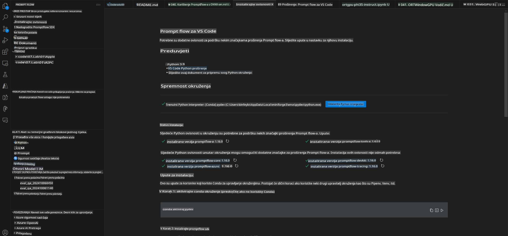
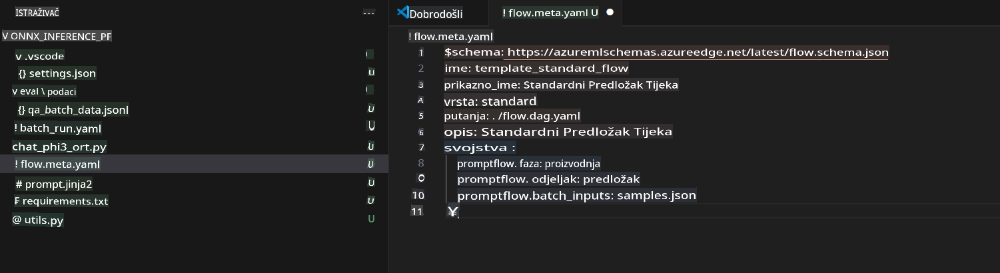
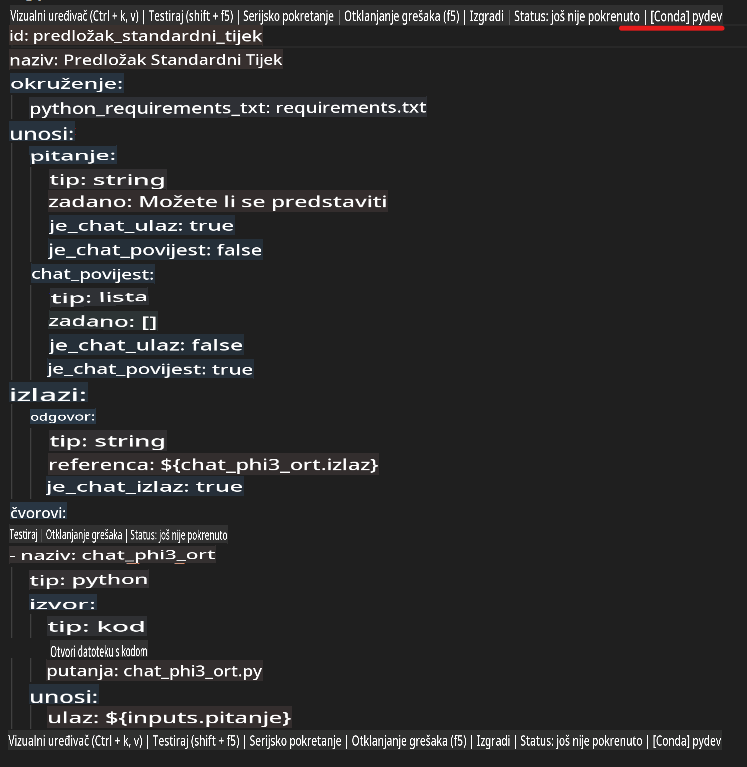
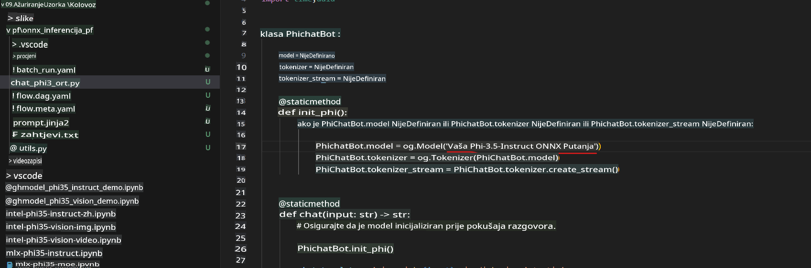
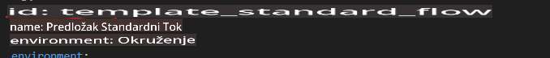
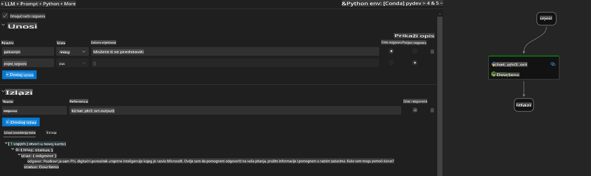
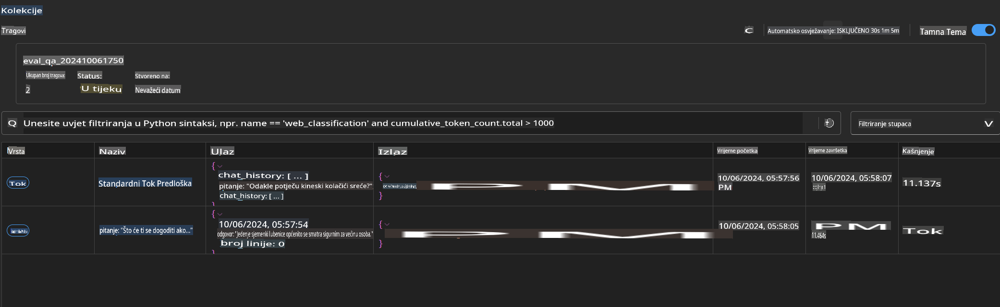

# Korištenje Windows GPU-a za stvaranje Prompt Flow rješenja s Phi-3.5-Instruct ONNX

Sljedeći dokument je primjer kako koristiti PromptFlow s ONNX-om (Open Neural Network Exchange) za razvoj AI aplikacija temeljenih na Phi-3 modelima.

PromptFlow je skup alata za razvoj koji olakšava cjelokupni razvojni ciklus AI aplikacija temeljenih na velikim jezičnim modelima (LLM), od ideje i prototipiranja do testiranja i evaluacije.

Integracijom PromptFlow-a s ONNX-om, programeri mogu:

- Optimizirati performanse modela: Iskoristiti ONNX za učinkovitu inferenciju i implementaciju modela.
- Pojednostaviti razvoj: Koristiti PromptFlow za upravljanje radnim procesom i automatizaciju repetitivnih zadataka.
- Poboljšati suradnju: Olakšati bolju suradnju među članovima tima pružanjem jedinstvenog razvojnog okruženja.

**Prompt flow** je skup alata za razvoj koji olakšava cjelokupni razvojni ciklus AI aplikacija temeljenih na LLM-ovima, od ideje, prototipa, testiranja, evaluacije do implementacije u produkciju i praćenja. Omogućuje jednostavnije kreiranje promptova i razvoj LLM aplikacija produkcijske kvalitete.

Prompt flow može se povezati s OpenAI, Azure OpenAI Service i prilagodljivim modelima (Huggingface, lokalni LLM/SLM). Naš cilj je implementirati kvantizirani ONNX model Phi-3.5 u lokalne aplikacije. Prompt flow nam može pomoći bolje planirati poslovanje i dovršiti lokalna rješenja temeljena na Phi-3.5. U ovom primjeru, kombinirat ćemo ONNX Runtime GenAI biblioteku kako bismo dovršili Prompt Flow rješenje temeljeno na Windows GPU-u.

## **Instalacija**

### **ONNX Runtime GenAI za Windows GPU**

Pročitajte ovaj vodič za postavljanje ONNX Runtime GenAI za Windows GPU [kliknite ovdje](./ORTWindowGPUGuideline.md)

### **Postavljanje Prompt flow-a u VSCode**

1. Instalirajte Prompt flow proširenje za VS Code



2. Nakon instalacije Prompt flow proširenja za VS Code, kliknite na proširenje i odaberite **Installation dependencies** te slijedite ovaj vodič za instalaciju Prompt flow SDK-a u svoje okruženje.



3. Preuzmite [Primjer koda](../../../../../../code/09.UpdateSamples/Aug/pf/onnx_inference_pf) i otvorite ga u VS Code-u.



4. Otvorite **flow.dag.yaml** kako biste odabrali svoje Python okruženje.



   Otvorite **chat_phi3_ort.py** kako biste promijenili lokaciju svog Phi-3.5-instruct ONNX modela.



5. Pokrenite svoj Prompt flow za testiranje.

Otvorite **flow.dag.yaml** i kliknite na vizualni uređivač.



Nakon što kliknete, pokrenite ga za testiranje.



1. Možete pokrenuti batch u terminalu kako biste provjerili više rezultata.

```bash

pf run create --file batch_run.yaml --stream --name 'Your eval qa name'    

```

Rezultate možete provjeriti u svom zadano postavljenom pregledniku.



**Odricanje od odgovornosti**:  
Ovaj dokument je preveden korištenjem usluga strojnog prevođenja temeljenih na umjetnoj inteligenciji. Iako težimo točnosti, imajte na umu da automatizirani prijevodi mogu sadržavati pogreške ili netočnosti. Izvorni dokument na izvornom jeziku treba smatrati mjerodavnim izvorom. Za ključne informacije preporučuje se profesionalni prijevod od strane stručnjaka. Ne preuzimamo odgovornost za nesporazume ili pogrešna tumačenja koja mogu proizaći iz korištenja ovog prijevoda.