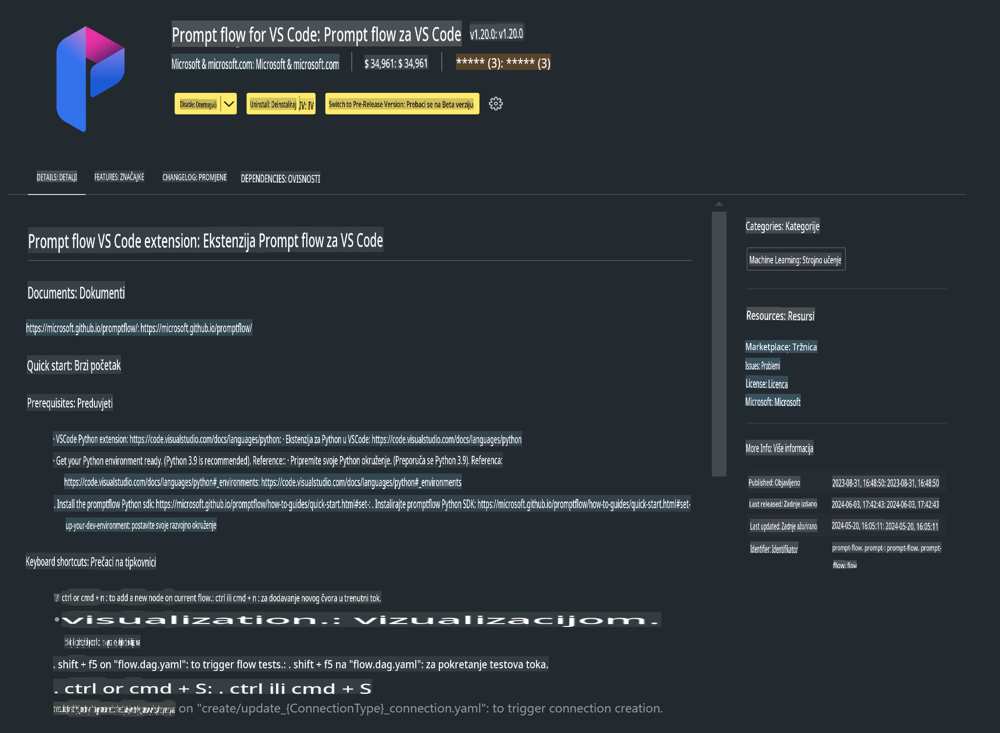

# **Lab 0 - Instalacija**

Kada uđemo u Lab, potrebno je konfigurirati odgovarajuće okruženje:

### **1. Python 3.11+**

Preporučuje se korištenje miniforge za konfiguraciju Python okruženja.

Za konfiguraciju miniforge pogledajte [https://github.com/conda-forge/miniforge](https://github.com/conda-forge/miniforge)

Nakon što ste konfigurirali miniforge, pokrenite sljedeću naredbu u Power Shellu:

```bash

conda create -n pyenv python==3.11.8 -y

conda activate pyenv

```

### **2. Instalirajte Prompt flow SDK**

U Labu 1 koristimo Prompt flow, pa je potrebno konfigurirati Prompt flow SDK.

```bash

pip install promptflow --upgrade

```

Možete provjeriti promptflow SDK ovom naredbom:

```bash

pf --version

```

### **3. Instalirajte Visual Studio Code Prompt flow ekstenziju**



### **4. Apple's MLX Framework**

MLX je okvir za nizove namijenjen istraživanju strojnog učenja na Apple Silicon procesorima, koji dolazi od Appleovog tima za istraživanje strojnog učenja. Možete koristiti **Apple MLX framework** za ubrzanje LLM / SLM modela s Apple Silicon procesorima. Ako želite saznati više, pročitajte [https://github.com/microsoft/PhiCookBook/blob/main/md/01.Introduction/03/MLX_Inference.md](https://github.com/microsoft/PhiCookBook/blob/main/md/01.Introduction/03/MLX_Inference.md).

Instalirajte MLX framework biblioteku u bashu:

```bash

pip install mlx-lm

```

### **5. Ostale Python biblioteke**

Kreirajte datoteku requirements.txt i dodajte ovaj sadržaj:

```txt

notebook
numpy 
scipy 
scikit-learn 
matplotlib 
pandas 
pillow 
graphviz

```

### **6. Instalirajte NVM**

Instalirajte nvm u PowerShellu:

```bash

brew install nvm

```

Instalirajte nodejs 18.20:

```bash

nvm install 18.20.0

nvm use 18.20.0

```

### **7. Instalirajte Visual Studio Code podršku za razvoj**

```bash

npm install --global yo generator-code

```

Čestitamo! Uspješno ste konfigurirali SDK. Sljedeći korak je prelazak na praktične zadatke.

**Odricanje od odgovornosti**:  
Ovaj dokument je preveden korištenjem usluga automatskog prijevoda temeljenih na umjetnoj inteligenciji. Iako težimo točnosti, molimo vas da budete svjesni da automatski prijevodi mogu sadržavati pogreške ili netočnosti. Izvorni dokument na njegovom izvornom jeziku treba smatrati mjerodavnim izvorom. Za ključne informacije preporučuje se profesionalni prijevod od strane čovjeka. Ne snosimo odgovornost za bilo kakva nesporazume ili pogrešna tumačenja koja proizlaze iz korištenja ovog prijevoda.