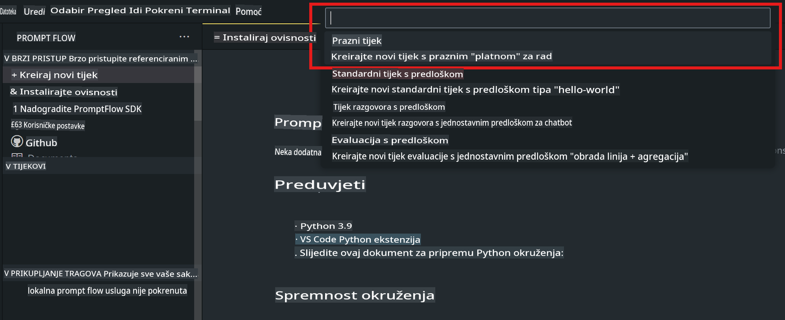
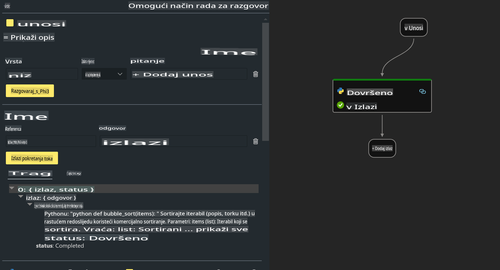

# **Lab 2 - Pokreni Prompt flow s Phi-3-mini u AIPC**

## **Što je Prompt flow**

Prompt flow je skup razvojnih alata dizajniranih za pojednostavljenje cijelog razvojnog ciklusa AI aplikacija temeljenih na LLM-u, od ideje, prototipiranja, testiranja, evaluacije do implementacije u produkciju i praćenja. Olakšava inženjering promptova i omogućuje vam izgradnju LLM aplikacija s produkcijskom kvalitetom.

Uz Prompt flow možete:

- Kreirati tijekove koji povezuju LLM-ove, promptove, Python kod i druge alate u izvršni tijek rada.

- Jednostavno debugirati i iterirati svoje tijekove, posebno interakciju s LLM-ovima.

- Evaluirati svoje tijekove, izračunavati metrike kvalitete i performansi s većim skupovima podataka.

- Integrirati testiranje i evaluaciju u vaš CI/CD sustav kako biste osigurali kvalitetu tijeka.

- Implementirati svoje tijekove na odabranu platformu za posluživanje ili ih lako integrirati u bazu koda vaše aplikacije.

- (Opcionalno, ali vrlo preporučeno) Suradnja s vašim timom korištenjem cloud verzije Prompt flow-a u Azure AI-u.


## **Izgradnja tijekova za generiranje koda na Apple Siliconu**

***Napomena***: Ako niste dovršili instalaciju okruženja, posjetite [Lab 0 - Instalacije](./01.Installations.md)

1. Otvorite Prompt flow ekstenziju u Visual Studio Code-u i kreirajte prazan projekt tijeka.



2. Dodajte parametre za Ulaze i Izlaze te dodajte Python kod kao novi tijek.



Možete se referirati na ovu strukturu (flow.dag.yaml) kako biste konstruirali svoj tijek.

```yaml

inputs:
  prompt:
    type: string
    default: Write python code for Fibonacci serie. Please use markdown as output
outputs:
  result:
    type: string
    reference: ${gen_code_by_phi3.output}
nodes:
- name: gen_code_by_phi3
  type: python
  source:
    type: code
    path: gen_code_by_phi3.py
  inputs:
    prompt: ${inputs.prompt}


```

3. Kvantificirajte phi-3-mini

Želimo bolje pokrenuti SLM na lokalnim uređajima. Općenito, kvantificiramo model (INT4, FP16, FP32).

```bash

python -m mlx_lm.convert --hf-path microsoft/Phi-3-mini-4k-instruct

```

**Napomena:** zadana mapa je mlx_model 

4. Dodajte kod u ***Chat_With_Phi3.py***.

```python


from promptflow import tool

from mlx_lm import load, generate


# The inputs section will change based on the arguments of the tool function, after you save the code
# Adding type to arguments and return value will help the system show the types properly
# Please update the function name/signature per need
@tool
def my_python_tool(prompt: str) -> str:

    model_id = './mlx_model_phi3_mini'

    model, tokenizer = load(model_id)

    # <|user|>\nWrite python code for Fibonacci serie. Please use markdown as output<|end|>\n<|assistant|>

    response = generate(model, tokenizer, prompt="<|user|>\n" + prompt  + "<|end|>\n<|assistant|>", max_tokens=2048, verbose=True)

    return response


```

4. Možete testirati tijek putem Debug ili Run opcije kako biste provjerili je li generirani kod ispravan.


5. Pokrenite tijek kao razvojni API u terminalu.

```

pf flow serve --source ./ --port 8080 --host localhost   

```

Možete ga testirati u Postmanu / Thunder Clientu.


### **Napomena**

1. Prvo pokretanje traje dugo. Preporučuje se preuzimanje phi-3 modela putem Hugging face CLI-ja.

2. S obzirom na ograničenu računalnu snagu Intel NPU-a, preporučuje se korištenje Phi-3-mini-4k-instruct.

3. Koristimo Intel NPU Akceleraciju za kvantizaciju INT4 konverzije, ali ako ponovno pokrenete servis, potrebno je obrisati cache i nc_workshop mape.


## **Resursi**

1. Naučite Promptflow [https://microsoft.github.io/promptflow/](https://microsoft.github.io/promptflow/)

2. Naučite Intel NPU Akceleraciju [https://github.com/intel/intel-npu-acceleration-library](https://github.com/intel/intel-npu-acceleration-library)

3. Primjer koda, preuzmite [Local NPU Agent Sample Code](../../../../../../../../../code/07.Lab/01/AIPC/local-npu-agent)

**Odricanje od odgovornosti**:  
Ovaj dokument je preveden korištenjem AI usluga za automatski prijevod. Iako nastojimo osigurati točnost, imajte na umu da automatski prijevodi mogu sadržavati pogreške ili netočnosti. Izvorni dokument na njegovom izvornom jeziku treba smatrati mjerodavnim izvorom. Za ključne informacije preporučuje se profesionalni prijevod od strane stručnjaka. Ne preuzimamo odgovornost za nesporazume ili pogrešne interpretacije nastale korištenjem ovog prijevoda.