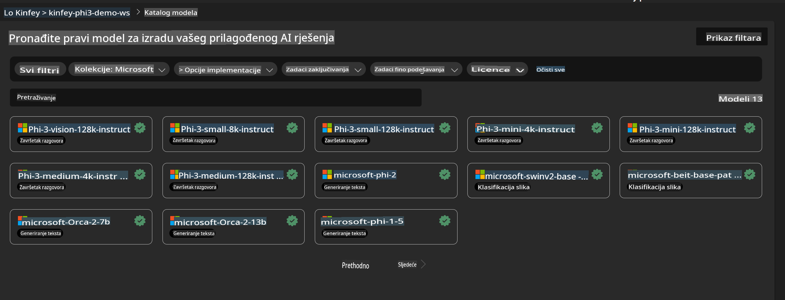
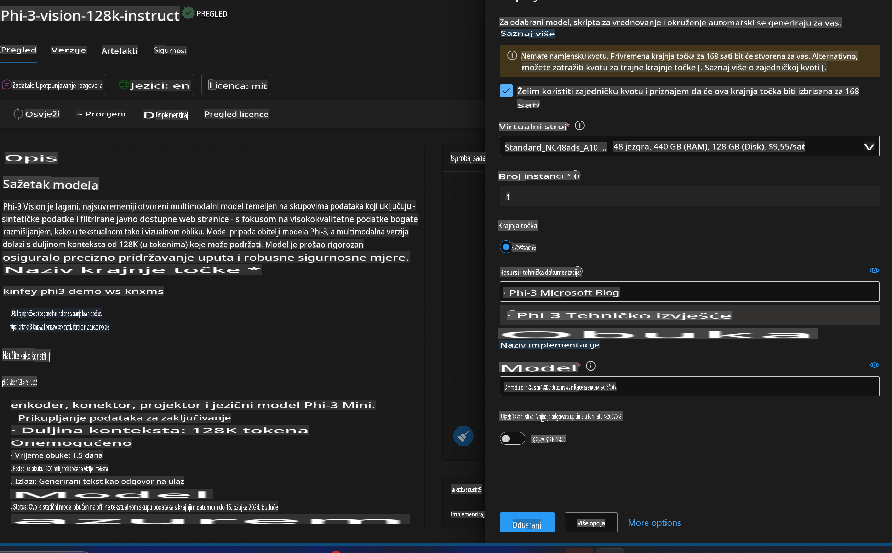

# **Lab 3 - Implementacija Phi-3-Vision na Azure Machine Learning Service**

Koristimo NPU za završetak produkcijskog postavljanja lokalnog koda, a zatim želimo omogućiti uvođenje PHI-3-VISION kako bismo ostvarili generiranje koda iz slika.

U ovom vodiču, brzo ćemo izgraditi uslugu Model As Service Phi-3 Vision unutar Azure Machine Learning Service.

***Napomena***: Phi-3 Vision zahtijeva računalnu snagu za brže generiranje sadržaja. Potrebna nam je računalna snaga u oblaku kako bismo to ostvarili.


### **1. Kreiranje Azure Machine Learning Service**

Potrebno je kreirati Azure Machine Learning Service na Azure Portalu. Ako želite saznati kako, posjetite sljedeći link [https://learn.microsoft.com/azure/machine-learning/quickstart-create-resources?view=azureml-api-2](https://learn.microsoft.com/azure/machine-learning/quickstart-create-resources?view=azureml-api-2)


### **2. Odabir Phi-3 Vision unutar Azure Machine Learning Service**




### **3. Implementacija Phi-3-Vision na Azure**




### **4. Testiranje krajnje točke u Postmanu**


***Napomena***

1. Parametri koji se prenose moraju uključivati Authorization, azureml-model-deployment i Content-Type. Potrebno je provjeriti informacije o implementaciji kako biste ih dobili.

2. Za prijenos parametara, Phi-3-Vision zahtijeva prijenos poveznice na sliku. Molimo pogledajte metodu GPT-4-Vision za prijenos parametara, primjerice:

```json

{
  "input_data":{
    "input_string":[
      {
        "role":"user",
        "content":[ 
          {
            "type": "text",
            "text": "You are a Python coding assistant.Please create Python code for image "
          },
          {
              "type": "image_url",
              "image_url": {
                "url": "https://ajaytech.co/wp-content/uploads/2019/09/index.png"
              }
          }
        ]
      }
    ],
    "parameters":{
          "temperature": 0.6,
          "top_p": 0.9,
          "do_sample": false,
          "max_new_tokens": 2048
    }
  }
}

```

3. Pozovite **/score** koristeći Post metodu.

**Čestitamo**! Završili ste brzo postavljanje PHI-3-VISION i isprobali kako koristiti slike za generiranje koda. Sljedeći korak je izgradnja aplikacija u kombinaciji s NPU-ovima i oblakom.

**Odricanje od odgovornosti**:  
Ovaj dokument je preveden koristeći usluge strojno vođenog AI prijevoda. Iako nastojimo postići točnost, imajte na umu da automatski prijevodi mogu sadržavati pogreške ili netočnosti. Izvorni dokument na njegovom izvornom jeziku treba smatrati mjerodavnim izvorom. Za ključne informacije preporučuje se profesionalni prijevod od strane čovjeka. Ne preuzimamo odgovornost za bilo kakve nesporazume ili pogrešne interpretacije proizašle iz korištenja ovog prijevoda.