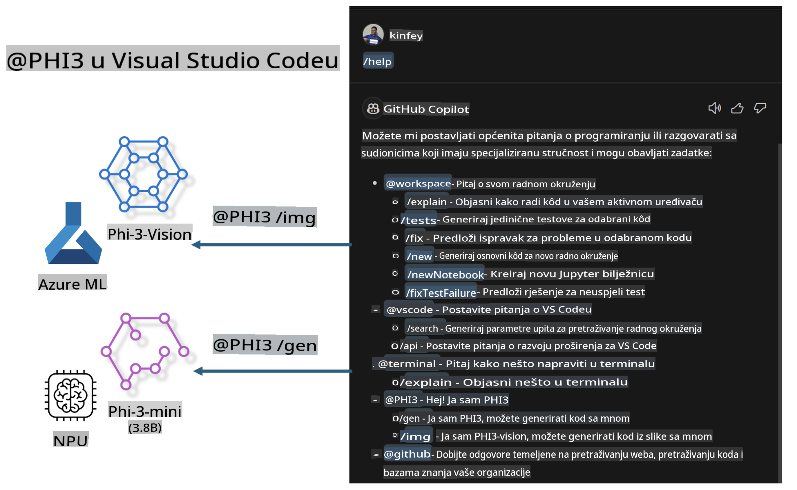

# **Izradite vlastiti Visual Studio Code GitHub Copilot Chat s Microsoft Phi-3 obitelji**

Jeste li koristili radni agent u GitHub Copilot Chatu? Želite li izraditi vlastitog agenta za kodiranje za svoj tim? Ova praktična radionica nastoji kombinirati open source model za izgradnju poslovnog agenta za kodiranje na razini poduzeća.

## **Osnove**

### **Zašto odabrati Microsoft Phi-3**

Phi-3 je serija modela koja uključuje phi-3-mini, phi-3-small i phi-3-medium, temeljene na različitim parametrima treniranja za generiranje teksta, dovršavanje dijaloga i generiranje koda. Također postoji phi-3-vision temeljen na Vision modelu. Prikladan je za poduzeća ili različite timove za stvaranje offline generativnih AI rješenja.

Preporučujemo da pročitate ovaj link [https://github.com/microsoft/PhiCookBook/blob/main/md/01.Introduction/01/01.PhiFamily.md](https://github.com/microsoft/PhiCookBook/blob/main/md/01.Introduction/01/01.PhiFamily.md)

### **Microsoft GitHub Copilot Chat**

Ekstenzija GitHub Copilot Chat pruža sučelje za razgovor koje vam omogućuje interakciju s GitHub Copilotom i dobivanje odgovora na pitanja vezana uz kodiranje izravno unutar VS Code-a, bez potrebe za pretraživanjem dokumentacije ili online foruma.

Copilot Chat koristi označavanje sintakse, uvlačenje i druge značajke formatiranja kako bi odgovori bili jasniji. Ovisno o vrsti pitanja korisnika, rezultat može sadržavati linkove na kontekst koji je Copilot koristio za generiranje odgovora, poput datoteka izvornog koda ili dokumentacije, ili gumbe za pristup funkcionalnostima VS Code-a.

- Copilot Chat integrira se u vaš tijek rada i pruža pomoć tamo gdje vam je potrebna:

- Pokrenite razgovor unutar uređivača ili terminala za pomoć tijekom kodiranja

- Koristite Chat pregled za AI asistenta koji je uvijek dostupan

- Pokrenite Brzi Chat za postavljanje kratkog pitanja i nastavite s radom

Možete koristiti GitHub Copilot Chat u raznim scenarijima, kao što su:

- Odgovaranje na pitanja vezana uz kodiranje i najbolje rješenje problema

- Objašnjavanje tuđeg koda i predlaganje poboljšanja

- Predlaganje ispravaka koda

- Generiranje testnih slučajeva

- Generiranje dokumentacije za kod

Preporučujemo da pročitate ovaj link [https://code.visualstudio.com/docs/copilot/copilot-chat](https://code.visualstudio.com/docs/copilot/copilot-chat?WT.mc_id=aiml-137032-kinfeylo)

###  **Microsoft GitHub Copilot Chat @workspace**

Korištenje **@workspace** u Copilot Chatu omogućuje vam postavljanje pitanja o cijeloj vašoj bazi koda. Na temelju pitanja, Copilot inteligentno pronalazi relevantne datoteke i simbole koje zatim koristi u odgovoru kao linkove i primjere koda.

Kako bi odgovorio na vaše pitanje, **@workspace** pretražuje iste izvore koje bi programer koristio pri navigaciji kroz bazu koda u VS Code-u:

- Sve datoteke u radnom prostoru, osim onih koje su ignorirane u .gitignore datoteci

- Strukturu direktorija s ugniježđenim mapama i nazivima datoteka

- Indeks pretrage koda na GitHubu, ako je radni prostor GitHub repozitorij indeksiran pretragom koda

- Simbole i definicije u radnom prostoru

- Trenutno odabrani tekst ili vidljivi tekst u aktivnom uređivaču

Napomena: .gitignore se zaobilazi ako imate otvorenu datoteku ili odabrani tekst unutar ignorirane datoteke.

Preporučujemo da pročitate ovaj link [[https://code.visualstudio.com/docs/copilot/copilot-chat](https://code.visualstudio.com/docs/copilot/workspace-context?WT.mc_id=aiml-137032-kinfeylo)]

## **Saznajte više o ovoj radionici**

GitHub Copilot značajno je unaprijedio programersku učinkovitost poduzeća, a svako poduzeće želi prilagoditi relevantne funkcije GitHub Copilota. Mnoga poduzeća prilagodila su ekstenzije slične GitHub Copilotu na temelju svojih poslovnih scenarija i open source modela. Za poduzeća, prilagođene ekstenzije su lakše za kontrolu, ali to također utječe na korisničko iskustvo. Ipak, GitHub Copilot ima jače funkcije u općim i profesionalnim scenarijima. Ako bi iskustvo moglo ostati dosljedno, bilo bi bolje prilagoditi vlastitu ekstenziju poduzeća. GitHub Copilot Chat pruža relevantne API-je za poduzeća kako bi proširila Chat iskustvo. Održavanje dosljednog iskustva uz prilagođene funkcije pruža bolje korisničko iskustvo.

Ova radionica uglavnom koristi Phi-3 model u kombinaciji s lokalnim NPU-om i Azure hibridom za izgradnju prilagođenog Agenta u GitHub Copilot Chatu ***@PHI3*** za pomoć programerima u poduzećima u generiranju koda ***(@PHI3 /gen)*** i generiranju koda na temelju slika ***(@PHI3 /img)***.

### ***Napomena:*** 

Ova radionica trenutno je implementirana na AIPC Intel CPU-u i Apple Siliconu. Nastavit ćemo ažurirati verziju za Qualcomm NPU.

## **Radionica**

| Naziv | Opis | AIPC | Apple |
| ------------ | ----------- | -------- |-------- |
| Lab0 - Instalacije(✅) | Konfigurirajte i instalirajte povezane alate i okruženja | [Go](./HOL/AIPC/01.Installations.md) |[Go](./HOL/Apple/01.Installations.md) |
| Lab1 - Pokrenite Prompt flow s Phi-3-mini (✅) | U kombinaciji s AIPC / Apple Siliconom, koristeći lokalni NPU za stvaranje generiranja koda pomoću Phi-3-mini | [Go](./HOL/AIPC/02.PromptflowWithNPU.md) |  [Go](./HOL/Apple/02.PromptflowWithMLX.md) |
| Lab2 - Implementacija Phi-3-vision na Azure Machine Learning Service(✅) | Generirajte kod implementacijom Model kataloga - Phi-3-vision slike iz Azure Machine Learning Service-a | [Go](./HOL/AIPC/03.DeployPhi3VisionOnAzure.md) |[Go](./HOL/Apple/03.DeployPhi3VisionOnAzure.md) |
| Lab3 - Stvorite @phi-3 agenta u GitHub Copilot Chatu(✅)  | Stvorite prilagođenog Phi-3 agenta u GitHub Copilot Chatu za dovršavanje generiranja koda, generiranje koda iz grafikona, RAG, itd. | [Go](./HOL/AIPC/04.CreatePhi3AgentInVSCode.md) | [Go](./HOL/Apple/04.CreatePhi3AgentInVSCode.md) |
| Uzorak koda (✅)  | Preuzmite uzorak koda | [Go](../../../../../../../code/07.Lab/01/AIPC) | [Go](../../../../../../../code/07.Lab/01/Apple) |

## **Resursi**

1. Phi-3 Cookbook [https://github.com/microsoft/Phi-3CookBook](https://github.com/microsoft/Phi-3CookBook)

2. Saznajte više o GitHub Copilotu [https://learn.microsoft.com/training/paths/copilot/](https://learn.microsoft.com/training/paths/copilot/?WT.mc_id=aiml-137032-kinfeylo)

3. Saznajte više o GitHub Copilot Chatu [https://learn.microsoft.com/training/paths/accelerate-app-development-using-github-copilot/](https://learn.microsoft.com/training/paths/accelerate-app-development-using-github-copilot/?WT.mc_id=aiml-137032-kinfeylo)

4. Saznajte više o API-ju za GitHub Copilot Chat [https://code.visualstudio.com/api/extension-guides/chat](https://code.visualstudio.com/api/extension-guides/chat?WT.mc_id=aiml-137032-kinfeylo)

5. Saznajte više o Azure AI Foundry [https://learn.microsoft.com/training/paths/create-custom-copilots-ai-studio/](https://learn.microsoft.com/training/paths/create-custom-copilots-ai-studio/?WT.mc_id=aiml-137032-kinfeylo)

6. Saznajte više o Model katalogu Azure AI Foundry-a [https://learn.microsoft.com/azure/ai-studio/how-to/model-catalog-overview](https://learn.microsoft.com/azure/ai-studio/how-to/model-catalog-overview)

**Odricanje od odgovornosti**:  
Ovaj dokument je preveden korištenjem usluga strojnog prevođenja temeljenih na umjetnoj inteligenciji. Iako nastojimo postići točnost, imajte na umu da automatski prijevodi mogu sadržavati pogreške ili netočnosti. Izvorni dokument na izvornom jeziku treba smatrati mjerodavnim izvorom. Za ključne informacije preporučuje se profesionalni prijevod od strane ljudskog prevoditelja. Ne preuzimamo odgovornost za bilo kakve nesporazume ili pogrešna tumačenja koja mogu proizaći iz korištenja ovog prijevoda.