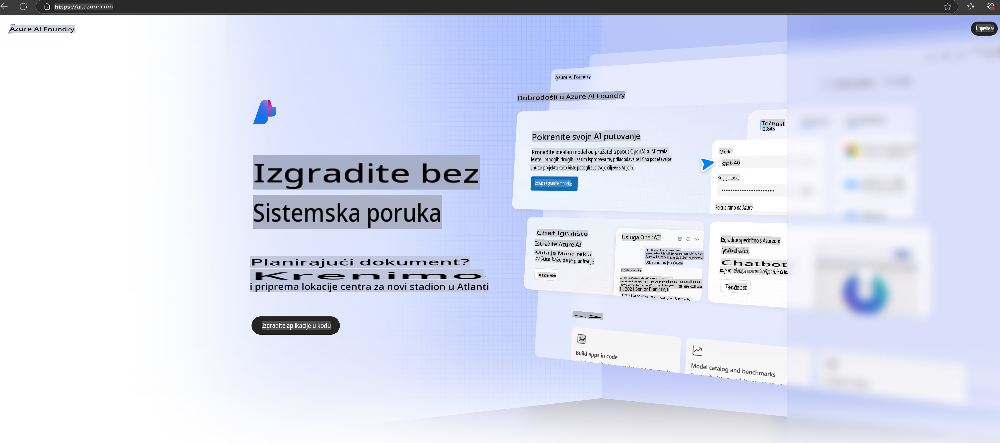

# **Korištenje Phi-3 u Azure AI Foundry**

S razvojem Generativne umjetne inteligencije, cilj nam je koristiti objedinjenu platformu za upravljanje različitim LLM i SLM modelima, integraciju podataka poduzeća, operacije finog podešavanja/RAG, kao i procjenu različitih poslovnih procesa nakon integracije LLM i SLM modela, kako bi se generativna umjetna inteligencija mogla bolje implementirati u pametne aplikacije. [Azure AI Foundry](https://ai.azure.com) je platforma za generativne AI aplikacije na razini poduzeća.

Uz Azure AI Foundry možete procijeniti odgovore velikih jezičnih modela (LLM) i orkestrirati komponente aplikacija pomoću prompt flow-a za bolje performanse. Platforma omogućuje lako skaliranje od dokazivanja koncepta do potpune proizvodne implementacije. Kontinuirano praćenje i usavršavanje podržavaju dugoročni uspjeh.

Model Phi-3 možemo brzo implementirati na Azure AI Foundry kroz jednostavne korake, a zatim koristiti Azure AI Foundry za izvršavanje povezanih zadataka poput Playground/Chat, finog podešavanja, procjene i drugih aktivnosti vezanih uz Phi-3.

## **1. Priprema**

Ako već imate instaliran [Azure Developer CLI](https://learn.microsoft.com/azure/developer/azure-developer-cli/overview?WT.mc_id=aiml-138114-kinfeylo) na svom uređaju, korištenje ovog predloška je jednostavno poput pokretanja ove naredbe u novom direktoriju.

## Ručno stvaranje

Stvaranje Microsoft Azure AI Foundry projekta i huba odličan je način za organizaciju i upravljanje vašim AI radom. Evo vodiča korak po korak kako započeti:

### Stvaranje projekta u Azure AI Foundry

1. **Idite na Azure AI Foundry**: Prijavite se na Azure AI Foundry portal.
2. **Stvorite projekt**:
   - Ako ste već u projektu, odaberite "Azure AI Foundry" u gornjem lijevom kutu stranice kako biste otišli na početnu stranicu.
   - Kliknite "+ Create project".
   - Unesite naziv za projekt.
   - Ako već imate hub, on će biti automatski odabran. Ako imate pristup više hubova, možete odabrati drugi iz padajućeg izbornika. Ako želite stvoriti novi hub, odaberite "Create new hub" i unesite naziv.
   - Kliknite "Create".

### Stvaranje huba u Azure AI Foundry

1. **Idite na Azure AI Foundry**: Prijavite se sa svojim Azure računom.
2. **Stvorite hub**:
   - Odaberite "Management center" iz lijevog izbornika.
   - Kliknite "All resources", zatim strelicu prema dolje pored "+ New project" i odaberite "+ New hub".
   - U dijalogu "Create a new hub" unesite naziv za vaš hub (npr. contoso-hub) i prilagodite ostala polja po želji.
   - Kliknite "Next", pregledajte unesene informacije, a zatim kliknite "Create".

Za detaljnije upute možete se obratiti službenoj [Microsoft dokumentaciji](https://learn.microsoft.com/azure/ai-studio/how-to/create-projects).

Nakon uspješnog stvaranja, možete pristupiti studiju koji ste stvorili putem [ai.azure.com](https://ai.azure.com/)

Na jednom AI Foundry može postojati više projekata. Stvorite projekt u AI Foundry kako biste se pripremili.

Stvorite Azure AI Foundry [QuickStarts](https://learn.microsoft.com/azure/ai-studio/quickstarts/get-started-code)

## **2. Implementacija Phi modela u Azure AI Foundry**

Kliknite opciju "Explore" projekta kako biste ušli u Model Catalog i odabrali Phi-3.

Odaberite Phi-3-mini-4k-instruct.

Kliknite 'Deploy' kako biste implementirali model Phi-3-mini-4k-instruct.

> [!NOTE]
>
> Prilikom implementacije možete odabrati računalnu snagu.

## **3. Playground Chat Phi u Azure AI Foundry**

Idite na stranicu implementacije, odaberite Playground i komunicirajte s Phi-3 putem Azure AI Foundry.

## **4. Implementacija modela iz Azure AI Foundry**

Kako biste implementirali model iz Azure Model Catalog, slijedite ove korake:

- Prijavite se na Azure AI Foundry.
- Odaberite model koji želite implementirati iz kataloga modela Azure AI Foundry.
- Na stranici Detalji modela odaberite Deploy, a zatim Serverless API s Azure AI Content Safety.
- Odaberite projekt u kojem želite implementirati svoje modele. Za korištenje Serverless API ponude, vaša radna okolina mora pripadati regiji East US 2 ili Sweden Central. Možete prilagoditi naziv implementacije.
- U čarobnjaku za implementaciju odaberite Pricing and terms kako biste saznali više o cijenama i uvjetima korištenja.
- Kliknite Deploy. Pričekajte dok implementacija ne bude spremna i dok ne budete preusmjereni na stranicu Deployments.
- Odaberite Open in playground kako biste počeli komunicirati s modelom.
- Uvijek se možete vratiti na stranicu Deployments, odabrati implementaciju i zabilježiti ciljani URL (Target URL) i tajni ključ (Secret Key), koje možete koristiti za pozivanje implementacije i generiranje odgovora.
- Detalje o URL-u i pristupnim ključevima uvijek možete pronaći odlaskom na karticu Build i odabirom Deployments iz odjeljka Components.

> [!NOTE]
> Imajte na umu da vaš račun mora imati dozvole Azure AI Developer role na Resource Group kako biste mogli izvesti ove korake.

## **5. Korištenje Phi API-ja u Azure AI Foundry**

Možete pristupiti https://{Ime vašeg projekta}.region.inference.ml.azure.com/swagger.json putem Postmana GET i kombinirati ga s ključem kako biste saznali više o dostupnim sučeljima.

Vrlo jednostavno možete dobiti parametre zahtjeva, kao i parametre odgovora.

**Odricanje od odgovornosti**:  
Ovaj dokument je preveden korištenjem usluga strojnih AI prijevoda. Iako nastojimo osigurati točnost, molimo vas da budete svjesni kako automatski prijevodi mogu sadržavati pogreške ili netočnosti. Izvorni dokument na izvornom jeziku treba smatrati mjerodavnim izvorom. Za ključne informacije preporučuje se profesionalni prijevod od strane čovjeka. Ne preuzimamo odgovornost za nesporazume ili pogrešna tumačenja koja mogu proizaći iz korištenja ovog prijevoda.