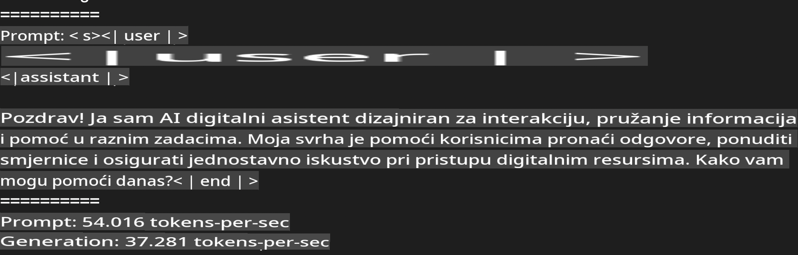

# **Inferiranje Phi-3 uz Apple MLX Framework**

## **Što je MLX Framework**

MLX je okvir za istraživanje strojnog učenja na Apple Silicon čipovima, kojeg je razvila Appleova istraživačka grupa za strojno učenje.

MLX je dizajniran od strane istraživača strojnog učenja za istraživače strojnog učenja. Okvir je zamišljen da bude jednostavan za korištenje, ali i dalje učinkovit za treniranje i implementaciju modela. Sam dizajn okvira je konceptualno jednostavan, s ciljem da istraživačima olakša proširenje i poboljšanje MLX-a kako bi mogli brzo istraživati nove ideje.

LLM-ovi mogu biti ubrzani na uređajima s Apple Silicon čipovima putem MLX-a, a modeli se mogu vrlo jednostavno pokretati lokalno.

## **Korištenje MLX-a za inferiranje Phi-3-mini**

### **1. Postavljanje MLX okruženja**

1. Python 3.11.x  
2. Instalirajte MLX biblioteku  

```bash

pip install mlx-lm

```

### **2. Pokretanje Phi-3-mini modela u Terminalu uz MLX**

```bash

python -m mlx_lm.generate --model microsoft/Phi-3-mini-4k-instruct --max-token 2048 --prompt  "<|user|>\nCan you introduce yourself<|end|>\n<|assistant|>"

```

Rezultat (moje okruženje je Apple M1 Max, 64GB) je:


### **3. Kvantizacija Phi-3-mini modela uz MLX u Terminalu**

```bash

python -m mlx_lm.convert --hf-path microsoft/Phi-3-mini-4k-instruct

```

***Napomena:*** Model se može kvantizirati pomoću mlx_lm.convert, a zadana kvantizacija je INT4. Ovaj primjer prikazuje kvantizaciju Phi-3-mini modela u INT4.

Model se kvantizira pomoću mlx_lm.convert, pri čemu je zadana kvantizacija INT4. Ovaj primjer kvantizira Phi-3-mini model u INT4. Nakon kvantizacije, model će biti spremljen u zadani direktorij ./mlx_model.

Model kvantiziran uz MLX možemo testirati iz terminala:

```bash

python -m mlx_lm.generate --model ./mlx_model/ --max-token 2048 --prompt  "<|user|>\nCan you introduce yourself<|end|>\n<|assistant|>"

```

Rezultat je:



### **4. Pokretanje Phi-3-mini modela uz MLX u Jupyter Notebooku**


***Napomena:*** Molimo pročitajte ovaj primjer [kliknite na ovu poveznicu](../../../../../code/03.Inference/MLX/MLX_DEMO.ipynb)

## **Resursi**

1. Saznajte više o Apple MLX Frameworku [https://ml-explore.github.io](https://ml-explore.github.io/mlx/build/html/index.html)

2. Apple MLX GitHub repozitorij [https://github.com/ml-explore](https://github.com/ml-explore)

**Odricanje od odgovornosti**:  
Ovaj dokument je preveden pomoću usluga strojno podržanog AI prijevoda. Iako nastojimo osigurati točnost, imajte na umu da automatski prijevodi mogu sadržavati pogreške ili netočnosti. Izvorni dokument na njegovom izvornom jeziku treba smatrati mjerodavnim izvorom. Za ključne informacije preporučuje se profesionalni prijevod od strane stručnjaka. Ne preuzimamo odgovornost za nesporazume ili pogrešne interpretacije proizašle iz korištenja ovog prijevoda.