# Fino podešavanje Phi-3 s Azure AI Foundry

Istražimo kako fino podesiti Microsoftov jezični model Phi-3 Mini koristeći Azure AI Foundry. Fino podešavanje omogućuje prilagodbu Phi-3 Mini modela specifičnim zadacima, čineći ga još snažnijim i svjesnijim konteksta.

## Razmatranja

- **Sposobnosti:** Koji modeli se mogu fino podešavati? Što osnovni model može postići nakon podešavanja?
- **Troškovi:** Koji je cjenovni model za fino podešavanje?
- **Prilagodljivost:** Koliko mogu izmijeniti osnovni model – i na koje načine?
- **Praktičnost:** Kako se zapravo odvija fino podešavanje – moram li pisati prilagođeni kod? Trebam li vlastiti računalni resurs?
- **Sigurnost:** Fino podešeni modeli mogu imati sigurnosne rizike – postoje li zaštitne mjere za sprječavanje nenamjerne štete?

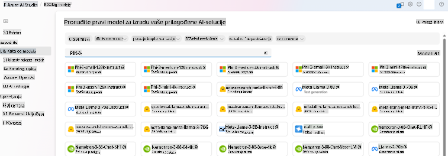

## Priprema za fino podešavanje

### Preduvjeti

> [!NOTE]
> Za modele iz obitelji Phi-3, ponuda za fino podešavanje po principu "plati koliko koristiš" dostupna je samo za hubove stvorene u regijama **East US 2**.

- Azure pretplata. Ako nemate Azure pretplatu, kreirajte [plaćeni Azure račun](https://azure.microsoft.com/pricing/purchase-options/pay-as-you-go) za početak.

- [AI Foundry projekt](https://ai.azure.com?WT.mc_id=aiml-138114-kinfeylo).
- Azure kontrole pristupa temeljene na ulogama (Azure RBAC) koriste se za dodjelu pristupa operacijama u Azure AI Foundry. Da biste izvršili korake u ovom članku, vaš korisnički račun mora imati dodijeljenu ulogu __Azure AI Developer role__ u grupi resursa.

### Registracija davatelja usluga pretplate

Provjerite je li pretplata registrirana za davatelja resursa `Microsoft.Network`.

1. Prijavite se u [Azure portal](https://portal.azure.com).
1. Odaberite **Pretplate** iz lijevog izbornika.
1. Odaberite pretplatu koju želite koristiti.
1. Odaberite **AI postavke projekta** > **Davatelji resursa** iz lijevog izbornika.
1. Potvrdite da se **Microsoft.Network** nalazi na popisu davatelja resursa. U suprotnom ga dodajte.

### Priprema podataka

Pripremite svoje podatke za treniranje i validaciju kako biste fino podesili model. Vaši podaci za treniranje i validaciju trebaju sadržavati primjere ulaza i izlaza koji odražavaju željeno ponašanje modela.

Provjerite jesu li svi primjeri za treniranje u skladu s očekivanim formatom za izvođenje. Kako biste učinkovito fino podešavali modele, osigurajte uravnotežen i raznolik skup podataka.

To uključuje održavanje ravnoteže podataka, uključivanje različitih scenarija te povremeno usklađivanje podataka za treniranje s očekivanjima iz stvarnog svijeta, što vodi ka točnijim i uravnoteženijim odgovorima modela.

Različiti tipovi modela zahtijevaju različite formate podataka za treniranje.

### Chat Completion

Podaci za treniranje i validaciju **moraju** biti formatirani kao JSON Lines (JSONL) dokument. Za `Phi-3-mini-128k-instruct` skup podataka za fino podešavanje mora biti u formatu razgovora koji koristi Chat completions API.

### Primjer formata datoteke

```json
    {"messages": [{"role": "system", "content": "You are an Xbox customer support agent whose primary goal is to help users with issues they are experiencing with their Xbox devices. You are friendly and concise. You only provide factual answers to queries, and do not provide answers that are not related to Xbox."}, {"role": "user", "content": "Is Xbox better than PlayStation?"}, {"role": "assistant", "content": "I apologize, but I cannot provide personal opinions. My primary job is to assist you with any issues related to your Xbox device. Do you have any Xbox-related issues that need addressing?"}]}
    {"messages": [{"role": "system", "content": "You are an Xbox customer support agent whose primary goal is to help users with issues they are experiencing with their Xbox devices. You are friendly and concise. You only provide factual answers to queries, and do not provide answers that are not related to Xbox."}, {"role": "user", "content": "Can I play PC games on my Xbox?"}, {"role": "assistant", "content": "While Xbox consoles don't natively support PC games, they can play an array of Xbox games, many of which are also available on PC. Can I assist you with finding games compatible with your Xbox device?"}]}
    {"messages": [{"role": "system", "content": "You are an Xbox customer support agent whose primary goal is to help users with issues they are experiencing with their Xbox devices. You are friendly and concise. You only provide factual answers to queries, and do not provide answers that are not related to Xbox."}, {"role": "user", "content": "I'm having trouble connecting my Xbox to the Wi-Fi."}, {"role": "assistant", "content": "No worries, let's go through the network settings on your Xbox. Can you please tell me what happens when you try to connect it to the Wi-Fi?"}]}
```

Podržani format datoteke je JSON Lines. Datoteke se prenose u zadanu spremište podataka i postaju dostupne u vašem projektu.

## Fino podešavanje Phi-3 s Azure AI Foundry

Azure AI Foundry omogućuje prilagodbu velikih jezičnih modela vašim osobnim skupovima podataka putem procesa poznatog kao fino podešavanje. Fino podešavanje donosi značajnu vrijednost omogućujući prilagodbu i optimizaciju za specifične zadatke i primjene. To vodi do poboljšane izvedbe, troškovne učinkovitosti, smanjene latencije i prilagođenih izlaza.

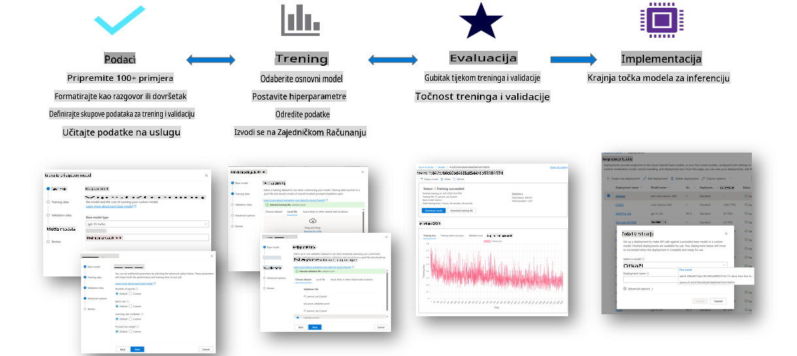

### Kreiranje novog projekta

1. Prijavite se u [Azure AI Foundry](https://ai.azure.com).

1. Odaberite **+New project** za kreiranje novog projekta u Azure AI Foundry.

    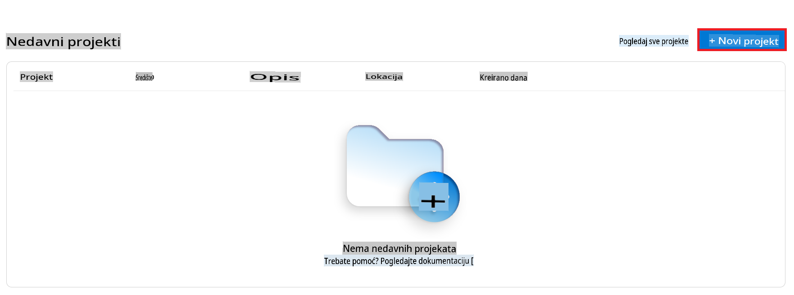

1. Izvršite sljedeće zadatke:

    - Unesite **Naziv huba**. Mora biti jedinstvena vrijednost.
    - Odaberite **Hub** koji želite koristiti (kreirajte novi ako je potrebno).

    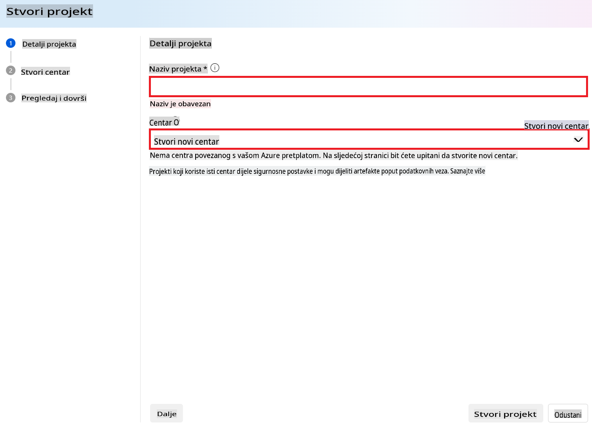

1. Izvršite sljedeće zadatke za kreiranje novog huba:

    - Unesite **Naziv huba**. Mora biti jedinstvena vrijednost.
    - Odaberite svoju Azure **Pretplatu**.
    - Odaberite **Grupu resursa** koju želite koristiti (kreirajte novu ako je potrebno).
    - Odaberite **Lokaciju** koju želite koristiti.
    - Odaberite **Poveži Azure AI usluge** koje želite koristiti (kreirajte novu ako je potrebno).
    - Odaberite **Poveži Azure AI pretraživanje** na **Preskoči povezivanje**.

    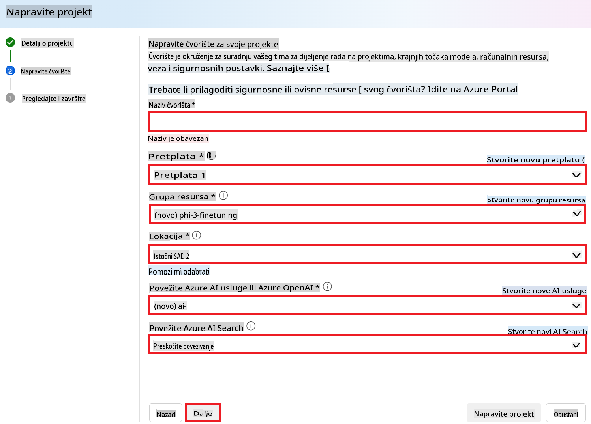

1. Odaberite **Next**.
1. Odaberite **Create a project**.

### Priprema podataka

Prije finog podešavanja, prikupite ili kreirajte skup podataka relevantan za vaš zadatak, poput uputa za razgovor, parova pitanja i odgovora ili bilo kojeg drugog relevantnog tekstualnog podatka. Očistite i pripremite ove podatke uklanjanjem šuma, obradom nedostajućih vrijednosti i tokenizacijom teksta.

### Fino podešavanje Phi-3 modela u Azure AI Foundry

> [!NOTE]
> Fino podešavanje Phi-3 modela trenutno je podržano u projektima smještenim u East US 2.

1. Odaberite **Model catalog** iz lijevog izbornika.

1. Upišite *phi-3* u **traku za pretraživanje** i odaberite phi-3 model koji želite koristiti.

    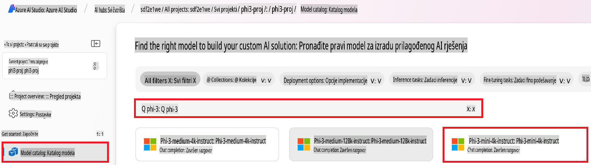

1. Odaberite **Fine-tune**.

    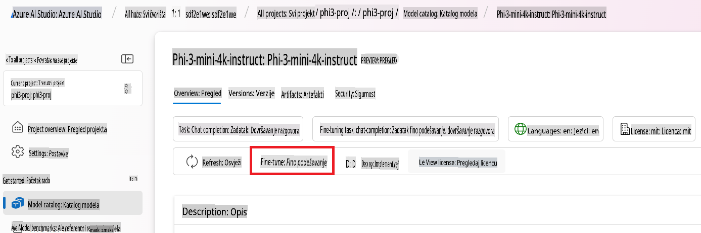

1. Unesite **Naziv fino podešenog modela**.

    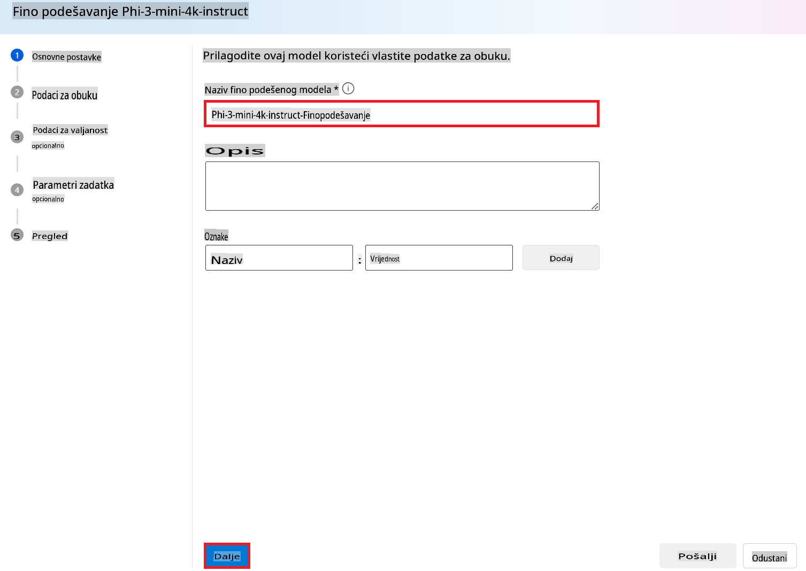

1. Odaberite **Next**.

1. Izvršite sljedeće zadatke:

    - Odaberite **Vrstu zadatka** kao **Chat completion**.
    - Odaberite **Podatke za treniranje** koje želite koristiti. Možete ih prenijeti putem Azure AI Foundryja ili iz lokalnog okruženja.

    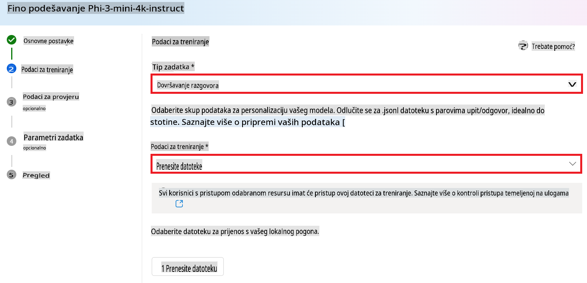

1. Odaberite **Next**.

1. Prenesite **Podatke za validaciju** koje želite koristiti ili odaberite **Automatsko razdvajanje podataka za treniranje**.

    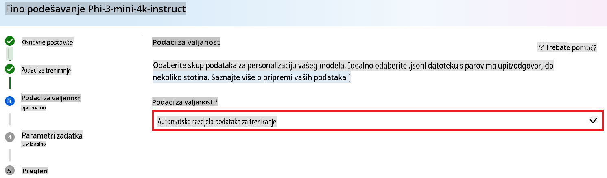

1. Odaberite **Next**.

1. Izvršite sljedeće zadatke:

    - Odaberite **Množitelj veličine grupe** koji želite koristiti.
    - Odaberite **Stopu učenja** koju želite koristiti.
    - Odaberite **Broj epoha** koje želite koristiti.

    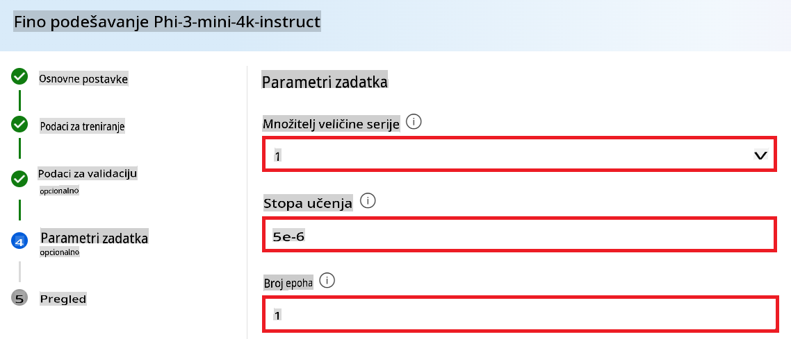

1. Odaberite **Submit** za pokretanje procesa finog podešavanja.

    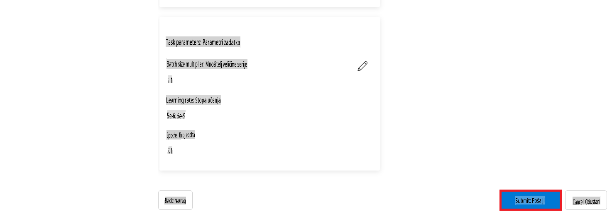

1. Kada je vaš model fino podešen, status će biti prikazan kao **Completed**, kao na slici ispod. Sada možete implementirati model i koristiti ga u svojoj aplikaciji, u playgroundu ili u prompt flowu. Za više informacija, pogledajte [Kako implementirati Phi-3 obitelj malih jezičnih modela s Azure AI Foundry](https://learn.microsoft.com/azure/ai-studio/how-to/deploy-models-phi-3?tabs=phi-3-5&pivots=programming-language-python).

    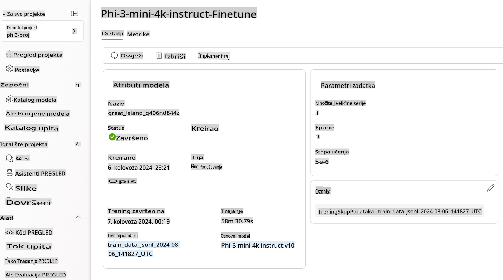

> [!NOTE]
> Za detaljnije informacije o finom podešavanju Phi-3, posjetite [Fine-tune Phi-3 models in Azure AI Foundry](https://learn.microsoft.com/azure/ai-studio/how-to/fine-tune-phi-3?tabs=phi-3-mini).

## Brisanje fino podešenih modela

Možete izbrisati fino podešeni model s popisa modela za fino podešavanje u [Azure AI Foundry](https://ai.azure.com) ili sa stranice detalja modela. Odaberite fino podešeni model za brisanje sa stranice za fino podešavanje, a zatim odaberite gumb Delete za brisanje modela.

> [!NOTE]
> Ne možete izbrisati prilagođeni model ako već postoji implementacija. Prvo morate izbrisati implementaciju modela prije nego što možete izbrisati prilagođeni model.

## Troškovi i kvote

### Razmatranja troškova i kvota za fino podešene Phi-3 modele

Phi modeli fino podešeni kao usluga nude se od strane Microsofta i integrirani su s Azure AI Foundry za upotrebu. Cijene možete pronaći prilikom [implementacije](https://learn.microsoft.com/azure/ai-studio/how-to/deploy-models-phi-3?tabs=phi-3-5&pivots=programming-language-python) ili finog podešavanja modela pod karticom Pricing and terms u čarobnjaku za implementaciju.

## Filtriranje sadržaja

Modeli implementirani kao usluga s plaćanjem po korištenju zaštićeni su Azure AI Content Safety. Kada se implementiraju na real-time endpointima, možete isključiti ovu mogućnost. S uključenim Azure AI content safety, i upit i odgovor prolaze kroz niz klasifikacijskih modela koji detektiraju i sprječavaju izlaz štetnog sadržaja. Sustav za filtriranje sadržaja detektira i poduzima radnje na specifičnim kategorijama potencijalno štetnog sadržaja u ulaznim upitima i izlaznim odgovorima. Saznajte više o [Azure AI Content Safety](https://learn.microsoft.com/azure/ai-studio/concepts/content-filtering).

**Konfiguracija finog podešavanja**

Hiperparametri: Definirajte hiperparametre poput stope učenja, veličine grupe i broja epoha za treniranje.

**Funkcija gubitka**

Odaberite odgovarajuću funkciju gubitka za svoj zadatak (npr. cross-entropy).

**Optimizator**

Odaberite optimizator (npr. Adam) za ažuriranja gradijenta tijekom treniranja.

**Proces finog podešavanja**

- Učitajte prethodno trenirani model: Učitajte Phi-3 Mini checkpoint.
- Dodajte prilagođene slojeve: Dodajte slojeve specifične za zadatak (npr. glavu za klasifikaciju za upute za razgovor).

**Trenirajte model**
Fino podesite model koristeći svoj pripremljeni skup podataka. Pratite napredak treniranja i prilagodite hiperparametre prema potrebi.

**Evaluacija i validacija**

Skup za validaciju: Podijelite svoje podatke na skupove za treniranje i validaciju.

**Procijenite izvedbu**

Koristite metrike poput točnosti, F1-scorea ili perplexity za procjenu izvedbe modela.

## Spremanje fino podešenog modela

**Checkpoint**
Spremite checkpoint fino podešenog modela za buduću upotrebu.

## Implementacija

- Implementirajte kao web uslugu: Implementirajte svoj fino podešeni model kao web uslugu u Azure AI Foundry.
- Testirajte endpoint: Pošaljite testne upite na implementirani endpoint kako biste provjerili njegovu funkcionalnost.

## Iteracija i poboljšanje

Iteracija: Ako izvedba nije zadovoljavajuća, iterirajte prilagođavanjem hiperparametara, dodavanjem više podataka ili finim podešavanjem za dodatne epohe.

## Praćenje i dorada

Kontinuirano pratite ponašanje modela i dorađujte ga prema potrebi.

## Prilagodba i proširenje

Prilagođeni zadaci: Phi-3 Mini se može fino podešavati za razne zadatke osim uputa za razgovor. Istražite druge primjene!
Eksperimentirajte: Isprobajte različite arhitekture, kombinacije slojeva i tehnike za poboljšanje izvedbe.

> [!NOTE]
> Fino podešavanje je iterativni proces. Eksperimentirajte, učite i prilagodite svoj model kako biste postigli najbolje rezultate za svoj specifični zadatak!

**Odricanje od odgovornosti**:  
Ovaj dokument je preveden korištenjem usluga strojnog prevođenja temeljenih na umjetnoj inteligenciji. Iako nastojimo osigurati točnost, imajte na umu da automatski prijevodi mogu sadržavati pogreške ili netočnosti. Izvorni dokument na izvornom jeziku treba smatrati mjerodavnim izvorom. Za ključne informacije preporučuje se profesionalni prijevod od strane ljudskog prevoditelja. Ne snosimo odgovornost za nesporazume ili pogrešna tumačenja koja proizlaze iz korištenja ovog prijevoda.