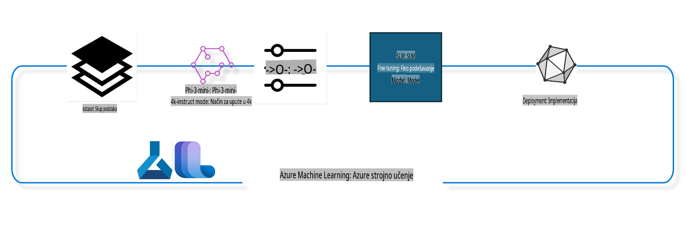

## Kako koristiti komponente za dovršavanje razgovora iz Azure ML sustava za fino podešavanje modela

U ovom primjeru izvodit ćemo fino podešavanje modela Phi-3-mini-4k-instruct kako bismo dovršili razgovor između 2 osobe koristeći ultrachat_200k skup podataka.



Primjer će vam pokazati kako izvesti fino podešavanje koristeći Azure ML SDK i Python te zatim implementirati fino podešeni model na online endpoint za inferenciju u stvarnom vremenu.

### Podaci za treniranje

Koristit ćemo ultrachat_200k skup podataka. Ovo je snažno filtrirana verzija UltraChat skupa podataka koji je korišten za treniranje Zephyr-7B-β, naprednog 7b modela za razgovor.

### Model

Koristit ćemo model Phi-3-mini-4k-instruct kako bismo pokazali kako korisnik može fino podesiti model za zadatak dovršavanja razgovora. Ako ste otvorili ovu bilježnicu iz specifične kartice modela, zamijenite ime specifičnog modela.

### Zadatci

- Odaberite model za fino podešavanje.
- Odaberite i istražite podatke za treniranje.
- Konfigurirajte posao za fino podešavanje.
- Pokrenite posao za fino podešavanje.
- Pregledajte metrike treniranja i evaluacije.
- Registrirajte fino podešeni model.
- Implementirajte fino podešeni model za inferenciju u stvarnom vremenu.
- Očistite resurse.

## 1. Postavljanje preduvjeta

- Instalirajte ovisnosti.
- Povežite se s AzureML radnim prostorom. Saznajte više na postavljanju SDK autentifikacije. Zamijenite <WORKSPACE_NAME>, <RESOURCE_GROUP> i <SUBSCRIPTION_ID> dolje.
- Povežite se s AzureML sustavskim registrom.
- Postavite opcionalno ime eksperimenta.
- Provjerite ili kreirajte računalni klaster.

> [!NOTE]
> Zahtjevi: jedan GPU čvor može imati više GPU kartica. Na primjer, jedan čvor Standard_NC24rs_v3 ima 4 NVIDIA V100 GPU-a, dok Standard_NC12s_v3 ima 2 NVIDIA V100 GPU-a. Pogledajte dokumentaciju za ove informacije. Broj GPU kartica po čvoru postavlja se u parametru gpus_per_node dolje. Ispravno postavljanje ove vrijednosti osigurava korištenje svih GPU-a u čvoru. Preporučene GPU konfiguracije možete pronaći ovdje i ovdje.

### Python biblioteke

Instalirajte ovisnosti pokretanjem dolje navedenog koda. Ovo nije opcionalan korak ako radite u novom okruženju.

```bash
pip install azure-ai-ml
pip install azure-identity
pip install datasets==2.9.0
pip install mlflow
pip install azureml-mlflow
```

### Interakcija s Azure ML

1. Ovaj Python skript koristi se za interakciju s Azure Machine Learning (Azure ML) servisom. Evo što radi:

    - Uvozi potrebne module iz azure.ai.ml, azure.identity i azure.ai.ml.entities paketa. Također uvozi modul time.

    - Pokušava se autentificirati koristeći DefaultAzureCredential(), što omogućuje jednostavno iskustvo autentifikacije za brzo započinjanje razvoja aplikacija u Azure oblaku. Ako to ne uspije, prelazi na InteractiveBrowserCredential(), koji pruža interaktivni prompt za prijavu.

    - Zatim pokušava kreirati MLClient instancu koristeći metodu from_config, koja čita konfiguraciju iz zadane konfiguracijske datoteke (config.json). Ako to ne uspije, kreira MLClient instancu ručnim pružanjem subscription_id, resource_group_name i workspace_name.

    - Kreira još jednu MLClient instancu, ovaj put za Azure ML registar nazvan "azureml". Ovaj registar je mjesto gdje su pohranjeni modeli, pipeline-ovi za fino podešavanje i okruženja.

    - Postavlja ime eksperimenta na "chat_completion_Phi-3-mini-4k-instruct".

    - Generira jedinstveni vremenski pečat pretvaranjem trenutnog vremena (u sekundama od epohe, kao decimalni broj) u cijeli broj, a zatim u string. Ovaj vremenski pečat može se koristiti za kreiranje jedinstvenih imena i verzija.

    ```python
    # Import necessary modules from Azure ML and Azure Identity
    from azure.ai.ml import MLClient
    from azure.identity import (
        DefaultAzureCredential,
        InteractiveBrowserCredential,
    )
    from azure.ai.ml.entities import AmlCompute
    import time  # Import time module
    
    # Try to authenticate using DefaultAzureCredential
    try:
        credential = DefaultAzureCredential()
        credential.get_token("https://management.azure.com/.default")
    except Exception as ex:  # If DefaultAzureCredential fails, use InteractiveBrowserCredential
        credential = InteractiveBrowserCredential()
    
    # Try to create an MLClient instance using the default config file
    try:
        workspace_ml_client = MLClient.from_config(credential=credential)
    except:  # If that fails, create an MLClient instance by manually providing the details
        workspace_ml_client = MLClient(
            credential,
            subscription_id="<SUBSCRIPTION_ID>",
            resource_group_name="<RESOURCE_GROUP>",
            workspace_name="<WORKSPACE_NAME>",
        )
    
    # Create another MLClient instance for the Azure ML registry named "azureml"
    # This registry is where models, fine-tuning pipelines, and environments are stored
    registry_ml_client = MLClient(credential, registry_name="azureml")
    
    # Set the experiment name
    experiment_name = "chat_completion_Phi-3-mini-4k-instruct"
    
    # Generate a unique timestamp that can be used for names and versions that need to be unique
    timestamp = str(int(time.time()))
    ```

## 2. Odaberite osnovni model za fino podešavanje

1. Phi-3-mini-4k-instruct je lagani, napredni otvoreni model s 3.8 milijardi parametara, razvijen na osnovu podataka korištenih za Phi-2. Model pripada Phi-3 obitelji modela, a Mini verzija dolazi u dvije varijante: 4K i 128K, što označava duljinu konteksta (u tokenima) koju može podržati. Model je potrebno fino podesiti za specifičnu svrhu kako bi se koristio. Ove modele možete pregledati u Model Catalog u AzureML Studiju, filtrirajući prema zadatku dovršavanja razgovora. U ovom primjeru koristimo Phi-3-mini-4k-instruct model. Ako ste otvorili ovu bilježnicu za drugi model, zamijenite ime modela i verziju prema potrebi.

    > [!NOTE]
    > model id svojstvo modela. Ovo će se proslijediti kao ulaz u posao za fino podešavanje. Također je dostupno kao polje Asset ID na stranici detalja modela u AzureML Studio Model Catalog.

2. Ovaj Python skript interaktira s Azure Machine Learning (Azure ML) servisom. Evo što radi:

    - Postavlja model_name na "Phi-3-mini-4k-instruct".

    - Koristi metodu get svojstva models objekta registry_ml_client kako bi dohvatila najnoviju verziju modela sa specificiranim imenom iz Azure ML registra. Metoda get poziva se s dva argumenta: imenom modela i oznakom koja specificira da se treba dohvatiti najnovija verzija modela.

    - Ispisuje poruku u konzolu koja označava ime, verziju i id modela koji će se koristiti za fino podešavanje. Metoda format stringa koristi se za umetanje imena, verzije i id-a modela u poruku. Ime, verzija i id modela pristupaju se kao svojstva foundation_model objekta.

    ```python
    # Set the model name
    model_name = "Phi-3-mini-4k-instruct"
    
    # Get the latest version of the model from the Azure ML registry
    foundation_model = registry_ml_client.models.get(model_name, label="latest")
    
    # Print the model name, version, and id
    # This information is useful for tracking and debugging
    print(
        "\n\nUsing model name: {0}, version: {1}, id: {2} for fine tuning".format(
            foundation_model.name, foundation_model.version, foundation_model.id
        )
    )
    ```

## 3. Kreirajte računalni klaster za korištenje s poslom

Posao za fino podešavanje radi SAMO s GPU računalima. Veličina klastera ovisi o veličini modela i često može biti izazovno odabrati odgovarajuće računalo za posao. U ovoj ćeliji vodimo korisnika kako odabrati odgovarajuće računalo za posao.

> [!NOTE]
> Dolje navedena računala rade s najoptimalnijom konfiguracijom. Bilo kakve promjene konfiguracije mogu dovesti do pogreške Cuda Out Of Memory. U takvim slučajevima, pokušajte nadograditi računalo na veću veličinu.

> [!NOTE]
> Prilikom odabira compute_cluster_size dolje, provjerite je li računalo dostupno u vašoj grupi resursa. Ako određeno računalo nije dostupno, možete podnijeti zahtjev za pristup računalnim resursima.

### Provjera modela za podršku finog podešavanja

1. Ovaj Python skript interaktira s Azure Machine Learning (Azure ML) modelom. Evo što radi:

    - Uvozi ast modul, koji pruža funkcije za obradu stabala Python apstraktne sintaksne gramatike.

    - Provjerava ima li foundation_model objekt (koji predstavlja model u Azure ML-u) oznaku nazvanu finetune_compute_allow_list. Oznake u Azure ML-u su parovi ključ-vrijednost koje možete kreirati i koristiti za filtriranje i sortiranje modela.

    - Ako je oznaka finetune_compute_allow_list prisutna, koristi funkciju ast.literal_eval kako bi sigurno parsirao vrijednost oznake (string) u Python listu. Ova lista zatim se dodjeljuje varijabli computes_allow_list. Zatim ispisuje poruku koja ukazuje da bi računalo trebalo biti kreirano iz liste.

    - Ako oznaka finetune_compute_allow_list nije prisutna, postavlja computes_allow_list na None i ispisuje poruku koja ukazuje da oznaka finetune_compute_allow_list nije dio oznaka modela.

    - Ukratko, ovaj skript provjerava specifičnu oznaku u metapodacima modela, pretvara vrijednost oznake u listu ako postoji i daje povratne informacije korisniku u skladu s tim.

    ```python
    # Import the ast module, which provides functions to process trees of the Python abstract syntax grammar
    import ast
    
    # Check if the 'finetune_compute_allow_list' tag is present in the model's tags
    if "finetune_compute_allow_list" in foundation_model.tags:
        # If the tag is present, use ast.literal_eval to safely parse the tag's value (a string) into a Python list
        computes_allow_list = ast.literal_eval(
            foundation_model.tags["finetune_compute_allow_list"]
        )  # convert string to python list
        # Print a message indicating that a compute should be created from the list
        print(f"Please create a compute from the above list - {computes_allow_list}")
    else:
        # If the tag is not present, set computes_allow_list to None
        computes_allow_list = None
        # Print a message indicating that the 'finetune_compute_allow_list' tag is not part of the model's tags
        print("`finetune_compute_allow_list` is not part of model tags")
    ```

### Provjera računalnog klastera

1. Ovaj Python skript interaktira s Azure Machine Learning (Azure ML) servisom i provodi nekoliko provjera na računalnom klasteru. Evo što radi:

    - Pokušava dohvatiti računalni klaster s imenom pohranjenim u compute_cluster iz Azure ML radnog prostora. Ako je stanje provizioniranja klastera "failed", podiže ValueError.

    - Provjerava je li computes_allow_list različit od None. Ako jest, pretvara sve veličine računala u listi u mala slova i provjerava je li veličina trenutnog klastera u listi. Ako nije, podiže ValueError.

    - Ako je computes_allow_list None, provjerava je li veličina klastera na listi nepodržanih GPU VM veličina. Ako jest, podiže ValueError.

    - Dohvaća listu svih dostupnih veličina klastera u radnom prostoru. Zatim iterira kroz ovu listu i za svaku veličinu provjerava odgovara li veličina trenutnog klastera. Ako odgovara, dohvaća broj GPU-ova za tu veličinu i postavlja gpu_count_found na True.

    - Ako je gpu_count_found True, ispisuje broj GPU-ova u klasteru. Ako je gpu_count_found False, podiže ValueError.

    - Ukratko, ovaj skript provodi nekoliko provjera na računalnom klasteru u Azure ML radnom prostoru, uključujući provjeru stanja provizioniranja, veličine u odnosu na dopuštenu ili zabranjenu listu i broj GPU-ova koje ima.

    ```python
    # Print the exception message
    print(e)
    # Raise a ValueError if the compute size is not available in the workspace
    raise ValueError(
        f"WARNING! Compute size {compute_cluster_size} not available in workspace"
    )
    
    # Retrieve the compute instance from the Azure ML workspace
    compute = workspace_ml_client.compute.get(compute_cluster)
    # Check if the provisioning state of the compute instance is "failed"
    if compute.provisioning_state.lower() == "failed":
        # Raise a ValueError if the provisioning state is "failed"
        raise ValueError(
            f"Provisioning failed, Compute '{compute_cluster}' is in failed state. "
            f"please try creating a different compute"
        )
    
    # Check if computes_allow_list is not None
    if computes_allow_list is not None:
        # Convert all compute sizes in computes_allow_list to lowercase
        computes_allow_list_lower_case = [x.lower() for x in computes_allow_list]
        # Check if the size of the compute instance is in computes_allow_list_lower_case
        if compute.size.lower() not in computes_allow_list_lower_case:
            # Raise a ValueError if the size of the compute instance is not in computes_allow_list_lower_case
            raise ValueError(
                f"VM size {compute.size} is not in the allow-listed computes for finetuning"
            )
    else:
        # Define a list of unsupported GPU VM sizes
        unsupported_gpu_vm_list = [
            "standard_nc6",
            "standard_nc12",
            "standard_nc24",
            "standard_nc24r",
        ]
        # Check if the size of the compute instance is in unsupported_gpu_vm_list
        if compute.size.lower() in unsupported_gpu_vm_list:
            # Raise a ValueError if the size of the compute instance is in unsupported_gpu_vm_list
            raise ValueError(
                f"VM size {compute.size} is currently not supported for finetuning"
            )
    
    # Initialize a flag to check if the number of GPUs in the compute instance has been found
    gpu_count_found = False
    # Retrieve a list of all available compute sizes in the workspace
    workspace_compute_sku_list = workspace_ml_client.compute.list_sizes()
    available_sku_sizes = []
    # Iterate over the list of available compute sizes
    for compute_sku in workspace_compute_sku_list:
        available_sku_sizes.append(compute_sku.name)
        # Check if the name of the compute size matches the size of the compute instance
        if compute_sku.name.lower() == compute.size.lower():
            # If it does, retrieve the number of GPUs for that compute size and set gpu_count_found to True
            gpus_per_node = compute_sku.gpus
            gpu_count_found = True
    # If gpu_count_found is True, print the number of GPUs in the compute instance
    if gpu_count_found:
        print(f"Number of GPU's in compute {compute.size}: {gpus_per_node}")
    else:
        # If gpu_count_found is False, raise a ValueError
        raise ValueError(
            f"Number of GPU's in compute {compute.size} not found. Available skus are: {available_sku_sizes}."
            f"This should not happen. Please check the selected compute cluster: {compute_cluster} and try again."
        )
    ```
trening pipeline na temelju različitih parametara, a zatim ispisuje ovaj prikazni naziv. ```python
    # Define a function to generate a display name for the training pipeline
    def get_pipeline_display_name():
        # Calculate the total batch size by multiplying the per-device batch size, the number of gradient accumulation steps, the number of GPUs per node, and the number of nodes used for fine-tuning
        batch_size = (
            int(finetune_parameters.get("per_device_train_batch_size", 1))
            * int(finetune_parameters.get("gradient_accumulation_steps", 1))
            * int(gpus_per_node)
            * int(finetune_parameters.get("num_nodes_finetune", 1))
        )
        # Retrieve the learning rate scheduler type
        scheduler = finetune_parameters.get("lr_scheduler_type", "linear")
        # Retrieve whether DeepSpeed is applied
        deepspeed = finetune_parameters.get("apply_deepspeed", "false")
        # Retrieve the DeepSpeed stage
        ds_stage = finetune_parameters.get("deepspeed_stage", "2")
        # If DeepSpeed is applied, include "ds" followed by the DeepSpeed stage in the display name; if not, include "nods"
        if deepspeed == "true":
            ds_string = f"ds{ds_stage}"
        else:
            ds_string = "nods"
        # Retrieve whether Layer-wise Relevance Propagation (LoRa) is applied
        lora = finetune_parameters.get("apply_lora", "false")
        # If LoRa is applied, include "lora" in the display name; if not, include "nolora"
        if lora == "true":
            lora_string = "lora"
        else:
            lora_string = "nolora"
        # Retrieve the limit on the number of model checkpoints to keep
        save_limit = finetune_parameters.get("save_total_limit", -1)
        # Retrieve the maximum sequence length
        seq_len = finetune_parameters.get("max_seq_length", -1)
        # Construct the display name by concatenating all these parameters, separated by hyphens
        return (
            model_name
            + "-"
            + "ultrachat"
            + "-"
            + f"bs{batch_size}"
            + "-"
            + f"{scheduler}"
            + "-"
            + ds_string
            + "-"
            + lora_string
            + f"-save_limit{save_limit}"
            + f"-seqlen{seq_len}"
        )
    
    # Call the function to generate the display name
    pipeline_display_name = get_pipeline_display_name()
    # Print the display name
    print(f"Display name used for the run: {pipeline_display_name}")
    ```

### Konfiguriranje pipelinea

Ovaj Python skript definira i konfigurira strojno učenje pipeline koristeći Azure Machine Learning SDK. Evo pregleda što radi:

1. Uvozi potrebne module iz Azure AI ML SDK-a.  
2. Dohvaća komponentu pipelinea nazvanu "chat_completion_pipeline" iz registra.  
3. Definira pipeline posao koristeći `@pipeline` decorator and the function `create_pipeline`. The name of the pipeline is set to `pipeline_display_name`.

1. Inside the `create_pipeline` function, it initializes the fetched pipeline component with various parameters, including the model path, compute clusters for different stages, dataset splits for training and testing, the number of GPUs to use for fine-tuning, and other fine-tuning parameters.

1. It maps the output of the fine-tuning job to the output of the pipeline job. This is done so that the fine-tuned model can be easily registered, which is required to deploy the model to an online or batch endpoint.

1. It creates an instance of the pipeline by calling the `create_pipeline` function.

1. It sets the `force_rerun` setting of the pipeline to `True`, meaning that cached results from previous jobs will not be used.

1. It sets the `continue_on_step_failure` setting of the pipeline to `False`, što znači da će pipeline stati ako bilo koji korak ne uspije.  
4. Ukratko, ovaj skript definira i konfigurira pipeline za zadatak dovršavanja razgovora koristeći Azure Machine Learning SDK.  

```python
    # Import necessary modules from the Azure AI ML SDK
    from azure.ai.ml.dsl import pipeline
    from azure.ai.ml import Input
    
    # Fetch the pipeline component named "chat_completion_pipeline" from the registry
    pipeline_component_func = registry_ml_client.components.get(
        name="chat_completion_pipeline", label="latest"
    )
    
    # Define the pipeline job using the @pipeline decorator and the function create_pipeline
    # The name of the pipeline is set to pipeline_display_name
    @pipeline(name=pipeline_display_name)
    def create_pipeline():
        # Initialize the fetched pipeline component with various parameters
        # These include the model path, compute clusters for different stages, dataset splits for training and testing, the number of GPUs to use for fine-tuning, and other fine-tuning parameters
        chat_completion_pipeline = pipeline_component_func(
            mlflow_model_path=foundation_model.id,
            compute_model_import=compute_cluster,
            compute_preprocess=compute_cluster,
            compute_finetune=compute_cluster,
            compute_model_evaluation=compute_cluster,
            # Map the dataset splits to parameters
            train_file_path=Input(
                type="uri_file", path="./ultrachat_200k_dataset/train_sft.jsonl"
            ),
            test_file_path=Input(
                type="uri_file", path="./ultrachat_200k_dataset/test_sft.jsonl"
            ),
            # Training settings
            number_of_gpu_to_use_finetuning=gpus_per_node,  # Set to the number of GPUs available in the compute
            **finetune_parameters
        )
        return {
            # Map the output of the fine tuning job to the output of pipeline job
            # This is done so that we can easily register the fine tuned model
            # Registering the model is required to deploy the model to an online or batch endpoint
            "trained_model": chat_completion_pipeline.outputs.mlflow_model_folder
        }
    
    # Create an instance of the pipeline by calling the create_pipeline function
    pipeline_object = create_pipeline()
    
    # Don't use cached results from previous jobs
    pipeline_object.settings.force_rerun = True
    
    # Set continue on step failure to False
    # This means that the pipeline will stop if any step fails
    pipeline_object.settings.continue_on_step_failure = False
    ```

### Podnošenje posla

1. Ovaj Python skript podnosi posao pipelinea strojnog učenja u Azure Machine Learning radni prostor i zatim čeka da posao završi. Evo pregleda što radi:

   - Poziva metodu `create_or_update` objekta jobs u `workspace_ml_client` kako bi podnio pipeline posao. Pipeline koji će se pokrenuti specificiran je s `pipeline_object`, a eksperiment pod kojim se posao pokreće specificiran je s `experiment_name`.  
   - Zatim poziva metodu `stream` objekta jobs u `workspace_ml_client` kako bi čekao da pipeline posao završi. Posao koji treba čekati specificiran je atributom `name` objekta `pipeline_job`.  
   - Ukratko, ovaj skript podnosi pipeline posao strojnog učenja u Azure Machine Learning radni prostor i zatim čeka da posao završi.  

```python
    # Submit the pipeline job to the Azure Machine Learning workspace
    # The pipeline to be run is specified by pipeline_object
    # The experiment under which the job is run is specified by experiment_name
    pipeline_job = workspace_ml_client.jobs.create_or_update(
        pipeline_object, experiment_name=experiment_name
    )
    
    # Wait for the pipeline job to complete
    # The job to wait for is specified by the name attribute of the pipeline_job object
    workspace_ml_client.jobs.stream(pipeline_job.name)
    ```

## 6. Registracija fino podešenog modela u radnom prostoru

Registrirat ćemo model iz izlaza posla fino podešavanja. Ovo će pratiti porijeklo između fino podešenog modela i posla fino podešavanja. Posao fino podešavanja također prati porijeklo prema osnovnom modelu, podacima i kodu za obuku.

### Registracija ML modela

1. Ovaj Python skript registrira strojno učenje model koji je treniran u Azure Machine Learning pipelineu. Evo pregleda što radi:

   - Uvozi potrebne module iz Azure AI ML SDK-a.  
   - Provjerava je li izlaz `trained_model` dostupan iz pipeline posla pozivajući metodu `get` objekta jobs u `workspace_ml_client` i pristupajući njegovom atributu `outputs`.  
   - Konstruira putanju do treniranog modela formatiranjem stringa s nazivom pipeline posla i nazivom izlaza ("trained_model").  
   - Definira naziv za fino podešeni model dodavanjem "-ultrachat-200k" izvornom nazivu modela i zamjenjujući bilo koje kose crte s crticama.  
   - Priprema se za registraciju modela kreiranjem objekta `Model` s različitim parametrima, uključujući putanju do modela, tip modela (MLflow model), naziv i verziju modela te opis modela.  
   - Registrira model pozivajući metodu `create_or_update` objekta models u `workspace_ml_client` s objektom `Model` kao argumentom.  
   - Ispisuje registrirani model.  

1. Ukratko, ovaj skript registrira strojno učenje model koji je treniran u Azure Machine Learning pipelineu.  

```python
    # Import necessary modules from the Azure AI ML SDK
    from azure.ai.ml.entities import Model
    from azure.ai.ml.constants import AssetTypes
    
    # Check if the `trained_model` output is available from the pipeline job
    print("pipeline job outputs: ", workspace_ml_client.jobs.get(pipeline_job.name).outputs)
    
    # Construct a path to the trained model by formatting a string with the name of the pipeline job and the name of the output ("trained_model")
    model_path_from_job = "azureml://jobs/{0}/outputs/{1}".format(
        pipeline_job.name, "trained_model"
    )
    
    # Define a name for the fine-tuned model by appending "-ultrachat-200k" to the original model name and replacing any slashes with hyphens
    finetuned_model_name = model_name + "-ultrachat-200k"
    finetuned_model_name = finetuned_model_name.replace("/", "-")
    
    print("path to register model: ", model_path_from_job)
    
    # Prepare to register the model by creating a Model object with various parameters
    # These include the path to the model, the type of the model (MLflow model), the name and version of the model, and a description of the model
    prepare_to_register_model = Model(
        path=model_path_from_job,
        type=AssetTypes.MLFLOW_MODEL,
        name=finetuned_model_name,
        version=timestamp,  # Use timestamp as version to avoid version conflict
        description=model_name + " fine tuned model for ultrachat 200k chat-completion",
    )
    
    print("prepare to register model: \n", prepare_to_register_model)
    
    # Register the model by calling the create_or_update method of the models object in the workspace_ml_client with the Model object as the argument
    registered_model = workspace_ml_client.models.create_or_update(
        prepare_to_register_model
    )
    
    # Print the registered model
    print("registered model: \n", registered_model)
    ```

## 7. Implementacija fino podešenog modela na online endpoint

Online endpointi pružaju trajni REST API koji se može koristiti za integraciju s aplikacijama koje trebaju koristiti model.

### Upravljanje endpointom

1. Ovaj Python skript kreira upravljani online endpoint u Azure Machine Learning za registrirani model. Evo pregleda što radi:

   - Uvozi potrebne module iz Azure AI ML SDK-a.  
   - Definira jedinstveni naziv za online endpoint dodavanjem vremenskog pečata stringu "ultrachat-completion-".  
   - Priprema za kreiranje online endpointa kreiranjem objekta `ManagedOnlineEndpoint` s različitim parametrima, uključujući naziv endpointa, opis endpointa i način autentifikacije ("key").  
   - Kreira online endpoint pozivajući metodu `begin_create_or_update` objekta `workspace_ml_client` s objektom `ManagedOnlineEndpoint` kao argumentom. Zatim čeka da se operacija kreiranja završi pozivajući metodu `wait`.  

1. Ukratko, ovaj skript kreira upravljani online endpoint u Azure Machine Learning za registrirani model.  

```python
    # Import necessary modules from the Azure AI ML SDK
    from azure.ai.ml.entities import (
        ManagedOnlineEndpoint,
        ManagedOnlineDeployment,
        ProbeSettings,
        OnlineRequestSettings,
    )
    
    # Define a unique name for the online endpoint by appending a timestamp to the string "ultrachat-completion-"
    online_endpoint_name = "ultrachat-completion-" + timestamp
    
    # Prepare to create the online endpoint by creating a ManagedOnlineEndpoint object with various parameters
    # These include the name of the endpoint, a description of the endpoint, and the authentication mode ("key")
    endpoint = ManagedOnlineEndpoint(
        name=online_endpoint_name,
        description="Online endpoint for "
        + registered_model.name
        + ", fine tuned model for ultrachat-200k-chat-completion",
        auth_mode="key",
    )
    
    # Create the online endpoint by calling the begin_create_or_update method of the workspace_ml_client with the ManagedOnlineEndpoint object as the argument
    # Then wait for the creation operation to complete by calling the wait method
    workspace_ml_client.begin_create_or_update(endpoint).wait()
    ```  

> [!NOTE]  
> Ovdje možete pronaći popis SKU-ova podržanih za implementaciju - [Managed online endpoints SKU list](https://learn.microsoft.com/azure/machine-learning/reference-managed-online-endpoints-vm-sku-list)

### Implementacija ML modela

1. Ovaj Python skript implementira registrirani strojno učenje model na upravljani online endpoint u Azure Machine Learning. Evo pregleda što radi:

   - Uvozi modul `ast`, koji pruža funkcije za obradu stabala Python sintakse.  
   - Postavlja tip instance za implementaciju na "Standard_NC6s_v3".  
   - Provjerava je li oznaka `inference_compute_allow_list` prisutna u osnovnom modelu. Ako jest, pretvara vrijednost oznake iz stringa u Python listu i dodjeljuje je `inference_computes_allow_list`. Ako nije, postavlja `inference_computes_allow_list` na `None`.  
   - Provjerava je li specificirani tip instance u dopuštenom popisu. Ako nije, ispisuje poruku tražeći od korisnika da odabere tip instance s dopuštenog popisa.  
   - Priprema za kreiranje implementacije kreiranjem objekta `ManagedOnlineDeployment` s različitim parametrima, uključujući naziv implementacije, naziv endpointa, ID modela, tip instance i broj, postavke za provjeru živosti i postavke zahtjeva.  
   - Kreira implementaciju pozivajući metodu `begin_create_or_update` objekta `workspace_ml_client` s objektom `ManagedOnlineDeployment` kao argumentom. Zatim čeka da se operacija kreiranja završi pozivajući metodu `wait`.  
   - Postavlja promet endpointa tako da usmjerava 100% prometa na implementaciju "demo".  
   - Ažurira endpoint pozivajući metodu `begin_create_or_update` objekta `workspace_ml_client` s objektom endpoint kao argumentom. Zatim čeka da se operacija ažuriranja završi pozivajući metodu `result`.  

1. Ukratko, ovaj skript implementira registrirani strojno učenje model na upravljani online endpoint u Azure Machine Learning.  

```python
    # Import the ast module, which provides functions to process trees of the Python abstract syntax grammar
    import ast
    
    # Set the instance type for the deployment
    instance_type = "Standard_NC6s_v3"
    
    # Check if the `inference_compute_allow_list` tag is present in the foundation model
    if "inference_compute_allow_list" in foundation_model.tags:
        # If it is, convert the tag value from a string to a Python list and assign it to `inference_computes_allow_list`
        inference_computes_allow_list = ast.literal_eval(
            foundation_model.tags["inference_compute_allow_list"]
        )
        print(f"Please create a compute from the above list - {computes_allow_list}")
    else:
        # If it's not, set `inference_computes_allow_list` to `None`
        inference_computes_allow_list = None
        print("`inference_compute_allow_list` is not part of model tags")
    
    # Check if the specified instance type is in the allow list
    if (
        inference_computes_allow_list is not None
        and instance_type not in inference_computes_allow_list
    ):
        print(
            f"`instance_type` is not in the allow listed compute. Please select a value from {inference_computes_allow_list}"
        )
    
    # Prepare to create the deployment by creating a `ManagedOnlineDeployment` object with various parameters
    demo_deployment = ManagedOnlineDeployment(
        name="demo",
        endpoint_name=online_endpoint_name,
        model=registered_model.id,
        instance_type=instance_type,
        instance_count=1,
        liveness_probe=ProbeSettings(initial_delay=600),
        request_settings=OnlineRequestSettings(request_timeout_ms=90000),
    )
    
    # Create the deployment by calling the `begin_create_or_update` method of the `workspace_ml_client` with the `ManagedOnlineDeployment` object as the argument
    # Then wait for the creation operation to complete by calling the `wait` method
    workspace_ml_client.online_deployments.begin_create_or_update(demo_deployment).wait()
    
    # Set the traffic of the endpoint to direct 100% of the traffic to the "demo" deployment
    endpoint.traffic = {"demo": 100}
    
    # Update the endpoint by calling the `begin_create_or_update` method of the `workspace_ml_client` with the `endpoint` object as the argument
    # Then wait for the update operation to complete by calling the `result` method
    workspace_ml_client.begin_create_or_update(endpoint).result()
    ```  

## 8. Testiranje endpointa s uzorkom podataka

Dohvatit ćemo neke uzorke podataka iz testnog skupa podataka i poslati ih na online endpoint za inferenciju. Zatim ćemo prikazati predviđene oznake uz stvarne oznake.

### Čitanje rezultata

1. Ovaj Python skript čita JSON Lines datoteku u pandas DataFrame, uzima slučajni uzorak i resetira indeks. Evo pregleda što radi:

   - Čita datoteku `./ultrachat_200k_dataset/test_gen.jsonl` u pandas DataFrame. Funkcija `read_json` koristi se s argumentom `lines=True` jer je datoteka u JSON Lines formatu, gdje je svaki red zaseban JSON objekt.  
   - Uzima slučajni uzorak od 1 reda iz DataFrame-a. Funkcija `sample` koristi se s argumentom `n=1` kako bi se specificirao broj slučajnih redova za odabir.  
   - Resetira indeks DataFrame-a. Funkcija `reset_index` koristi se s argumentom `drop=True` kako bi se odbacio izvorni indeks i zamijenio novim indeksom s vrijednostima cijelih brojeva.  
   - Prikazuje prva 2 reda DataFrame-a koristeći funkciju `head` s argumentom 2. Međutim, budući da DataFrame sadrži samo jedan red nakon uzorkovanja, prikazat će samo taj jedan red.  

1. Ukratko, ovaj skript čita JSON Lines datoteku u pandas DataFrame, uzima slučajni uzorak od 1 reda, resetira indeks i prikazuje prvi red.  

```python
    # Import pandas library
    import pandas as pd
    
    # Read the JSON Lines file './ultrachat_200k_dataset/test_gen.jsonl' into a pandas DataFrame
    # The 'lines=True' argument indicates that the file is in JSON Lines format, where each line is a separate JSON object
    test_df = pd.read_json("./ultrachat_200k_dataset/test_gen.jsonl", lines=True)
    
    # Take a random sample of 1 row from the DataFrame
    # The 'n=1' argument specifies the number of random rows to select
    test_df = test_df.sample(n=1)
    
    # Reset the index of the DataFrame
    # The 'drop=True' argument indicates that the original index should be dropped and replaced with a new index of default integer values
    # The 'inplace=True' argument indicates that the DataFrame should be modified in place (without creating a new object)
    test_df.reset_index(drop=True, inplace=True)
    
    # Display the first 2 rows of the DataFrame
    # However, since the DataFrame only contains one row after the sampling, this will only display that one row
    test_df.head(2)
    ```  

### Kreiranje JSON objekta

1. Ovaj Python skript kreira JSON objekt sa specifičnim parametrima i sprema ga u datoteku. Evo pregleda što radi:

   - Uvozi modul `json`, koji pruža funkcije za rad s JSON podacima.  
   - Kreira rječnik `parameters` s ključevima i vrijednostima koji predstavljaju parametre za strojno učenje model. Ključevi su "temperature", "top_p", "do_sample" i "max_new_tokens", a njihove odgovarajuće vrijednosti su 0.6, 0.9, `True` i 200.  
   - Kreira drugi rječnik `test_json` s dva ključa: "input_data" i "params". Vrijednost "input_data" je drugi rječnik s ključevima "input_string" i "parameters". Vrijednost "input_string" je lista koja sadrži prvu poruku iz DataFrame-a `test_df`. Vrijednost "parameters" je rječnik `parameters` kreiran ranije. Vrijednost "params" je prazan rječnik.  
   - Otvara datoteku pod nazivom `sample_score.json`.  

```python
    # Import the json module, which provides functions to work with JSON data
    import json
    
    # Create a dictionary `parameters` with keys and values that represent parameters for a machine learning model
    # The keys are "temperature", "top_p", "do_sample", and "max_new_tokens", and their corresponding values are 0.6, 0.9, True, and 200 respectively
    parameters = {
        "temperature": 0.6,
        "top_p": 0.9,
        "do_sample": True,
        "max_new_tokens": 200,
    }
    
    # Create another dictionary `test_json` with two keys: "input_data" and "params"
    # The value of "input_data" is another dictionary with keys "input_string" and "parameters"
    # The value of "input_string" is a list containing the first message from the `test_df` DataFrame
    # The value of "parameters" is the `parameters` dictionary created earlier
    # The value of "params" is an empty dictionary
    test_json = {
        "input_data": {
            "input_string": [test_df["messages"][0]],
            "parameters": parameters,
        },
        "params": {},
    }
    
    # Open a file named `sample_score.json` in the `./ultrachat_200k_dataset` directory in write mode
    with open("./ultrachat_200k_dataset/sample_score.json", "w") as f:
        # Write the `test_json` dictionary to the file in JSON format using the `json.dump` function
        json.dump(test_json, f)
    ```  

### Pozivanje endpointa

1. Ovaj Python skript poziva online endpoint u Azure Machine Learning kako bi ocijenio JSON datoteku. Evo pregleda što radi:

   - Poziva metodu `invoke` svojstva `online_endpoints` objekta `workspace_ml_client`. Ova metoda koristi se za slanje zahtjeva na online endpoint i dobivanje odgovora.  
   - Specificira naziv endpointa i implementacije s argumentima `endpoint_name` i `deployment_name`. U ovom slučaju, naziv endpointa pohranjen je u varijabli `online_endpoint_name`, a naziv implementacije je "demo".  
   - Specificira putanju do JSON datoteke koja se ocjenjuje s argumentom `request_file`. U ovom slučaju, datoteka je `./ultrachat_200k_dataset/sample_score.json`.  
   - Sprema odgovor s endpointa u varijablu `response`.  
   - Ispisuje sirovi odgovor.  

1. Ukratko, ovaj skript poziva online endpoint u Azure Machine Learning kako bi ocijenio JSON datoteku i ispisuje odgovor.  

```python
    # Invoke the online endpoint in Azure Machine Learning to score the `sample_score.json` file
    # The `invoke` method of the `online_endpoints` property of the `workspace_ml_client` object is used to send a request to an online endpoint and get a response
    # The `endpoint_name` argument specifies the name of the endpoint, which is stored in the `online_endpoint_name` variable
    # The `deployment_name` argument specifies the name of the deployment, which is "demo"
    # The `request_file` argument specifies the path to the JSON file to be scored, which is `./ultrachat_200k_dataset/sample_score.json`
    response = workspace_ml_client.online_endpoints.invoke(
        endpoint_name=online_endpoint_name,
        deployment_name="demo",
        request_file="./ultrachat_200k_dataset/sample_score.json",
    )
    
    # Print the raw response from the endpoint
    print("raw response: \n", response, "\n")
    ```  

## 9. Brisanje online endpointa

1. Nemojte zaboraviti obrisati online endpoint, inače će se nastaviti naplata za računalne resurse koje endpoint koristi. Ova linija Python koda briše online endpoint u Azure Machine Learning. Evo pregleda što radi:

   - Poziva metodu `begin_delete` svojstva `online_endpoints` objekta `workspace_ml_client`. Ova metoda koristi se za pokretanje brisanja online endpointa.  
   - Specificira naziv endpointa koji treba obrisati s argumentom `name`. U ovom slučaju, naziv endpointa pohranjen je u varijabli `online_endpoint_name`.  
   - Poziva metodu `wait` kako bi čekao da se operacija brisanja završi. Ovo je blokirajuća operacija, što znači da će spriječiti nastavak skripta dok brisanje ne završi.  

1. Ukratko, ova linija koda pokreće brisanje online endpointa u Azure Machine Learning i čeka da se operacija završi.  

```python
    # Delete the online endpoint in Azure Machine Learning
    # The `begin_delete` method of the `online_endpoints` property of the `workspace_ml_client` object is used to start the deletion of an online endpoint
    # The `name` argument specifies the name of the endpoint to be deleted, which is stored in the `online_endpoint_name` variable
    # The `wait` method is called to wait for the deletion operation to complete. This is a blocking operation, meaning that it will prevent the script from continuing until the deletion is finished
    workspace_ml_client.online_endpoints.begin_delete(name=online_endpoint_name).wait()
    ```  

**Odricanje od odgovornosti**:  
Ovaj dokument je preveden korištenjem usluga strojno baziranog AI prevođenja. Iako težimo točnosti, imajte na umu da automatizirani prijevodi mogu sadržavati pogreške ili netočnosti. Izvorni dokument na izvornom jeziku treba smatrati mjerodavnim izvorom. Za ključne informacije preporučuje se profesionalni prijevod od strane stručnjaka. Ne preuzimamo odgovornost za bilo kakve nesporazume ili pogrešne interpretacije proizašle iz korištenja ovog prijevoda.