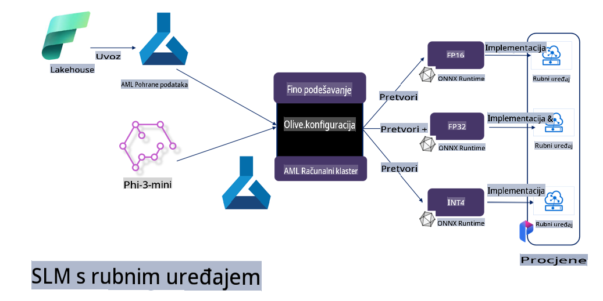

# **Fino podešavanje Phi-3 s Microsoft Olive**

[Olive](https://github.com/microsoft/OLive?WT.mc_id=aiml-138114-kinfeylo) je jednostavan alat za optimizaciju modela prilagođen hardveru, koji objedinjuje vodeće tehnike u industriji za kompresiju, optimizaciju i kompilaciju modela.

Dizajniran je za pojednostavljenje procesa optimizacije modela strojnog učenja, osiguravajući njihovu maksimalnu učinkovitost na specifičnim hardverskim arhitekturama.

Bez obzira radite li na aplikacijama u oblaku ili uređajima na rubu mreže, Olive omogućuje optimizaciju vaših modela na jednostavan i učinkovit način.

## Ključne značajke:
- Olive objedinjuje i automatizira tehnike optimizacije za željene hardverske ciljeve.
- Ne postoji jedna tehnika optimizacije koja odgovara svim scenarijima, pa Olive omogućuje proširivost tako da stručnjaci iz industrije mogu dodavati vlastite inovacije.

## Smanjenje inženjerskog napora:
- Programeri često moraju učiti i koristiti različite alate specifične za hardverske dobavljače kako bi pripremili i optimizirali trenirane modele za implementaciju.
- Olive pojednostavljuje ovo iskustvo automatiziranjem tehnika optimizacije za željeni hardver.

## Spremno rješenje za E2E optimizaciju:

Kombiniranjem i podešavanjem integriranih tehnika, Olive nudi objedinjeno rješenje za optimizaciju od početka do kraja.
U obzir uzima ograničenja poput točnosti i kašnjenja prilikom optimizacije modela.

## Korištenje Microsoft Olive za fino podešavanje

Microsoft Olive je vrlo jednostavan alat otvorenog koda za optimizaciju modela, koji pokriva i fino podešavanje i referenciranje u području generativne umjetne inteligencije. Potrebna je samo jednostavna konfiguracija, u kombinaciji s korištenjem malih modela jezika otvorenog koda i povezanih okruženja za izvršavanje (AzureML / lokalni GPU, CPU, DirectML), kako biste automatskom optimizacijom mogli završiti fino podešavanje ili referenciranje modela te pronaći najbolji model za implementaciju u oblaku ili na uređajima na rubu mreže. Omogućuje poduzećima izgradnju vlastitih industrijskih vertikalnih modela lokalno i u oblaku.


## Fino podešavanje Phi-3 s Microsoft Olive 



## Primjer koda i uzorak za Phi-3 Olive
U ovom primjeru koristit ćete Olive za:

- Fino podešavanje LoRA adaptera za klasifikaciju fraza na kategorije Tuga, Radost, Strah, Iznenađenje.
- Spajanje težina adaptera u osnovni model.
- Optimizaciju i kvantizaciju modela u int4.

[Primjer koda](../../code/03.Finetuning/olive-ort-example/README.md)

### Postavljanje Microsoft Olive

Instalacija Microsoft Olive je vrlo jednostavna i može se instalirati za CPU, GPU, DirectML i Azure ML.

```bash
pip install olive-ai
```

Ako želite pokrenuti ONNX model na CPU-u, možete koristiti:

```bash
pip install olive-ai[cpu]
```

Ako želite pokrenuti ONNX model na GPU-u, možete koristiti:

```python
pip install olive-ai[gpu]
```

Ako želite koristiti Azure ML, koristite:

```python
pip install git+https://github.com/microsoft/Olive#egg=olive-ai[azureml]
```

**Napomena**
Zahtjev za OS: Ubuntu 20.04 / 22.04 

### **Config.json za Microsoft Olive**

Nakon instalacije, možete konfigurirati različite postavke specifične za model putem konfiguracijske datoteke, uključujući podatke, računalne resurse, treniranje, implementaciju i generiranje modela.

**1. Podaci**

Na Microsoft Olive podržano je treniranje na lokalnim i oblaku pohranjenim podacima, što se može konfigurirati u postavkama.

*Postavke lokalnih podataka*

Jednostavno možete postaviti skup podataka koji treba trenirati za fino podešavanje, obično u json formatu, i prilagoditi ga predlošku podataka. Ovo treba prilagoditi prema zahtjevima modela (na primjer, prilagoditi formatu koji zahtijeva Microsoft Phi-3-mini. Ako imate druge modele, molimo pogledajte potrebne formate za fino podešavanje drugih modela).

```json

    "data_configs": [
        {
            "name": "dataset_default_train",
            "type": "HuggingfaceContainer",
            "load_dataset_config": {
                "params": {
                    "data_name": "json", 
                    "data_files":"dataset/dataset-classification.json",
                    "split": "train"
                }
            },
            "pre_process_data_config": {
                "params": {
                    "dataset_type": "corpus",
                    "text_cols": [
                            "phrase",
                            "tone"
                    ],
                    "text_template": "### Text: {phrase}\n### The tone is:\n{tone}",
                    "corpus_strategy": "join",
                    "source_max_len": 2048,
                    "pad_to_max_len": false,
                    "use_attention_mask": false
                }
            }
        }
    ],
```

**Postavke izvora podataka iz oblaka**

Povezivanjem s pohranom podataka u Azure AI Studio/Azure Machine Learning Service možete uvesti različite izvore podataka u Azure AI Studio/Azure Machine Learning Service putem Microsoft Fabric i Azure Data kao podršku za fino podešavanje podataka.

```json

    "data_configs": [
        {
            "name": "dataset_default_train",
            "type": "HuggingfaceContainer",
            "load_dataset_config": {
                "params": {
                    "data_name": "json", 
                    "data_files": {
                        "type": "azureml_datastore",
                        "config": {
                            "azureml_client": {
                                "subscription_id": "Your Azure Subscrition ID",
                                "resource_group": "Your Azure Resource Group",
                                "workspace_name": "Your Azure ML Workspaces name"
                            },
                            "datastore_name": "workspaceblobstore",
                            "relative_path": "Your train_data.json Azure ML Location"
                        }
                    },
                    "split": "train"
                }
            },
            "pre_process_data_config": {
                "params": {
                    "dataset_type": "corpus",
                    "text_cols": [
                            "Question",
                            "Best Answer"
                    ],
                    "text_template": "<|user|>\n{Question}<|end|>\n<|assistant|>\n{Best Answer}\n<|end|>",
                    "corpus_strategy": "join",
                    "source_max_len": 2048,
                    "pad_to_max_len": false,
                    "use_attention_mask": false
                }
            }
        }
    ],
    
```

**2. Računalna konfiguracija**

Ako trebate raditi lokalno, možete koristiti lokalne resurse podataka. Ako trebate koristiti resurse Azure AI Studio / Azure Machine Learning Service, potrebno je konfigurirati odgovarajuće Azure parametre, naziv računalne snage itd.

```json

    "systems": {
        "aml": {
            "type": "AzureML",
            "config": {
                "accelerators": ["gpu"],
                "hf_token": true,
                "aml_compute": "Your Azure AI Studio / Azure Machine Learning Service Compute Name",
                "aml_docker_config": {
                    "base_image": "Your Azure AI Studio / Azure Machine Learning Service docker",
                    "conda_file_path": "conda.yaml"
                }
            }
        },
        "azure_arc": {
            "type": "AzureML",
            "config": {
                "accelerators": ["gpu"],
                "aml_compute": "Your Azure AI Studio / Azure Machine Learning Service Compute Name",
                "aml_docker_config": {
                    "base_image": "Your Azure AI Studio / Azure Machine Learning Service docker",
                    "conda_file_path": "conda.yaml"
                }
            }
        }
    },
```

***Napomena***

Budući da se izvršava putem kontejnera na Azure AI Studio/Azure Machine Learning Service, potrebno je konfigurirati odgovarajuće okruženje. Ovo se konfigurira u conda.yaml okruženju.

```yaml

name: project_environment
channels:
  - defaults
dependencies:
  - python=3.8.13
  - pip=22.3.1
  - pip:
      - einops
      - accelerate
      - azure-keyvault-secrets
      - azure-identity
      - bitsandbytes
      - datasets
      - huggingface_hub
      - peft
      - scipy
      - sentencepiece
      - torch>=2.2.0
      - transformers
      - git+https://github.com/microsoft/Olive@jiapli/mlflow_loading_fix#egg=olive-ai[gpu]
      - --extra-index-url https://aiinfra.pkgs.visualstudio.com/PublicPackages/_packaging/ORT-Nightly/pypi/simple/ 
      - ort-nightly-gpu==1.18.0.dev20240307004
      - --extra-index-url https://aiinfra.pkgs.visualstudio.com/PublicPackages/_packaging/onnxruntime-genai/pypi/simple/
      - onnxruntime-genai-cuda

    

```

**3. Odabir vašeg SLM-a**

Model možete koristiti izravno s Hugging Face platforme ili ga kombinirati s Model Catalogom u Azure AI Studio / Azure Machine Learning za odabir modela. U donjem primjeru koda koristit ćemo Microsoft Phi-3-mini kao primjer.

Ako imate model lokalno, možete koristiti ovu metodu:

```json

    "input_model":{
        "type": "PyTorchModel",
        "config": {
            "hf_config": {
                "model_name": "model-cache/microsoft/phi-3-mini",
                "task": "text-generation",
                "model_loading_args": {
                    "trust_remote_code": true
                }
            }
        }
    },
```

Ako želite koristiti model iz Azure AI Studio / Azure Machine Learning Service, možete koristiti ovu metodu:

```json

    "input_model":{
        "type": "PyTorchModel",
        "config": {
            "model_path": {
                "type": "azureml_registry_model",
                "config": {
                    "name": "microsoft/Phi-3-mini-4k-instruct",
                    "registry_name": "azureml-msr",
                    "version": "11"
                }
            },
             "model_file_format": "PyTorch.MLflow",
             "hf_config": {
                "model_name": "microsoft/Phi-3-mini-4k-instruct",
                "task": "text-generation",
                "from_pretrained_args": {
                    "trust_remote_code": true
                }
            }
        }
    },
```

**Napomena:**
Potrebno je integrirati s Azure AI Studio / Azure Machine Learning Service, pa prilikom postavljanja modela obratite pažnju na broj verzije i povezano imenovanje.

Svi modeli na Azure moraju biti postavljeni na PyTorch.MLflow.

Potrebno je imati Hugging Face račun i povezati ključ s vrijednošću ključa u Azure AI Studio / Azure Machine Learning.

**4. Algoritam**

Microsoft Olive vrlo dobro podržava algoritme za fino podešavanje poput Lora i QLora. Sve što trebate konfigurirati su neki relevantni parametri. Ovdje kao primjer uzimam QLora.

```json
        "lora": {
            "type": "LoRA",
            "config": {
                "target_modules": [
                    "o_proj",
                    "qkv_proj"
                ],
                "double_quant": true,
                "lora_r": 64,
                "lora_alpha": 64,
                "lora_dropout": 0.1,
                "train_data_config": "dataset_default_train",
                "eval_dataset_size": 0.3,
                "training_args": {
                    "seed": 0,
                    "data_seed": 42,
                    "per_device_train_batch_size": 1,
                    "per_device_eval_batch_size": 1,
                    "gradient_accumulation_steps": 4,
                    "gradient_checkpointing": false,
                    "learning_rate": 0.0001,
                    "num_train_epochs": 3,
                    "max_steps": 10,
                    "logging_steps": 10,
                    "evaluation_strategy": "steps",
                    "eval_steps": 187,
                    "group_by_length": true,
                    "adam_beta2": 0.999,
                    "max_grad_norm": 0.3
                }
            }
        },
```

Ako želite kvantizacijsku konverziju, glavna grana Microsoft Olive već podržava onnxruntime-genai metodu. Možete je postaviti prema svojim potrebama:

1. Spojite težine adaptera u osnovni model.
2. Pretvorite model u onnx model s potrebnom preciznošću pomoću ModelBuildera.

Na primjer, pretvaranje u kvantizirani INT4:

```json

        "merge_adapter_weights": {
            "type": "MergeAdapterWeights"
        },
        "builder": {
            "type": "ModelBuilder",
            "config": {
                "precision": "int4"
            }
        }
```

**Napomena** 
- Ako koristite QLoRA, kvantizacijska konverzija s ONNXRuntime-genai trenutno nije podržana.

- Važno je napomenuti da gore navedene korake možete postaviti prema vlastitim potrebama. Nije potrebno u potpunosti konfigurirati sve korake. Ovisno o potrebama, možete koristiti samo algoritamske korake bez finog podešavanja. Na kraju trebate konfigurirati odgovarajuće motore.

```json

    "engine": {
        "log_severity_level": 0,
        "host": "aml",
        "target": "aml",
        "search_strategy": false,
        "execution_providers": ["CUDAExecutionProvider"],
        "cache_dir": "../model-cache/models/phi3-finetuned/cache",
        "output_dir" : "../model-cache/models/phi3-finetuned"
    }
```

**5. Završeno fino podešavanje**

Na naredbenoj liniji, izvršite u direktoriju olive-config.json:

```bash
olive run --config olive-config.json  
```

**Odricanje od odgovornosti**:  
Ovaj dokument je preveden korištenjem usluga strojno baziranog AI prevođenja. Iako nastojimo postići točnost, imajte na umu da automatizirani prijevodi mogu sadržavati pogreške ili netočnosti. Izvorni dokument na izvornom jeziku treba smatrati mjerodavnim izvorom. Za ključne informacije preporučuje se profesionalni prijevod od strane čovjeka. Ne preuzimamo odgovornost za nesporazume ili pogrešna tumačenja koja mogu proizaći iz korištenja ovog prijevoda.