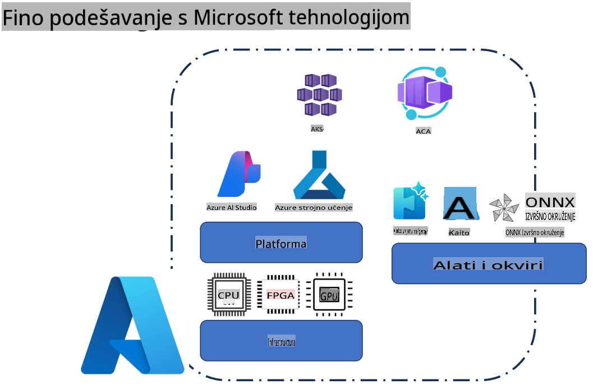
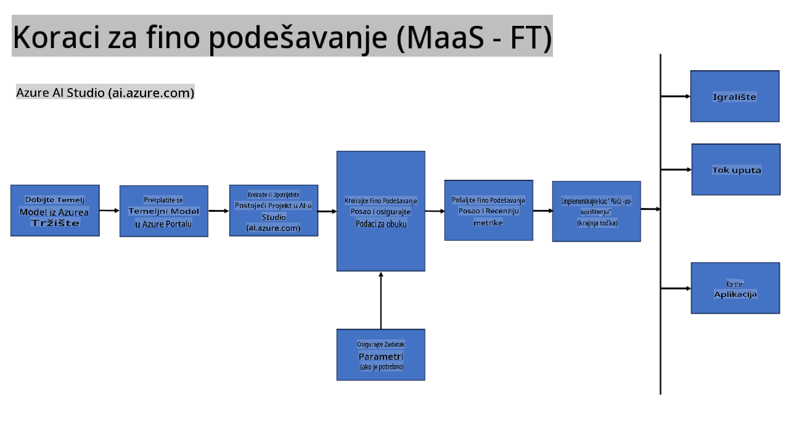
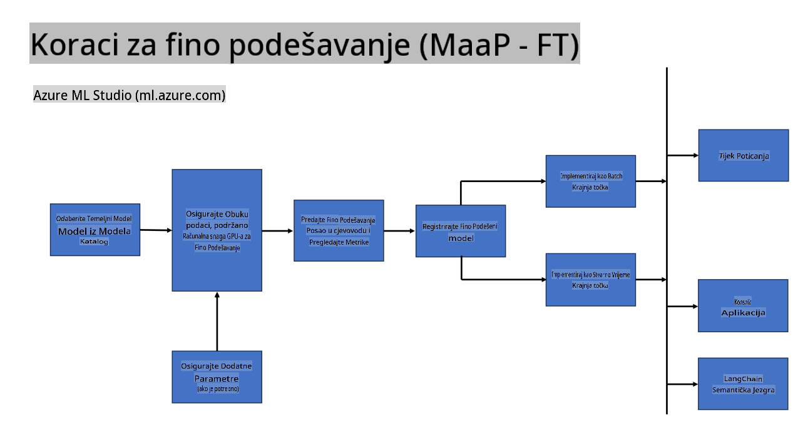
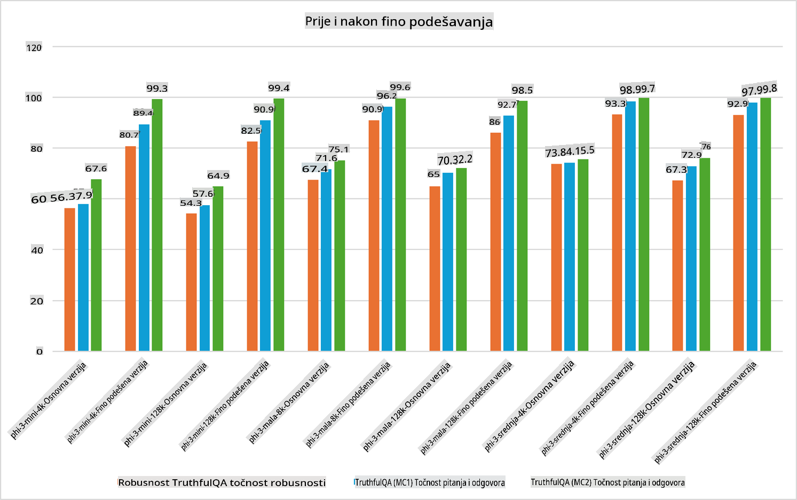

## Scenariji za fino podešavanje

**Platforma** Ovo uključuje razne tehnologije kao što su Azure AI Foundry, Azure Machine Learning, AI Tools, Kaito i ONNX Runtime.

**Infrastruktura** Ovo uključuje CPU i FPGA, koji su ključni za proces fino podešavanja. Dopustite mi da vam pokažem ikone za svaku od ovih tehnologija.

**Alati i okviri** Ovo uključuje ONNX Runtime i ONNX Runtime. Dopustite mi da vam pokažem ikone za svaku od ovih tehnologija.  
[Umetnite ikone za ONNX Runtime i ONNX Runtime]

Proces fino podešavanja s Microsoftovim tehnologijama uključuje različite komponente i alate. Razumijevanjem i korištenjem ovih tehnologija možemo učinkovito prilagoditi naše aplikacije i stvoriti bolja rješenja.

## Model kao usluga

Fino podešavanje modela pomoću hostiranog fino podešavanja, bez potrebe za kreiranjem i upravljanjem računalnim resursima.

Serverless fino podešavanje dostupno je za Phi-3-mini i Phi-3-medium modele, omogućujući programerima brzo i jednostavno prilagođavanje modela za scenarije u oblaku i na rubnim uređajima bez potrebe za organiziranjem računalnih resursa. Također smo objavili da je Phi-3-small sada dostupan putem naše ponude Model-as-a-Service, što programerima omogućuje brz i jednostavan početak razvoja AI-a bez potrebe za upravljanjem osnovnom infrastrukturom.

## Model kao platforma

Korisnici upravljaju vlastitim računalnim resursima kako bi fino podesili svoje modele.

[Primjer fino podešavanja](https://github.com/Azure/azureml-examples/blob/main/sdk/python/foundation-models/system/finetune/chat-completion/chat-completion.ipynb)

## Scenariji za fino podešavanje

| | | | | | | |
|-|-|-|-|-|-|-|
|Scenarij|LoRA|QLoRA|PEFT|DeepSpeed|ZeRO|DORA|
|Prilagodba unaprijed istreniranih LLM-ova specifičnim zadacima ili domenama|Da|Da|Da|Da|Da|Da|
|Fino podešavanje za NLP zadatke poput klasifikacije teksta, prepoznavanja imenovanih entiteta i strojno prevođenje|Da|Da|Da|Da|Da|Da|
|Fino podešavanje za QA zadatke|Da|Da|Da|Da|Da|Da|
|Fino podešavanje za generiranje odgovora nalik ljudskim u chatbotovima|Da|Da|Da|Da|Da|Da|
|Fino podešavanje za generiranje glazbe, umjetnosti ili drugih oblika kreativnosti|Da|Da|Da|Da|Da|Da|
|Smanjenje računalnih i financijskih troškova|Da|Da|Ne|Da|Da|Ne|
|Smanjenje korištenja memorije|Ne|Da|Ne|Da|Da|Da|
|Korištenje manjeg broja parametara za učinkovito fino podešavanje|Ne|Da|Da|Ne|Ne|Da|
|Memorijski učinkovit oblik paralelizma podataka koji omogućuje pristup agregiranoj GPU memoriji svih dostupnih GPU uređaja|Ne|Ne|Ne|Da|Da|Da|

## Primjeri performansi fino podešavanja

**Odricanje od odgovornosti**:  
Ovaj dokument je preveden korištenjem usluga strojno potpomognutog AI prevođenja. Iako nastojimo osigurati točnost, imajte na umu da automatizirani prijevodi mogu sadržavati pogreške ili netočnosti. Izvorni dokument na izvornom jeziku treba smatrati mjerodavnim izvorom. Za ključne informacije preporučuje se profesionalni prijevod od strane ljudskog prevoditelja. Ne preuzimamo odgovornost za nesporazume ili pogrešna tumačenja koja mogu proizaći iz korištenja ovog prijevoda.