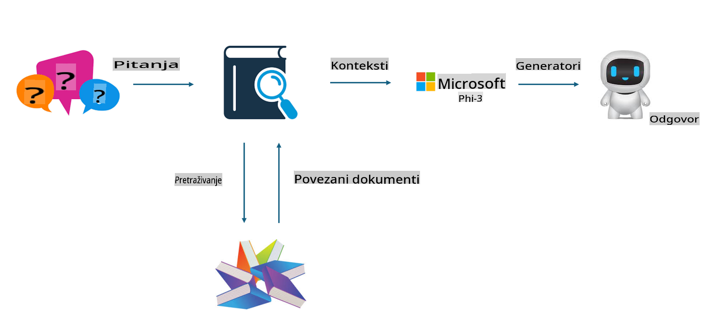

## Fino podešavanje vs RAG

## Dohvatom proširena generacija

RAG kombinira dohvat podataka i generiranje teksta. Strukturirani i nestrukturirani podaci poduzeća pohranjuju se u vektorsku bazu podataka. Prilikom pretraživanja relevantnog sadržaja pronalazi se odgovarajući sažetak i sadržaj kako bi se formirao kontekst, a zatim se koristi sposobnost dovršavanja teksta LLM/SLM za generiranje sadržaja.

## Proces RAG

## Fino podešavanje
Fino podešavanje temelji se na poboljšanju određenog modela. Nije potrebno početi od algoritma modela, ali je potrebno kontinuirano prikupljati podatke. Ako želite precizniju terminologiju i jezične izraze u industrijskim primjenama, fino podešavanje je bolji izbor. No, ako se vaši podaci često mijenjaju, fino podešavanje može postati složeno.

## Kako odabrati
Ako naš odgovor zahtijeva uvođenje vanjskih podataka, RAG je najbolji izbor.

Ako trebate pružiti stabilno i precizno industrijsko znanje, fino podešavanje će biti dobar izbor. RAG daje prednost dohvaćanju relevantnog sadržaja, ali možda neće uvijek pogoditi specijalizirane nijanse.

Fino podešavanje zahtijeva visokokvalitetan skup podataka, a ako se radi o samo malom opsegu podataka, neće donijeti značajnu razliku. RAG je fleksibilniji.  
Fino podešavanje je poput crne kutije, svojevrsne metafizike, i teško je razumjeti unutarnji mehanizam. Međutim, RAG omogućuje lakše pronalaženje izvora podataka, čime se učinkovito smanjuju halucinacije ili pogreške u sadržaju te osigurava bolja transparentnost.

**Odricanje od odgovornosti**:  
Ovaj dokument je preveden korištenjem usluga strojno baziranog AI prijevoda. Iako težimo točnosti, molimo vas da budete svjesni da automatski prijevodi mogu sadržavati pogreške ili netočnosti. Izvorni dokument na njegovom izvornom jeziku treba smatrati mjerodavnim izvorom. Za ključne informacije preporučuje se profesionalni prijevod od strane čovjeka. Ne preuzimamo odgovornost za bilo kakva nesporazume ili pogrešna tumačenja koja proizlaze iz korištenja ovog prijevoda.