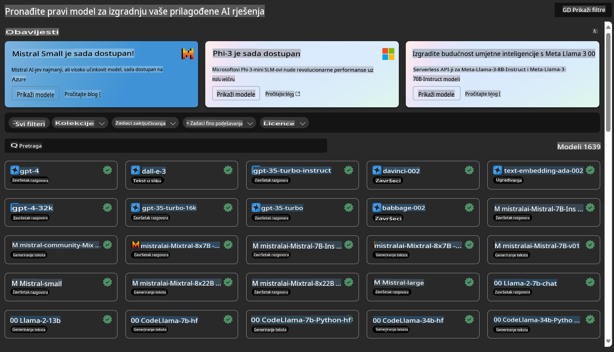

# **Uvod u Azure Machine Learning Service**

[Azure Machine Learning](https://ml.azure.com?WT.mc_id=aiml-138114-kinfeylo) je cloud usluga za ubrzavanje i upravljanje životnim ciklusom projekata strojnog učenja (ML).

Stručnjaci za ML, znanstvenici za podatke i inženjeri mogu je koristiti u svakodnevnim radnim procesima za:

- Treniranje i implementaciju modela.  
- Upravljanje operacijama strojnog učenja (MLOps).  
- Možete stvoriti model u Azure Machine Learning ili koristiti model izrađen na platformi otvorenog koda, poput PyTorch, TensorFlow ili scikit-learn.  
- Alati za MLOps pomažu u praćenju, ponovnom treniranju i ponovnoj implementaciji modela.  

## Za koga je Azure Machine Learning?

**Znanstvenici za podatke i ML inženjeri**

Mogu koristiti alate za ubrzavanje i automatizaciju svojih svakodnevnih radnih procesa.  
Azure ML nudi značajke za pravednost, objašnjivost, praćenje i revizijsku sljedivost.  

**Programeri aplikacija**

Mogu jednostavno integrirati modele u aplikacije ili usluge.  

**Razvojni inženjeri platformi**

Imaju pristup širokom setu alata podržanih čvrstim Azure Resource Manager API-jevima.  
Ovi alati omogućuju izgradnju naprednih alata za ML.  

**Poduzeća**

Rad u Microsoft Azure oblaku omogućuje poduzećima prednosti poput poznate sigurnosti i kontrole pristupa na temelju uloga.  
Postavite projekte za kontrolu pristupa zaštićenim podacima i specifičnim operacijama.  

## Produktivnost za cijeli tim  

ML projekti često zahtijevaju tim s raznolikim vještinama za izgradnju i održavanje.  

Azure ML nudi alate koji omogućuju:  
- Suradnju s timom putem zajedničkih bilježnica, računalnih resursa, serverless obrade, podataka i okruženja.  
- Razvoj modela s pravednošću, objašnjivošću, praćenjem i revizijskom sljedivošću kako bi se ispunili zahtjevi za sljedivost i usklađenost.  
- Brzu i jednostavnu implementaciju ML modela u velikim razmjerima te učinkovito upravljanje i nadzor nad njima pomoću MLOps-a.  
- Pokretanje ML radnih opterećenja bilo gdje uz ugrađeno upravljanje, sigurnost i usklađenost.  

## Alati platforme kompatibilni s raznim sustavima  

Bilo tko u ML timu može koristiti svoje omiljene alate za obavljanje posla.  
Bez obzira provodite li brze eksperimente, podešavanje hiperparametara, gradite li pipelines ili upravljate inferencijama, možete koristiti poznata sučelja uključujući:  
- Azure Machine Learning Studio  
- Python SDK (v2)  
- Azure CLI (v2)  
- Azure Resource Manager REST API-jeve  

Dok usavršavate modele i surađujete tijekom razvojnog ciklusa, možete dijeliti i pronalaziti resurse, metrike i druge sadržaje unutar korisničkog sučelja Azure Machine Learning studija.  

## **LLM/SLM u Azure ML**

Azure ML dodao je mnoge funkcije povezane s LLM/SLM, kombinirajući LLMOps i SLMOps kako bi stvorio platformu za generativnu umjetnu inteligenciju na razini poduzeća.  

### **Katalog modela**  

Korisnici u poduzećima mogu implementirati različite modele prema različitim poslovnim scenarijima putem Kataloga modela te pružiti usluge kao Model as Service za pristup razvojnim inženjerima ili korisnicima u poduzeću.  

  

Katalog modela u Azure Machine Learning studiju središnje je mjesto za otkrivanje i korištenje širokog spektra modela koji omogućuju izgradnju aplikacija temeljenih na generativnoj AI. Katalog modela sadrži stotine modela od pružatelja usluga poput Azure OpenAI servisa, Mistral, Meta, Cohere, Nvidia, Hugging Face, uključujući modele koje je trenirao Microsoft.  
Modeli od pružatelja koji nisu Microsoft definirani su kao proizvodi koji nisu Microsoftovi proizvodi prema Microsoftovim uvjetima korištenja proizvoda i podliježu uvjetima navedenim uz model.  

### **Job Pipeline**  

Osnova pipeline-a za strojno učenje je podjela kompletnog zadatka strojnog učenja na višestepeni tijek rada. Svaki korak je upravljiva komponenta koja se može pojedinačno razvijati, optimizirati, konfigurirati i automatizirati. Koraci su povezani kroz jasno definirana sučelja.  
Usluga pipeline-a u Azure Machine Learningu automatski orkestrira sve ovisnosti između koraka pipeline-a.  

Kod prilagodbe SLM / LLM, možemo upravljati našim podacima, procesima treniranja i generiranja putem pipeline-a.  

  

### **Prompt flow**  

Prednosti korištenja Azure Machine Learning prompt flow-a  
Azure Machine Learning prompt flow nudi niz pogodnosti koje korisnicima pomažu u prijelazu od ideje do eksperimentiranja i, na kraju, do aplikacija temeljenih na LLM-u spremnih za proizvodnju:  

**Agilnost u inženjeringu promptova**  

Interaktivno iskustvo izrade: Azure Machine Learning prompt flow pruža vizualni prikaz strukture tijeka, omogućujući korisnicima da lako razumiju i navigiraju svoje projekte. Također nudi iskustvo kodiranja slično bilježnici za učinkovitu izradu i otklanjanje pogrešaka tijekova.  
Varijante za podešavanje promptova: Korisnici mogu kreirati i uspoređivati više varijanti promptova, olakšavajući iterativni proces usavršavanja.  

Evaluacija: Ugrađeni tijekovi evaluacije omogućuju korisnicima procjenu kvalitete i učinkovitosti njihovih promptova i tijekova.  

Sveobuhvatni resursi: Azure Machine Learning prompt flow uključuje biblioteku ugrađenih alata, uzoraka i predložaka koji služe kao polazište za razvoj, potičući kreativnost i ubrzavajući proces.  

**Spremnost poduzeća za aplikacije temeljene na LLM-u**  

Suradnja: Azure Machine Learning prompt flow podržava timsku suradnju, omogućujući više korisnika da zajednički rade na projektima inženjeringa promptova, dijele znanje i održavaju kontrolu verzija.  

Sve-u-jednom platforma: Azure Machine Learning prompt flow pojednostavljuje cijeli proces inženjeringa promptova, od razvoja i evaluacije do implementacije i praćenja. Korisnici mogu jednostavno implementirati svoje tijekove kao Azure Machine Learning krajnje točke i pratiti njihov učinak u stvarnom vremenu, osiguravajući optimalan rad i kontinuirano poboljšanje.  

Rješenja za spremnost poduzeća u Azure Machine Learningu: Prompt flow koristi robusna rješenja za spremnost poduzeća iz Azure Machine Learninga, pružajući sigurnu, skalabilnu i pouzdanu osnovu za razvoj, eksperimentiranje i implementaciju tijekova.  

S Azure Machine Learning prompt flow-om, korisnici mogu osloboditi svoju agilnost u inženjeringu promptova, učinkovito surađivati i koristiti rješenja na razini poduzeća za uspješan razvoj i implementaciju aplikacija temeljenih na LLM-u.  

Kombiniranjem računalne snage, podataka i različitih komponenti Azure ML-a, razvojni inženjeri u poduzećima mogu lako izgraditi vlastite aplikacije umjetne inteligencije.  

**Odricanje odgovornosti**:  
Ovaj dokument je preveden pomoću usluga strojnog prevođenja temeljenih na umjetnoj inteligenciji. Iako nastojimo osigurati točnost, imajte na umu da automatski prijevodi mogu sadržavati pogreške ili netočnosti. Izvorni dokument na njegovom izvornom jeziku treba smatrati mjerodavnim izvorom. Za ključne informacije preporučuje se profesionalni prijevod od strane stručnjaka. Ne preuzimamo odgovornost za nesporazume ili pogrešna tumačenja koja mogu proizaći iz korištenja ovog prijevoda.