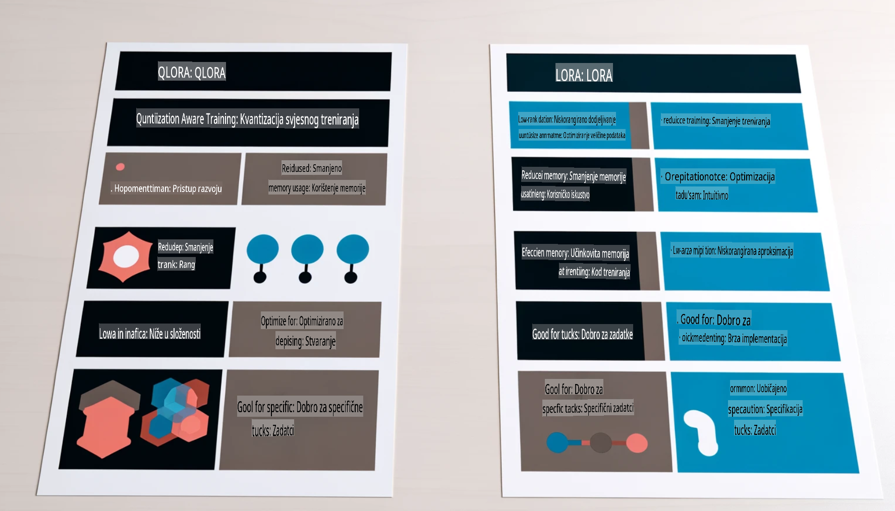

# **Neka Phi-3 postane stručnjak u industriji**

Da biste Phi-3 model primijenili u industriji, potrebno je dodati poslovne podatke iz industrije u Phi-3 model. Imamo dvije različite opcije: RAG (Retrieval Augmented Generation) i Fine Tuning.

## **RAG vs Fine-tuning**

### **Retrieval Augmented Generation**

RAG kombinira dohvaćanje podataka i generiranje teksta. Strukturalni i nestrukturalni podaci poduzeća pohranjuju se u vektorsku bazu podataka. Prilikom pretraživanja relevantnog sadržaja pronalazi se odgovarajući sažetak i sadržaj kako bi se formirao kontekst, a zatim se kombinira s mogućnostima dovršavanja teksta LLM/SLM za generiranje sadržaja.

### **Fine-tuning**

Fine-tuning je poboljšanje postojećeg modela. Nema potrebe započinjati s algoritmom modela, ali je potrebno kontinuirano prikupljanje podataka. Ako želite precizniju terminologiju i izražavanje jezika u industrijskim primjenama, fine-tuning je bolji izbor. No, ako se vaši podaci često mijenjaju, fine-tuning može postati složen.

### **Kako odabrati**

1. Ako naš odgovor zahtijeva uvođenje vanjskih podataka, RAG je najbolji izbor.

2. Ako trebate stabilno i precizno industrijsko znanje, fine-tuning je dobar izbor. RAG daje prioritet dohvaćanju relevantnog sadržaja, ali možda neće uvijek pogoditi specijalizirane nijanse.

3. Fine-tuning zahtijeva visokokvalitetni skup podataka, a ako je riječ o malom opsegu podataka, neće napraviti veliku razliku. RAG je fleksibilniji.

4. Fine-tuning je poput crne kutije, teško je razumjeti unutarnji mehanizam. Ali RAG olakšava pronalazak izvora podataka, čime se učinkovito smanjuju pogreške ili halucinacije u sadržaju i pruža bolja transparentnost.

### **Scenariji**

1. Vertikalne industrije koje zahtijevaju specifičan profesionalni rječnik i izraze, ***Fine-tuning*** je najbolji izbor.

2. Sustav pitanja i odgovora koji uključuje sintezu različitih točaka znanja, ***RAG*** je najbolji izbor.

3. Kombinacija automatiziranog poslovnog toka, ***RAG + Fine-tuning*** je najbolji izbor.

## **Kako koristiti RAG**

Vektorska baza podataka je zbirka podataka pohranjenih u matematičkom obliku. Vektorske baze podataka olakšavaju modelima strojnog učenja pamćenje prethodnih unosa, omogućujući primjenu strojnog učenja za podršku slučajevima upotrebe kao što su pretraživanje, preporuke i generiranje teksta. Podaci se mogu identificirati na temelju mjernih sličnosti, a ne točnih podudarnosti, omogućujući računalnim modelima razumijevanje konteksta podataka.

Vektorska baza podataka ključna je za realizaciju RAG-a. Možemo pretvoriti podatke u vektorsku pohranu pomoću vektorskih modela poput text-embedding-3, jina-ai-embedding itd.

Saznajte više o stvaranju RAG aplikacije [https://github.com/microsoft/Phi-3CookBook](https://github.com/microsoft/Phi-3CookBook?WT.mc_id=aiml-138114-kinfeylo)

## **Kako koristiti Fine-tuning**

Najčešće korišteni algoritmi u Fine-tuningu su Lora i QLora. Kako odabrati?
- [Saznajte više putem ovog uzorka bilježnice](../../../../code/04.Finetuning/Phi_3_Inference_Finetuning.ipynb)
- [Primjer Python FineTuning uzorka](../../../../code/04.Finetuning/FineTrainingScript.py)

### **Lora i QLora**

LoRA (Low-Rank Adaptation) i QLoRA (Quantized Low-Rank Adaptation) su tehnike koje se koriste za fine-tuning velikih jezičnih modela (LLMs) pomoću metode Parameter Efficient Fine Tuning (PEFT). PEFT tehnike dizajnirane su za učinkovitije treniranje modela u usporedbi s tradicionalnim metodama.  
LoRA je samostalna tehnika fine-tuninga koja smanjuje memorijski otisak primjenom niskorangirane aproksimacije na matricu ažuriranja težina. Nudi brzo vrijeme treniranja i održava performanse bliske tradicionalnim metodama fine-tuninga.  

QLoRA je proširena verzija LoRA koja uključuje tehnike kvantizacije za dodatno smanjenje potrošnje memorije. QLoRA kvantizira preciznost parametara težine u prethodno istreniranom LLM-u na 4-bitnu preciznost, što je memorijski učinkovitije od LoRA-e. Međutim, treniranje QLoRA-e je otprilike 30% sporije od treniranja LoRA-e zbog dodatnih koraka kvantizacije i dekvantizacije.  

QLoRA koristi LoRA kao dodatak za ispravljanje pogrešaka nastalih tijekom kvantizacije. QLoRA omogućuje fine-tuning masivnih modela s milijardama parametara na relativno malim, lako dostupnim GPU-ovima. Na primjer, QLoRA može prilagoditi model s 70 milijardi parametara koji zahtijeva 36 GPU-ova koristeći samo 2.

**Odricanje od odgovornosti**:  
Ovaj dokument je preveden korištenjem usluga strojnog AI prevođenja. Iako težimo točnosti, molimo vas da budete svjesni da automatizirani prijevodi mogu sadržavati pogreške ili netočnosti. Izvorni dokument na izvornom jeziku treba smatrati mjerodavnim izvorom. Za ključne informacije preporučuje se profesionalni prijevod od strane ljudskog prevoditelja. Ne preuzimamo odgovornost za nesporazume ili pogrešna tumačenja koja proizlaze iz korištenja ovog prijevoda.