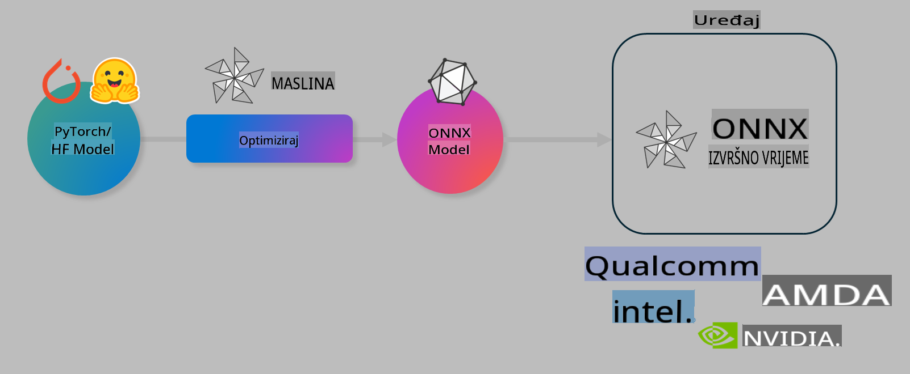

# Lab. Optimizacija AI modela za inference na uređaju

## Uvod 

> [!IMPORTANT]
> Ova radionica zahtijeva **Nvidia A10 ili A100 GPU** s pripadajućim upravljačkim programima i instaliranim CUDA alatom (verzija 12+).

> [!NOTE]
> Ovo je **35-minutna** radionica koja će vam pružiti praktičan uvod u osnovne koncepte optimizacije modela za inference na uređaju koristeći OLIVE.

## Ciljevi učenja

Na kraju ove radionice, moći ćete koristiti OLIVE za:

- Kvantizaciju AI modela koristeći metodu kvantizacije AWQ.
- Fino podešavanje AI modela za specifičan zadatak.
- Generiranje LoRA adaptera (fino podešen model) za učinkovitu inference na uređaju koristeći ONNX Runtime.

### Što je Olive

Olive (*O*NNX *live*) je alat za optimizaciju modela s pratećim CLI-jem koji omogućuje isporuku modela za ONNX runtime +++https://onnxruntime.ai+++ s visokom kvalitetom i performansama.



Ulaz za Olive obično je PyTorch ili Hugging Face model, a izlaz je optimizirani ONNX model koji se izvršava na uređaju (cilj implementacije) koji koristi ONNX runtime. Olive optimizira model za AI akcelerator ciljanog uređaja (NPU, GPU, CPU) koji pruža proizvođač hardvera kao što su Qualcomm, AMD, Nvidia ili Intel.

Olive izvršava *workflow*, što je poredani slijed pojedinačnih zadataka optimizacije modela nazvanih *passes* - primjeri passes uključuju: kompresiju modela, hvatanje grafa, kvantizaciju, optimizaciju grafa. Svaki pass ima skup parametara koji se mogu prilagoditi kako bi se postigli najbolji metrički rezultati, poput točnosti i kašnjenja, koje procjenjuje odgovarajući evaluator. Olive koristi strategiju pretraživanja koja koristi algoritam pretraživanja za automatsko podešavanje svakog passa pojedinačno ili skupa passes zajedno.

#### Prednosti Olive-a

- **Smanjenje frustracije i vremena** potrebnog za ručne eksperimente pokušaja i pogrešaka s različitim tehnikama optimizacije grafa, kompresije i kvantizacije. Definirajte svoje zahtjeve za kvalitetom i performansama i dopustite Olive-u da automatski pronađe najbolji model za vas.
- **40+ ugrađenih komponenti za optimizaciju modela** koje pokrivaju najnovije tehnike kvantizacije, kompresije, optimizacije grafa i finog podešavanja.
- **Jednostavan CLI** za uobičajene zadatke optimizacije modela. Na primjer, olive quantize, olive auto-opt, olive finetune.
- Ugrađeno pakiranje i implementacija modela.
- Podrška za generiranje modela za **Multi LoRA posluživanje**.
- Konstrukcija workflow-a pomoću YAML/JSON-a za orkestraciju zadataka optimizacije i implementacije modela.
- Integracija s **Hugging Face** i **Azure AI**.
- Ugrađeni mehanizam **keširanja** za **smanjenje troškova**.

## Upute za radionicu
> [!NOTE]
> Molimo osigurajte da ste pripremili svoj Azure AI Hub i Projekt te postavili svoj A100 izračun kao što je navedeno u Radionici 1.

### Korak 0: Povezivanje s vašim Azure AI Compute-om

Povezat ćete se s Azure AI Compute koristeći udaljenu značajku u **VS Code-u.** 

1. Otvorite svoju **VS Code** desktop aplikaciju:
1. Otvorite **command palette** koristeći **Shift+Ctrl+P**
1. U command palette pretražite **AzureML - remote: Connect to compute instance in New Window**.
1. Slijedite upute na ekranu za povezivanje s Compute-om. Ovo će uključivati odabir vaše Azure pretplate, resursne grupe, projekta i naziva Compute-a koji ste postavili u Radionici 1.
1. Kada se povežete s vašim Azure ML Compute čvorom, to će biti prikazano u **donjem lijevom kutu Visual Code-a** `><Azure ML: Compute Name`

### Korak 1: Kloniranje ovog repozitorija

U VS Code-u možete otvoriti novi terminal s **Ctrl+J** i klonirati ovaj repozitorij:

U terminalu biste trebali vidjeti prompt

```
azureuser@computername:~/cloudfiles/code$ 
```
Klonirajte rješenje 

```bash
cd ~/localfiles
git clone https://github.com/microsoft/phi-3cookbook.git
```

### Korak 2: Otvaranje mape u VS Code-u

Za otvaranje VS Code-a u odgovarajućoj mapi izvršite sljedeću naredbu u terminalu, koja će otvoriti novi prozor:

```bash
code phi-3cookbook/code/04.Finetuning/Olive-lab
```

Alternativno, možete otvoriti mapu odabirom **File** > **Open Folder**. 

### Korak 3: Ovisnosti

Otvorite prozor terminala u VS Code-u na svom Azure AI Compute instance-u (savjet: **Ctrl+J**) i izvršite sljedeće naredbe za instalaciju ovisnosti:

```bash
conda create -n olive-ai python=3.11 -y
conda activate olive-ai
pip install -r requirements.txt
az extension remove -n azure-cli-ml
az extension add -n ml
```

> [!NOTE]
> Instalacija svih ovisnosti trajat će ~5 minuta.

U ovoj radionici preuzet ćete i učitati modele u katalog modela Azure AI. Kako biste mogli pristupiti katalogu modela, morat ćete se prijaviti u Azure koristeći:

```bash
az login
```

> [!NOTE]
> Tijekom prijave od vas će se tražiti da odaberete svoju pretplatu. Osigurajte da postavite pretplatu na onu koja je osigurana za ovu radionicu.

### Korak 4: Izvršavanje Olive naredbi 

Otvorite prozor terminala u VS Code-u na svom Azure AI Compute instance-u (savjet: **Ctrl+J**) i osigurajte da je aktivirano okruženje `olive-ai` conda:

```bash
conda activate olive-ai
```

Zatim izvršite sljedeće Olive naredbe u komandnoj liniji.

1. **Pregled podataka:** U ovom primjeru, fino ćete podešavati Phi-3.5-Mini model kako bi bio specijaliziran za odgovaranje na pitanja vezana uz putovanja. Kod ispod prikazuje prvih nekoliko zapisa iz skupa podataka koji su u JSON lines formatu:
   
    ```bash
    head data/data_sample_travel.jsonl
    ```
1. **Kvantizacija modela:** Prije treniranja modela, prvo ga kvantizirajte koristeći sljedeću naredbu koja koristi tehniku nazvanu Active Aware Quantization (AWQ) +++https://arxiv.org/abs/2306.00978+++. AWQ kvantizira težine modela uzimajući u obzir aktivacije proizvedene tijekom inferencije. To znači da proces kvantizacije uzima u obzir stvarnu distribuciju podataka u aktivacijama, što dovodi do boljeg očuvanja točnosti modela u usporedbi s tradicionalnim metodama kvantizacije težina.
    
    ```bash
    olive quantize \
       --model_name_or_path microsoft/Phi-3.5-mini-instruct \
       --trust_remote_code \
       --algorithm awq \
       --output_path models/phi/awq \
       --log_level 1
    ```
    
    Proces kvantizacije AWQ traje **~8 minuta**, a veličina modela smanjuje se s **~7.5GB na ~2.5GB**.
   
   U ovoj radionici pokazujemo kako unositi modele iz Hugging Face-a (na primjer: `microsoft/Phi-3.5-mini-instruct`). However, Olive also allows you to input models from the Azure AI catalog by updating the `model_name_or_path` argument to an Azure AI asset ID (for example:  `azureml://registries/azureml/models/Phi-3.5-mini-instruct/versions/4`). 

1. **Train the model:** Next, the `olive finetune` naredba fino podešava kvantizirani model. Kvantizacija modela *prije* finog podešavanja umjesto nakon rezultira boljom točnošću jer proces finog podešavanja oporavlja dio gubitka iz kvantizacije.
    
    ```bash
    olive finetune \
        --method lora \
        --model_name_or_path models/phi/awq \
        --data_files "data/data_sample_travel.jsonl" \
        --data_name "json" \
        --text_template "<|user|>\n{prompt}<|end|>\n<|assistant|>\n{response}<|end|>" \
        --max_steps 100 \
        --output_path ./models/phi/ft \
        --log_level 1
    ```
    
    Fino podešavanje traje **~6 minuta** (sa 100 koraka).

1. **Optimizacija:** S treniranim modelom sada možete optimizirati model koristeći Olive-ovu naredbu `auto-opt` command, which will capture the ONNX graph and automatically perform a number of optimizations to improve the model performance for CPU by compressing the model and doing fusions. It should be noted, that you can also optimize for other devices such as NPU or GPU by just updating the `--device` and `--provider` argumente - ali za potrebe ove radionice koristit ćemo CPU.

    ```bash
    olive auto-opt \
       --model_name_or_path models/phi/ft/model \
       --adapter_path models/phi/ft/adapter \
       --device cpu \
       --provider CPUExecutionProvider \
       --use_ort_genai \
       --output_path models/phi/onnx-ao \
       --log_level 1
    ```
    
    Optimizacija traje **~5 minuta**.

### Korak 5: Brzi test inferencije modela

Za testiranje inferencije modela, kreirajte Python datoteku u svojoj mapi nazvanu **app.py** i kopirajte i zalijepite sljedeći kod:

```python
import onnxruntime_genai as og
import numpy as np

print("loading model and adapters...", end="", flush=True)
model = og.Model("models/phi/onnx-ao/model")
adapters = og.Adapters(model)
adapters.load("models/phi/onnx-ao/model/adapter_weights.onnx_adapter", "travel")
print("DONE!")

tokenizer = og.Tokenizer(model)
tokenizer_stream = tokenizer.create_stream()

params = og.GeneratorParams(model)
params.set_search_options(max_length=100, past_present_share_buffer=False)
user_input = "what is the best thing to see in chicago"
params.input_ids = tokenizer.encode(f"<|user|>\n{user_input}<|end|>\n<|assistant|>\n")

generator = og.Generator(model, params)

generator.set_active_adapter(adapters, "travel")

print(f"{user_input}")

while not generator.is_done():
    generator.compute_logits()
    generator.generate_next_token()

    new_token = generator.get_next_tokens()[0]
    print(tokenizer_stream.decode(new_token), end='', flush=True)

print("\n")
```

Izvršite kod koristeći:

```bash
python app.py
```

### Korak 6: Učitavanje modela u Azure AI

Učitavanje modela u Azure AI repozitorij modela omogućuje dijeljenje modela s ostalim članovima vašeg razvojnog tima i također upravlja verzijama modela. Za učitavanje modela izvršite sljedeću naredbu:

> [!NOTE]
> Ažurirajte `{}` placeholders with the name of your resource group and Azure AI Project Name. 

To find your resource group `"resourceGroup"i naziv projekta Azure AI, izvršite sljedeću naredbu 

```
az ml workspace show
```

Ili idite na +++ai.azure.com+++ i odaberite **management center** **project** **overview**

Ažurirajte `{}` s nazivom vaše resursne grupe i naziva projekta Azure AI.

```bash
az ml model create \
    --name ft-for-travel \
    --version 1 \
    --path ./models/phi/onnx-ao \
    --resource-group {RESOURCE_GROUP_NAME} \
    --workspace-name {PROJECT_NAME}
```
Tada možete vidjeti svoj učitani model i implementirati ga na https://ml.azure.com/model/list

**Odricanje odgovornosti**:  
Ovaj dokument preveden je pomoću usluga strojno baziranog AI prevođenja. Iako težimo točnosti, imajte na umu da automatski prijevodi mogu sadržavati pogreške ili netočnosti. Izvorni dokument na izvornom jeziku treba smatrati mjerodavnim izvorom. Za ključne informacije preporučuje se profesionalni prijevod od strane ljudskog prevoditelja. Ne preuzimamo odgovornost za nesporazume ili pogrešne interpretacije proizašle iz korištenja ovog prijevoda.