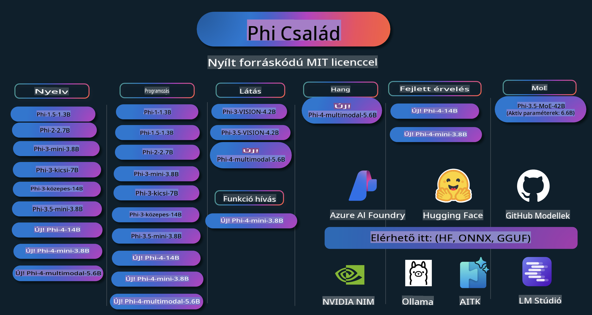

# Phi Szakácskönyv: Gyakorlati példák a Microsoft Phi modellekkel

A Phi a Microsoft által fejlesztett nyílt forráskódú AI modellek sorozata.

Jelenleg a Phi a legerősebb és legköltséghatékonyabb kis nyelvi modell (SLM), amely kiváló eredményeket ér el többnyelvűség, érvelés, szöveg/csevegés generálás, kódolás, képek, hangok és más forgatókönyvek terén.

A Phi telepíthető felhőbe vagy peremhálózati eszközökre, és könnyen építhetők generatív AI alkalmazások korlátozott számítási kapacitással.

Kövesse az alábbi lépéseket, hogy elkezdje használni ezeket az erőforrásokat:
1. **Forkolja a repót**: Kattintson ide 
2. **Klónozza a repót**:   `git clone https://github.com/microsoft/PhiCookBook.git`
3. [**Csatlakozzon a Microsoft AI Discord közösséghez, és találkozzon szakértőkkel és más fejlesztőkkel**](https://discord.com/invite/ByRwuEEgH4?WT.mc_id=aiml-137032-kinfeylo)

## Tartalomjegyzék

- Bevezetés
  - [Üdvözöljük a Phi családban](./md/01.Introduction/01/01.PhiFamily.md)
  - [Környezet beállítása](./md/01.Introduction/01/01.EnvironmentSetup.md)
  - [Kulcstechnológiák megértése](./md/01.Introduction/01/01.Understandingtech.md)
  - [AI biztonság a Phi modelleknél](./md/01.Introduction/01/01.AISafety.md)
  - [Phi hardvertámogatás](./md/01.Introduction/01/01.Hardwaresupport.md)
  - [Phi modellek és elérhetőség platformokon](./md/01.Introduction/01/01.Edgeandcloud.md)
  - [Guidance-ai és Phi használata](./md/01.Introduction/01/01.Guidance.md)
  - [GitHub Marketplace modellek](https://github.com/marketplace/models)
  - [Azure AI Model Katalógus](https://ai.azure.com)

- Phi következtetések különböző környezetekben
    - [Hugging face](./md/01.Introduction/02/01.HF.md)
    - [GitHub modellek](./md/01.Introduction/02/02.GitHubModel.md)
    - [Azure AI Foundry Model Katalógus](./md/01.Introduction/02/03.AzureAIFoundry.md)
    - [Ollama](./md/01.Introduction/02/04.Ollama.md)
    - [AI Toolkit VSCode (AITK)](./md/01.Introduction/02/05.AITK.md)
    - [NVIDIA NIM](./md/01.Introduction/02/06.NVIDIA.md)

- Phi család következtetések
    - [Phi következtetés iOS-en](./md/01.Introduction/03/iOS_Inference.md)
    - [Phi következtetés Androidon](./md/01.Introduction/03/Android_Inference.md)
- [Phi következtetés Jetsonon](./md/01.Introduction/03/Jetson_Inference.md)
    - [Phi következtetés AI PC-n](./md/01.Introduction/03/AIPC_Inference.md)
    - [Phi következtetés az Apple MLX Framework segítségével](./md/01.Introduction/03/MLX_Inference.md)
    - [Phi következtetés helyi szerveren](./md/01.Introduction/03/Local_Server_Inference.md)
    - [Phi következtetés távoli szerveren AI Toolkit használatával](./md/01.Introduction/03/Remote_Interence.md)
    - [Phi következtetés Rusttal](./md/01.Introduction/03/Rust_Inference.md)
    - [Phi--Vision következtetés helyben](./md/01.Introduction/03/Vision_Inference.md)
    - [Phi következtetés Kaito AKS-szel és Azure Containers-szel (hivatalos támogatás)](./md/01.Introduction/03/Kaito_Inference.md)
- [Phi család kvantifikálása](./md/01.Introduction/04/QuantifyingPhi.md)
    - [Phi-3.5 / 4 kvantifikálása llama.cpp használatával](./md/01.Introduction/04/UsingLlamacppQuantifyingPhi.md)
    - [Phi-3.5 / 4 kvantifikálása Generative AI kiterjesztésekkel az onnxruntime-hoz](./md/01.Introduction/04/UsingORTGenAIQuantifyingPhi.md)
    - [Phi-3.5 / 4 kvantifikálása Intel OpenVINO használatával](./md/01.Introduction/04/UsingIntelOpenVINOQuantifyingPhi.md)
    - [Phi-3.5 / 4 kvantifikálása az Apple MLX Framework segítségével](./md/01.Introduction/04/UsingAppleMLXQuantifyingPhi.md)

- Phi értékelése
    - [Felelős AI](./md/01.Introduction/05/ResponsibleAI.md)
    - [Azure AI Foundry az értékeléshez](./md/01.Introduction/05/AIFoundry.md)
    - [Promptflow használata értékeléshez](./md/01.Introduction/05/Promptflow.md)

- RAG az Azure AI Search segítségével
    - [Hogyan használjuk a Phi-4-mini és Phi-4-multimodal (RAG) modelleket az Azure AI Search-el](https://github.com/microsoft/PhiCookBook/blob/main/code/06.E2E/E2E_Phi-4-RAG-Azure-AI-Search.ipynb)

- Phi alkalmazásfejlesztési minták
  - Szöveg- és chatalkalmazások
    - Phi-4 minták 🆕
      - [📓] [Chat Phi-4-mini ONNX modellel](./md/02.Application/01.TextAndChat/Phi4/ChatWithPhi4ONNX/README.md)
      - [Chat Phi-4 helyi ONNX modellel .NET-en](../../md/04.HOL/dotnet/src/LabsPhi4-Chat-01OnnxRuntime)
      - [Chat .NET konzolos alkalmazás Phi-4 ONNX modellel Sementic Kernel használatával](../../md/04.HOL/dotnet/src/LabsPhi4-Chat-02SK)
    - Phi-3 / 3.5 minták
      - [Helyi chatbot a böngészőben Phi3, ONNX Runtime Web és WebGPU használatával](https://github.com/microsoft/onnxruntime-inference-examples/tree/main/js/chat)
      - [OpenVino Chat](./md/02.Application/01.TextAndChat/Phi3/E2E_OpenVino_Chat.md)
      - [Többmodell - Interaktív Phi-3-mini és OpenAI Whisper](./md/02.Application/01.TextAndChat/Phi3/E2E_Phi-3-mini_with_whisper.md)
      - [MLFlow - Burkoló készítése és Phi-3 használata MLFlow-val](./md//02.Application/01.TextAndChat/Phi3/E2E_Phi-3-MLflow.md)
      - [Model optimalizálás - Hogyan optimalizáljuk a Phi-3-min modellt az ONNX Runtime Webhez Olive segítségével](https://github.com/microsoft/Olive/tree/main/examples/phi3)
      - [WinUI3 alkalmazás Phi-3 mini-4k-instruct-onnx modellel](https://github.com/microsoft/Phi3-Chat-WinUI3-Sample/)
      - [WinUI3 többmodell mesterséges intelligenciával támogatott jegyzetalkalmazás minta](https://github.com/microsoft/ai-powered-notes-winui3-sample)
      - [Phi-3 egyedi modellek finomhangolása és integrálása Promptflow-val](./md/02.Application/01.TextAndChat/Phi3/E2E_Phi-3-FineTuning_PromptFlow_Integration.md)
      - [Phi-3 egyedi modellek finomhangolása és integrálása Promptflow-val az Azure AI Foundry-ban](./md/02.Application/01.TextAndChat/Phi3/E2E_Phi-3-FineTuning_PromptFlow_Integration_AIFoundry.md)
      - [Finomhangolt Phi-3 / Phi-3.5 modellek értékelése az Azure AI Foundry-ban a Microsoft Felelős AI elveire összpontosítva](./md/02.Application/01.TextAndChat/Phi3/E2E_Phi-3-Evaluation_AIFoundry.md)
- [📓] [Phi-3.5-mini-instruct nyelvi előrejelzési példa (kínai/angol)](../../md/02.Application/01.TextAndChat/Phi3/phi3-instruct-demo.ipynb)
      - [Phi-3.5-Instruct WebGPU RAG Chatbot](./md/02.Application/01.TextAndChat/Phi3/WebGPUWithPhi35Readme.md)
      - [Windows GPU használata Prompt flow megoldás létrehozásához Phi-3.5-Instruct ONNX segítségével](./md/02.Application/01.TextAndChat/Phi3/UsingPromptFlowWithONNX.md)
      - [Microsoft Phi-3.5 tflite használata Android alkalmazás készítéséhez](./md/02.Application/01.TextAndChat/Phi3/UsingPhi35TFLiteCreateAndroidApp.md)
      - [Q&A .NET példa helyi ONNX Phi-3 modell használatával a Microsoft.ML.OnnxRuntime segítségével](../../md/04.HOL/dotnet/src/LabsPhi301)
      - [Konzolos chat .NET alkalmazás Semantic Kernel-lel és Phi-3-mal](../../md/04.HOL/dotnet/src/LabsPhi302)

  - Azure AI Inference SDK kód alapú példák 
    - Phi-4 példák 🆕
      - [📓] [Projektkód generálása Phi-4-multimodal segítségével](./md/02.Application/02.Code/Phi4/GenProjectCode/README.md)
    - Phi-3 / 3.5 példák
      - [Saját Visual Studio Code GitHub Copilot Chat létrehozása Microsoft Phi-3 családdal](./md/02.Application/02.Code/Phi3/VSCodeExt/README.md)
      - [Saját Visual Studio Code Chat Copilot Agent létrehozása Phi-3.5-tel GitHub Modellek segítségével](/md/02.Application/02.Code/Phi3/CreateVSCodeChatAgentWithGitHubModels.md)

  - Haladó érvelési példák
    - Phi-4 példák 🆕
      - [📓] [Phi-4-mini érvelési példák](./md/02.Application/03.AdvancedReasoning/Phi4/AdvancedResoningPhi4mini/README.md)
  
  - Demók
      - [Phi-4-mini demók a Hugging Face Spaces-en](https://huggingface.co/spaces/microsoft/phi-4-mini?WT.mc_id=aiml-137032-kinfeylo)
      - [Phi-4-multimodal demók a Hugging Face Spaces-en](https://huggingface.co/spaces/microsoft/phi-4-multimodal?WT.mc_id=aiml-137032-kinfeylo)
  - Látvány példák
    - Phi-4 példák 🆕
      - [📓] [Phi-4-multimodal használata képek olvasására és kód generálására](./md/02.Application/04.Vision/Phi4/CreateFrontend/README.md) 
    - Phi-3 / 3.5 példák
      -  [📓][Phi-3-vision - Kép szövegből szövegbe](../../md/02.Application/04.Vision/Phi3/E2E_Phi-3-vision-image-text-to-text-online-endpoint.ipynb)
      - [Phi-3-vision-ONNX](https://onnxruntime.ai/docs/genai/tutorials/phi3-v.html)
      - [📓][Phi-3-vision CLIP Beágyazás](../../md/02.Application/04.Vision/Phi3/E2E_Phi-3-vision-image-text-to-text-online-endpoint.ipynb)
      - [DEMO: Phi-3 Újrahasznosítás](https://github.com/jennifermarsman/PhiRecycling/)
      - [Phi-3-vision - Vizuális nyelvi asszisztens - Phi3-Vision és OpenVINO segítségével](https://docs.openvino.ai/nightly/notebooks/phi-3-vision-with-output.html)
      - [Phi-3 Vision Nvidia NIM](./md/02.Application/04.Vision/Phi3/E2E_Nvidia_NIM_Vision.md)
      - [Phi-3 Vision OpenVino](./md/02.Application/04.Vision/Phi3/E2E_OpenVino_Phi3Vision.md)
      - [📓][Phi-3.5 Vision többképes vagy többkeretes példa](../../md/02.Application/04.Vision/Phi3/phi3-vision-demo.ipynb)
      - [Phi-3 Vision helyi ONNX modell a Microsoft.ML.OnnxRuntime .NET segítségével](../../md/04.HOL/dotnet/src/LabsPhi303)
      - [Menübázisú Phi-3 Vision helyi ONNX modell a Microsoft.ML.OnnxRuntime .NET segítségével](../../md/04.HOL/dotnet/src/LabsPhi304)

  - Hang példák
    - Phi-4 példák 🆕
      - [📓] [Hangátiratok kinyerése Phi-4-multimodal segítségével](./md/02.Application/05.Audio/Phi4/Transciption/README.md)
      - [📓] [Phi-4-multimodal hang példa](../../md/02.Application/05.Audio/Phi4/Siri/demo.ipynb)
      - [📓] [Phi-4-multimodal beszéd fordítási példa](../../md/02.Application/05.Audio/Phi4/Translate/demo.ipynb)
      - [.NET konzolos alkalmazás Phi-4-multimodal hang használatával egy hangfájl elemzésére és átirat készítésére](../../md/04.HOL/dotnet/src/LabsPhi4-MultiModal-02Audio)

  - MOE példák
    - Phi-3 / 3.5 példák
      - [📓] [Phi-3.5 Mixture of Experts Models (MoEs) közösségi média példa](../../md/02.Application/06.MoE/Phi3/phi3_moe_demo.ipynb)
      - [📓] [Visszakeresésen alapuló generálási (RAG) folyamat létrehozása NVIDIA NIM Phi-3 MOE, Azure AI Search és LlamaIndex segítségével](../../md/02.Application/06.MoE/Phi3/azure-ai-search-nvidia-rag.ipynb)
  - Funkcióhívási példák
    - Phi-4 példák 🆕
      -  [📓] [Funkcióhívás használata Phi-4-mini segítségével](./md/02.Application/07.FunctionCalling/Phi4/FunctionCallingBasic/README.md)
  - Multimodális keverési példák
    - Phi-4 példák 🆕
- [📓] [Phi-4-multimodal használata technológiai újságíróként](../../md/02.Application/08.Multimodel/Phi4/TechJournalist/phi_4_mm_audio_text_publish_news.ipynb)  
  - [.NET konzolos alkalmazás, amely a Phi-4-multimodalt használja képek elemzésére](../../md/04.HOL/dotnet/src/LabsPhi4-MultiModal-01Images)

- Phi finomhangolási minták  
  - [Finomhangolási forgatókönyvek](./md/03.FineTuning/FineTuning_Scenarios.md)  
  - [Finomhangolás vs RAG](./md/03.FineTuning/FineTuning_vs_RAG.md)  
  - [Finomhangolás: Phi-3 iparági szakértővé válik](./md/03.FineTuning/LetPhi3gotoIndustriy.md)  
  - [Phi-3 finomhangolása az AI Toolkit segítségével a VS Code-ban](./md/03.FineTuning/Finetuning_VSCodeaitoolkit.md)  
  - [Phi-3 finomhangolása az Azure Machine Learning Service-szel](./md/03.FineTuning/Introduce_AzureML.md)  
  - [Phi-3 finomhangolása Lorával](./md/03.FineTuning/FineTuning_Lora.md)  
  - [Phi-3 finomhangolása QLorával](./md/03.FineTuning/FineTuning_Qlora.md)  
  - [Phi-3 finomhangolása az Azure AI Foundry segítségével](./md/03.FineTuning/FineTuning_AIFoundry.md)  
  - [Phi-3 finomhangolása az Azure ML CLI/SDK-val](./md/03.FineTuning/FineTuning_MLSDK.md)  
  - [Finomhangolás a Microsoft Olive segítségével](./md/03.FineTuning/FineTuning_MicrosoftOlive.md)  
  - [Finomhangolás a Microsoft Olive gyakorlati laborral](./md/03.FineTuning/olive-lab/readme.md)  
  - [Phi-3-vision finomhangolása a Weights and Bias segítségével](./md/03.FineTuning/FineTuning_Phi-3-visionWandB.md)  
  - [Phi-3 finomhangolása az Apple MLX Frameworkkel](./md/03.FineTuning/FineTuning_MLX.md)  
  - [Phi-3-vision finomhangolása (hivatalos támogatás)](./md/03.FineTuning/FineTuning_Vision.md)  
  - [Phi-3 és Kaito AKS, Azure Containers finomhangolása (hivatalos támogatás)](./md/03.FineTuning/FineTuning_Kaito.md)  
  - [Phi-3 és 3.5 Vision finomhangolása](https://github.com/2U1/Phi3-Vision-Finetune)  

- Gyakorlati labor  
  - [Új generációs modellek felfedezése: LLM-ek, SLM-ek, helyi fejlesztés és még sok más](https://github.com/microsoft/aitour-exploring-cutting-edge-models)  
  - [NLP lehetőségek kiaknázása: Finomhangolás a Microsoft Olive-val](https://github.com/azure/Ignite_FineTuning_workshop)  

- Tudományos kutatási cikkek és publikációk  
  - [Textbooks Are All You Need II: phi-1.5 technikai jelentés](https://arxiv.org/abs/2309.05463)  
  - [Phi-3 technikai jelentés: Egy rendkívül fejlett nyelvi modell helyileg a telefonodon](https://arxiv.org/abs/2404.14219)  
  - [Phi-4 technikai jelentés](https://arxiv.org/abs/2412.08905)  
  - [Kis nyelvi modellek optimalizálása járművekben történő funkcióhívásokhoz](https://arxiv.org/abs/2501.02342)  
  - [(WhyPHI) PHI-3 finomhangolása feleletválasztós kérdések megválaszolására: Módszertan, eredmények és kihívások](https://arxiv.org/abs/2501.01588)  

## Phi modellek használata  

### Phi az Azure AI Foundry-ban  

Megtanulhatod, hogyan használd a Microsoft Phi-t, és hogyan építs E2E megoldásokat különböző hardvereszközeiden. Ha szeretnéd magad kipróbálni a Phi-t, kezdd a modellek tesztelésével és testreszabásával a saját forgatókönyveidhez az [Azure AI Foundry Azure AI Model Catalog](https://aka.ms/phi3-azure-ai) segítségével. További információt találsz az [Azure AI Foundry kezdési útmutatóban](/md/02.QuickStart/AzureAIFoundry_QuickStart.md).  

**Játszótér**  
Minden modellhez tartozik egy dedikált játszótér a teszteléshez: [Azure AI Playground](https://aka.ms/try-phi3).  

### Phi a GitHub modellek között  

Megtanulhatod, hogyan használd a Microsoft Phi-t, és hogyan építs E2E megoldásokat különböző hardvereszközeiden. Ha szeretnéd magad kipróbálni a Phi-t, kezdd a modellek tesztelésével és testreszabásával a saját forgatókönyveidhez a [GitHub Model Catalog](https://github.com/marketplace/models?WT.mc_id=aiml-137032-kinfeylo) segítségével. További információt találsz a [GitHub Model Catalog kezdési útmutatóban](/md/02.QuickStart/GitHubModel_QuickStart.md).  

**Játszótér**  
Minden modellhez tartozik egy [játszótér, ahol tesztelheted a modellt](/md/02.QuickStart/GitHubModel_QuickStart.md).

### Phi a Hugging Face-en

A modellt megtalálhatod a [Hugging Face](https://huggingface.co/microsoft) platformon is.

**Játszótér**  
[Hugging Chat játszótér](https://huggingface.co/chat/models/microsoft/Phi-3-mini-4k-instruct)

## Felelős AI 

A Microsoft elkötelezett amellett, hogy segítse ügyfeleit mesterséges intelligencia termékeink felelősségteljes használatában, megossza tapasztalatait, és bizalmon alapuló partnerségeket építsen olyan eszközökkel, mint a Transparency Notes és az Impact Assessments. Ezek közül sok erőforrás elérhető itt: [https://aka.ms/RAI](https://aka.ms/RAI).  
A Microsoft felelős AI megközelítése az AI alapelveinken nyugszik: méltányosság, megbízhatóság és biztonság, adatvédelem és biztonság, befogadás, átláthatóság és elszámoltathatóság.

A nagy léptékű természetes nyelv-, kép- és beszédmodellek – mint amilyeneket ebben a példában is használnak – potenciálisan méltánytalanul, megbízhatatlanul vagy sértően viselkedhetnek, ami károkat okozhat. Kérjük, olvasd el az [Azure OpenAI szolgáltatás átláthatósági jegyzetét](https://learn.microsoft.com/legal/cognitive-services/openai/transparency-note?tabs=text), hogy tájékozódj a kockázatokról és korlátokról.

A kockázatok mérséklésének ajánlott módja, hogy az architektúrádba egy biztonsági rendszert építesz, amely képes észlelni és megelőzni a káros viselkedést. Az [Azure AI Content Safety](https://learn.microsoft.com/azure/ai-services/content-safety/overview) egy független védelmi réteget biztosít, amely képes felismerni a felhasználók által generált és az AI által létrehozott káros tartalmakat az alkalmazásokban és szolgáltatásokban. Az Azure AI Content Safety szöveg- és kép-API-kat tartalmaz, amelyek lehetővé teszik a káros anyagok felismerését. Az Azure AI Foundry-n belül a Content Safety szolgáltatás lehetőséget nyújt arra, hogy megtekintsd, felfedezd és kipróbáld a káros tartalmak felismerésére szolgáló mintakódokat különböző modalitásokon keresztül. A következő [gyorsindítási dokumentáció](https://learn.microsoft.com/azure/ai-services/content-safety/quickstart-text?tabs=visual-studio%2Clinux&pivots=programming-language-rest) bemutatja, hogyan küldhetsz kéréseket a szolgáltatásnak.

Egy másik szempont, amit figyelembe kell venni, az alkalmazás általános teljesítménye. Többmodalitású és többmodelles alkalmazások esetében a teljesítményt úgy értelmezzük, hogy a rendszer az elvárásoknak megfelelően működik, ideértve azt is, hogy nem generál káros kimeneteket. Fontos, hogy az alkalmazásod teljesítményét értékeld az [Performance and Quality and Risk and Safety evaluators](https://learn.microsoft.com/azure/ai-studio/concepts/evaluation-metrics-built-in) segítségével. Lehetőséged van saját [egyéni értékelők](https://learn.microsoft.com/azure/ai-studio/how-to/develop/evaluate-sdk#custom-evaluators) létrehozására és használatára is.

AI alkalmazásodat fejlesztési környezetben az [Azure AI Evaluation SDK](https://microsoft.github.io/promptflow/index.html) segítségével értékelheted. Egy tesztadatkészlet vagy cél megadása esetén a generatív AI alkalmazás generálásai mennyiségileg mérhetők beépített vagy egyéni értékelők segítségével. Az Azure AI Evaluation SDK használatának megkezdéséhez a rendszer értékeléséhez kövesd a [gyorsindítási útmutatót](https://learn.microsoft.com/azure/ai-studio/how-to/develop/flow-evaluate-sdk). Miután végrehajtottál egy értékelési futtatást, az eredményeket [vizualizálhatod az Azure AI Foundry-ban](https://learn.microsoft.com/azure/ai-studio/how-to/evaluate-flow-results). 

## Védjegyek

Ez a projekt tartalmazhat védjegyeket vagy logókat projektekhez, termékekhez vagy szolgáltatásokhoz. A Microsoft védjegyek vagy logók engedélyezett használata a [Microsoft védjegy- és márka irányelveinek](https://www.microsoft.com/legal/intellectualproperty/trademarks/usage/general) megfelelően történhet.  
A Microsoft védjegyek vagy logók használata a projekt módosított verzióiban nem okozhat félreértést vagy azt a látszatot, hogy a Microsoft támogatja azt. Harmadik felek védjegyeinek vagy logóinak használata az adott harmadik fél irányelveinek hatálya alá tartozik.

**Felelősségkizárás**:  
Ez a dokumentum gépi AI fordítószolgáltatások segítségével került lefordításra. Bár törekszünk a pontosságra, kérjük, vegye figyelembe, hogy az automatikus fordítások hibákat vagy pontatlanságokat tartalmazhatnak. Az eredeti dokumentum az eredeti nyelvén tekintendő hiteles forrásnak. Kritikus információk esetén javasolt a professzionális, emberi fordítás igénybevétele. Nem vállalunk felelősséget az ebből a fordításból eredő félreértésekért vagy téves értelmezésekért.