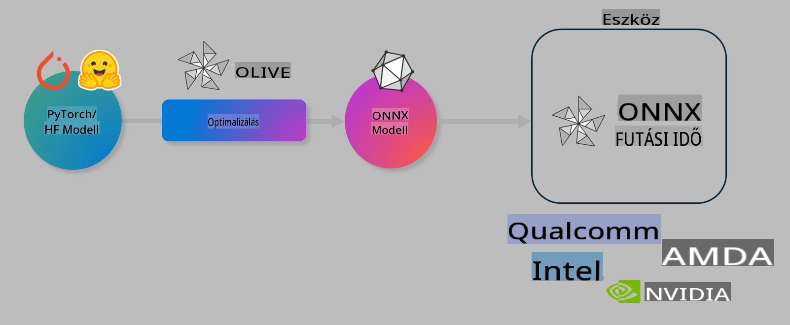

# Laboratórium. AI modellek optimalizálása eszközön történő inferenciához

## Bevezetés 

> [!IMPORTANT]
> Ehhez a laboratóriumhoz egy **Nvidia A10 vagy A100 GPU** szükséges, a megfelelő meghajtókkal és a CUDA toolkit (12-es vagy újabb verzió) telepítésével.

> [!NOTE]
> Ez egy **35 perces** laboratóriumi gyakorlat, amely gyakorlati bevezetést nyújt az OLIVE használatával történő modellek optimalizálásának alapfogalmaiba eszközön történő inferencia céljából.

## Tanulási célok

A laboratórium végére képes leszel az OLIVE használatával:

- AI modell kvantálása az AWQ kvantálási módszer segítségével.
- AI modell finomhangolása egy adott feladatra.
- LoRA adapterek (finomhangolt modell) létrehozása hatékony eszközön történő inferenciához az ONNX Runtime környezetben.

### Mi az az Olive?

Az Olive (*O*NNX *live*) egy modelloptimalizálási eszközkészlet, amelyhez CLI is tartozik. Lehetővé teszi modellek szállítását az ONNX runtime +++https://onnxruntime.ai+++ számára, minőséggel és teljesítménnyel.



Az Olive bemenete általában egy PyTorch vagy Hugging Face modell, a kimenete pedig egy optimalizált ONNX modell, amely egy ONNX runtime-ot futtató eszközön (telepítési cél) fut. Az Olive optimalizálja a modellt a telepítési cél AI gyorsítója (NPU, GPU, CPU) számára, amelyet olyan hardvergyártók biztosítanak, mint a Qualcomm, AMD, Nvidia vagy Intel.

Az Olive egy *munkafolyamatot* hajt végre, amely egyedi modelloptimalizálási feladatok, azaz *lépések* sorrendjéből áll – például: modell tömörítés, gráf rögzítés, kvantálás, gráf optimalizálás. Minden lépésnek van egy paraméterkészlete, amely finomhangolható a legjobb metrikák – például pontosság és késleltetés – elérése érdekében, amelyeket a megfelelő értékelő elemez. Az Olive egy keresési stratégiát alkalmaz, amely egy keresési algoritmust használ az egyes lépések vagy lépések egy csoportjának automatikus finomhangolására.

#### Az Olive előnyei

- **Csökkenti a frusztrációt és az időt**, amit különböző gráfoptimalizálási, tömörítési és kvantálási technikák kézi próbálgatására fordítanál. Határozd meg a minőségi és teljesítményi korlátokat, és hagyd, hogy az Olive automatikusan megtalálja a legjobb modellt számodra.
- **40+ beépített modelloptimalizálási komponens**, amelyek a kvantálás, tömörítés, gráf optimalizálás és finomhangolás legújabb technikáit fedik le.
- **Egyszerűen használható CLI** a gyakori modelloptimalizálási feladatokhoz. Például: olive quantize, olive auto-opt, olive finetune.
- Modellcsomagolás és telepítés beépítve.
- Támogatja a **Multi LoRA kiszolgálásra** történő modellgenerálást.
- YAML/JSON segítségével munkafolyamatok létrehozása a modelloptimalizálási és telepítési feladatok összehangolására.
- **Hugging Face** és **Azure AI** integráció.
- Beépített **gyorsítótár** mechanizmus a **költségek csökkentésére**.

## Laboratóriumi utasítások
> [!NOTE]
> Győződj meg róla, hogy az Azure AI Hub és Projekted előkészítve van, és az A100 számítási egység beállítása megtörtént az 1. labor szerint.

### 0. lépés: Csatlakozás az Azure AI Compute-hoz

Csatlakozni fogsz az Azure AI Compute-hoz a **VS Code** távoli funkciójának segítségével. 

1. Nyisd meg a **VS Code** asztali alkalmazást:
1. Nyisd meg a **parancspalettát** a **Shift+Ctrl+P** billentyűkombinációval.
1. A parancspalettában keresd meg az **AzureML - remote: Connect to compute instance in New Window** parancsot.
1. Kövesd a képernyőn megjelenő utasításokat a Compute-hoz való csatlakozáshoz. Ez magában foglalja az Azure-előfizetésed, az erőforráscsoportod, a projekted és az 1. laborban beállított Compute nevének kiválasztását.
1. Miután csatlakoztál az Azure ML Compute node-hoz, ez megjelenik a **VS Code bal alsó sarkában** `><Azure ML: Compute Name`

### 1. lépés: Klónozd ezt a repót

A VS Code-ban új terminált nyithatsz a **Ctrl+J** billentyűkombinációval, és klónozhatod ezt a repót:

A terminálban a következő promptot kell látnod:

```
azureuser@computername:~/cloudfiles/code$ 
```
Klónozd a megoldást:

```bash
cd ~/localfiles
git clone https://github.com/microsoft/phi-3cookbook.git
```

### 2. lépés: Mappa megnyitása a VS Code-ban

A releváns mappa megnyitásához a VS Code-ban hajtsd végre a következő parancsot a terminálban, amely egy új ablakot nyit meg:

```bash
code phi-3cookbook/code/04.Finetuning/Olive-lab
```

Alternatív megoldásként a mappát a **Fájl** > **Mappa megnyitása** menüpont kiválasztásával is megnyithatod. 

### 3. lépés: Függőségek

Nyiss egy terminálablakot a VS Code-ban az Azure AI Compute Instance-odon (tipp: **Ctrl+J**), és hajtsd végre a következő parancsokat a függőségek telepítéséhez:

```bash
conda create -n olive-ai python=3.11 -y
conda activate olive-ai
pip install -r requirements.txt
az extension remove -n azure-cli-ml
az extension add -n ml
```

> [!NOTE]
> A függőségek telepítése körülbelül **5 percet** vesz igénybe.

Ebben a laboratóriumban modelleket fogsz letölteni és feltölteni az Azure AI Model katalógusba. Ehhez be kell jelentkezned az Azure-ba a következő parancs segítségével:

```bash
az login
```

> [!NOTE]
> A bejelentkezéskor ki kell választanod az előfizetésedet. Győződj meg róla, hogy a laborhoz biztosított előfizetést állítod be.

### 4. lépés: Olive parancsok végrehajtása 

Nyiss egy terminálablakot a VS Code-ban az Azure AI Compute Instance-odon (tipp: **Ctrl+J**), és győződj meg róla, hogy az `olive-ai` conda környezet aktiválva van:

```bash
conda activate olive-ai
```

Ezután hajtsd végre a következő Olive parancsokat a parancssorban.

1. **Adatok ellenőrzése:** Ebben a példában a Phi-3.5-Mini modellt fogod finomhangolni, hogy utazással kapcsolatos kérdésekre specializálódjon. Az alábbi kód megjeleníti az adathalmaz első néhány rekordját, amelyek JSON lines formátumban vannak:

    ```bash
    head data/data_sample_travel.jsonl
    ```
1. **Modell kvantálása:** A modell tréningelése előtt kvantáld a következő paranccsal, amely az Active Aware Quantization (AWQ) technikát használja +++https://arxiv.org/abs/2306.00978+++. Az AWQ a modell súlyait az inferencia során előállított aktivációk figyelembevételével kvantálja. Ez azt jelenti, hogy a kvantálási folyamat figyelembe veszi az aktivációk tényleges adateloszlását, ami jobb modell pontosságot eredményez a hagyományos súlykvantálási módszerekhez képest.
    
    ```bash
    olive quantize \
       --model_name_or_path microsoft/Phi-3.5-mini-instruct \
       --trust_remote_code \
       --algorithm awq \
       --output_path models/phi/awq \
       --log_level 1
    ```
    
    A kvantálás **~8 percet** vesz igénybe, és **csökkenti a modell méretét ~7,5 GB-ról ~2,5 GB-ra**.
   
   Ebben a laborban azt mutatjuk meg, hogyan lehet modelleket betölteni a Hugging Face-ből (például: `microsoft/Phi-3.5-mini-instruct`). However, Olive also allows you to input models from the Azure AI catalog by updating the `model_name_or_path` argument to an Azure AI asset ID (for example:  `azureml://registries/azureml/models/Phi-3.5-mini-instruct/versions/4`). 

1. **Train the model:** Next, the `olive finetune` parancs finomhangolja a kvantált modellt. A modell kvantálása *a finomhangolás előtt* jobb pontosságot eredményez, mivel a finomhangolási folyamat helyreállítja a kvantálásból eredő veszteségek egy részét.
    
    ```bash
    olive finetune \
        --method lora \
        --model_name_or_path models/phi/awq \
        --data_files "data/data_sample_travel.jsonl" \
        --data_name "json" \
        --text_template "<|user|>\n{prompt}<|end|>\n<|assistant|>\n{response}<|end|>" \
        --max_steps 100 \
        --output_path ./models/phi/ft \
        --log_level 1
    ```
    
    A finomhangolás (100 lépéssel) **~6 percet** vesz igénybe.

1. **Optimalizálás:** A modell betanítása után optimalizáld a modellt az Olive `auto-opt` command, which will capture the ONNX graph and automatically perform a number of optimizations to improve the model performance for CPU by compressing the model and doing fusions. It should be noted, that you can also optimize for other devices such as NPU or GPU by just updating the `--device` and `--provider` argumentumaival – de a labor céljából CPU-t fogunk használni.

    ```bash
    olive auto-opt \
       --model_name_or_path models/phi/ft/model \
       --adapter_path models/phi/ft/adapter \
       --device cpu \
       --provider CPUExecutionProvider \
       --use_ort_genai \
       --output_path models/phi/onnx-ao \
       --log_level 1
    ```
    
    Az optimalizálás **~5 percet** vesz igénybe.

### 5. lépés: Modell inferencia gyors tesztje

A modell inferenciájának teszteléséhez hozz létre egy Python fájlt a mappádban **app.py** néven, és másold be az alábbi kódot:

```python
import onnxruntime_genai as og
import numpy as np

print("loading model and adapters...", end="", flush=True)
model = og.Model("models/phi/onnx-ao/model")
adapters = og.Adapters(model)
adapters.load("models/phi/onnx-ao/model/adapter_weights.onnx_adapter", "travel")
print("DONE!")

tokenizer = og.Tokenizer(model)
tokenizer_stream = tokenizer.create_stream()

params = og.GeneratorParams(model)
params.set_search_options(max_length=100, past_present_share_buffer=False)
user_input = "what is the best thing to see in chicago"
params.input_ids = tokenizer.encode(f"<|user|>\n{user_input}<|end|>\n<|assistant|>\n")

generator = og.Generator(model, params)

generator.set_active_adapter(adapters, "travel")

print(f"{user_input}")

while not generator.is_done():
    generator.compute_logits()
    generator.generate_next_token()

    new_token = generator.get_next_tokens()[0]
    print(tokenizer_stream.decode(new_token), end='', flush=True)

print("\n")
```

Hajtsd végre a kódot a következő paranccsal:

```bash
python app.py
```

### 6. lépés: Modell feltöltése az Azure AI-ba

A modell feltöltése egy Azure AI modell-tárba lehetővé teszi a modell megosztását a fejlesztőcsapat más tagjaival, valamint a modell verziókövetését. A modell feltöltéséhez futtasd a következő parancsot:

> [!NOTE]
> Frissítsd a `{}` placeholders with the name of your resource group and Azure AI Project Name. 

To find your resource group `"resourceGroup" és Azure AI Projekt nevet, és futtasd a következő parancsot:

```
az ml workspace show
```

Vagy lépj a +++ai.azure.com+++ oldalra, és válaszd ki a **management center** **project** **overview** menüpontot.

Frissítsd a `{}` helyőrzőket az erőforráscsoportod és az Azure AI Projekt nevével.

```bash
az ml model create \
    --name ft-for-travel \
    --version 1 \
    --path ./models/phi/onnx-ao \
    --resource-group {RESOURCE_GROUP_NAME} \
    --workspace-name {PROJECT_NAME}
```
Ezután megtekintheted a feltöltött modelledet, és telepítheted a modelledet a következő oldalon: https://ml.azure.com/model/list

**Felelősségkizárás**:  
Ez a dokumentum gépi AI fordítószolgáltatások segítségével került lefordításra. Bár törekszünk a pontosságra, kérjük, vegye figyelembe, hogy az automatikus fordítások hibákat vagy pontatlanságokat tartalmazhatnak. Az eredeti dokumentum az eredeti nyelvén tekintendő hiteles forrásnak. Kritikus információk esetén javasolt professzionális emberi fordítást igénybe venni. Nem vállalunk felelősséget a fordítás használatából eredő félreértésekért vagy téves értelmezésekért.