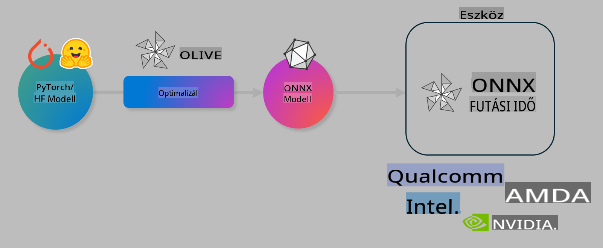

# Lab. Optimalizálja az AI modelleket eszközön történő futtatáshoz

## Bevezetés

> [!IMPORTANT]
> Ehhez a laborhoz **Nvidia A10 vagy A100 GPU** szükséges, a megfelelő illesztőprogramokkal és CUDA eszközkészlettel (12-es vagy újabb verzió) telepítve.

> [!NOTE]
> Ez egy **35 perces** labor, amely gyakorlati bevezetést nyújt az OLIVE segítségével történő modellek optimalizálásának alapvető fogalmaiba.

## Tanulási célok

A labor végére képes lesz az OLIVE segítségével:

- Kvantálni egy AI modellt az AWQ kvantálási módszerrel.
- Finomhangolni egy AI modellt egy adott feladathoz.
- LoRA adaptereket (finomhangolt modelleket) generálni hatékony eszközön történő futtatáshoz az ONNX Runtime segítségével.

### Mi az Olive?

Az Olive (*O*NNX *live*) egy modelloptimalizáló eszközkészlet, amelyhez CLI is tartozik. Lehetővé teszi, hogy modelleket készítsen az ONNX futtatókörnyezethez +++https://onnxruntime.ai+++ minőséggel és teljesítménnyel.



Az Olive bemenete általában egy PyTorch vagy Hugging Face modell, a kimenete pedig egy optimalizált ONNX modell, amelyet egy eszközön (telepítési célpont) futtatnak az ONNX futtatókörnyezetben. Az Olive optimalizálja a modellt a telepítési célpont AI gyorsítója (NPU, GPU, CPU) számára, amelyet egy hardvergyártó, például Qualcomm, AMD, Nvidia vagy Intel biztosít.

Az Olive egy *munkafolyamatot* hajt végre, amely egyedi modelloptimalizálási feladatok, azaz *lépések* rendezett sorozata – például modellkompresszió, gráfrögzítés, kvantálás, gráfoptimalizálás. Minden lépésnek van egy paraméterkészlete, amely finomhangolható a legjobb mutatók – például pontosság és késleltetés – elérése érdekében, amelyeket a megfelelő értékelő vizsgál. Az Olive egy keresési stratégiát alkalmaz, amely egy keresési algoritmust használ az egyes lépések, vagy lépések csoportjainak automatikus finomhangolására.

#### Az Olive előnyei

- **Csökkenti a frusztrációt és az időt**, amelyet a különböző gráfoptimalizálási, kompressziós és kvantálási technikák kézi próbálgatására fordítana. Határozza meg minőségi és teljesítménybeli korlátait, és az Olive automatikusan megtalálja az Ön számára legjobb modellt.
- **40+ beépített modelloptimalizálási komponens**, amelyek lefedik a kvantálás, kompresszió, gráfoptimalizálás és finomhangolás legújabb technikáit.
- **Egyszerűen használható CLI** a szokásos modelloptimalizálási feladatokhoz. Például: olive quantize, olive auto-opt, olive finetune.
- Beépített modellcsomagolás és telepítés.
- Támogatja a modellek generálását **Multi LoRA kiszolgáláshoz**.
- YAML/JSON segítségével munkafolyamatokat építhet a modelloptimalizálási és telepítési feladatok összehangolásához.
- **Hugging Face** és **Azure AI** integráció.
- Beépített **gyorsítótár-mechanizmus**, amely **költséget takarít meg**.

## Labor utasítások
> [!NOTE]
> Kérjük, győződjön meg róla, hogy beállította az Azure AI Hubot és Projektet, valamint az A100 számítási erőforrást az 1. labor szerint.

### 0. lépés: Csatlakozás az Azure AI Compute-hoz

Csatlakozzon az Azure AI számítási erőforráshoz a **VS Code** távoli funkciójának használatával.

1. Nyissa meg a **VS Code** asztali alkalmazást:
1. Nyissa meg a **parancspalettát** a **Shift+Ctrl+P** billentyűkombinációval.
1. A parancspalettában keresse meg az **AzureML - remote: Connect to compute instance in New Window** opciót.
1. Kövesse a képernyőn megjelenő utasításokat a számítási erőforráshoz való csatlakozáshoz. Ez magában foglalja az Azure-előfizetés, az erőforráscsoport, a projekt és az 1. laborban beállított számítási erőforrás kiválasztását.
1. Miután csatlakozott az Azure ML Compute csomóponthoz, ez megjelenik a **Visual Code bal alsó sarkában** `><Azure ML: Compute Name`

### 1. lépés: A repó klónozása

A VS Code-ban nyisson meg egy új terminált a **Ctrl+J** billentyűkombinációval, és klónozza ezt a repót:

A terminálban meg kell jelennie a következő promptnak:

```
azureuser@computername:~/cloudfiles/code$ 
```
Klónozza a megoldást:

```bash
cd ~/localfiles
git clone https://github.com/microsoft/phi-3cookbook.git
```

### 2. lépés: Mappa megnyitása a VS Code-ban

A releváns mappa megnyitásához a VS Code-ban hajtsa végre a következő parancsot a terminálban, amely egy új ablakot nyit meg:

```bash
code phi-3cookbook/code/04.Finetuning/Olive-lab
```

Alternatív megoldásként a mappát a **File** > **Open Folder** kiválasztásával is megnyithatja.

### 3. lépés: Függőségek telepítése

Nyisson meg egy terminálablakot a VS Code-ban az Azure AI Compute példányában (tipp: **Ctrl+J**), és hajtsa végre az alábbi parancsokat a függőségek telepítéséhez:

```bash
conda create -n olive-ai python=3.11 -y
conda activate olive-ai
pip install -r requirements.txt
az extension remove -n azure-cli-ml
az extension add -n ml
```

> [!NOTE]
> A függőségek telepítése **~5 percet** vesz igénybe.

Ebben a laborban modelleket fog letölteni és feltölteni az Azure AI Modellkatalógusba. Ahhoz, hogy hozzáférjen a modellkatalógushoz, be kell jelentkeznie az Azure-ba a következő paranccsal:

```bash
az login
```

> [!NOTE]
> A bejelentkezéskor ki kell választania az előfizetését. Győződjön meg róla, hogy a laborhoz biztosított előfizetést választja.

### 4. lépés: Olive parancsok végrehajtása

Nyisson meg egy terminálablakot a VS Code-ban az Azure AI Compute példányában (tipp: **Ctrl+J**), és győződjön meg arról, hogy az `olive-ai` conda környezet aktiválva van:

```bash
conda activate olive-ai
```

Ezután hajtsa végre az alábbi Olive parancsokat a parancssorban.

1. **Az adatok ellenőrzése:** Ebben a példában a Phi-3.5-Mini modellt fogja finomhangolni, hogy utazással kapcsolatos kérdések megválaszolására specializálódjon. Az alábbi kód megjeleníti az adatkészlet első néhány rekordját, amelyek JSON lines formátumban vannak:

    ```bash
    head data/data_sample_travel.jsonl
    ```
1. **A modell kvantálása:** A modell betanítása előtt kvantálja azt az alábbi paranccsal, amely az Active Aware Quantization (AWQ) +++https://arxiv.org/abs/2306.00978+++ technikát használja. Az AWQ a modell súlyait az inferencia során keletkező aktivációk figyelembevételével kvantálja. Ez azt jelenti, hogy a kvantálási folyamat figyelembe veszi az aktivációk tényleges adateloszlását, így jobban megőrzi a modell pontosságát, mint a hagyományos súlykvantálási módszerek.

    ```bash
    olive quantize \
       --model_name_or_path microsoft/Phi-3.5-mini-instruct \
       --trust_remote_code \
       --algorithm awq \
       --output_path models/phi/awq \
       --log_level 1
    ```

    A kvantálás **~8 percet** vesz igénybe, és **a modell méretét ~7,5 GB-ról ~2,5 GB-ra csökkenti**.

    Ebben a laborban megmutatjuk, hogyan lehet modelleket betölteni a Hugging Face-ből (például: `microsoft/Phi-3.5-mini-instruct`). However, Olive also allows you to input models from the Azure AI catalog by updating the `model_name_or_path` argument to an Azure AI asset ID (for example:  `azureml://registries/azureml/models/Phi-3.5-mini-instruct/versions/4`). 

1. **Train the model:** Next, the `olive finetune` parancs finomhangolja a kvantált modellt. A modell *kvantálása* a finomhangolás előtt jobb pontosságot eredményez, mivel a finomhangolási folyamat helyreállítja a kvantálásból származó veszteségek egy részét.

    ```bash
    olive finetune \
        --method lora \
        --model_name_or_path models/phi/awq \
        --data_files "data/data_sample_travel.jsonl" \
        --data_name "json" \
        --text_template "<|user|>\n{prompt}<|end|>\n<|assistant|>\n{response}<|end|>" \
        --max_steps 100 \
        --output_path ./models/phi/ft \
        --log_level 1
    ```

    A finomhangolás (100 lépéssel) **~6 percet** vesz igénybe.

1. **Optimalizálás:** A modell betanítása után optimalizálja a modellt az Olive `auto-opt` command, which will capture the ONNX graph and automatically perform a number of optimizations to improve the model performance for CPU by compressing the model and doing fusions. It should be noted, that you can also optimize for other devices such as NPU or GPU by just updating the `--device` and `--provider` argumentumaival – de ennek a labornak a céljaira CPU-t fogunk használni.

    ```bash
    olive auto-opt \
       --model_name_or_path models/phi/ft/model \
       --adapter_path models/phi/ft/adapter \
       --device cpu \
       --provider CPUExecutionProvider \
       --use_ort_genai \
       --output_path models/phi/onnx-ao \
       --log_level 1
    ```

    Az optimalizálás **~5 percet** vesz igénybe.

### 5. lépés: Modell futtatásának gyors tesztje

A modell teszteléséhez hozzon létre egy Python fájlt a mappájában **app.py** néven, és másolja be az alábbi kódot:

```python
import onnxruntime_genai as og
import numpy as np

print("loading model and adapters...", end="", flush=True)
model = og.Model("models/phi/onnx-ao/model")
adapters = og.Adapters(model)
adapters.load("models/phi/onnx-ao/model/adapter_weights.onnx_adapter", "travel")
print("DONE!")

tokenizer = og.Tokenizer(model)
tokenizer_stream = tokenizer.create_stream()

params = og.GeneratorParams(model)
params.set_search_options(max_length=100, past_present_share_buffer=False)
user_input = "what is the best thing to see in chicago"
params.input_ids = tokenizer.encode(f"<|user|>\n{user_input}<|end|>\n<|assistant|>\n")

generator = og.Generator(model, params)

generator.set_active_adapter(adapters, "travel")

print(f"{user_input}")

while not generator.is_done():
    generator.compute_logits()
    generator.generate_next_token()

    new_token = generator.get_next_tokens()[0]
    print(tokenizer_stream.decode(new_token), end='', flush=True)

print("\n")
```

Hajtsa végre a kódot a következő paranccsal:

```bash
python app.py
```

### 6. lépés: Modell feltöltése az Azure AI-ba

A modell feltöltése egy Azure AI modell-adattárba lehetővé teszi a modell megosztását a fejlesztőcsapat többi tagjával, és biztosítja a modell verziókövetését is. A modell feltöltéséhez futtassa az alábbi parancsot:

> [!NOTE]
> Frissítse a `{}` placeholders with the name of your resource group and Azure AI Project Name. 

To find your resource group `"resourceGroup" és az Azure AI Projekt nevét, majd futtassa az alábbi parancsot:

```
az ml workspace show
```

Vagy látogasson el ide: +++ai.azure.com+++, és válassza a **management center** > **project** > **overview** lehetőséget.

Frissítse a `{}` helyőrzőket az erőforráscsoport és az Azure AI Projekt nevével.

```bash
az ml model create \
    --name ft-for-travel \
    --version 1 \
    --path ./models/phi/onnx-ao \
    --resource-group {RESOURCE_GROUP_NAME} \
    --workspace-name {PROJECT_NAME}
```
Ezután megtekintheti a feltöltött modelljét, és telepítheti azt a következő helyen: https://ml.azure.com/model/list

**Jogi nyilatkozat**:  
Ez a dokumentum gépi AI fordítási szolgáltatások segítségével készült. Bár törekszünk a pontosságra, kérjük, vegye figyelembe, hogy az automatizált fordítások hibákat vagy pontatlanságokat tartalmazhatnak. Az eredeti dokumentum az eredeti nyelvén tekintendő hiteles forrásnak. Kritikus információk esetén javasolt professzionális, emberi fordítást igénybe venni. Nem vállalunk felelősséget az ebből a fordításból eredő félreértésekért vagy téves értelmezésekért.