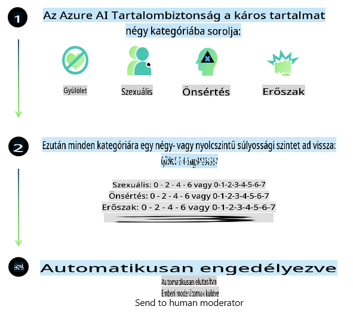
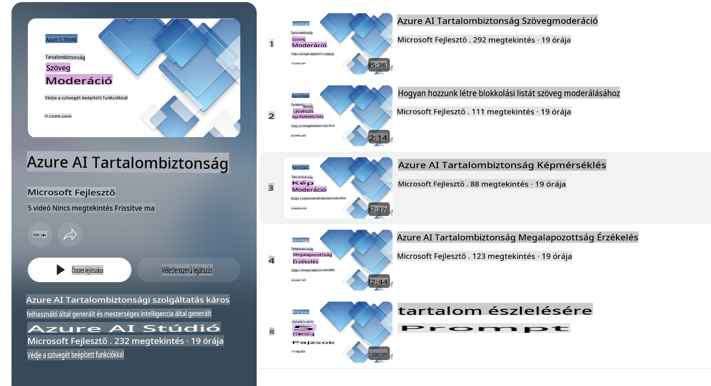

# AI biztonság a Phi modellek számára

A Phi modellek családját a [Microsoft Responsible AI Standard](https://query.prod.cms.rt.microsoft.com/cms/api/am/binary/RE5cmFl) irányelvei szerint fejlesztették, amely a vállalat egészére kiterjedő követelményrendszer a következő hat alapelv alapján: elszámoltathatóság, átláthatóság, méltányosság, megbízhatóság és biztonság, adatvédelem és biztonság, valamint befogadás. Ezek az alapelvek alkotják a [Microsoft Felelős AI alapelveit](https://www.microsoft.com/ai/responsible-ai).

Hasonlóan a korábbi Phi modellekhez, egy sokoldalú biztonsági értékelési és utóképzési megközelítést alkalmaztak, kiegészítve a többnyelvű képességekre vonatkozó további intézkedésekkel ebben a kiadásban. A biztonsági képzési és értékelési megközelítésünket, beleértve a több nyelven és kockázati kategóriában végzett tesztelést, a [Phi Safety Post-Training Paper](https://arxiv.org/abs/2407.13833) dokumentumban részleteztük. Bár a Phi modellek profitálnak ebből a megközelítésből, a fejlesztőknek alkalmazniuk kell a felelős AI legjobb gyakorlatait, beleértve a kockázatok feltérképezését, mérését és csökkentését az adott felhasználási esetük és kulturális, valamint nyelvi kontextusuk figyelembevételével.

## Legjobb gyakorlatok

Más modellekhez hasonlóan a Phi modellek is viselkedhetnek igazságtalan, megbízhatatlan vagy sértő módon.

Néhány korlátozó viselkedés, amelyre figyelni kell az SLM és LLM esetében:

- **Szolgáltatás minősége:** A Phi modelleket elsősorban angol nyelvű szövegeken képezték. Az angoltól eltérő nyelveken rosszabb teljesítmény várható. Azok az angol nyelvváltozatok, amelyek kevésbé vannak képviselve a képzési adatokban, gyengébb teljesítményt mutathatnak, mint a standard amerikai angol.
- **Károk ábrázolása és sztereotípiák erősítése:** Ezek a modellek túl- vagy alulreprezentálhatnak bizonyos csoportokat, egyes csoportokat eltüntethetnek, vagy megalázó, negatív sztereotípiákat erősíthetnek. A biztonsági utóképzés ellenére ezek a korlátok továbbra is fennállhatnak a különböző csoportok eltérő reprezentációs szintje vagy a negatív sztereotípiák példáinak előfordulása miatt, amelyek a valós mintákat és társadalmi elfogultságokat tükrözik.
- **Nem megfelelő vagy sértő tartalom:** A modellek más típusú nem megfelelő vagy sértő tartalmat is generálhatnak, ami miatt nem megfelelő lehet érzékeny kontextusokban történő alkalmazásuk, hacsak nem történnek további, az adott felhasználási esethez igazított enyhítések.
- **Információ megbízhatósága:** A nyelvi modellek értelmetlen tartalmat generálhatnak, vagy olyan tartalmat állíthatnak elő, amely ésszerűnek tűnik, de pontatlan vagy elavult.
- **Korlátozott kódolási terjedelem:** A Phi-3 képzési adatainak többsége Pythonon alapul, és gyakori csomagokat használ, mint például "typing, math, random, collections, datetime, itertools". Ha a modell más csomagokat vagy más nyelveken írt szkripteket használó Python szkripteket generál, erősen ajánlott, hogy a felhasználók manuálisan ellenőrizzék az API használatát.

A fejlesztőknek alkalmazniuk kell a felelős AI legjobb gyakorlatait, és felelősek azért, hogy az adott felhasználási eset megfeleljen a vonatkozó törvényeknek és szabályozásoknak (például adatvédelem, kereskedelem stb.).

## Felelős AI megfontolások

Más nyelvi modellekhez hasonlóan a Phi sorozat modelljei is viselkedhetnek igazságtalan, megbízhatatlan vagy sértő módon. Néhány korlátozó viselkedés, amelyre figyelni kell:

**Szolgáltatás minősége:** A Phi modelleket elsősorban angol nyelvű szövegeken képezték. Az angoltól eltérő nyelveken rosszabb teljesítmény várható. Azok az angol nyelvváltozatok, amelyek kevésbé vannak képviselve a képzési adatokban, gyengébb teljesítményt mutathatnak, mint a standard amerikai angol.

**Károk ábrázolása és sztereotípiák erősítése:** Ezek a modellek túl- vagy alulreprezentálhatnak bizonyos csoportokat, egyes csoportokat eltüntethetnek, vagy megalázó, negatív sztereotípiákat erősíthetnek. A biztonsági utóképzés ellenére ezek a korlátok továbbra is fennállhatnak a különböző csoportok eltérő reprezentációs szintje vagy a negatív sztereotípiák példáinak előfordulása miatt, amelyek a valós mintákat és társadalmi elfogultságokat tükrözik.

**Nem megfelelő vagy sértő tartalom:** A modellek más típusú nem megfelelő vagy sértő tartalmat is generálhatnak, ami miatt nem megfelelő lehet érzékeny kontextusokban történő alkalmazásuk, hacsak nem történnek további, az adott felhasználási esethez igazított enyhítések.

**Információ megbízhatósága:** A nyelvi modellek értelmetlen tartalmat generálhatnak, vagy olyan tartalmat állíthatnak elő, amely ésszerűnek tűnik, de pontatlan vagy elavult.

**Korlátozott kódolási terjedelem:** A Phi-3 képzési adatainak többsége Pythonon alapul, és gyakori csomagokat használ, mint például "typing, math, random, collections, datetime, itertools". Ha a modell más csomagokat vagy más nyelveken írt szkripteket használó Python szkripteket generál, erősen ajánlott, hogy a felhasználók manuálisan ellenőrizzék az API használatát.

A fejlesztőknek alkalmazniuk kell a felelős AI legjobb gyakorlatait, és felelősek azért, hogy az adott felhasználási eset megfeleljen a vonatkozó törvényeknek és szabályozásoknak (például adatvédelem, kereskedelem stb.). Fontos megfontolások:

**Erőforráselosztás:** A modellek nem feltétlenül alkalmasak olyan forgatókönyvekre, amelyek jelentős hatással lehetnek jogi státuszra vagy erőforrások, illetve életlehetőségek elosztására (például lakhatás, foglalkoztatás, hitel stb.) további értékelések és kiegyensúlyozási technikák nélkül.

**Magas kockázatú forgatókönyvek:** A fejlesztőknek értékelniük kell a modellek használatának alkalmasságát magas kockázatú forgatókönyvekben, ahol az igazságtalan, megbízhatatlan vagy sértő eredmények rendkívül költségesek lehetnek, vagy károkat okozhatnak. Ez magában foglalja az érzékeny vagy szakértői területeken történő tanácsadást, ahol a pontosság és megbízhatóság kritikus (például jogi vagy egészségügyi tanácsadás). További biztosítékokat kell bevezetni az alkalmazási szint szerint a telepítési kontextusnak megfelelően.

**Félrevezető információ:** A modellek pontatlan információkat generálhatnak. A fejlesztőknek követniük kell az átláthatóság legjobb gyakorlatait, és tájékoztatniuk kell a végfelhasználókat arról, hogy AI rendszerrel lépnek kapcsolatba. Az alkalmazási szinten a fejlesztők visszacsatolási mechanizmusokat és olyan csatornákat építhetnek ki, amelyek az adott felhasználási eset kontextusában alapozzák meg a válaszokat, ezt a technikát Retrieval Augmented Generation (RAG) néven ismerik.

**Káros tartalom generálása:** A fejlesztőknek értékelniük kell a kimeneteket azok kontextusában, és használniuk kell az elérhető biztonsági osztályozókat vagy az adott felhasználási esethez igazított egyedi megoldásokat.

**Visszaélés:** Más visszaélési formák, például csalás, spam vagy rosszindulatú szoftverek előállítása is lehetséges lehet, ezért a fejlesztőknek biztosítaniuk kell, hogy alkalmazásaik ne sértsék meg az alkalmazandó törvényeket és szabályozásokat.

### Finomhangolás és AI tartalombiztonság

Egy modell finomhangolása után erősen ajánlott az [Azure AI Content Safety](https://learn.microsoft.com/azure/ai-services/content-safety/overview) eszközeinek használata, hogy figyelemmel kísérjék a modellek által generált tartalmat, és azonosítsák, illetve blokkolják a potenciális kockázatokat, fenyegetéseket és minőségi problémákat.

Az [Azure AI Content Safety](https://learn.microsoft.com/azure/ai-services/content-safety/overview) szöveges és képi tartalmakat egyaránt támogat. Telepíthető felhőben, leválasztott konténerekben és edge/beágyazott eszközökön.

## Azure AI Content Safety áttekintése

Az Azure AI Content Safety nem egy univerzális megoldás; testreszabható, hogy igazodjon az üzleti specifikus irányelvekhez. Többnyelvű modelljei lehetővé teszik több nyelv egyidejű megértését.

- **Azure AI Content Safety**
- **Microsoft Developer**
- **5 videó**

Az Azure AI Content Safety szolgáltatás képes az alkalmazásokban és szolgáltatásokban előforduló káros, felhasználók által generált és AI által generált tartalmak észlelésére. Szöveges és képi API-kat tartalmaz, amelyek lehetővé teszik káros vagy nem megfelelő anyagok azonosítását.

[AI Content Safety Playlist](https://www.youtube.com/playlist?list=PLlrxD0HtieHjaQ9bJjyp1T7FeCbmVcPkQ)

**Felelősségkizárás**:  
Ez a dokumentum gépi AI fordítási szolgáltatások segítségével készült. Bár igyekszünk pontosságra törekedni, kérjük, vegye figyelembe, hogy az automatikus fordítások hibákat vagy pontatlanságokat tartalmazhatnak. Az eredeti dokumentum az eredeti nyelvén tekintendő hiteles forrásnak. Kritikus információk esetén javasolt professzionális emberi fordítást igénybe venni. Nem vállalunk felelősséget a fordítás használatából eredő félreértésekért vagy téves értelmezésekért.