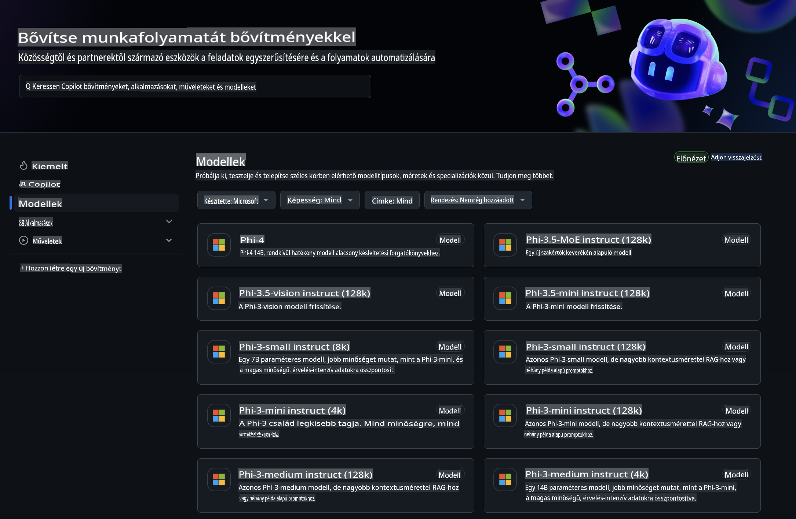
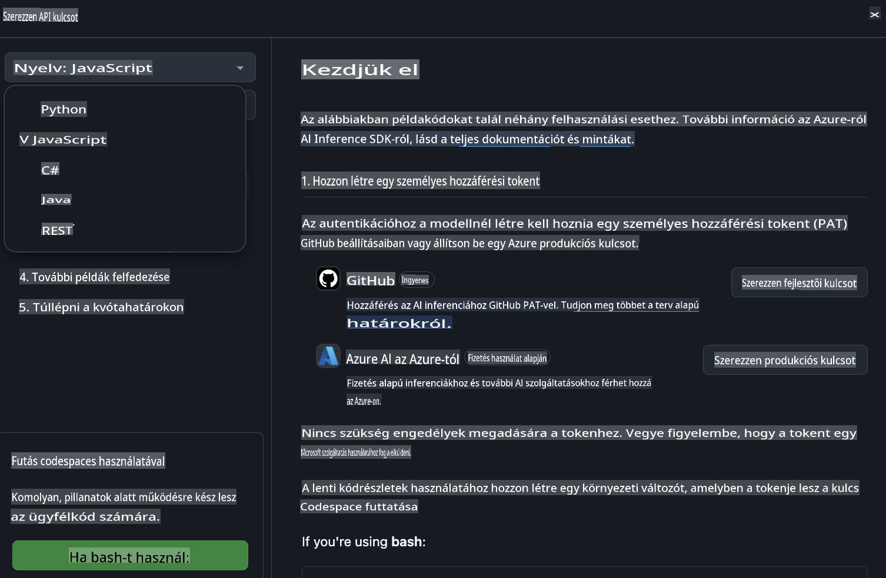
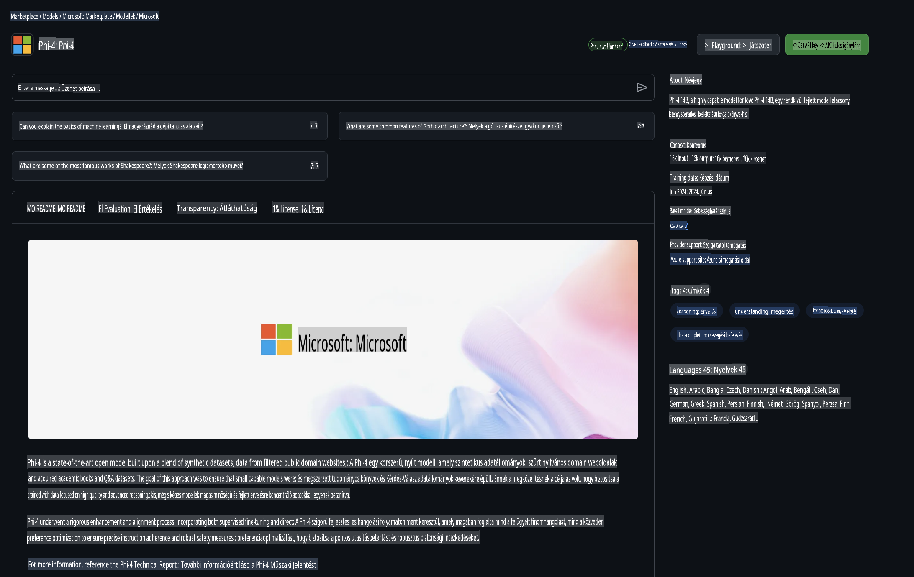

## Phi család a GitHub Modellekben

Üdvözlünk a [GitHub Modellek](https://github.com/marketplace/models) oldalán! Minden készen áll arra, hogy felfedezd az Azure AI által hosztolt mesterséges intelligencia modelleket.



További információért a GitHub Modelleken elérhető modellekről, látogasd meg a [GitHub Model Marketplace](https://github.com/marketplace/models) oldalát.

## Elérhető modellek

Minden modellhez tartozik egy különálló tesztkörnyezet és példa kód.


### Phi család a GitHub Model Katalógusban

- [Phi-4](https://github.com/marketplace/models/azureml/Phi-4)

- [Phi-3.5-MoE instruct (128k)](https://github.com/marketplace/models/azureml/Phi-3-5-MoE-instruct)

- [Phi-3.5-vision instruct (128k)](https://github.com/marketplace/models/azureml/Phi-3-5-vision-instruct)

- [Phi-3.5-mini instruct (128k)](https://github.com/marketplace/models/azureml/Phi-3-5-mini-instruct)

- [Phi-3-Medium-128k-Instruct](https://github.com/marketplace/models/azureml/Phi-3-medium-128k-instruct)

- [Phi-3-medium-4k-instruct](https://github.com/marketplace/models/azureml/Phi-3-medium-4k-instruct)

- [Phi-3-mini-128k-instruct](https://github.com/marketplace/models/azureml/Phi-3-mini-128k-instruct)

- [Phi-3-mini-4k-instruct](https://github.com/marketplace/models/azureml/Phi-3-mini-4k-instruct)

- [Phi-3-small-128k-instruct](https://github.com/marketplace/models/azureml/Phi-3-small-128k-instruct)

- [Phi-3-small-8k-instruct](https://github.com/marketplace/models/azureml/Phi-3-small-8k-instruct)

## Első lépések

Van néhány alapvető példa, amelyeket azonnal futtathatsz. Ezeket a minták könyvtárában találod. Ha egy konkrét programozási nyelvet szeretnél használni, az alábbi nyelveken érhetők el példák:

- Python
- JavaScript
- C#
- Java
- cURL

Van egy külön Codespaces környezet is, amelyben futtathatod a mintákat és modelleket.



## Példa kód

Az alábbiakban néhány felhasználási esetre vonatkozó kódrészlet található. Az Azure AI Inference SDK-val kapcsolatos további információkért lásd a teljes dokumentációt és mintákat.

## Beállítás

1. Hozz létre egy személyes hozzáférési tokent!  
Nem szükséges engedélyeket adni a tokennek. Vedd figyelembe, hogy a tokent egy Microsoft szolgáltatásnak küldöd el.

A lenti kódrészletek használatához hozz létre egy környezeti változót, amelyben a tokent kulcsként állítod be az ügyfélkódhoz.

Ha bash-t használsz:  
```
export GITHUB_TOKEN="<your-github-token-goes-here>"
```  
Ha powershellt használsz:  
```
$Env:GITHUB_TOKEN="<your-github-token-goes-here>"
```  

Ha Windows parancssort használsz:  
```
set GITHUB_TOKEN=<your-github-token-goes-here>
```  

## Python példa

### Függőségek telepítése  
Telepítsd az Azure AI Inference SDK-t pip használatával (Szükséges: Python >=3.8):  
```
pip install azure-ai-inference
```  

### Egy alapvető példa futtatása  

Ez a példa bemutatja, hogyan lehet alapvető hívást végrehajtani a chat completion API-val. Az Azure AI modell inference végpontját és a GitHub tokent használja. A hívás szinkron módon történik.  

```python
import os
from azure.ai.inference import ChatCompletionsClient
from azure.ai.inference.models import SystemMessage, UserMessage
from azure.core.credentials import AzureKeyCredential

endpoint = "https://models.inference.ai.azure.com"
model_name = "Phi-4"
token = os.environ["GITHUB_TOKEN"]

client = ChatCompletionsClient(
    endpoint=endpoint,
    credential=AzureKeyCredential(token),
)

response = client.complete(
    messages=[
        UserMessage(content="I have $20,000 in my savings account, where I receive a 4% profit per year and payments twice a year. Can you please tell me how long it will take for me to become a millionaire? Also, can you please explain the math step by step as if you were explaining it to an uneducated person?"),
    ],
    temperature=0.4,
    top_p=1.0,
    max_tokens=2048,
    model=model_name
)

print(response.choices[0].message.content)
```  

### Többfordulós beszélgetés futtatása  

Ez a példa egy többfordulós beszélgetést mutat be a chat completion API-val. Ha a modellt egy chatalkalmazáshoz használod, kezelned kell a beszélgetés előzményeit, és az aktuális üzeneteket kell elküldened a modellnek.  

```
import os
from azure.ai.inference import ChatCompletionsClient
from azure.ai.inference.models import AssistantMessage, SystemMessage, UserMessage
from azure.core.credentials import AzureKeyCredential

token = os.environ["GITHUB_TOKEN"]
endpoint = "https://models.inference.ai.azure.com"
# Replace Model_Name
model_name = "Phi-4"

client = ChatCompletionsClient(
    endpoint=endpoint,
    credential=AzureKeyCredential(token),
)

messages = [
    SystemMessage(content="You are a helpful assistant."),
    UserMessage(content="What is the capital of France?"),
    AssistantMessage(content="The capital of France is Paris."),
    UserMessage(content="What about Spain?"),
]

response = client.complete(messages=messages, model=model_name)

print(response.choices[0].message.content)
```  

### Kimenet folyamatos megjelenítése  

A jobb felhasználói élmény érdekében érdemes a modell válaszát folyamatosan megjeleníteni, hogy az első token már korán megjelenjen, és elkerüld a hosszú válaszok miatti várakozást.  

```
import os
from azure.ai.inference import ChatCompletionsClient
from azure.ai.inference.models import SystemMessage, UserMessage
from azure.core.credentials import AzureKeyCredential

token = os.environ["GITHUB_TOKEN"]
endpoint = "https://models.inference.ai.azure.com"
# Replace Model_Name
model_name = "Phi-4"

client = ChatCompletionsClient(
    endpoint=endpoint,
    credential=AzureKeyCredential(token),
)

response = client.complete(
    stream=True,
    messages=[
        SystemMessage(content="You are a helpful assistant."),
        UserMessage(content="Give me 5 good reasons why I should exercise every day."),
    ],
    model=model_name,
)

for update in response:
    if update.choices:
        print(update.choices[0].delta.content or "", end="")

client.close()
```  

## INGYENES használat és korlátozások a GitHub Modellekhez



A [játszótér és az ingyenes API-használat korlátozásai](https://docs.github.com/en/github-models/prototyping-with-ai-models#rate-limits) célja, hogy segítsenek kísérletezni a modellekkel és prototípust készíteni AI-alkalmazásodhoz. Ha ezen korlátokon túl szeretnéd használni a modelleket, vagy méretezni szeretnéd az alkalmazásodat, Azure-fiókból kell erőforrásokat biztosítanod, és onnan hitelesítened. Ehhez nem kell mást változtatnod a kódodban. Használd ezt a linket, hogy megtudd, hogyan léphetsz túl az ingyenes szint korlátain az Azure AI-ban.

### Nyilatkozatok  

Ne feledd, hogy amikor egy modellel dolgozol, mesterséges intelligenciával kísérletezel, így előfordulhatnak tartalmi hibák.  

A funkció különböző korlátoknak van alávetve (például: kérések percenként, kérések naponta, tokenek kérésenként, párhuzamos kérések száma), és nem gyártási célú felhasználási esetekre van tervezve.  

A GitHub Modellek az Azure AI Tartalom Biztonságát használják. Ezek a szűrők nem kapcsolhatók ki a GitHub Modellek használata során. Ha úgy döntesz, hogy fizetős szolgáltatáson keresztül használod a modelleket, konfiguráld a tartalomszűrőidet az igényeid szerint.  

Ez a szolgáltatás a GitHub előzetes kiadási feltételei alatt áll.  

**Felelősségkizárás**:  
Ez a dokumentum gépi AI fordítószolgáltatások segítségével lett lefordítva. Bár igyekszünk pontosságra törekedni, kérjük, vegye figyelembe, hogy az automatikus fordítások hibákat vagy pontatlanságokat tartalmazhatnak. Az eredeti dokumentum az eredeti nyelvén tekintendő hiteles forrásnak. Kritikus információk esetén javasolt professzionális, emberi fordítást igénybe venni. Nem vállalunk felelősséget a fordítás használatából eredő félreértésekért vagy téves értelmezésekért.