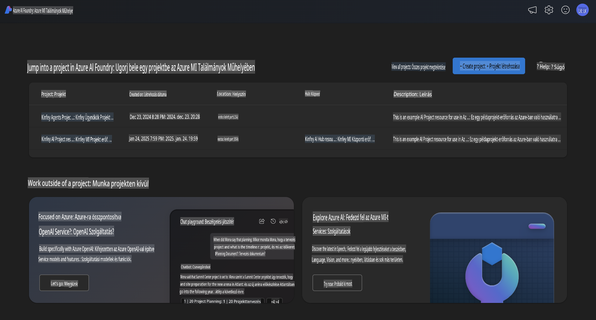
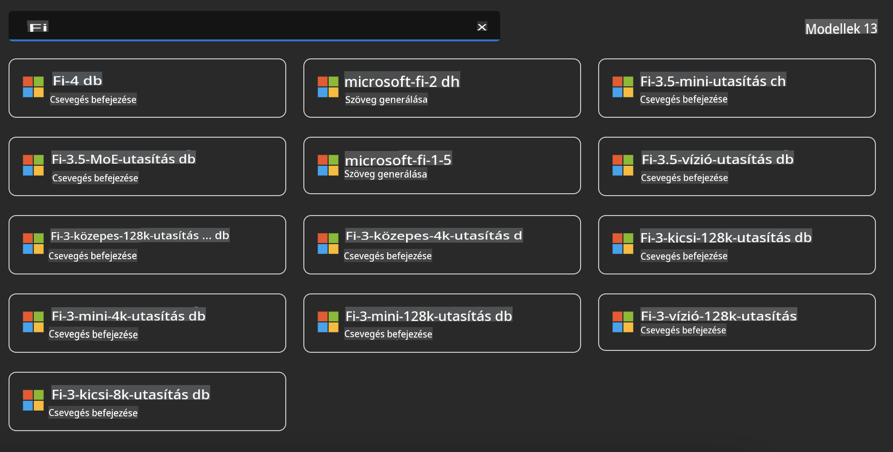
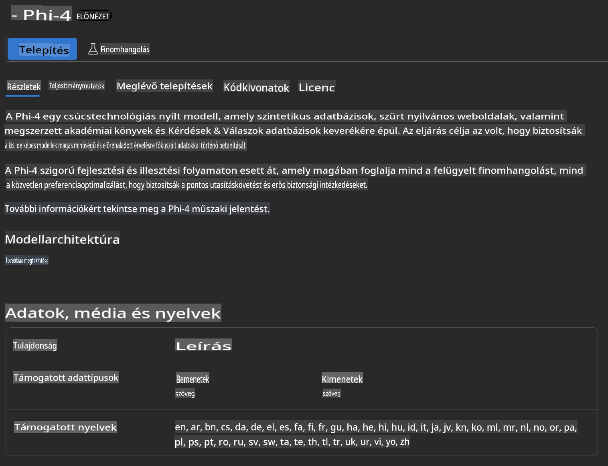
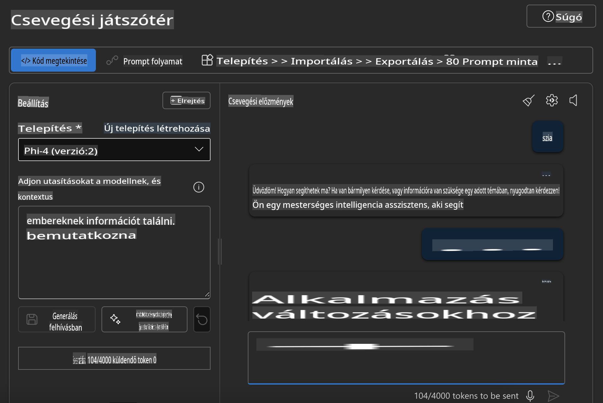

## Phi család az Azure AI Foundry-ban

Az [Azure AI Foundry](https://ai.azure.com) egy megbízható platform, amely lehetővé teszi a fejlesztők számára, hogy biztonságos, megbízható és felelősségteljes módon ösztönözzék az innovációt és formálják a jövőt az AI segítségével.

Az [Azure AI Foundry](https://ai.azure.com) a fejlesztők számára készült, hogy:

- Generatív AI alkalmazásokat hozzanak létre vállalati szintű platformon.
- Fedezzék fel, építsék, teszteljék és telepítsék a legújabb AI eszközöket és ML modelleket, felelősségteljes AI gyakorlatokra alapozva.
- Együttműködjenek egy csapattal az alkalmazásfejlesztés teljes életciklusa során.

Az Azure AI Foundry segítségével felfedezheted a modellek, szolgáltatások és képességek széles skáláját, és olyan AI alkalmazásokat építhetsz, amelyek leginkább szolgálják a céljaidat. Az Azure AI Foundry platform lehetővé teszi a skálázhatóságot, hogy a koncepcióbizonyításokat könnyedén teljes értékű, éles alkalmazásokká alakítsd. A folyamatos monitorozás és finomhangolás támogatja a hosszú távú sikert.



Az Azure AI Foundry-ban az Azure AOAI Service használata mellett harmadik fél által készített modelleket is használhatsz az Azure AI Foundry Model Catalog segítségével. Ez jó választás, ha az Azure AI Foundry-t szeretnéd AI megoldási platformként használni.

Az Azure AI Foundry Model Catalog segítségével gyorsan telepíthetjük a Phi család modelljeit.



### **Phi-4 telepítése az Azure AI Foundry-ban**



### **Phi-4 tesztelése az Azure AI Foundry Playground-ban**



### **Python kód futtatása az Azure AI Foundry Phi-4 hívásához**

```python

import os  
import base64
from openai import AzureOpenAI  
from azure.identity import DefaultAzureCredential, get_bearer_token_provider  
        
endpoint = os.getenv("ENDPOINT_URL", "Your Azure AOAI Service Endpoint")  
deployment = os.getenv("DEPLOYMENT_NAME", "Phi-4")  
      
token_provider = get_bearer_token_provider(  
    DefaultAzureCredential(),  
    "https://cognitiveservices.azure.com/.default"  
)  
  
client = AzureOpenAI(  
    azure_endpoint=endpoint,  
    azure_ad_token_provider=token_provider,  
    api_version="2024-05-01-preview",  
)  
  

chat_prompt = [
    {
        "role": "system",
        "content": "You are an AI assistant that helps people find information."
    },
    {
        "role": "user",
        "content": "can you introduce yourself"
    }
] 
    
# Include speech result if speech is enabled  
messages = chat_prompt 

completion = client.chat.completions.create(  
    model=deployment,  
    messages=messages,
    max_tokens=800,  
    temperature=0.7,  
    top_p=0.95,  
    frequency_penalty=0,  
    presence_penalty=0,
    stop=None,  
    stream=False  
)  
  
print(completion.to_json())  

```

**Felelősségkizárás**:  
Ez a dokumentum gépi AI fordítószolgáltatások segítségével került lefordításra. Bár törekszünk a pontosságra, kérjük, vegye figyelembe, hogy az automatikus fordítások hibákat vagy pontatlanságokat tartalmazhatnak. Az eredeti dokumentum az eredeti nyelvén tekintendő hiteles forrásnak. Kritikus információk esetén javasolt professzionális emberi fordítást igénybe venni. Nem vállalunk felelősséget a fordítás használatából eredő félreértésekért vagy téves értelmezésekért.