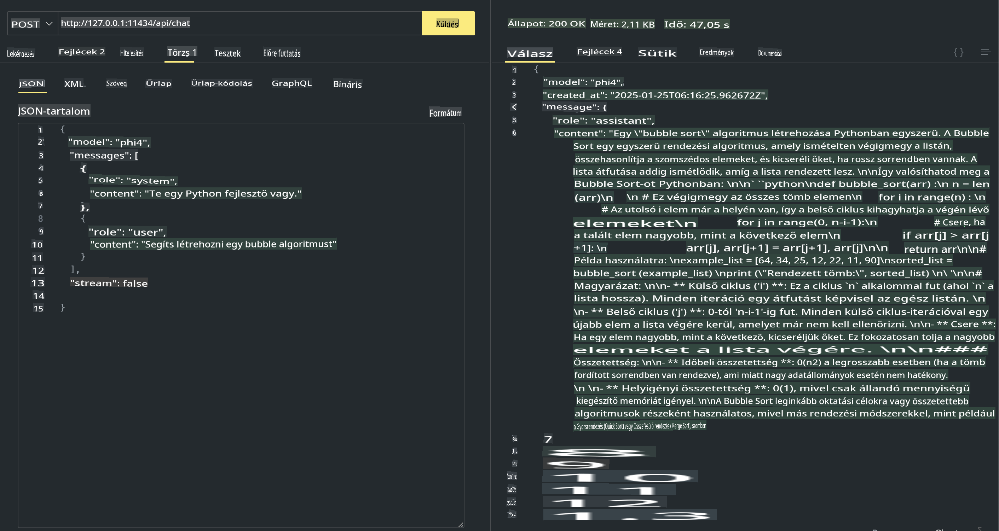

## Phi család az Ollamában

[Ollama](https://ollama.com) lehetővé teszi, hogy egyszerű szkriptek segítségével több ember közvetlenül telepíthessen nyílt forráskódú LLM vagy SLM modelleket, valamint API-kat is építhet, hogy támogassa a helyi Copilot alkalmazási forgatókönyveket.

## **1. Telepítés**

Az Ollama Windows, macOS és Linux rendszereken is futtatható. Az Ollama telepítéséhez használd ezt a linket: ([https://ollama.com/download](https://ollama.com/download)). A sikeres telepítés után közvetlenül használhatod az Ollama szkriptet a Phi-3 meghívására egy terminálablakban. Az összes [elérhető könyvtárat az Ollamában itt találod](https://ollama.com/library). Ha ezt a tárolót egy Codespace-ben nyitod meg, az Ollama már telepítve lesz.

```bash

ollama run phi4

```

> [!NOTE]
> Az első futtatáskor a modell letöltésre kerül. Természetesen közvetlenül megadhatod a letöltött Phi-4 modellt is. Példaként a WSL-t használjuk a parancs futtatására. Miután a modell sikeresen letöltődött, közvetlenül interakcióba léphetsz vele a terminálon.


## **2. Phi-4 API meghívása az Ollamából**

Ha az Ollama által generált Phi-4 API-t szeretnéd meghívni, használd ezt a parancsot a terminálban az Ollama szerver indításához.

```bash

ollama serve

```

> [!NOTE]
> Ha macOS vagy Linux rendszert használsz, előfordulhat, hogy a következő hibát kapod: **"Error: listen tcp 127.0.0.1:11434: bind: address already in use"**. Ez a hiba általában azt jelzi, hogy a szerver már fut. Ezt figyelmen kívül hagyhatod, vagy újraindíthatod az Ollamát:

**macOS**

```bash

brew services restart ollama

```

**Linux**

```bash

sudo systemctl stop ollama

```

Az Ollama két API-t támogat: generate és chat. Az igényeidnek megfelelően meghívhatod az Ollama által biztosított modell API-t, helyi szolgáltatásra küldött kérésekkel, amely az 11434-es porton fut.

**Chat**

```bash

curl http://127.0.0.1:11434/api/chat -d '{
  "model": "phi3",
  "messages": [
    {
      "role": "system",
      "content": "Your are a python developer."
    },
    {
      "role": "user",
      "content": "Help me generate a bubble algorithm"
    }
  ],
  "stream": false
  
}'

This is the result in Postman



## Additional Resources

Check the list of available models in Ollama in [their library](https://ollama.com/library).

Pull your model from the Ollama server using this command

```bash
ollama pull phi4
```

Run the model using this command

```bash
ollama run phi4
```

***Note:*** Visit this link [https://github.com/ollama/ollama/blob/main/docs/api.md](https://github.com/ollama/ollama/blob/main/docs/api.md) to learn more

## Calling Ollama from Python

You can use `requests` or `urllib3` to make requests to the local server endpoints used above. However, a popular way to use Ollama in Python is via the [openai](https://pypi.org/project/openai/) SDK, since Ollama provides OpenAI-compatible server endpoints as well.

Here is an example for phi3-mini:

```python
import openai

client = openai.OpenAI(
    base_url="http://localhost:11434/v1",
    api_key="nokeyneeded",
)

response = client.chat.completions.create(
    model="phi4",
    temperature=0.7,
    n=1,
    messages=[
        {"role": "system", "content": "Segítőkész asszisztens vagy."},
        {"role": "user", "content": "Írj egy haikut egy éhes macskáról."},
    ],
)

print("Válasz:")
print(response.choices[0].message.content)
```

## Calling Ollama from JavaScript 

```javascript
// Példa egy fájl összefoglalására Phi-4 segítségével
script({
    model: "ollama:phi4",
    title: "Összefoglalás Phi-4-gyel",
    system: ["system"],
})

// Összefoglalás példa
const file = def("FILE", env.files)
$`Foglaljuk össze ${file}-t egyetlen bekezdésben.`
```

## Calling Ollama from C#

Create a new C# Console application and add the following NuGet package:

```bash
dotnet add package Microsoft.SemanticKernel --version 1.34.0
```

Then replace this code in the `Program.cs` file

```csharp
using Microsoft.SemanticKernel;
using Microsoft.SemanticKernel.ChatCompletion;

// Chat completion szolgáltatás hozzáadása a helyi Ollama szerver végpontjának használatával
#pragma warning disable SKEXP0001, SKEXP0003, SKEXP0010, SKEXP0011, SKEXP0050, SKEXP0052
builder.AddOpenAIChatCompletion(
    modelId: "phi4",
    endpoint: new Uri("http://localhost:11434/"),
    apiKey: "nem szükséges");

// Egyszerű prompt küldése a chat szolgáltatásnak
string prompt = "Mondj egy viccet a kiscicákról";
var response = await kernel.InvokePromptAsync(prompt);
Console.WriteLine(response.GetValue<string>());
```

Run the app with the command:

```bash
dotnet run

**Felelősségkizárás**:  
Ez a dokumentum gépi AI fordítási szolgáltatások segítségével készült. Bár törekszünk a pontosságra, kérjük, vegye figyelembe, hogy az automatikus fordítások hibákat vagy pontatlanságokat tartalmazhatnak. Az eredeti dokumentum az eredeti nyelvén tekintendő a hiteles forrásnak. Fontos információk esetén javasolt a professzionális, emberi fordítás igénybevétele. Nem vállalunk felelősséget a fordítás használatából eredő félreértésekért vagy téves értelmezésekért.