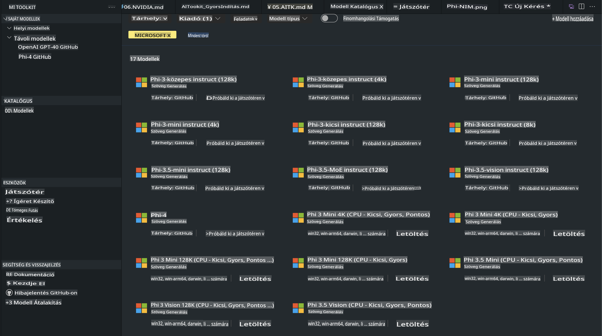
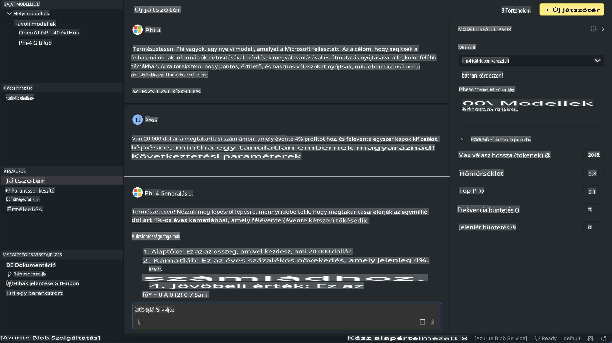

# Phi család az AITK-ban

[AI Toolkit for VS Code](https://marketplace.visualstudio.com/items?itemName=ms-windows-ai-studio.windows-ai-studio) leegyszerűsíti a generatív AI alkalmazások fejlesztését azáltal, hogy egyesíti a legmodernebb AI fejlesztői eszközöket és modelleket az Azure AI Foundry katalógusából, valamint más katalógusokból, mint például a Hugging Face. Lehetőséged lesz böngészni a GitHub Models és az Azure AI Foundry Model Catalogs által támogatott AI modellek között, letölteni őket helyben vagy távolról, finomhangolni, tesztelni és felhasználni őket az alkalmazásodban.

Az AI Toolkit Preview helyben fog futni. A helyi következtetések vagy finomhangolás a választott modelltől függően GPU-t igényelhet, például NVIDIA CUDA GPU-t. A GitHub modelleket közvetlenül az AITK-val is futtathatod.

## Első lépések

[Tudj meg többet a Windows alrendszer Linuxhoz való telepítéséről](https://learn.microsoft.com/windows/wsl/install?WT.mc_id=aiml-137032-kinfeylo)

és [az alapértelmezett disztribúció megváltoztatásáról](https://learn.microsoft.com/windows/wsl/install#change-the-default-linux-distribution-installed).

[AI Toolkit GitHub Repo](https://github.com/microsoft/vscode-ai-toolkit/)

- Windows, Linux, macOS
  
- A finomhangoláshoz Windows és Linux rendszeren is Nvidia GPU szükséges. Továbbá a **Windows** rendszeren szükség van a Linux alrendszerre egy 18.4-es vagy újabb Ubuntu disztribúcióval. [Tudj meg többet a Windows alrendszer Linuxhoz való telepítéséről](https://learn.microsoft.com/windows/wsl/install) és [az alapértelmezett disztribúció megváltoztatásáról](https://learn.microsoft.com/windows/wsl/install#change-the-default-linux-distribution-installed).

### AI Toolkit telepítése

Az AI Toolkit egy [Visual Studio Code kiterjesztésként](https://code.visualstudio.com/docs/setup/additional-components#_vs-code-extensions) érhető el, ezért először telepítened kell a [VS Code-ot](https://code.visualstudio.com/docs/setup/windows?WT.mc_id=aiml-137032-kinfeylo), majd letöltened az AI Toolkit-et a [VS Marketplace-ről](https://marketplace.visualstudio.com/items?itemName=ms-windows-ai-studio.windows-ai-studio).
Az [AI Toolkit elérhető a Visual Studio Marketplace-en](https://marketplace.visualstudio.com/items?itemName=ms-windows-ai-studio.windows-ai-studio), és úgy telepíthető, mint bármely más VS Code kiterjesztés.

Ha nem vagy jártas a VS Code kiterjesztések telepítésében, kövesd az alábbi lépéseket:

### Bejelentkezés

1. A VS Code-ban válaszd ki az **Extensions** lehetőséget az Activity Bar-ban.
1. Az Extensions keresősávba írd be: "AI Toolkit".
1. Válaszd ki az "AI Toolkit for Visual Studio Code" lehetőséget.
1. Kattints az **Install** gombra.

Most már készen állsz a kiterjesztés használatára!

A rendszer kérni fogja, hogy jelentkezz be a GitHub-ba, ezért kattints az "Allow" gombra a folytatáshoz. Ez átirányít a GitHub bejelentkezési oldalára.

Jelentkezz be, és kövesd a folyamat lépéseit. A sikeres befejezés után vissza leszel irányítva a VS Code-ba.

Miután a kiterjesztést telepítetted, az AI Toolkit ikon megjelenik az Activity Bar-ban.

Fedezzük fel az elérhető műveleteket!

### Elérhető műveletek

Az AI Toolkit elsődleges oldalsávja a következőkre van felosztva:  

- **Models**
- **Resources**
- **Playground**  
- **Fine-tuning**
- **Evaluation**

Ezek elérhetők a Resources szekcióban. Az induláshoz válaszd ki a **Model Catalog**-ot.

### Modell letöltése a katalógusból

Az AI Toolkit VS Code oldalsávból való indítása után az alábbi lehetőségek közül választhatsz:



- Keresd meg a **Model Catalog**-ból egy támogatott modellt, és töltsd le helyben.
- Teszteld a modell következtetéseit a **Model Playground**-ban.
- Finomhangold a modellt helyben vagy távolról a **Model Fine-tuning** segítségével.
- Telepítsd a finomhangolt modelleket a felhőbe az AI Toolkit parancspalettáján keresztül.
- Értékeld a modelleket.

> [!NOTE]
>
> **GPU Vs CPU**
>
> Észre fogod venni, hogy a modellkártyák megjelenítik a modell méretét, a platformot és az akcelerátor típusát (CPU, GPU). Az optimalizált teljesítmény érdekében **Windows eszközökön, amelyek legalább egy GPU-val rendelkeznek**, válassz olyan modellverziókat, amelyek csak a Windows-t célozzák meg.
>
> Ez biztosítja, hogy a modell a DirectML akcelerátorhoz legyen optimalizálva.
>
> A modellek nevei a következő formátumban vannak:
>
> - `{model_name}-{accelerator}-{quantization}-{format}`.
>
> Hogy ellenőrizd, van-e GPU a Windows eszközödön, nyisd meg a **Feladatkezelőt**, majd válaszd a **Teljesítmény** fület. Ha van GPU-d, azok olyan nevekkel lesznek felsorolva, mint "GPU 0" vagy "GPU 1".

### Modell futtatása a playground-ban

Miután az összes paramétert beállítottad, kattints a **Generate Project** gombra.

Miután a modell letöltődött, válaszd a **Load in Playground** lehetőséget a katalógus modellkártyáján:

- Kezdeményezd a modell letöltését.
- Telepítsd az összes szükséges előfeltételt és függőséget.
- Hozz létre egy VS Code munkaterületet.



### REST API használata az alkalmazásodban 

Az AI Toolkit egy helyi REST API webszervert biztosít **a 5272-es porton**, amely a [OpenAI chat completions formátumot](https://platform.openai.com/docs/api-reference/chat/create) használja. 

Ez lehetővé teszi, hogy helyben teszteld az alkalmazásodat anélkül, hogy egy felhőalapú AI modell szolgáltatásra kellene támaszkodnod. Például az alábbi JSON fájl bemutatja, hogyan kell konfigurálni a kérés törzsét:

```json
{
    "model": "Phi-4",
    "messages": [
        {
            "role": "user",
            "content": "what is the golden ratio?"
        }
    ],
    "temperature": 0.7,
    "top_p": 1,
    "top_k": 10,
    "max_tokens": 100,
    "stream": true
}
```

Tesztelheted a REST API-t például a [Postman](https://www.postman.com/) vagy a CURL (Client URL) segédprogram segítségével:

```bash
curl -vX POST http://127.0.0.1:5272/v1/chat/completions -H 'Content-Type: application/json' -d @body.json
```

### OpenAI klienskönyvtár használata Pythonhoz

```python
from openai import OpenAI

client = OpenAI(
    base_url="http://127.0.0.1:5272/v1/", 
    api_key="x" # required for the API but not used
)

chat_completion = client.chat.completions.create(
    messages=[
        {
            "role": "user",
            "content": "what is the golden ratio?",
        }
    ],
    model="Phi-4",
)

print(chat_completion.choices[0].message.content)
```

### Azure OpenAI klienskönyvtár használata .NET-hez

Add hozzá az [Azure OpenAI klienskönyvtárat .NET-hez](https://www.nuget.org/packages/Azure.AI.OpenAI/) a projektedhez a NuGet segítségével:

```bash
dotnet add {project_name} package Azure.AI.OpenAI --version 1.0.0-beta.17
```

Adj hozzá egy **OverridePolicy.cs** nevű C# fájlt a projekthez, és illeszd be a következő kódot:

```csharp
// OverridePolicy.cs
using Azure.Core.Pipeline;
using Azure.Core;

internal partial class OverrideRequestUriPolicy(Uri overrideUri)
    : HttpPipelineSynchronousPolicy
{
    private readonly Uri _overrideUri = overrideUri;

    public override void OnSendingRequest(HttpMessage message)
    {
        message.Request.Uri.Reset(_overrideUri);
    }
}
```

Ezután illeszd be a következő kódot a **Program.cs** fájlodba:

```csharp
// Program.cs
using Azure.AI.OpenAI;

Uri localhostUri = new("http://localhost:5272/v1/chat/completions");

OpenAIClientOptions clientOptions = new();
clientOptions.AddPolicy(
    new OverrideRequestUriPolicy(localhostUri),
    Azure.Core.HttpPipelinePosition.BeforeTransport);
OpenAIClient client = new(openAIApiKey: "unused", clientOptions);

ChatCompletionsOptions options = new()
{
    DeploymentName = "Phi-4",
    Messages =
    {
        new ChatRequestSystemMessage("You are a helpful assistant. Be brief and succinct."),
        new ChatRequestUserMessage("What is the golden ratio?"),
    }
};

StreamingResponse<StreamingChatCompletionsUpdate> streamingChatResponse
    = await client.GetChatCompletionsStreamingAsync(options);

await foreach (StreamingChatCompletionsUpdate chatChunk in streamingChatResponse)
{
    Console.Write(chatChunk.ContentUpdate);
}
```

## Finomhangolás az AI Toolkit segítségével

- Kezdj a modellek felfedezésével és a playground használatával.
- Modell finomhangolása és következtetések helyi számítási erőforrásokkal.
- Távoli finomhangolás és következtetések Azure erőforrások használatával.

[Finomhangolás az AI Toolkit segítségével](../../03.FineTuning/Finetuning_VSCodeaitoolkit.md)

## AI Toolkit Kérdések és Válaszok forrásai

Kérjük, tekintsd meg [Kérdések és Válaszok oldalunkat](https://github.com/microsoft/vscode-ai-toolkit/blob/main/archive/QA.md) a leggyakoribb problémák és megoldások megismeréséhez.

**Felelősség kizárása**:  
Ez a dokumentum gépi AI fordítószolgáltatások segítségével került lefordításra. Bár igyekszünk pontosságra törekedni, kérjük, vegye figyelembe, hogy az automatizált fordítások hibákat vagy pontatlanságokat tartalmazhatnak. Az eredeti dokumentum az eredeti nyelvén tekintendő hiteles forrásnak. Kritikus információk esetén javasolt professzionális emberi fordítás igénybevétele. Nem vállalunk felelősséget az ebből a fordításból eredő félreértésekért vagy téves értelmezésekért.