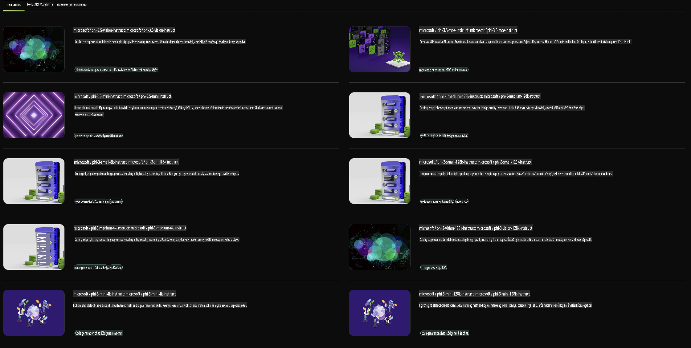

## Phi család az NVIDIA NIM-ben

Az NVIDIA NIM egy könnyen használható mikroszolgáltatás-készlet, amelyet generatív AI modellek telepítésének felgyorsítására terveztek a felhőben, adatközpontokban és munkaállomásokon. A NIM-ek modellcsaládok és egyedi modellek szerint vannak kategorizálva. Például az NVIDIA NIM nagy nyelvi modellekhez (LLM-ekhez) elhozza a legmodernebb LLM-ek erejét vállalati alkalmazásokhoz, páratlan természetes nyelvfeldolgozási és megértési képességeket biztosítva.

A NIM megkönnyíti az IT és DevOps csapatok számára, hogy saját kezelt környezetükben hostolják a nagy nyelvi modelleket (LLM-eket), miközben továbbra is iparági szabványú API-kat biztosít a fejlesztők számára. Ezek az API-k lehetővé teszik erőteljes copilotok, chatbotok és AI-asszisztensek építését, amelyek átalakíthatják üzletüket. Az NVIDIA legmodernebb GPU-gyorsítását és skálázható telepítését kihasználva a NIM páratlan teljesítménnyel biztosítja a leggyorsabb utat az inferenciához.

Az NVIDIA NIM segítségével inferenciát végezhet a Phi család modelljeivel.



### **Minták - Phi-3-Vision az NVIDIA NIM-ben**

Képzelje el, hogy van egy képe (`demo.png`), és Python kódot szeretne generálni, amely feldolgozza ezt a képet, majd elment egy új verziót (`phi-3-vision.jpg`).

A fenti kód ezt a folyamatot automatizálja:

1. A környezet és a szükséges konfigurációk beállításával.
2. Egy prompt létrehozásával, amely utasítja a modellt a szükséges Python kód generálására.
3. A prompt elküldésével a modellnek és a generált kód begyűjtésével.
4. A generált kód kinyerésével és futtatásával.
5. Az eredeti és a feldolgozott képek megjelenítésével.

Ez a megközelítés az AI erejét használja ki a képfeldolgozási feladatok automatizálására, megkönnyítve és felgyorsítva a célok elérését.

[Minta kódmegoldás](../../../../../code/06.E2E/E2E_Nvidia_NIM_Phi3_Vision.ipynb)

Nézzük meg lépésről lépésre, mit csinál az egész kód:

1. **Szükséges csomag telepítése**:
    ```python
    !pip install langchain_nvidia_ai_endpoints -U
    ```
    Ez a parancs telepíti a `langchain_nvidia_ai_endpoints` csomagot, biztosítva, hogy az a legfrissebb verzió legyen.

2. **Szükséges modulok importálása**:
    ```python
    from langchain_nvidia_ai_endpoints import ChatNVIDIA
    import getpass
    import os
    import base64
    ```
    Ezek az importálások lehetővé teszik az NVIDIA AI végpontokkal való interakciót, a jelszavak biztonságos kezelését, az operációs rendszerrel való interakciót, valamint az adatok base64 formátumban történő kódolását és dekódolását.

3. **API-kulcs beállítása**:
    ```python
    if not os.getenv("NVIDIA_API_KEY"):
        os.environ["NVIDIA_API_KEY"] = getpass.getpass("Enter your NVIDIA API key: ")
    ```
    Ez a kód ellenőrzi, hogy az `NVIDIA_API_KEY` környezeti változó be van-e állítva. Ha nem, akkor a felhasználótól kéri az API-kulcs biztonságos megadását.

4. **Modell és kép elérési útjának meghatározása**:
    ```python
    model = 'microsoft/phi-3-vision-128k-instruct'
    chat = ChatNVIDIA(model=model)
    img_path = './imgs/demo.png'
    ```
    Ez beállítja a használni kívánt modellt, létrehoz egy `ChatNVIDIA` példányt a megadott modellel, és meghatározza a kép fájl elérési útját.

5. **Szöveges prompt létrehozása**:
    ```python
    text = "Please create Python code for image, and use plt to save the new picture under imgs/ and name it phi-3-vision.jpg."
    ```
    Ez egy olyan szöveges promptot határoz meg, amely utasítja a modellt egy kép feldolgozásához szükséges Python kód generálására.

6. **Kép base64 formátumba kódolása**:
    ```python
    with open(img_path, "rb") as f:
        image_b64 = base64.b64encode(f.read()).decode()
    image = f''
    ```
    Ez a kód beolvassa a képfájlt, base64 formátumba kódolja, és létrehoz egy HTML kép címkét a kódolt adatokkal.

7. **Szöveg és kép kombinálása a promptban**:
    ```python
    prompt = f"{text} {image}"
    ```
    Ez a szöveges promptot és a HTML kép címkét egyetlen sztringgé egyesíti.

8. **Kód generálása a ChatNVIDIA segítségével**:
    ```python
    code = ""
    for chunk in chat.stream(prompt):
        print(chunk.content, end="")
        code += chunk.content
    ```
    Ez a kód elküldi a promptot a `ChatNVIDIA` model and collects the generated code in chunks, printing and appending each chunk to the `code` sztringnek.

9. **Python kód kinyerése a generált tartalomból**:
    ```python
    begin = code.index('```python') + 9
    code = code[begin:]
    end = code.index('```')
    code = code[:end]
    ```
    Ez eltávolítja a markdown formázást, és kinyeri a tényleges Python kódot a generált tartalomból.

10. **Generált kód futtatása**:
    ```python
    import subprocess
    result = subprocess.run(["python", "-c", code], capture_output=True)
    ```
    Ez a kód alfolyamatként futtatja a kinyert Python kódot, és rögzíti annak kimenetét.

11. **Képek megjelenítése**:
    ```python
    from IPython.display import Image, display
    display(Image(filename='./imgs/phi-3-vision.jpg'))
    display(Image(filename='./imgs/demo.png'))
    ```
    Ezek a sorok a `IPython.display` modul segítségével jelenítik meg a képeket.

**Felelősségkizárás**:  
Ez a dokumentum gépi AI fordítószolgáltatások segítségével készült. Bár törekszünk a pontosságra, kérjük, vegye figyelembe, hogy az automatikus fordítások hibákat vagy pontatlanságokat tartalmazhatnak. Az eredeti dokumentum az eredeti nyelvén tekintendő hiteles forrásnak. Kritikus információk esetén javasolt professzionális, emberi fordítás igénybevétele. Nem vállalunk felelősséget az ebből a fordításból eredő félreértésekért vagy téves értelmezésekért.