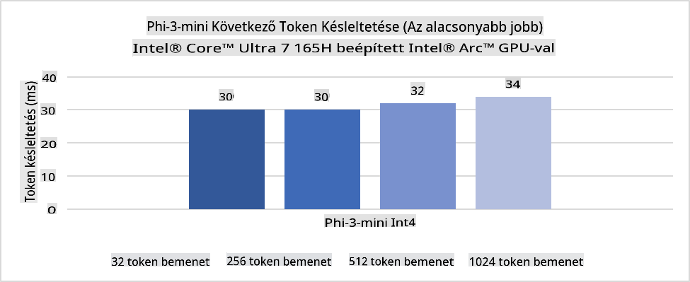
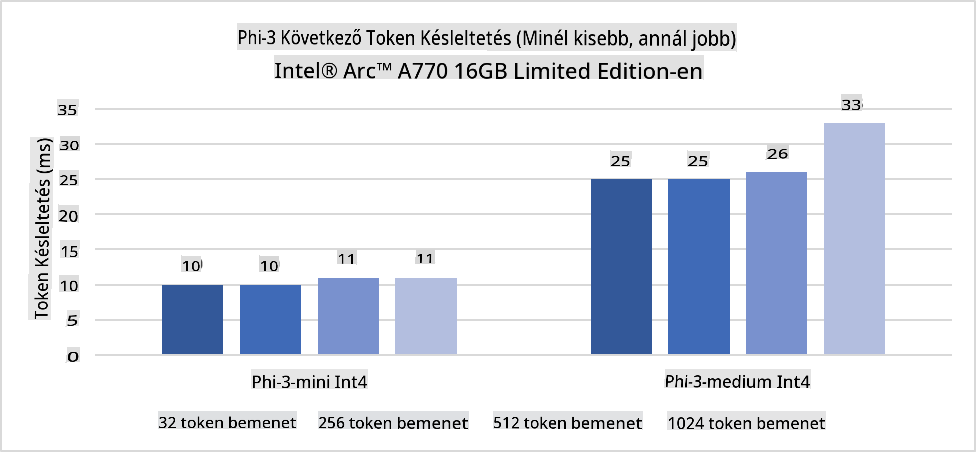
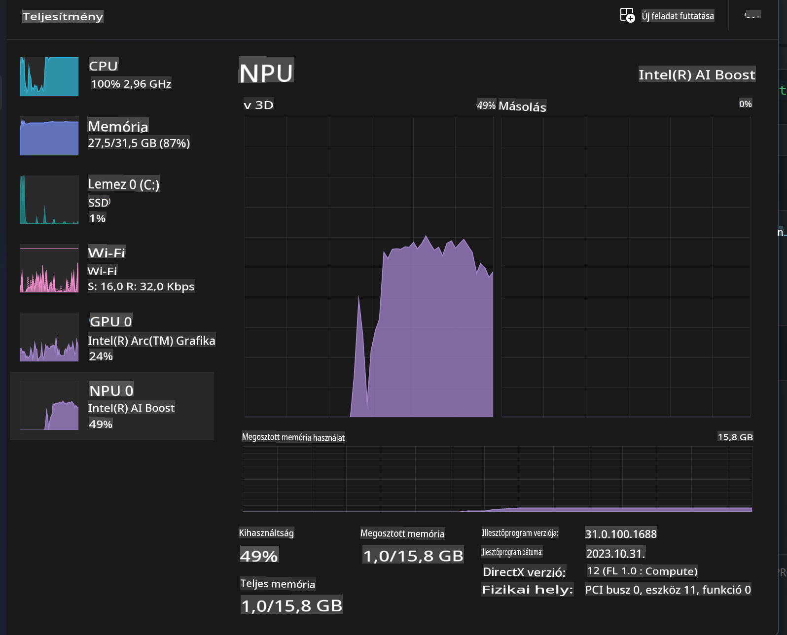
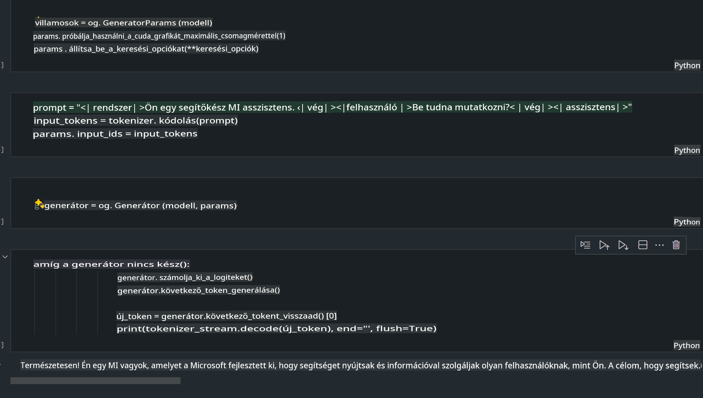
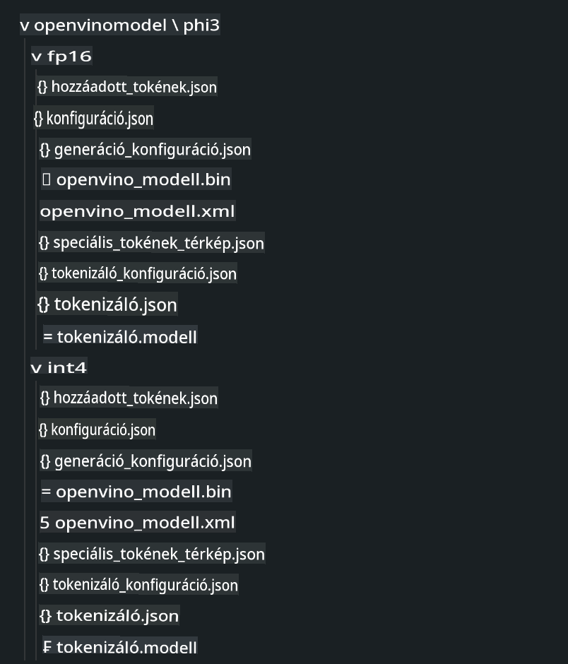
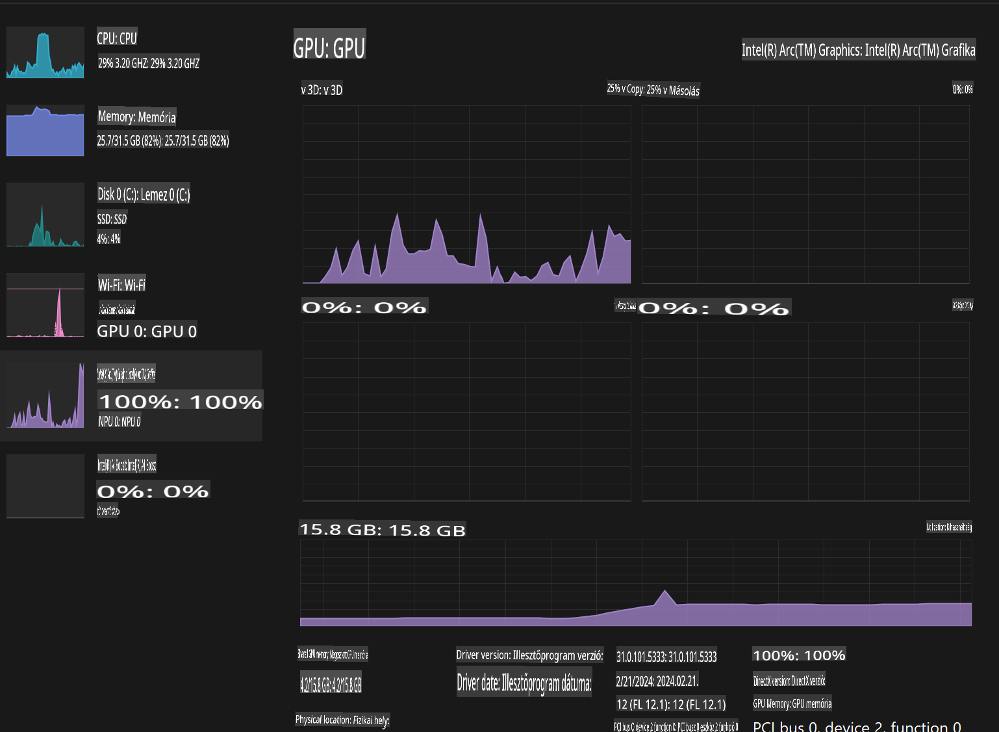

# **Inference Phi-3 az AI PC-n**

A generatív mesterséges intelligencia fejlődésével és az edge eszközök hardveres képességeinek javulásával egyre több generatív AI-modell integrálható a felhasználók saját BYOD (Bring Your Own Device) eszközeibe. Az AI PC-k is ezek közé a modellek közé tartoznak. 2024-től kezdődően az Intel, az AMD és a Qualcomm együttműködik PC-gyártókkal, hogy bemutassák az AI PC-ket, amelyek hardveres módosítások révén lehetővé teszik a lokalizált generatív AI-modellek telepítését. Ebben a beszélgetésben az Intel AI PC-kre összpontosítunk, és megvizsgáljuk, hogyan telepíthetjük a Phi-3-at egy Intel AI PC-re.

### Mi az az NPU?

Az NPU (Neural Processing Unit) egy dedikált processzor vagy feldolgozó egység egy nagyobb SoC-on belül, amelyet kifejezetten a neurális hálózatok műveleteinek és AI-feladatainak gyorsítására terveztek. Ellentétben az általános célú CPU-kkal és GPU-kkal, az NPU-k optimalizáltak az adatvezérelt párhuzamos számításokra, így rendkívül hatékonyak a hatalmas multimédiás adatok, például videók és képek feldolgozásában, valamint a neurális hálózatok adatelemzésében. Különösen alkalmasak AI-hoz kapcsolódó feladatokra, mint például beszédfelismerés, háttér elmosása videóhívásokban, és olyan fotó- vagy videószerkesztési folyamatokra, mint az objektumfelismerés.

## NPU vs GPU

Bár sok AI- és gépi tanulási munkafolyamat GPU-kon fut, lényeges különbség van a GPU-k és az NPU-k között.  
A GPU-k híresek párhuzamos számítási képességeikről, de nem minden GPU ugyanolyan hatékony a grafikai feldolgozáson túl. Az NPU-k ezzel szemben kifejezetten a neurális hálózatok műveleteihez kapcsolódó komplex számításokra készültek, így rendkívül hatékonyak az AI-feladatokban.

Összefoglalva, az NPU-k a matematikai zsenik, amelyek turbózzák az AI-számításokat, és kulcsszerepet játszanak az AI PC-k feltörekvő korszakában!

***Ez a példa az Intel legújabb Intel Core Ultra processzorán alapul***

## **1. Phi-3 modell futtatása NPU-val**

Az Intel® NPU eszköz egy AI következtetési gyorsító, amely az Intel kliens CPU-kba van integrálva, kezdve az Intel® Core™ Ultra processzorok generációjával (korábban Meteor Lake néven ismert). Ez lehetővé teszi az energiahatékony mesterséges neurális hálózati feladatok végrehajtását.





**Intel NPU Gyorsítási Könyvtár**

Az Intel NPU Gyorsítási Könyvtár [https://github.com/intel/intel-npu-acceleration-library](https://github.com/intel/intel-npu-acceleration-library) egy Python könyvtár, amely az Intel Neural Processing Unit (NPU) erejét használja ki, hogy nagy sebességű számításokat végezzen kompatibilis hardveren, és ezzel növelje az alkalmazások hatékonyságát.

Példa a Phi-3-mini modellre Intel® Core™ Ultra processzorral működő AI PC-n.


Python Könyvtár telepítése pip segítségével

```bash

   pip install intel-npu-acceleration-library

```

***Megjegyzés*** A projekt még fejlesztés alatt áll, de a referencia modell már most nagyon komplett.

### **Phi-3 futtatása az Intel NPU Gyorsítási Könyvtárral**

Az Intel NPU gyorsítás használatával ez a könyvtár nem befolyásolja a hagyományos kódolási folyamatot. Csak annyit kell tennie, hogy ezt a könyvtárat használja az eredeti Phi-3 modell kvantálásához, például FP16, INT8, INT4 formátumban, például:

```python
from transformers import AutoTokenizer, pipeline,TextStreamer
from intel_npu_acceleration_library import NPUModelForCausalLM, int4
from intel_npu_acceleration_library.compiler import CompilerConfig
import warnings

model_id = "microsoft/Phi-3-mini-4k-instruct"

compiler_conf = CompilerConfig(dtype=int4)
model = NPUModelForCausalLM.from_pretrained(
    model_id, use_cache=True, config=compiler_conf, attn_implementation="sdpa"
).eval()

tokenizer = AutoTokenizer.from_pretrained(model_id)

text_streamer = TextStreamer(tokenizer, skip_prompt=True)
```

A kvantálás sikeres befejezése után folytassa a végrehajtást az NPU meghívásával a Phi-3 modell futtatásához.

```python
generation_args = {
   "max_new_tokens": 1024,
   "return_full_text": False,
   "temperature": 0.3,
   "do_sample": False,
   "streamer": text_streamer,
}

pipe = pipeline(
   "text-generation",
   model=model,
   tokenizer=tokenizer,
)

query = "<|system|>You are a helpful AI assistant.<|end|><|user|>Can you introduce yourself?<|end|><|assistant|>"

with warnings.catch_warnings():
    warnings.simplefilter("ignore")
    pipe(query, **generation_args)
```

A kód végrehajtása során a Feladatkezelőn keresztül megtekinthetjük az NPU futási állapotát.



***Minták*** : [AIPC_NPU_DEMO.ipynb](../../../../../code/03.Inference/AIPC/AIPC_NPU_DEMO.ipynb)

## **2. Phi-3 modell futtatása DirectML + ONNX Runtime segítségével**

### **Mi az a DirectML**

A [DirectML](https://github.com/microsoft/DirectML) egy nagy teljesítményű, hardveresen gyorsított DirectX 12 könyvtár gépi tanuláshoz. A DirectML GPU-gyorsítást biztosít a gépi tanulási feladatokhoz számos támogatott hardveren és illesztőprogramon, beleértve az összes DirectX 12-kompatibilis GPU-t az AMD, Intel, NVIDIA és Qualcomm gyártóktól.

Önmagában használva a DirectML API egy alacsony szintű DirectX 12 könyvtár, amely alkalmas nagy teljesítményű, alacsony késleltetésű alkalmazásokhoz, például keretrendszerekhez, játékokhoz és egyéb valós idejű alkalmazásokhoz. A DirectML zökkenőmentes interoperabilitása a Direct3D 12-vel, valamint alacsony terhelése és hardverfüggetlen megbízhatósága ideálissá teszi gépi tanulási feladatok gyorsítására, amikor mind a magas teljesítmény, mind az eredmények megbízhatósága és kiszámíthatósága fontos.

***Megjegyzés*** : A legújabb DirectML már támogatja az NPU-t (https://devblogs.microsoft.com/directx/introducing-neural-processor-unit-npu-support-in-directml-developer-preview/)

###  DirectML és CUDA képességeik és teljesítményük szempontjából:

**DirectML** egy Microsoft által fejlesztett gépi tanulási könyvtár. Windows-eszközökön történő gépi tanulási munkafolyamatok gyorsítására tervezték, beleértve az asztali számítógépeket, laptopokat és edge eszközöket.
- DX12-alapú: A DirectML a DirectX 12 (DX12) tetejére épül, amely széleskörű hardvertámogatást nyújt GPU-k esetében, beleértve az NVIDIA-t és az AMD-t is.
- Szélesebb támogatás: Mivel a DX12-t használja, a DirectML bármely DX12-kompatibilis GPU-val működik, még az integrált GPU-kkal is.
- Képfeldolgozás: A DirectML képeket és más adatokat dolgoz fel neurális hálózatok segítségével, így alkalmas olyan feladatokra, mint a képfelismerés, objektumfelismerés stb.
- Egyszerű beállítás: A DirectML beállítása egyszerű, és nem igényel specifikus SDK-kat vagy könyvtárakat a GPU-gyártóktól.
- Teljesítmény: Bizonyos esetekben a DirectML jól teljesít, és gyorsabb lehet, mint a CUDA, különösen bizonyos munkafolyamatoknál.
- Korlátok: Azonban előfordulhatnak olyan esetek, amikor a DirectML lassabb, különösen nagy float16 batch méreteknél.

**CUDA** az NVIDIA párhuzamos számítási platformja és programozási modellje. Lehetővé teszi a fejlesztők számára, hogy kihasználják az NVIDIA GPU-k erejét általános célú számításokhoz, beleértve a gépi tanulást és tudományos szimulációkat.
- NVIDIA-specifikus: A CUDA szorosan integrálva van az NVIDIA GPU-kkal, és kifejezetten azokhoz készült.
- Nagyon optimalizált: Kiváló teljesítményt nyújt a GPU-gyorsított feladatokhoz, különösen NVIDIA GPU-k használata esetén.
- Széles körben használt: Számos gépi tanulási keretrendszer és könyvtár (például TensorFlow és PyTorch) támogatja a CUDA-t.
- Testreszabhatóság: A fejlesztők finomhangolhatják a CUDA beállításokat specifikus feladatokhoz, ami optimális teljesítményhez vezethet.
- Korlátok: A CUDA hardverfüggősége az NVIDIA GPU-kkal korlátozó lehet, ha szélesebb kompatibilitásra van szükség különböző GPU-k között.

### DirectML és CUDA közötti választás

A választás a DirectML és a CUDA között az adott felhasználási esettől, a rendelkezésre álló hardvertől és a preferenciáktól függ.  
Ha szélesebb kompatibilitásra és egyszerűbb beállításra van szükség, a DirectML jó választás lehet. Ha azonban NVIDIA GPU-k állnak rendelkezésre, és rendkívül optimalizált teljesítményre van szükség, a CUDA erős versenyző marad. Összefoglalva, mind a DirectML, mind a CUDA rendelkezik előnyökkel és hátrányokkal, így a döntést az igények és a rendelkezésre álló hardver alapján kell meghozni.

### **Generatív AI az ONNX Runtime segítségével**

Az AI korszakában az AI modellek hordozhatósága nagyon fontos. Az ONNX Runtime könnyen lehetővé teszi a betanított modellek telepítését különböző eszközökre. A fejlesztőknek nem kell figyelmet fordítaniuk a következtetési keretrendszerre, és egységes API-t használva végezhetik el a modell következtetését. A generatív AI korszakában az ONNX Runtime kódoptimalizálást is végzett (https://onnxruntime.ai/docs/genai/). Az optimalizált ONNX Runtime segítségével a kvantált generatív AI modell különböző terminálokon következtethető. A Generatív AI az ONNX Runtime-mal lehetővé teszi az AI modell API következtetését Python, C#, C / C++ segítségével. Természetesen az iPhone-ra történő telepítés során kihasználható a C++ Generative AI az ONNX Runtime API-val.

[Minta kód](https://github.com/Azure-Samples/Phi-3MiniSamples/tree/main/onnx)

***Generatív AI fordítása az ONNX Runtime könyvtárral***

```bash

winget install --id=Kitware.CMake  -e

git clone https://github.com/microsoft/onnxruntime.git

cd .\onnxruntime\

./build.bat --build_shared_lib --skip_tests --parallel --use_dml --config Release

cd ../

git clone https://github.com/microsoft/onnxruntime-genai.git

cd .\onnxruntime-genai\

mkdir ort

cd ort

mkdir include

mkdir lib

copy ..\onnxruntime\include\onnxruntime\core\providers\dml\dml_provider_factory.h ort\include

copy ..\onnxruntime\include\onnxruntime\core\session\onnxruntime_c_api.h ort\include

copy ..\onnxruntime\build\Windows\Release\Release\*.dll ort\lib

copy ..\onnxruntime\build\Windows\Release\Release\onnxruntime.lib ort\lib

python build.py --use_dml


```

**Könyvtár telepítése**

```bash

pip install .\onnxruntime_genai_directml-0.3.0.dev0-cp310-cp310-win_amd64.whl

```

Ez a futási eredmény



***Minták*** : [AIPC_DirectML_DEMO.ipynb](../../../../../code/03.Inference/AIPC/AIPC_DirectML_DEMO.ipynb)

## **3. Phi-3 modell futtatása az Intel OpenVino-val**

### **Mi az OpenVINO**

[OpenVINO](https://github.com/openvinotoolkit/openvino) egy nyílt forráskódú eszközkészlet mélytanulási modellek optimalizálásához és telepítéséhez. Fokozott mélytanulási teljesítményt nyújt vizuális, hang- és nyelvi modellekhez népszerű keretrendszerekből, mint a TensorFlow, PyTorch stb. Kezdjen az OpenVINO-val. Az OpenVINO CPU-val és GPU-val kombinálva is használható a Phi-3 modell futtatására.

***Megjegyzés***: Jelenleg az OpenVINO nem támogatja az NPU-t.

### **OpenVINO Könyvtár telepítése**

```bash

 pip install git+https://github.com/huggingface/optimum-intel.git

 pip install git+https://github.com/openvinotoolkit/nncf.git

 pip install openvino-nightly

```

### **Phi-3 futtatása az OpenVINO-val**

Az NPU-hoz hasonlóan az OpenVINO is kvantált modellek futtatásával hívja meg a generatív AI modelleket. Először kvantálnunk kell a Phi-3 modellt, és a modell kvantálását az optimum-cli segítségével parancssorban kell elvégezni.

**INT4**

```bash

optimum-cli export openvino --model "microsoft/Phi-3-mini-4k-instruct" --task text-generation-with-past --weight-format int4 --group-size 128 --ratio 0.6  --sym  --trust-remote-code ./openvinomodel/phi3/int4

```

**FP16**

```bash

optimum-cli export openvino --model "microsoft/Phi-3-mini-4k-instruct" --task text-generation-with-past --weight-format fp16 --trust-remote-code ./openvinomodel/phi3/fp16

```

Az átalakított formátum, így néz ki:



Modellek elérési útjának (model_dir), kapcsolódó konfigurációk (ov_config = {"PERFORMANCE_HINT": "LATENCY", "NUM_STREAMS": "1", "CACHE_DIR": ""}) és hardvergyorsított eszközök (GPU.0) betöltése az OVModelForCausalLM segítségével.

```python

ov_model = OVModelForCausalLM.from_pretrained(
     model_dir,
     device='GPU.0',
     ov_config=ov_config,
     config=AutoConfig.from_pretrained(model_dir, trust_remote_code=True),
     trust_remote_code=True,
)

```

A kód végrehajtása során a Feladatkezelőn keresztül megtekinthetjük a GPU futási állapotát.



***Minták*** : [AIPC_OpenVino_Demo.ipynb](../../../../../code/03.Inference/AIPC/AIPC_OpenVino_Demo.ipynb)

### ***Megjegyzés*** : A fenti három módszer mindegyikének megvannak a maga előnyei, de az AI PC következtetésekhez ajánlott az NPU gyorsítás használata.

**Felelősségkizárás**:  
Ez a dokumentum gépi AI fordítószolgáltatások segítségével lett lefordítva. Bár törekszünk a pontosságra, kérjük, vegye figyelembe, hogy az automatizált fordítások hibákat vagy pontatlanságokat tartalmazhatnak. Az eredeti dokumentum az eredeti nyelvén tekintendő hiteles forrásnak. Kritikus információk esetén javasolt professzionális, emberi fordítást igénybe venni. Nem vállalunk felelősséget a fordítás használatából eredő félreértésekért vagy téves értelmezésekért.