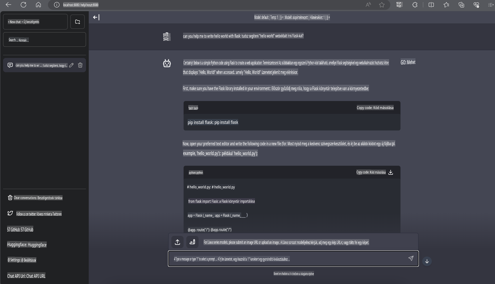

# **Inference Phi-3 Nvidia Jetsonon**

Az Nvidia Jetson az Nvidia beágyazott számítástechnikai eszközeinek sorozata. A Jetson TK1, TX1 és TX2 modellek mindegyike egy Nvidia Tegra processzort (vagy SoC-t) tartalmaz, amely egy ARM architektúrájú központi feldolgozóegységet (CPU) integrál. A Jetson egy alacsony fogyasztású rendszer, amelyet gépi tanulási alkalmazások gyorsítására terveztek. Az Nvidia Jetson-t professzionális fejlesztők használják áttörést jelentő mesterséges intelligencia-termékek létrehozására az iparágak széles körében, valamint diákok és lelkes amatőrök gyakorlati MI-tanulásra és lenyűgöző projektek megvalósítására. Az SLM-et olyan edge-eszközökön telepítik, mint a Jetson, amely lehetővé teszi az ipari generatív MI alkalmazási forgatókönyvek jobb megvalósítását.

## Telepítés NVIDIA Jetsonra:
Az autonóm robotikával és beágyazott eszközökkel foglalkozó fejlesztők kihasználhatják a Phi-3 Mini előnyeit. A Phi-3 viszonylag kis mérete ideálissá teszi az edge telepítésekhez. Az edzés során az összes paraméter gondosan lett hangolva, ami magas válaszpontosságot biztosít.

### TensorRT-LLM optimalizáció:
Az NVIDIA [TensorRT-LLM könyvtára](https://github.com/NVIDIA/TensorRT-LLM?WT.mc_id=aiml-138114-kinfeylo) optimalizálja a nagy nyelvi modellek következtetéseit. Támogatja a Phi-3 Mini hosszú kontextusablakát, javítva az áteresztőképességet és a késleltetést. Az optimalizációk között olyan technikák szerepelnek, mint a LongRoPE, FP8 és inflight batching.

### Elérhetőség és telepítés:
A fejlesztők felfedezhetik a Phi-3 Mini-t a 128K kontextusablakkal az [NVIDIA AI](https://www.nvidia.com/en-us/ai-data-science/generative-ai/) platformján. Ez egy NVIDIA NIM-ként van csomagolva, amely egy szabványos API-val rendelkező mikroszolgáltatás, és bárhol telepíthető. További információkért látogasson el a [TensorRT-LLM GitHub implementációkra](https://github.com/NVIDIA/TensorRT-LLM).

## **1. Előkészületek**

a. Jetson Orin NX / Jetson NX

b. JetPack 5.1.2+
   
c. Cuda 11.8
   
d. Python 3.8+

## **2. Phi-3 futtatása Jetsonon**

Használhatjuk az [Ollama](https://ollama.com) vagy a [LlamaEdge](https://llamaedge.com) platformokat.

Ha a gguf-ot egyszerre szeretnénk használni a felhőben és edge-eszközökön, a LlamaEdge felfogható WasmEdge-ként (a WasmEdge egy könnyű, nagy teljesítményű, skálázható WebAssembly futtatókörnyezet, amely alkalmas felhőalapú, edge és decentralizált alkalmazásokhoz. Támogatja a szerver nélküli alkalmazásokat, beágyazott funkciókat, mikroszolgáltatásokat, okos szerződéseket és IoT-eszközöket. A gguf kvantitatív modelljeit a LlamaEdge segítségével telepíthetjük edge-eszközökre és a felhőbe.


A használati lépések:

1. Kapcsolódó könyvtárak és fájlok telepítése és letöltése

```bash

curl -sSf https://raw.githubusercontent.com/WasmEdge/WasmEdge/master/utils/install.sh | bash -s -- --plugin wasi_nn-ggml

curl -LO https://github.com/LlamaEdge/LlamaEdge/releases/latest/download/llama-api-server.wasm

curl -LO https://github.com/LlamaEdge/chatbot-ui/releases/latest/download/chatbot-ui.tar.gz

tar xzf chatbot-ui.tar.gz

```

**Megjegyzés**: a llama-api-server.wasm és a chatbot-ui ugyanabban a könyvtárban kell legyenek

2. Futtassa a szkripteket a terminálban

```bash

wasmedge --dir .:. --nn-preload default:GGML:AUTO:{Your gguf path} llama-api-server.wasm -p phi-3-chat

```

Íme a futási eredmény:



***Minta kód*** [Phi-3 mini WASM Notebook minta](https://github.com/Azure-Samples/Phi-3MiniSamples/tree/main/wasm)

Összefoglalva, a Phi-3 Mini jelentős előrelépést képvisel a nyelvi modellezés terén, ötvözve a hatékonyságot, a kontextusérzékenységet és az NVIDIA optimalizációs képességeit. Akár robotokat, akár edge-alkalmazásokat épít, a Phi-3 Mini egy erőteljes eszköz, amelyet érdemes ismerni.

**Felelősségkizárás**:  
Ezt a dokumentumot gépi AI fordítási szolgáltatásokkal fordítottuk le. Bár törekszünk a pontosságra, kérjük, vegye figyelembe, hogy az automatikus fordítások hibákat vagy pontatlanságokat tartalmazhatnak. Az eredeti dokumentum az eredeti nyelvén tekintendő hiteles forrásnak. Kritikus információk esetén javasolt professzionális, emberi fordítást igénybe venni. Nem vállalunk felelősséget a fordítás használatából eredő félreértésekért vagy téves értelmezésekért.